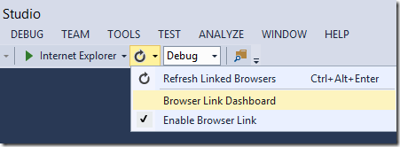
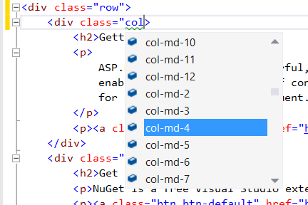

ASP.NET and Web Tools for Visual Studio 2013 Release Notes
====================
by [Microsoft](https://github.com/microsoft)

> This document describes the release of ASP.NET and Web Tools for Visual Studio 2013.

## Contents

- [Installation Notes](#TOC1)
- [Documentation](#TOC2)
- [Software Requirements](#TOC4)

### New Features in ASP.NET and Web Tools for Visual Studio 2013

- [One ASP.NET](#TOC6)
- [New Web Project Experience](#newproj)
- [ASP.NET Scaffolding](#scaffold)
- [Browser Link](#browser-link)
- [Visual Studio Web Editor Enhancements](#web-editor)
- [Azure App Service Web Apps Support in Visual Studio](#waws)
- [Web Publish Enhancements](#publish)
- [NuGet 2.7](#nuget)
- [ASP.NET Web Forms](#TOC9)
- [ASP.NET MVC 5](#TOC10)
- [ASP.NET Web API 2](#TOC11)
- [ASP.NET SignalR](#TOC13)
- [ASP.NET Identity](#TOC8)
- [Microsoft OWIN Components](#TOC7)
- [Entity Framework 6](#ef6)
- [ASP.NET Razor 3](#TOC14)
- [ASP.NET App Suspend](#TOC15)
- [Known Issues and Breaking Changes](#knownissues)

## Installation Notes

ASP.NET and Web Tools for Visual Studio 2013 are bundled in the main installer and can be downloaded [here](https://www.asp.net/downloads).

## Documentation

Tutorials and other information about ASP.NET and Web Tools for Visual Studio 2013 are available from the [ASP.NET web site](https://www.asp.net/).

## Software Requirements

ASP.NET and Web Tools requires Visual Studio 2013.

## New Features in ASP.NET and Web Tools for Visual Studio 2013

The following sections describe the features that have been introduced in the release.

## One ASP.NET

With the release of Visual Studio 2013, we have taken a step towards unifying the experience of using ASP.NET technologies, so that you can easily mix and match the ones you want. For example, you can start a project using MVC and easily add Web Forms pages to the project later, or scaffold Web APIs in a Web Forms project. One ASP.NET is all about making it easier for you as a developer to do the things you love in ASP.NET. No matter what technology you choose, you can have confidence that you are building on the trusted underlying framework of One ASP.NET.

## New Web Project Experience

We have enhanced the experience of creating new web projects in Visual Studio 2013. In the **New ASP.NET Web Project** dialog you can select the project type you want, configure any combination of technologies (Web Forms, MVC, Web API), configure authentication options, and add a unit test project.

The new dialog enables you to change the default authentication options for many of the templates. For example, when you create an ASP.NET Web Forms project you can select any of the following options:

- No Authentication
- Individual User Accounts (ASP.NET membership or social provider log in)
- Organizational Accounts (Active Directory in an internet application)
- Windows Authentication (Active Directory in an intranet application)

For more information about the new process for creating web projects, see [Creating ASP.NET Web Projects in Visual Studio 2013](creating-web-projects-in-visual-studio.md). For more information about the new authentication options, see [ASP.NET Identity](#TOC8) later in this document.

## ASP.NET Scaffolding

ASP.NET Scaffolding is a code generation framework for ASP.NET Web applications. It makes it easy to add boilerplate code to your project that interacts with a data model.

In previous versions of Visual Studio, scaffolding was limited to ASP.NET MVC projects. With Visual Studio 2013, you can now use scaffolding for any ASP.NET project, including Web Forms. Visual Studio 2013 does not currently support generating pages for a Web Forms project, but you can still use scaffolding with Web Forms by adding MVC dependencies to the project. Support for generating pages for Web Forms will be added in a future update.

When using scaffolding, we ensure that all required dependencies are installed in the project. For example, if you start with an ASP.NET Web Forms project and then use scaffolding to add a Web API Controller, the required NuGet packages and references are added to your project automatically.

To add MVC scaffolding to a Web Forms project, add a **New Scaffolded Item** and select **MVC 5 Dependencies** in the dialog window. There are two options for scaffolding MVC; Minimal and Full. If you select Minimal, only the NuGet packages and references for ASP.NET MVC are added to your project. If you select the Full option, the Minimal dependencies are added, as well as the required content files for an MVC project.

Support for scaffolding async controllers uses the new async features from Entity Framework 6.

For more information and tutorials, see [ASP.NET Scaffolding Overview](aspnet-scaffolding-overview.md).

## Browser Link – SignalR channel between browser and Visual Studio

The new [Browser Link](using-browser-link.md) feature lets you connect multiple browsers to Visual Studio and refresh them all by clicking a button in the toolbar. You can connect multiple browsers to your development site, including mobile emulators, and click refresh to refresh all the browsers all at the same time. Browser Link also exposes an API to enable developers to write Browser Link extensions.

By enabling developers to take advantage of the Browser Link API, it becomes possible to create very advanced scenarios that crosses boundaries between Visual Studio and any browser that's connected. Web Essentials takes advantage of the API to create an integrated experience between Visual Studio and the browser's developer tools, remote controlling mobile emulators and a lot more.

## Visual Studio Web Editor Enhancements

Visual Studio 2013 includes a new HTML editor for Razor files and HTML files in web applications. The new HTML editor provides a single unified schema based on HTML5. It has automatic brace completion, jQuery UI and AngularJS attribute IntelliSense, attribute IntelliSense Grouping, ID and class name Intellisense, and other improvements including better performance, formatting and SmartTags.

The following screenshot demonstrates using Bootstrap attribute IntelliSense in the HTML editor.

Visual Studio 2013 also comes with both CoffeeScript and LESS editors built in. The LESS editor comes with all the cool features from the CSS editor and has specific Intellisense for variables and mixins across all the LESS documents in the @import chain.

## Azure App Service Web Apps Support in Visual Studio

In Visual Studio 2013 with the Azure SDK for .NET 2.2, you can use **Server Explorer** to interact directly with your remote web apps. You can sign in to your Azure account, create new web apps, configure apps, view real-time logs, and more. Coming soon after SDK 2.2 is released, you'll be able to run in debug mode remotely in Azure. Most of the new features for Azure App Service Web Apps also work in Visual Studio 2012 when you install the current release of the Azure SDK for .NET.

For more information, see the following resources:

- [Create an ASP.NET web app in Azure App Service](https://azure.microsoft.com/en-us/documentation/articles/web-sites-dotnet-get-started/)
- [Troubleshoot a web app in Azure App Service using Visual Studio](https://azure.microsoft.com/en-us/documentation/articles/web-sites-dotnet-troubleshoot-visual-studio/)

## Web Publish Enhancements

Visual Studio 2013 includes new and enhanced Web Publish features. Here are a few of them:

- Easily [automate Web.config file encryption](https://go.microsoft.com/fwlink/?LinkId=325529). (This link and the following two point to documentation on MSDN that might not be available until late in the day on 10/17.)
- Easily [automate taking an application offline during deployment](https://go.microsoft.com/fwlink/?LinkId=325530).
- Configure Web Deploy to [use file checksum instead of last-changed date](https://go.microsoft.com/fwlink/?LinkId=325531) for determining which files should be copied to the server.
- Quickly publish individual selected files (including Web.config) when you're using the FTP or file system publish methods as well as with Web Deploy.

For more information about ASP.NET web deployment, see [the ASP.NET site](https://go.microsoft.com/fwlink/?LinkId=322027).

## NuGet 2.7

NuGet 2.7 includes a rich set of new features which are described in detail at [NuGet 2.7 Release Notes](http://docs.nuget.org/docs/release-notes/nuget-2.7).

This version of NuGet also removes the need to provide explicit consent for NuGet's package restore feature to download packages. Consent (and the associated checkbox in NuGet's preferences dialog) is now granted by installing NuGet. Now package restore simply works by default.

## ASP.NET Web Forms

### One ASP.NET

The Web Forms project templates integrate seamlessly with the new One ASP.NET experience. You can add MVC and Web API support to your Web Forms project, and you can configure authentication using the One ASP.NET project creation wizard. For more information, see [Creating ASP.NET Web Projects in Visual Studio 2013](creating-web-projects-in-visual-studio.md).

### ASP.NET Identity

The Web Forms project templates support the new ASP.NET Identity framework. In addition, the templates now support creation of a Web Forms intranet project. For more information, see [Authentication Methods](creating-web-projects-in-visual-studio.md#auth) in **Creating ASP.NET Web Projects in Visual Studio 2013**.

### Bootstrap

The Web Forms templates use [Bootstrap](http://twitter.github.io/bootstrap/) to provide a sleek and responsive look and feel that you can easily customize. For more information, see [Bootstrap in the Visual Studio 2013 web project templates](creating-web-projects-in-visual-studio.md#bootstrap).

## ASP.NET MVC 5

### One ASP.NET

The Web MVC project templates integrate seamlessly with the new One ASP.NET experience. You can customize your MVC project and configure authentication using the One ASP.NET project creation wizard. An introductory tutorial to ASP.NET MVC 5 can be found at [Getting Started with ASP.NET MVC 5](../../../mvc/overview/getting-started/introduction/getting-started.md).

For information on upgrading MVC 4 projects to MVC 5, see [How to Upgrade an ASP.NET MVC 4 and Web API Project to ASP.NET MVC 5 and Web API 2](../../../mvc/overview/releases/how-to-upgrade-an-aspnet-mvc-4-and-web-api-project-to-aspnet-mvc-5-and-web-api-2.md).

### ASP.NET Identity

The MVC project templates have been updated to use ASP.NET Identity for authentication and identity management. A tutorial featuring Facebook and Google authentication and the new membership API can be found at [Create an ASP.NET MVC 5 App with Facebook and Google OAuth2 and OpenID Sign-on](../../../mvc/overview/security/create-an-aspnet-mvc-5-app-with-facebook-and-google-oauth2-and-openid-sign-on.md) and [Create an ASP.NET MVC app with auth and SQL DB and deploy to Azure App Service](https://azure.microsoft.com/en-us/documentation/articles/web-sites-dotnet-deploy-aspnet-mvc-app-membership-oauth-sql-database/).

### Bootstrap

The MVC project template has been updated to use [Bootstrap](http://getbootstrap.com/) to provide a sleek and responsive look and feel that you can easily customize. For more information, see [Bootstrap in the Visual Studio 2013 web project templates](creating-web-projects-in-visual-studio.md#bootstrap).

### Authentication filters

Authentication filters are a new kind of filter in ASP.NET MVC that run prior to authorization filters in the ASP.NET MVC pipeline and allow you to specify authentication logic per-action, per-controller, or globally for all controllers. Authentication filters process credentials in the request and provide a corresponding principal. Authentication filters can also add authentication challenges in response to unauthorized requests.

### Filter overrides

You can now override which filters apply to a given action method or controller by specifying an override filter. Override filters specify a set of filter types that should not be run for a given scope (action or controller). This allows you to configure filters that apply globally but then exclude certain global filters from applying to specific actions or controllers.

### Attribute routing

ASP.NET MVC now supports attribute routing, thanks to a contribution by Tim McCall, the author of [http://attributerouting.net](http://attributerouting.net). With attribute routing you can specify your routes by annotating your actions and controllers.

## ASP.NET Web API 2

### Attribute routing

ASP.NET Web API now supports attribute routing, thanks to a contribution by Tim McCall, the author of [http://attributerouting.net](http://attributerouting.net). With attribute routing you can specify your Web API routes by annotating your actions and controllers like this:

[!code-csharp[Main](release-notes/samples/sample1.cs)]

Attribute routing gives you more control over the URIs in your web API. For example, you can easily define a resource hierarchy using a single API controller:

[!code-csharp[Main](release-notes/samples/sample2.cs)]

Attribute routing also provides a convenient syntax for specifying optional parameters, default values, and route constraints:

[!code-csharp[Main](release-notes/samples/sample3.cs)]

For more information about attribute routing, see [Attribute Routing in Web API 2](../../../web-api/overview/web-api-routing-and-actions/attribute-routing-in-web-api-2.md).

### OAuth 2.0

The Web API and Single Page Application project templates now support authorization using OAuth 2.0. OAuth 2.0 is a framework for authorizing client access to protected resources. It works for a variety of clients including browsers and mobile devices.

Support for OAuth 2.0 is based on new security middleware provided by the Microsoft OWIN Components for bearer authentication and implementing the authorization server role. Alternatively, clients can be authorized using an organizational authorization server, such as Azure Active Directory or ADFS in Windows Server 2012 R2.

### OData Improvements

**Support for $select, $expand, $batch, and $value**

ASP.NET Web API OData now has full support for $select, $expand, and $value. You can also use $batch for request batching and processing of change sets.

The $select and $expand options let you change the shape of the data that is returned from an OData endpoint. For more information, see [Introducing $select and $expand support in Web API OData](../../../web-api/overview/odata-support-in-aspnet-web-api/using-select-expand-and-value.md).

**Improved extensibility**

The OData formatters are now extensible. You can add Atom entry metadata, support named stream and media link entries, add instance annotations, and customize how links are generated.

**Type-less support**

You can now build OData services without needing to define CLR types for your entity types. Instead, your OData controllers can take or return instances of **IEdmObject**, which are the OData formatters serialize/deserialize.

**Reuse an existing model**

If you already have an existing entity data model (EDM), you can now reuse it directly, instead of having to build a new one. For example, if you are using Entity Framework, you can use the EDM that EF builds for you.

### Request Batching

Request batching combines multiple operations into a single HTTP POST request, to reduce network traffic and provide a smoother, less chatty user interface. ASP.NET Web API now supports several strategies for request batching:

- Use the $batch endpoint of an OData service.
- Package multiple requests into a single MIME multipart request.
- Use a custom batching format.

To enable request batching, simply add a route with a batching handler to your Web API configuration:

[!code-csharp[Main](release-notes/samples/sample4.cs)]

You can also control whether requests or executed sequentially or in any order.

### Portable ASP.NET Web API Client

You can now use the ASP.NET Web API Client to create portable class libraries that work across your Windows Store and Windows Phone 8 applications. You can also create portable formatters that can be shared across client and server.

### Improved Testability

Web API 2 makes it much easier to unit test your API controllers. Just instantiate your API controller with your request message and configuration, and then call the action method you wish to test. It is also easy to mock the **UrlHelper** class, for action methods that perform link generation.

### IHttpActionResult

You can now implement IHttpActionResult to encapsulate the result of your Web API action methods. An IHttpActionResult returned from a Web API action method is executed by the ASP.NET Web API runtime to produce the resultant response message. An IHttpActionResult can be returned from any Web API action to simplify unit testing of your Web API implementation. For convenience a number of IHttpActionResult implementations are provided out of the box including results for returning specific status codes, formatted content or content-negotiated responses.

### HttpRequestContext

The new **HttpRequestContext** tracks any state that is tied to the request but is not immediately available from the request. For example, you can use the **HttpRequestContext** to get route data, the principal associated with the request, the client certificate, the **UrlHelper** and the virtual path root. You can easily create an **HttpRequestContext** for unit testing purposes.

Because the principal for the request is flowed with the request instead of relying on **Thread.CurrentPrincipal**, the principal is now available throughout the lifetime of the request while it is in the Web API pipeline.

### CORS

Thanks to another great contribution from Brock Allen, ASP.NET now fully supports Cross Origin Request Sharing (CORS).

Browser security prevents a web page from making AJAX requests to another domain. [CORS](http://www.w3.org/TR/cors/) is a W3C standard that allows a server to relax the same-origin policy. Using CORS, a server can explicitly allow some cross-origin requests while rejecting others.

Web API 2 now supports CORS, including automatic handling of preflight requests. For more information, see [Enabling Cross-Origin Requests in ASP.NET Web API](../../../web-api/overview/security/enabling-cross-origin-requests-in-web-api.md).

### Authentication Filters

Authentication filters are a new kind of filter in ASP.NET Web API that run prior to authorization filters in the ASP.NET Web API pipeline and allow you to specify authentication logic per-action, per-controller, or globally for all controllers. Authentication filters process credentials in the request and provide a corresponding principal. Authentication filters can also add authentication challenges in response to unauthorized requests.

### Filter Overrides

You can now override which filters apply to a given action method or controller, by specifying an override filter. Override filters specify a set of filter types that should not run for a given scope (action or controller). This allows you to add global filters, but then exclude some from specific actions or controllers.

### OWIN Integration

ASP.NET Web API now fully supports OWIN and can be run on any OWIN capable host. Also included is a **HostAuthenticationFilter** that provides integration with the OWIN authentication system.

With OWIN integration, you can self-host Web API in your own process alongside other OWIN middleware, such as SignalR. For more information, see [Use OWIN to Self-Host ASP.NET Web API](../../../signalr/overview/deployment/tutorial-signalr-self-host.md).

## ASP.NET SignalR 2.0

The following sections describe features of SignalR 2.0.

- [Built on OWIN](#builtonowin)
- [MapHubs and MapConnection are now MapSignalR](#MapSignalR)
- [Cross-Domain Support](#crossdomain)
- [iOS and Android support via MonoTouch and MonoDroid](#mobile)
- [Portable .NET Client](#portable)
- [New Self-Host Package](#selfhost)
- [Backward-compatible server support](#backwardcompat)
- [Removed server support for .NET 4.0](#remove40)
- [Sending a message to a list of clients and groups](#messagelist)
- [Sending a message to a specific user](#sendtouser)
- [Better error handling support](#errorhandling)
- [Easier unit testing of hubs](#unittesting)
- [JavaScript error handling](#javascripterror)

For an example of how to upgrade an existing 1.x project to SignalR 2.0, see [Upgrading a SignalR 1.x Project](../../../signalr/overview/releases/upgrading-signalr-1x-projects-to-20.md).

### Built on OWIN

SignalR 2.0 is built completely on [OWIN (the Open Web Interface for .NET)](http://owin.org/). This change makes the setup process for SignalR much more consistent between web-hosted and self-hosted SignalR applications, but has also required a number of API changes.

### MapHubs and MapConnection are now MapSignalR

For compatibility with OWIN standards, these methods have been renamed to `MapSignalR`. `MapSignalR` called without parameters will map all hubs (as `MapHubs` does in version 1.x); to map individual **PersistentConnection** objects, specify the connection type as the type parameter, and the URL extension for the connection as the first argument.

The `MapSignalR` method is called in an Owin startup class. Visual Studio 2013 contains a new template for an Owin startup class; to use this template, do the following:

1. Right-click on the project
2. Select **Add**, **New Item...**
3. Select **Owin Startup class**. Name the new class **Startup.cs**.

In a **Web application,** the Owin startup class containing the `MapSignalR` method is then added to Owin's startup process using an entry in the application settings node of the Web.Config file, as shown below.

In a **Self-hosted application**, the Startup class is passed as the type parameter of the `WebApp.Start` method.

**Mapping hubs and connections in SignalR 1.x (from the global application file in a web application):** 

[!code-csharp[Main](release-notes/samples/sample5.cs)]

**Mapping hubs and connections in SignalR 2.0 (from an Owin Startup class file):** 

[!code-csharp[Main](release-notes/samples/sample6.cs)]

In a **Self-hosted application**, the Startup class is passed as the type parameter for the `WebApp.Start` method, as shown below.

[!code-csharp[Main](release-notes/samples/sample7.cs)]

### Cross-Domain Support

In SignalR 1.x, cross domain requests were controlled by a single EnableCrossDomain flag. This flag controlled both JSONP and CORS requests. For greater flexibility, all CORS support has been removed from the server component of SignalR (JavaScript lients still use CORS normally if it is detected that the browser supports it), and new OWIN middleware has been made available to support these scenarios.

In SignalR 2.0, If JSONP is required on the client (to support cross-domain requests in older browsers), it will need to be enabled explicitly by setting `EnableJSONP` on the `HubConfiguration` object to `true`, as shown below. JSONP is disabled by default, as it is less secure than CORS.

To add the new CORS middleware in SignalR 2.0, add the `Microsoft.Owin.Cors` library to your project, and call `UseCors` before your SignalR middleware, as shown in the section below.

**Adding Microsoft.Owin.Cors to your project**: To install this library, run the following command in the Package Manager Console:

[!code-powershell[Main](release-notes/samples/sample8.ps1)]

This command will add the 2.0.0 version of the package to your project.

**Calling UseCors**

The following code snippets demonstrate how to implement cross-domain connections in SignalR 1.x and 2.0.

**Implementing cross-domain requests in SignalR 1.x (from the global application file)**

[!code-csharp[Main](release-notes/samples/sample9.cs)]

**Implementing cross-domain requests in SignalR 2.0 (from a C# code file)**

The following code demonstrates how to enable CORS or JSONP in a SignalR 2.0 project. This code sample uses `Map` and `RunSignalR` instead of `MapSignalR`, so that the CORS middleware runs only for the SignalR requests that require CORS support (rather than for all traffic at the path specified in `MapSignalR`.) `Map` can also be used for any other middleware that needs to run for a specific URL prefix, rather than for the entire application.

[!code-csharp[Main](release-notes/samples/sample10.cs)]

### iOS and Android support via MonoTouch and MonoDroid

Support has been added for iOS and Android clients using MonoTouch and MonoDroid components from the [Xamarin library](https://xamarin.com/). For more information on how to use them, see [Using Xamarin Components](https://github.com/SignalR/SignalR/wiki/Building-Mono.Mobile.sln). These components will be available in the [Xamarin Store](https://store.xamarin.com/) when the SignalR RTW release is available.

 ### Portable .NET client

To better facilitate cross-platform development, the Silverlight, WinRT and Windows Phone clients have been replaced with a single portable .NET client that supports the following platforms:

- NET 4.5
- Silverlight 5
- WinRT (.NET for Windows Store Apps)
- Windows Phone 8

### New Self-Host Package

There is now a NuGet package to make it easier to get started with SignalR Self-Host (SignalR applications that are hosted in a process or other application, rather than being hosted in a web server). To upgrade a self-host project built with SignalR 1.x, remove the Microsoft.AspNet.SignalR.Owin package, and add the Microsoft.AspNet.SignalR.SelfHost package. For more information on getting started with the self-host package, see [Tutorial: SignalR Self-Host](../../../signalr/overview/deployment/tutorial-signalr-self-host.md).

### Backward-compatible server support

In previous versions of SignalR, the versions of the SignalR package used in the client and the server needed to be identical. In order to support thick-client applications that would be difficult to update, SignalR 2.0 now supports using a newer server version with an older client. **Note: SignalR 2.0 does not support servers built with older versions with newer clients.**

### Removed server support for .NET 4.0

SignalR 2.0 has dropped support for server interoperability with .NET 4.0. .NET 4.5 must be used with SignalR 2.0 servers. There is still a .NET 4.0 client for SignalR 2.0.

### Sending a message to a list of clients and groups

In SignalR 2.0, it's possible to send a message using a list of client and group IDs. The following code snippets demonstrate how to do this.

**Sending a message to a list of clients and groups using PersistentConnection**

[!code-csharp[Main](release-notes/samples/sample11.cs)]

**Sending a message to a list of clients and groups using Hubs**

[!code-csharp[Main](release-notes/samples/sample12.cs)]

### Sending a message to a specific user

This feature allows users to specify what the userId is based on an IRequest via a new interface IUserIdProvider:

**The IUserIdProvider interface**

[!code-csharp[Main](release-notes/samples/sample13.cs)]

By default there will be an implementation that uses the user's IPrincipal.Identity.Name as the user name.

In hubs, you'll be able to send messages to these users via a new API:

**Using the Clients.User API**

[!code-csharp[Main](release-notes/samples/sample14.cs)]

### Better Error Handling Support

Users can now throw **HubException** from any hub invocation. The constructor of the **HubException** can take a string message and an object extra error data. SignalR will auto-serialize the exception and send it to the client where it will be used to reject/fail the hub method invocation.

The **show detailed hub exceptions** setting has no bearing on **HubException** being sent back to the client or not; it is always sent.

**Server-side code demonstrating sending a HubException to the client**

[!code-csharp[Main](release-notes/samples/sample15.cs)]

**JavaScript client code demonstrating responding to a HubException sent from the server**

[!code-html[Main](release-notes/samples/sample16.html)]

**.NET client code demonstrating responding to a HubException sent from the server**

[!code-csharp[Main](release-notes/samples/sample17.cs)]

### Easier unit testing of hubs

SignalR 2.0 includes an interface called `IHubCallerConnectionContext` on Hubs that makes it easier to create mock client side invocations. The following code snippets demonstrate using this interface with popular test harnesses [xUnit.net](http://xunit.codeplex.com/) and [moq](https://code.google.com/p/moq/).

**Unit testing SignalR with xUnit.net**

[!code-csharp[Main](release-notes/samples/sample18.cs)]

**Unit testing SignalR with moq**

[!code-csharp[Main](release-notes/samples/sample19.cs)]

### JavaScript error handling

In SignalR 2.0, all JavaScript error handling callbacks return JavaScript error objects instead of raw strings. This allows SignalR to flow richer information to your error handlers. You can get the inner exception from the `source` property of the error.

**JavaScript client code that handles the Start.Fail exception**

[!code-javascript[Main](release-notes/samples/sample20.js)]

## ASP.NET Identity

### New ASP.NET Membership System

ASP.NET Identity is the new membership system for ASP.NET applications. ASP.NET Identity makes it easy to integrate user-specific profile data with application data. ASP.NET Identity also allows you to choose the persistence model for user profiles in your application. You can store the data in a SQL Server database or another data store, including NoSQL data stores such as Azure Storage Tables. For more information, see [Individual User Accounts](creating-web-projects-in-visual-studio.md#indauth) in **Creating ASP.NET Web Projects in Visual Studio 2013**.

### Claims-based authentication

ASP.NET now supports claims-based authentication, where the user's identity is represented as a set of claims from a trusted issuer. Users can be authenticated using a username and password maintained in an application database, or using social identity providers (for example: Microsoft Accounts, Facebook, Google, Twitter), or using organizational accounts through Azure Active Directory or Active Directory Federation Services (ADFS).

### Integration with Azure Active Directory and Windows Server Active Directory

You can now create ASP.NET projects that use Azure Active Directory or Windows Server Active Directory (AD) for authentication. For more information, see [Organizational Accounts](creating-web-projects-in-visual-studio.md#orgauth) in **Creating ASP.NET Web Projects in Visual Studio 2013**.

### OWIN Integration

ASP.NET authentication is now based on OWIN middleware that can be used on any OWIN-based host. For more information about OWIN, see the following [Microsoft OWIN Components](#TOC7) section.

## Microsoft OWIN Components

[Open Web Interface for .NET](http://owin.org/) (OWIN) defines an abstraction between .NET web servers and web applications. OWIN decouples the web application from the server, making web applications host-agnostic. For example, you can host an OWIN-based web application in IIS or self-host it in a custom process.

Changes introduced in the Microsoft OWIN components (also known as the Katana project) include new server and host components, new helper libraries and middleware, and new authentication middleware.

For more information about OWIN and Katana, see [What's new in OWIN and Katana](../../../aspnet/overview/owin-and-katana/index.md).

**Note: [OWIN](../../../aspnet/overview/owin-and-katana/an-overview-of-project-katana.md) applications cannot run in IIS classic mode; they must be run in integrated mode.**

**Note: [OWIN](../../../aspnet/overview/owin-and-katana/an-overview-of-project-katana.md) applications must be run in full trust.**

### New Servers and Hosts

With this release, new components were added to enable self-host scenarios. These components include the following NuGet packages:

- **Microsoft.Owin.Host.HttpListener**. Provides an OWIN server that uses **HttpListener** to listen for HTTP requests and direct them into the OWIN pipeline.
- **Microsoft.Owin.Hosting** Provides a library for developers who wish to self-host an OWIN pipeline in a custom process, such as a console application or Windows service.
- **OwinHost**. Provides a stand-alone executable that wraps `Microsoft.Owin.Hosting` and lets you self-host an OWIN pipeline without having to write a custom host application.

In addition, the `Microsoft.Owin.Host.SystemWeb` package now enables middleware to provide hints to the **SystemWeb** server, indicating that the middleware should be called during a specific ASP.NET pipeline stage. This feature is particularly useful for authentication middleware, which should run early in the ASP.NET pipeline.

### Helper Libraries and Middleware

Although you can write OWIN components using only the function and type definitions from the OWIN specification, the new `Microsoft.Owin` package provides a more user-friendly set of abstractions. This package combines several earlier packages (e.g., `Owin.Extensions`, `Owin.Types`) into a single, well-structured object model that can then be easily used by other OWIN components. In fact, the majority of Microsoft OWIN components now use this package.

> [!NOTE]
> [OWIN](http://www.owin.org) applications cannot run in IIS classic mode; they must be run in integrated mode.

> [!NOTE]
> [OWIN](http://www.owin.org) applications must be run in full trust.

This release also includes the Microsoft.Owin.Diagnostics package, which includes middleware to validate a running OWIN application, plus error-page middleware to help investigate failures.

### Authentication Components

The following authentication components are available.

- **Microsoft.Owin.Security.ActiveDirectory**. Enables authentication using on-premise or cloud-based directory services.
- **Microsoft.Owin.Security.Cookies** Enables authentication using cookies. This package was previously named `Microsoft.Owin.Security.Forms`.
- **Microsoft.Owin.Security.Facebook** Enables authentication using Facebook's OAuth-based service.
- **Microsoft.Owin.Security.Google** Enables authentication using Google's OpenID-based service.
- **Microsoft.Owin.Security.Jwt** Enables authentication using JWT tokens.
- **Microsoft.Owin.Security.MicrosoftAccount** Enables authentication using Microsoft accounts.
- **Microsoft.Owin.Security.OAuth**. Provides an OAuth authorization server as well as middleware for authenticating bearer tokens.
- **Microsoft.Owin.Security.Twitter** Enables authentication using Twitter's OAuth-based service.

This release also includes the `Microsoft.Owin.Cors` package, which contains middleware for processing cross-origin HTTP requests.

> [!NOTE]
> Support for JWT signing has been removed in the final version of Visual Studio 2013.

## Entity Framework 6

For a list of new features and other changes in Entity Framework 6, see [Entity Framework Version History](https://msdn.com/data/jj574253).

## ASP.NET Razor 3

ASP.NET Razor 3 includes the following new features:

- Support for Tab editing. Preivously, the **Format Document** command, auto indenting, and auto formatting in Visual Studio did not work correctly when using the **Keep Tabs** option. This change corrects Visual Studio formatting for Razor code for tab formatting.
- Support for URL Rewrite rules when generating links.
- Removal of security transparent attribute.
 > [!NOTE]
 > This is a breaking change, and makes Razor 3 incompatible with MVC4 and earlier, while Razor 2 is incompatible with MVC5 or assemblies compiled against MVC5.

Razor 3 issues fixed in Visual Studio 2013 from pre-release versions can be found [here](https://aspnetwebstack.codeplex.com/workitem/list/advanced?keyword=&status=Resolved%7cClosed&type=All&priority=All&release=All%7cv5.0%2bPreview%7cv5.0%2bRC%7cv5.0%2bRTM&assignedTo=All&component=Web%2bPages%252fRazor&reasonClosed=Fixed&sortField=LastUpdatedDate&sortDirection=Descending&page=0).

## ASP.NET App Suspend

ASP.NET App Suspend is a game-changing feature in the .NET Framework 4.5.1 that radically changes the user experience and economic model for hosting large numbers of ASP.NET sites on a single machine. For more information, see [ASP.NET App Suspend – responsive shared .NET web hosting](https://blogs.msdn.com/b/dotnet/archive/2013/10/09/asp-net-app-suspend-responsive-shared-net-web-hosting.aspx).

## Known Issues and Breaking Changes

This section describes known issues and breaking changes in the ASP.NET and Web Tools for Visual Studio 2013.

### NuGet

- [New package restore doesn't work on Mono when using SLN file](https://nuget.codeplex.com/workitem/3596) – will be fixed in an upcoming nuget.exe download and [NuGet.CommandLine package](http://www.nuget.org/packages/NuGet.CommandLine/) update.
- [New package restore doesn't work with Wix projects](https://nuget.codeplex.com/workitem/3598) – will be fixed in an upcoming nuget.exe download and [NuGet.CommandLine package](http://www.nuget.org/packages/NuGet.CommandLine/) update.
- [Automatic Package restore doesn't work for projects under a solution folder](https://nuget.codeplex.com/workitem/3625) – will be fixed in NuGet 2.8.

### ASP.NET Web API

1. `ODataQueryOptions<T>.ApplyTo(IQueryable)` doesn't return `IQueryable<T>` always, as we added support for `$select` and `$expand`.

    Our earlier samples for `ODataQueryOptions<T>` always casted the return value from `ApplyTo` to `IQueryable<T>`. This worked earlier because the query options that we supported earlier (`$filter`, `$orderby`, `$skip`, `$top`) do not change the shape of the query. Now that we support `$select` and `$expand` the return value from `ApplyTo` will not be `IQueryable<T>` always.

    [!code-csharp[Main](release-notes/samples/sample21.cs)]

    If you are using the sample code from earlier, it will continue working if the client does not send `$select` and `$expand`. However, if you wish to support `$select` and `$expand` you have to change that code to this.

    [!code-csharp[Main](release-notes/samples/sample22.cs)]
2. **Request.Url or RequestContext.Url is null during a batch request**

    In a batching scenario, **UrlHelper** is null when accessed from **Request.Url** or **RequestContext.Url**.

    This issue is currently tracked here: [BatchRequestContext.Url is null for batching request](http://aspnetwebstack.codeplex.com/workitem/1301).

    The workaround for this issue is to create a new instance of **UrlHelper**, as in the following example:

    **Creating a new instance of UrlHelper**

    [!code-csharp[Main](release-notes/samples/sample23.cs)]

### ASP.NET MVC

1. When using MVC5 and OrgAuth, if you have views which do AntiForgerToken validation, you might come across the following error when you post data to the view:

    **Error**:

    *Server Error in '/' Application.*

    *A claim of type 'http://schemas.xmlsoap.org/ws/2005/05/identity/claims/nameidentifier' or 'http://schemas.microsoft.com/accesscontrolservice/2010/07/claims/identityprovider' was not present on the provided ClaimsIdentity. To enable anti-forgery token support with claims-based authentication, please verify that the configured claims provider is providing both of these claims on the ClaimsIdentity instances it generates. If the configured claims provider instead uses a different claim type as a unique identifier, it can be configured by setting the static property AntiForgeryConfig.UniqueClaimTypeIdentifier.*

    **Workaround**:

    Add the following line in Global.asax to fix it:

    `AntiForgeryConfig.UniqueClaimTypeIdentifier = ClaimTypes.Name;`

    This will be fixed for the next release.
2. After upgrading an MVC4 app to MVC5, build the solution and launch it. You should see the following error:

    [A]System.Web.WebPages.Razor.Configuration.HostSection cannot be cast to [B]System.Web.WebPages.Razor.Configuration.HostSection. Type A originates from 'System.Web.WebPages.Razor, Version=2.0.0.0, Culture=neutral, PublicKeyToken=31bf3856ad364e35' in the context 'Default' at location 'C:\windows\Microsoft.Net\assembly\GAC\_MSIL\System.Web.WebPages.Razor\v4.0\_2.0.0.0\_\_31bf3856ad364e35\System.Web.WebPages.Razor.dll'. Type B originates from 'System.Web.WebPages.Razor, Version=3.0.0.0, Culture=neutral, PublicKeyToken=31bf3856ad364e35' in the context 'Default' at location 'C:\Windows\Microsoft.NET\Framework\v4.0.30319\Temporary ASP.NET Files\root\6d05bbd0\e8b5908e\assembly\dl3\c9cbca63\f8910382\_6273ce01\System.Web.WebPages.Razor.dll'.

    To fix the above error, open *all* the Web.config files (including the ones in the Views folder) in your project and do the following:

    1. Update all occurrences of version "4.0.0.0" of "System.Web.Mvc" to "5.0.0.0".
    2. Update all occurrences of version "2.0.0.0" of "System.Web.Helpers", &quot;System.Web.WebPages&quot; and &quot;System.Web.WebPages.Razor&quot; to "3.0.0.0"

    For example, after you make the above changes, the assembly bindings should look like this:

    [!code-xml[Main](release-notes/samples/sample24.xml)]

    For information on upgrading MVC 4 projects to MVC 5, see [How to Upgrade an ASP.NET MVC 4 and Web API Project to ASP.NET MVC 5 and Web API 2](../../../mvc/overview/releases/how-to-upgrade-an-aspnet-mvc-4-and-web-api-project-to-aspnet-mvc-5-and-web-api-2.md).
3. When using client-side validation with jQuery Unobtrusive Validation, the validation message is sometimes incorrect for an HTML input element with type='number'. The validation error for a required value ("The Age field is required") is shown when an invalid number is entered instead of the correct message that a valid number is required.

    This issue is commonly found with scaffolded code for a model with an integer property on the Create and Edit views.

    To work around this issue, change the editor helper from:

    `@Html.EditorFor(person => person.Age)`

    To:

    `@Html.TextBoxFor(person => person.Age)`
4. ASP.NET MVC 5 no longer supports partial trust. Projects linking to the MVC or WebAPI binaries should remove the [SecurityTransparent](https://msdn.microsoft.com/en-us/library/system.security.securitytransparentattribute.aspx) attribute and the [AllowPartiallyTrustedCallers](https://msdn.microsoft.com/en-us/library/system.security.allowpartiallytrustedcallersattribute.aspx) attribute. Removing these attributes will eliminate compiler errors such as the following.

    `Attempt by security transparent method ‘MyComponent' to access security critical type 'System.Web.Mvc.MvcHtmlString' failed. Assembly 'PagedList.Mvc, Version=4.3.0.0, Culture=neutral, PublicKeyToken=abbb863e9397c5e1' is marked with the AllowPartiallyTrustedCallersAttribute, and uses the level 2 security transparency model. Level 2 transparency causes all methods in AllowPartiallyTrustedCallers assemblies to become security transparent by default, which may be the cause of this exception.`

    > Note, as a side effect of this you cannot use 4.0 and 5.0 assemblies in the same application. You need to update all of them to 5.0.

### SPA Template with Facebook authorization may cause instability in IE while the web site is hosted in intranet zone

The SPA template provides external log in with Facebook. When the project created with the template is running locally, signing in may cause IE to crash.

Solution:

1. Host the web site in internet zone; or

2. Test the scenario in a browser other than IE.

### Web Forms Scaffolding

Web Forms Scaffolding has been removed from VS2013 and will be available in a future update to Visual Studio. However, you can still use scaffolding within a Web Forms project by adding MVC dependencies and generating scaffolding for MVC. Your project will contain a combination of Web Forms and MVC.

To add MVC to your Web Forms project, add a new scaffolded item and select **MVC 5 Dependencies**. Select either Minimal or Full depending on whether you need all of the content files, such as scripts. Then, add a scaffolded item for MVC, which will create views and a controller in your project.

### MVC and Web API Scaffolding - HTTP 404, Not Found error

If an error is encountered when adding a scaffolded item to a project, it is possible your project will be left in an inconsistent state. Some of the changes made be scaffolding will be rolled back but other changes, such as the installed NuGet packages, will not be rolled back. If the routing configuration changes are rolled back, users will receive an HTTP 404 error when navigating to scaffolded items.

Workaround:

- To fix this error for MVC, add a new scaffolded item and select MVC 5 Dependencies (either Minimal or Full). This process will add all of the required changes to your project.
- To fix this error for Web API:

    1. Add the WebApiConfig class to your project.

        [!code-csharp[Main](release-notes/samples/sample25.cs)]

        [!code-vb[Main](release-notes/samples/sample26.vb)]
    2. Configure WebApiConfig.Register in the Application\_Start method in Global.asax as follows:

        [!code-csharp[Main](release-notes/samples/sample27.cs)]

        [!code-vb[Main](release-notes/samples/sample28.vb)]