Using Browser Link in Visual Studio 2013
====================
by [Mike Wasson](https://github.com/MikeWasson)

Browser Link is a new feature in Visual Studio 2013 that creates a communication channel between the development environment and one or more web browsers. You can use Browser Link to refresh your web application in several browsers at once, which is useful for cross-browser testing.

- [Browser Refresh](#browser-refresh)
- [Viewing the Browser Link Dashboard](#dashboard)
- [Enabling Browser Link for Static HTML Files](#static-html)
- [Disabling Browser Link](#disabling)
- [How Does It Work?](#how-it-works)

## Browser Refresh

With Browser Refresh, you can refresh multiple browsers that are connected to Visual Studio through Browser Link.

To use Browser Refresh, first create an ASP.NET application, using any of the project templates. Debug the application by pressing F5 or clicking the arrow icon in the toolbar:

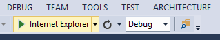

You can also use the dropdown to select a specific browser for debugging.

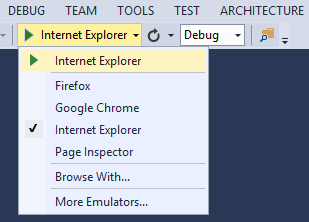

To debug with multiple browsers, select **Browse With**. In the **Browse With** dialog, hold down the CTRL key to select more than one browser. Click **Browse** to debug with the selected browsers. Browser Link also works if you launch a browser from outside Visual Studio and navigate to the application URL.

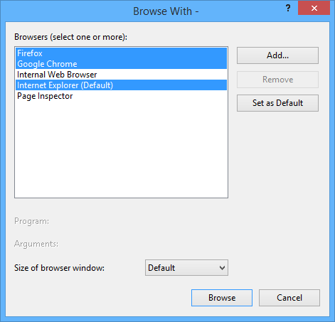

The Browser Link controls are located in the dropdown with the circular arrow icon. The arrow icon is the **Refresh** button.

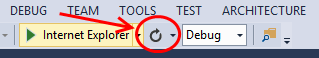

To see which browsers are connected, hover the mouse over the **Refresh** button while debugging. The connected browsers are shown in a ToolTip window.

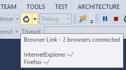

To refresh the connected browsers, click the **Refresh** button or press CTRL+ALT+ENTER. For example, the following screenshot shows an ASP.NET project, which I created using the MVC 5 project template. You can see the application running in two browsers at the top. At the bottom, the project is open in Visual Studio.

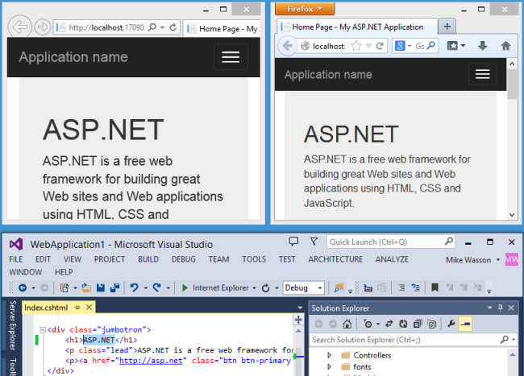

In Visual Studio, I changed the &lt;h1&gt; heading for the home page:

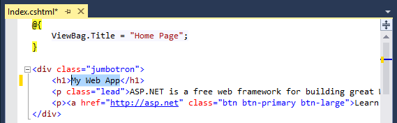

When I clicked the **Refresh** button, the change appeared in both browser windows:

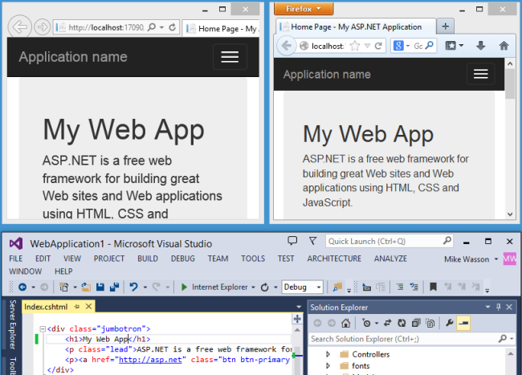

**Notes**

- To enable Browser Link, set `debug=true` in the [&lt;compilation&gt;](https://msdn.microsoft.com/en-us/library/s10awwz0(v=vs.85).aspx) element in the project's Web.config file.
- The application must be running on localhost.
- The application must target .NET 4.0 or later.

## Viewing the Browser Link Dashboard

The Browser Link dashboard shows information about the Browser Link connections. To view the dashboard, select the Browser Link dropdown menu (the small arrow next to the **Refresh** button). Then click **Browser Link Dashboard**.

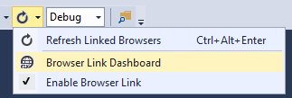

The dashboard lists the connected Browsers and the URL to which each browser has navigated.

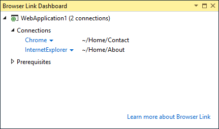

The **Prerequisites** section shows any steps needed to enable Browser Link for that project. For example, the following screenshot shows a project where "debug" is set to false in the Web.config file.

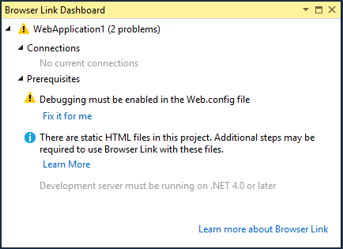

## Enabling Browser Link for Static HTML Files

To enable Browser Link for static HTML files, add the following to your Web.config file.

[!code-xml[Main](using-browser-link/samples/sample1.xml)]

For performance reasons, remove this setting when you publish your project.

## Disabling Browser Link

Browser Link is enabled by default. There are several ways to disable it:

- In the Browser Link dropdown menu, uncheck **Enable Browser Link**. 

    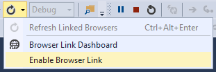
- In the Web.config file, add a key named "vs:EnableBrowserLink" with the value "false" in the appSettings section. 

    [!code-xml[Main](using-browser-link/samples/sample2.xml)]
- In the Web.config file, set debug to false. 

    [!code-xml[Main](using-browser-link/samples/sample3.xml)]

## How Does It Work?

Browser Link uses [SignalR](../../../signalr/index.md) to create a communication channel between Visual Studio and the browser. When Browser Link is enabled, Visual Studio acts as a SignalR server that multiple clients (browsers) can connect to. Browser Link also registers an HTTP module with ASP.NET. This module injects special &lt;script&gt; references into every page request from the server. You can see the script references by selecting "View source" in the browser.

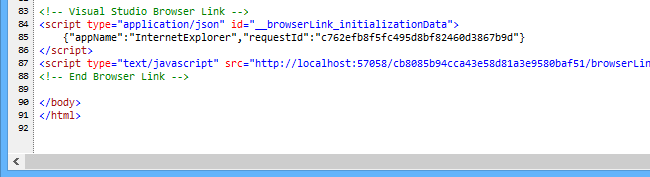

Your source files are not modified. The HTTP module injects the script references dynamically.

Because the browser-side code is all JavaScript, it works on all browsers that [SignalR supports](../../../signalr/overview/getting-started/supported-platforms.md), without requiring any browser plug-in.