Hands On Lab: Visual Studio 2013 Web Tools
====================
by [Web Camps Team](https://twitter.com/webcamps)

[Download Web Camps Training Kit](http://aka.ms/webcamps-training-kit)

> Visual Studio is an excellent development environment for .NET-based Windows and web projects. It includes a powerful text editor that can easily be used to edit standalone files without a project.
> 
> Visual Studio maintains a full-featured parse tree as you edit each file. This allows Visual Studio to provide unparalleled auto-completion and document-based actions while making the development experience much faster and more pleasant. These features are especially powerful in HTML and CSS documents.
> 
> All of this power is also available for extensions, making it simple to extend the editors with powerful new features to suit your needs. Web Essentials is a collection of (mostly) web-related enhancements to Visual Studio. It includes lots of new IntelliSense completions (especially for CSS), new Browser Link features, automatic JSHint for JavaScript files, new warnings for HTML and CSS, and many other features that are essential to modern web development.
> 
> All sample code and snippets are included in the Web Camps Training Kit, available at [http://aka.ms/webcamps-training-kit](http://aka.ms/webcamps-training-kit).

## Overview

### Objectives

In this hands-on lab, you will learn how to:

- Use new HTML editor features included in Web Essentials such as rich HTML5 code snippets and Zen coding
- Use new CSS editor features included in Web Essentials such as the Color picker and Browser matrix tooltip
- Use new JavaScript editor features included in Web Essentials such as Extract to File and IntelliSense for all HTML elements
- Exchange data between your browser and Visual Studio using Browser Link

### Prerequisites

The following is required to complete this hands-on lab:

- [Microsoft Visual Studio Professional 2013](https://www.microsoft.com/visualstudio/) or greater
- [Web Essentials 2013](http://vswebessentials.com/)
- [Google Chrome](https://www.google.com/chrome/)

### Setup

In order to run the exercises in this hands-on lab, you will need to set up your environment first.

1. Open a Windows Explorer window and browse to the lab's **Source** folder.
2. Right-click **Setup.cmd** and select **Run as administrator** to launch the setup process that will configure your environment and install the Visual Studio code snippets for this lab.
3. If the User Account Control dialog box is shown, confirm the action to proceed.

> [!NOTE]
> Make sure you have checked all the dependencies for this lab before running the setup.

### Using the Code Snippets

Throughout the lab document, you will be instructed to insert code blocks. For your convenience, most of this code is provided as Visual Studio Code Snippets, which you can access from within Visual Studio 2013 to avoid having to add it manually.

> [!NOTE]
> Each exercise is accompanied by a starting solution located in the **Begin** folder of the exercise that allows you to follow each exercise independently of the others. Please be aware that the code snippets that are added during an exercise are missing from these starting solutions and may not work until you have completed the exercise. Inside the source code for an exercise, you will also find an **End** folder containing a Visual Studio solution with the code that results from completing the steps in the corresponding exercise. You can use these solutions as guidance if you need additional help as you work through this hands-on lab.

* * *

## Exercises

This hands-on lab includes the following exercises:

1. [Working with Browser Link and Web Essentials](#Exercise1)
2. [Taking Advantage of Code Snippets and IntelliSense](#Exercise2)

> [!NOTE]
> When you first start Visual Studio, you must select one of the predefined settings collections. Each predefined collection is designed to match a particular development style and determines window layouts, editor behavior, IntelliSense code snippets, and dialog box options. The procedures in this lab describe the actions necessary to accomplish a given task in Visual Studio when using the **General Development Settings** collection. If you choose a different settings collection for your development environment, there may be differences in the steps that you should take into account.

### Exercise 1: Working with Browser Link and Web Essentials

**Web Essentials** is a Visual Studio extension that adds a variety of useful features for modern web development, mostly focused on making the web development experience much faster and more pleasant. You can install Web Essentials from the Extension Gallery in Visual Studio.

**Browser Link** is a new feature included in Visual Studio 2013 that provides a channel between the Visual Studio IDE and any open browser to exchange data between your web application and Visual Studio. Web Essentials extends Browser Link with tools to manipulate the DOM object model and the CSS styles of your web pages directly from the browser.

In this exercise, you will explore some of the features supported by **Web Essentials** and **Browser Link** to enhance a simple quiz page.

#### Task 1 - Running the Project in Multiple Browsers

In this task, you will configure your web application to run in multiple browsers at once, which is useful for cross-browser testing.

1. Open **Microsoft Visual Studio**.
2. In the **File** menu, select **Open | Project/Solution...** and browse to **Ex1-WorkingwithBrowserLinkandWebEssentials\Begin** in the **Source** folder of the lab (C:\WebCampsTK\HOL\VSWebTooling\Source). Select **Begin.sln** and click **Open**.
3. In the Visual Studio toolbar, expand the browser menu and select **Browse With...**.

    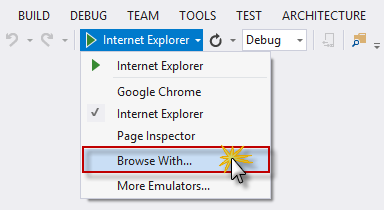

    *Browse With menu option*
4. In the **Browse With** dialog box, select both **Google Chrome** and **Internet Explorer** by holding down the **CTRL** key and click **Set as Default**.

    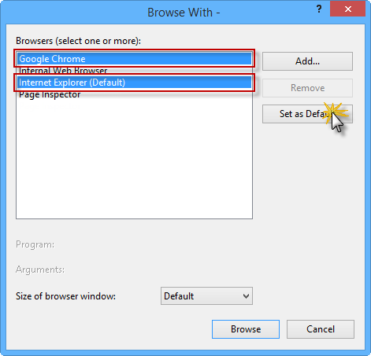

    *Selecting multiple default browsers*
5. Both Google Chrome and Internet Explorer should now appear as the default browsers. Click **Cancel** to close the dialog box.

    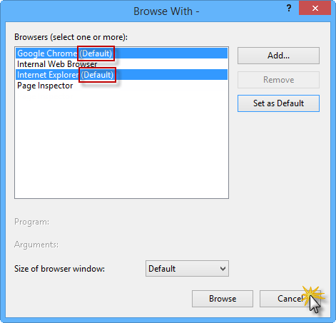

    *Google Chrome and Internet Explorer as default browsers*

    > [!NOTE]
    > After configuring the default browsers, the **Multiple Browsers** option is selected in the browser menu.
    > 
    > 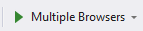
6. Press **CTRL** + **F5** to run the application without debugging.
7. When both browser windows open, place one of them above the other in order to see the updates on both browsers simultaneously. The browsers should display a web page with a light-blue rectangle.

    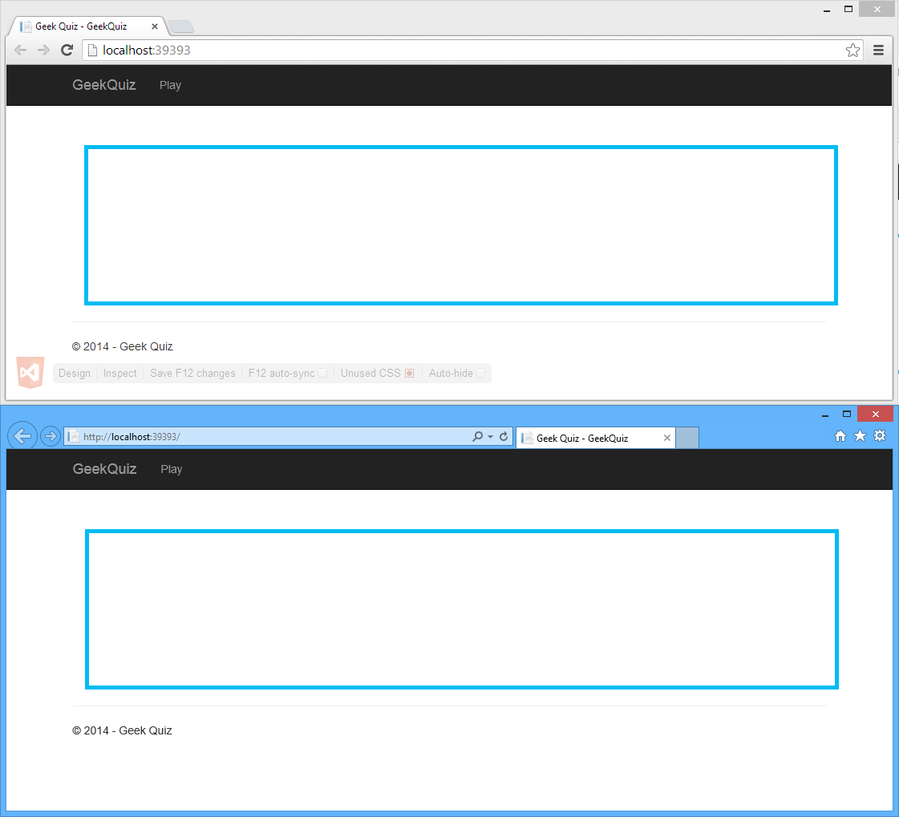

    *Placing one browser above the other*
8. Do not close the browsers. You will use them in the next task.

#### Task 2 - Using Zen Coding to Create HTML Elements

**Zen Coding** is an editor plugin for high-speed HTML, XML, XSL (or any other structured code format) coding and editing. The core of this plugin is a powerful abbreviation engine which allows you to expand expressions -similar to CSS selectors- into HTML code. Zen Coding is a fast way to write HTML using a CSS style selector syntax.

In this exercise, you will use the Zen Coding feature provided by Web Essentials to generate the HTML buttons that represent the options of the question.

1. Switch back to Visual Studio.
2. Open the **Index.cshtml** file located in the **Views** | **Home** folder.
3. Replace the **&lt;!-- TODO: add options here--&gt;** comment with the following code, and press **TAB**.

    [!code-css[Main](visual-studio-2013-web-tools/samples/sample1.css)]
4. The code should be expanded to HTML.

    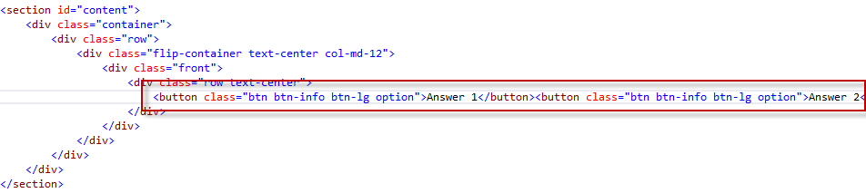

    *Expanded HTML*

    > [!NOTE]
    > To learn more about Zen Coding syntax, see the following [article](http://www.johnpapa.net/zen-coding-in-visual-studio-2012/).
5. Click the **Refresh linked browsers** button to update both browsers.

    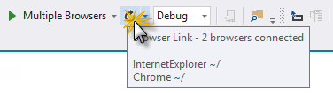

    *Refresh linked browsers*

    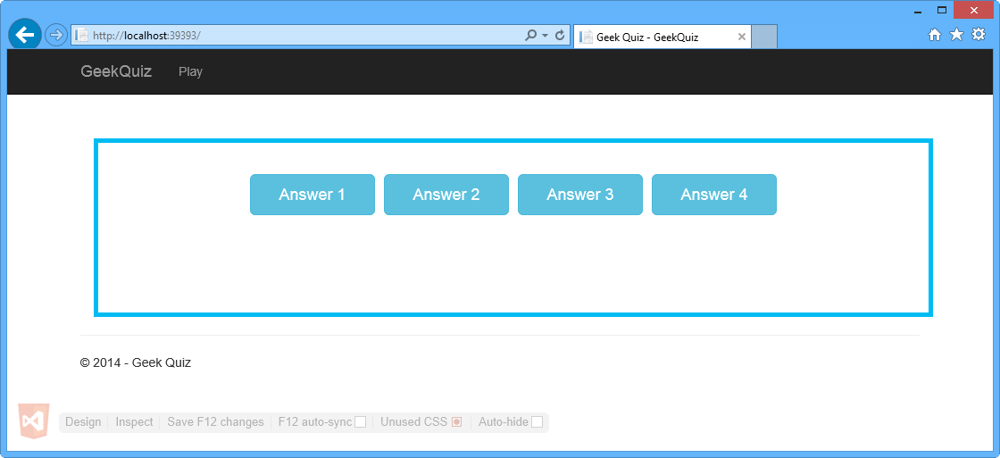

    *Internet Explorer - Page updated with four buttons*

    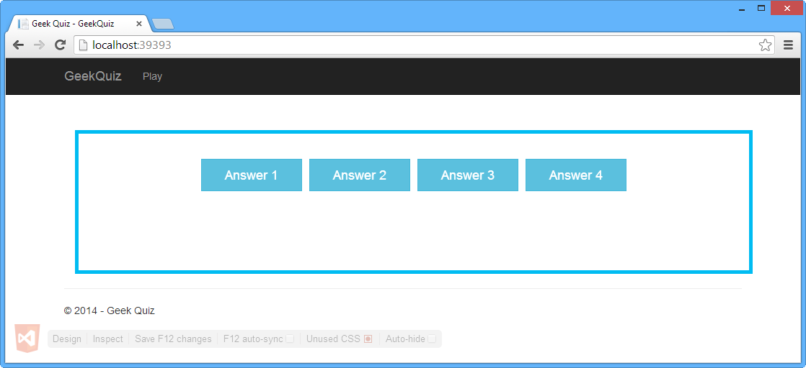

    *Google Chrome - Page updated with four buttons*
6. Switch back to Visual Studio.
7. You have added the buttons to the page, but you still need to add a template question. To do so, you will use a new feature in Web Essentials called **Lorem Ipsum generator**. Locate the **div** element with the **class** attribute **front**.
8. Add the following code as the first child element of the **div**, and press **TAB**.

    [!code-css[Main](visual-studio-2013-web-tools/samples/sample2.css)]
9. The code should be expanded to HTML.

    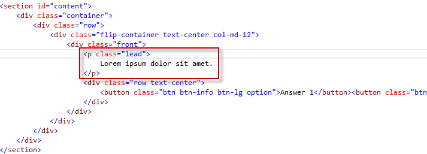

    *Lorem Ipsum autogenerated*

    > [!NOTE]
    > As part of Zen Coding, you can now generate Lorem Ipsum code directly in the HTML editor. Simply type **lorem** and hit **TAB** and a 30 word Lorem Ipsum text will be inserted. E.g. *lorem10* inserts 10 Lorem Ipsum words.
10. You will add a logo at the top of the question by using another new feature in Web Essentials called **Lorem Pixel generator**. Add the following code as the first child element of the **div** element with **container** as **class** value, and press **TAB**.

    [!code-css[Main](visual-studio-2013-web-tools/samples/sample3.css)]
11. The code should expand to HTML.

    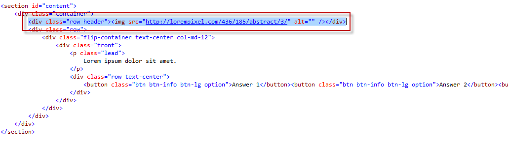

    *Lorem Pixel autogenerated*

    > [!NOTE]
    > As part of Zen Coding, you can also generate Lorem Pixel code directly in the HTML editor. Simply type **pix-200x200-animals** and hit **TAB** and an **img** tag with a 200x200 image of an animal will be inserted. For more information, refer to [Lorem Pixel](http://www.lorempixel.com).
12. Click the **Refresh linked browsers** button to update both browsers.

    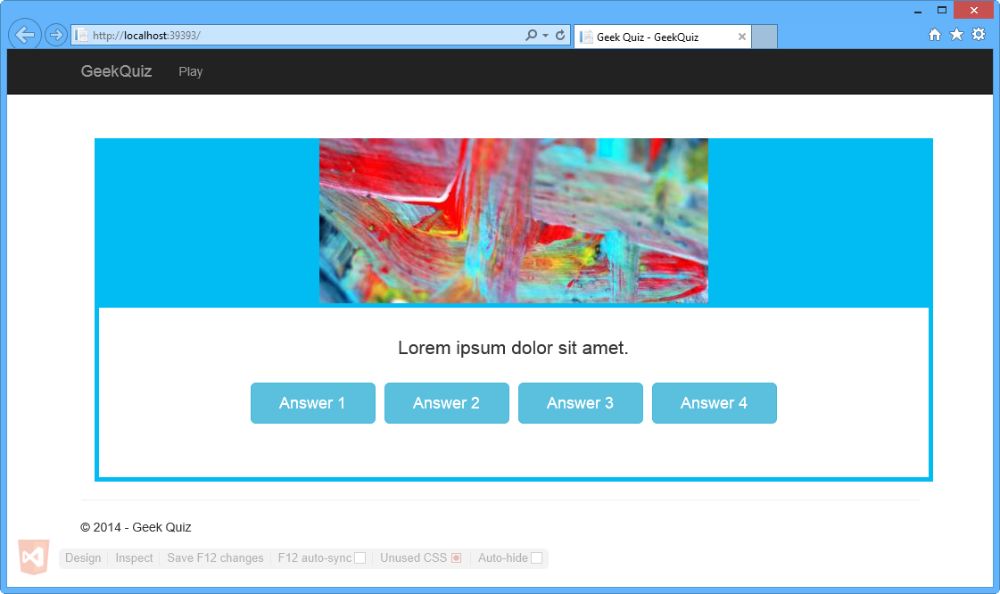

    *Internet Explorer - Autogenerated image and text*

    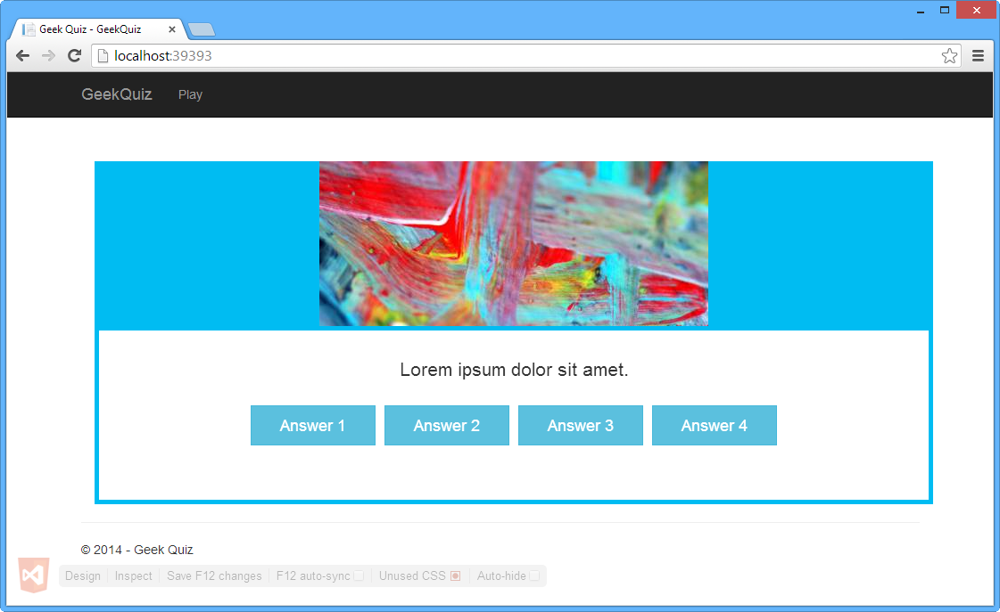

    *Google Chrome - Autogenerated image and text*

    > [!NOTE]
    > Because the image is selected randomly when adding the code snippet, the image shown in the browsers may differ.
13. Do not close the browsers. You will use them in the next task.

#### Task 3 - Updating a Style Property

In this task, you will use the Browser Link's **Inspect Mode** feature to detect the exact location where the specific DOM element is generated and then update the color property of that element using a color picker provided by Web Essentials.

1. In the Internet Explorer browser, press **CTRL** + **ALT** + **I** to enable Inspect Mode.
2. Move the pointer over the light blue border and click.

    

    *Moving the pointer over the light blue border*
3. Switch back to Visual Studio. Notice how the HTML element that you selected in the browser is also selected in the Visual Studio HTML editor.

    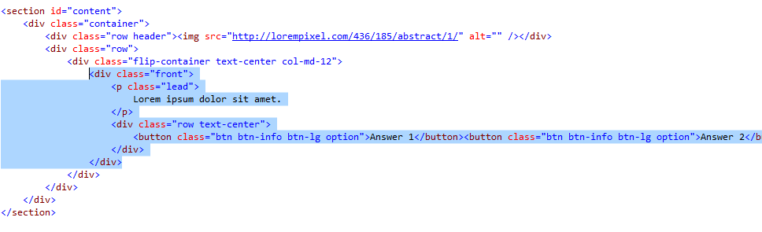

    *HTML element selected in the Visual Studio HTML editor*
4. You will now update the **front** CSS class in order to change the styling of the selected element. To do so, press **CTRL** + **,** to open the **Navigate To** search box. Type **site.css** and press **ENTER** to open the file.

    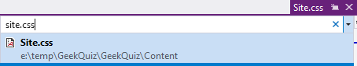

    *Opening file Site.css*
5. Press **CTRL** + **F** and type **.flip-containter .front** to find the CSS selector.
6. Click the light blue square in the border property of the class to open the Color Picker.

    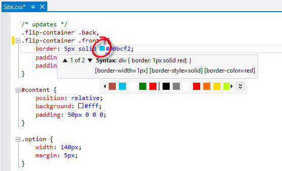

    *Opening the Color Picker*
7. Expand the Color Picker by clicking the chevron button and select a new color.

    

    *Expanding the Color Picker*
8. Press **CTRL** + **ALT** + **ENTER** to refresh linked browsers.
9. Switch to Internet Explorer and notice how the color of the border has changed.

    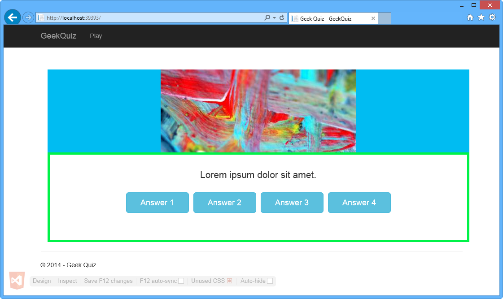

    *Internet Explorer - Border color updated*
10. Switch to Google Chrome and notice how the color of the border has changed.

    

    *Google Chrome - Border color updated*
11. Switch back to Visual Studio.
12. Go to the end of the **Site.css** file and press **CTRL** + **F** to locate the **.btn** selector.
13. Notice that the **-webkit-border-radius** property is underlined in green.

    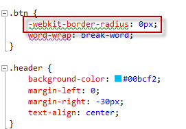

    *-webkit-border-radius property of the btn selector*
14. Place the caret in the **-webkit-border-radius** property. A blue line should appear under the first letter of the first word of the property. This is the **smart tag**.
15. Press **CTRL** + **.** to open the suggestions menu and click **Add missing standard property (border-radius)**.

    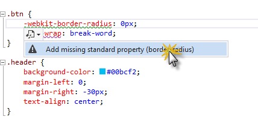

    *Add missing standard property suggestion*
16. The **border-radius** property is automatically added to the CSS rule.

    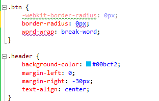

    *Missing standard property added*
17. Move the pointer over the **border-radius** property to display the **Browser matrix tooltip**. The **Browser matrix tooltip** shows the availability of the property in each browser.

    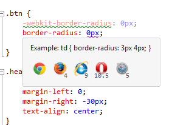

    *Browser matrix tooltip*
18. Notice that the value of the **border-radius** property is still underlined. Move the pointer over the value to see the warning message.

    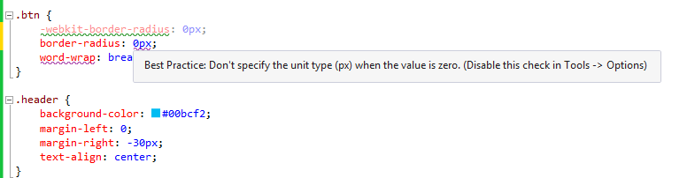

    *Border-radius property value warning*
19. Remove the unit of the **border-radius** property value as suggested by the tooltip.
20. As **border-radius** is the standard property for defining how rounded border corners are, you can remove the **-webkit-border-radius** property and value from the CSS rule.
21. Place the caret in the **word-wrap** property and notice that the smart tag also appears below.
22. Open the menu and click **Add missing vendor specifics**.

    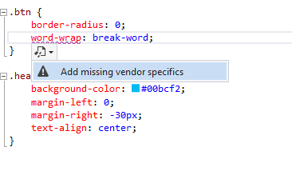

    *Add missing vendor specifics suggestion*
23. The **-ms-word-wrap** property is automatically added to the CSS rule.

    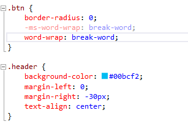

    *Vendor specific property added*

#### Task 4 - Updating the HTML Code from the Browser

In this task, you will use the Browser Link's **Design Mode** feature to edit the DOM object from the browser and transfer the changes to the HTML source file in Visual Studio.

1. In Google Chrome, press **CTRL** + **ALT** + **D** to enable Design Mode.
2. Move the pointer over the **Lorem Ipsum dolor sit amet** label and click.

    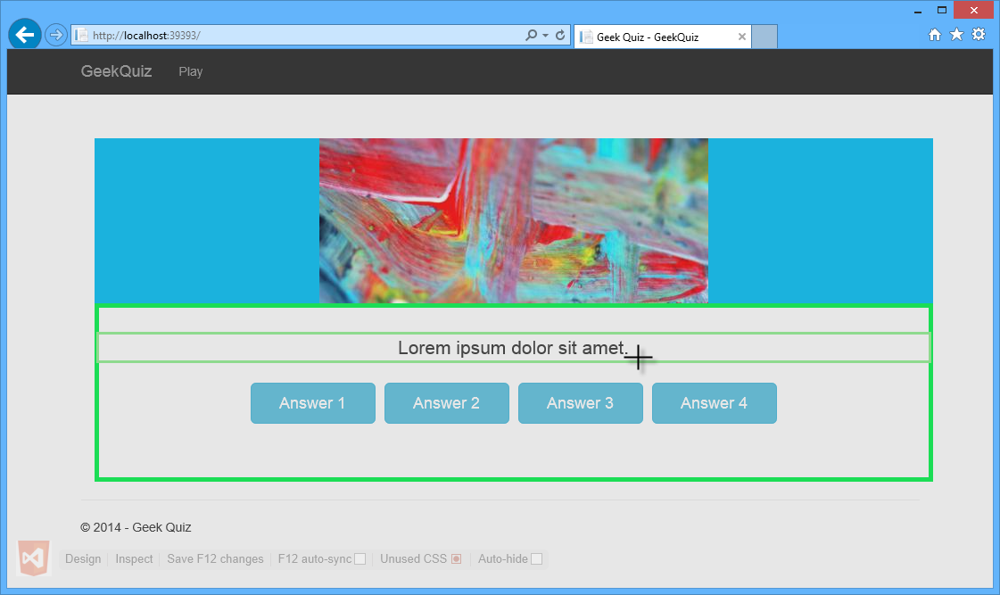

    *Editing the question*
3. A cursor should appear. Replace the original text with *What does it look like when I write a longer question?*, and then press **ESC** to exit Design Mode.

    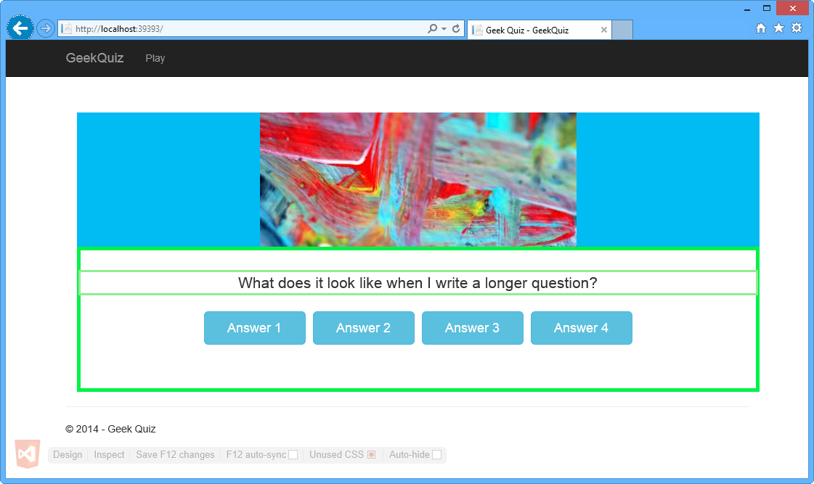

    *Question edited*
4. Switch back to Visual Studio and open **Index.cshtml**, if not already opened. Notice that the inner text of the **&lt;p&gt;** element has been updated.

    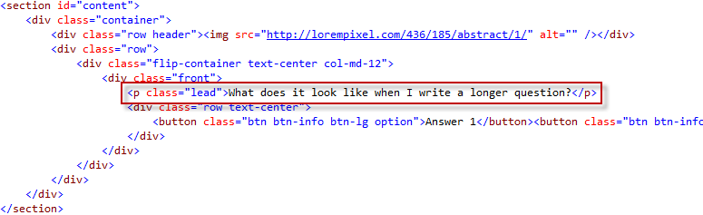

    *Updated question in the HTML page*

#### Task 5 - Reviewing SEO Related Warnings

**Search Engine Optimization** (SEO) is the process of making a website rank higher on a search engine's list of results. The higher the site ranks and the more consistently it is listed, the more visitors the site will get from that search engine. Web Essentials incorporates an analytical tool that examines HTML, reports the issues found and provides assistance to fix them.

1. Go to the **View** menu and click **Error List** to open the **Error List** window.

    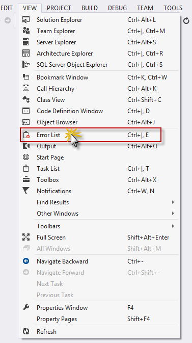

    *Error List in View menu*
2. Notice that there is an SEO warning notifying that a **&lt;meta&gt;** tag for the page description is missing. Double-click the SEO warning entry to fix it.

    

    *Error List window*
3. In the **Web Essentials** dialog box, click **Yes** to insert a description &lt;meta&gt; tag.

    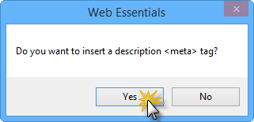

    *Web Essentials dialog box*
4. The editor for **\_Layout.cshtml** opens and the **&lt;meta&gt;** tag is automatically added to the **head** section of the HTML file.

    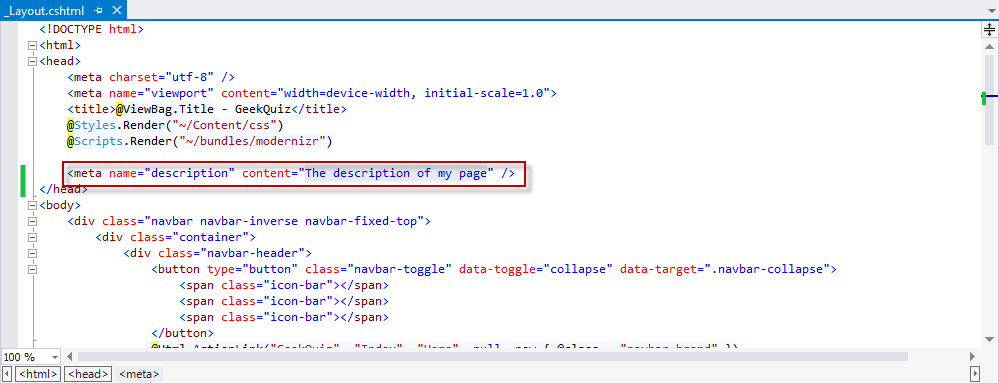

    *Meta tag automatically added to \_Layout page*
5. Change the value of the **content** attribute to *GeekQuiz* and save the file.

### Exercise 2: Taking Advantage of Code Snippets and IntelliSense

With Web Essentials, the HTML editor has been extended with extra functionality. In this exercise, you will see some new features that are helpful when developing web applications.

#### Task 1 - Using IntelliSense in HTML Documents

The first new feature you will see in this task is called **Dynamic IntelliSense**. Dynamic IntelliSense reads other tags and attributes to infer the possible ids you will use.

In this task, you will create a new HTML form element which contains a label and an input field. Then you will add a **for** attribute to the label to bind it to the input, and you will see IntelliSense suggestions based on the ids of the inputs in scope.

1. Open **Visual Studio Express 2013 for Web** and the **Begin.sln** solution located in the **Source/Ex2-TakingAdvantageofCodeSnippetsandIntelliSense/Begin** folder. Alternatively, you can continue with the solution that you obtained in the previous exercise.
2. In **Solution Explorer**, open the **Index.cshtml** file located in the **Views** | **Home** folder.
3. Add the following form inside the **&lt;section&gt;** element.

    (Code Snippet - *VisualStudio2013WebTooling* - *Ex2* - *Form*)

    [!code-html[Main](visual-studio-2013-web-tools/samples/sample4.html)]
4. The input tag should be preceded by a label with some description of the field. Add the following label before the input tag.

    [!code-html[Main](visual-studio-2013-web-tools/samples/sample5.html)]
5. The **for** attribute of a **&lt;label&gt;** specifies which form element a label is bound to. The attribute's value should be equal to the id of the related element. Add the **for** attribute to the **&lt;label&gt;** element. As shown in the following figure, the &quot;name&quot; value pops up in the IntelliSense box, based on the id of the elements within the same scope (the enclosing **&lt;form&gt;**).

    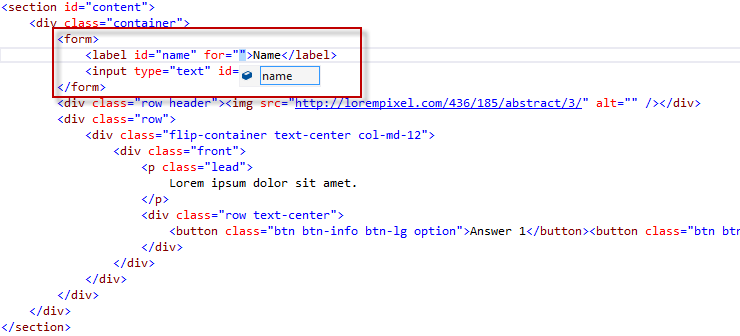

    *Showing the id in IntelliSense*
6. Delete the recently added **&lt;form&gt;** element and its content.

#### Task 2 - Using HTML Code Snippets

HTML5 introduced more than 25 new semantic tags. Visual Studio already had IntelliSense support for these tags, but Visual Studio 2013 makes it faster and easier to write markup by adding new code snippets. Though these tags are not complicated, they come with a few small subtleties, such as adding the correct codec fallbacks for the *audio* tag. In this task, you will see the HTML code snippets for the audio tag.

1. In the **Index.cshtml** file, type **&lt;aud** inside the **&lt;section&gt;** element as shown in the following figure.

    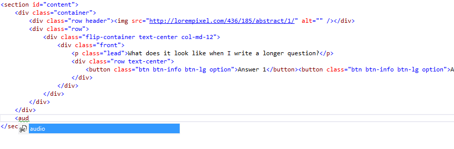

    *Inserting an audio element*
2. Press **TAB** twice and notice how the following code is added on the page and the cursor is placed on the **src** attribute of the first source.

    [!code-html[Main](visual-studio-2013-web-tools/samples/sample6.html)]

    > [!NOTE]
    > By pressing the **TAB** key twice, the code snippet is inserted. The audio snippet shows the standard usage of the *audio* tag, with two source files for improved support.
3. Delete the second line and update the source of the first line with the following link to the WebCampsTV Katana show: [http://media.ch9.ms/ch9/11d8/604b8163-fad3-4f12-9607-b404201211d8/KatanaProject.mp3](http://media.ch9.ms/ch9/11d8/604b8163-fad3-4f12-9607-b404201211d8/KatanaProject.mp3). The resulting code is shown below.

    [!code-html[Main](visual-studio-2013-web-tools/samples/sample7.html)]

    > [!NOTE]
    > The source file *KatanaProject.mp3* is used as an example. You can use another source if you prefer.
4. Press **CTRL** + **S** to save the file.
5. Press **CTRL** + **F5** to start the application.
6. Notice that an audio player was added to the application.

    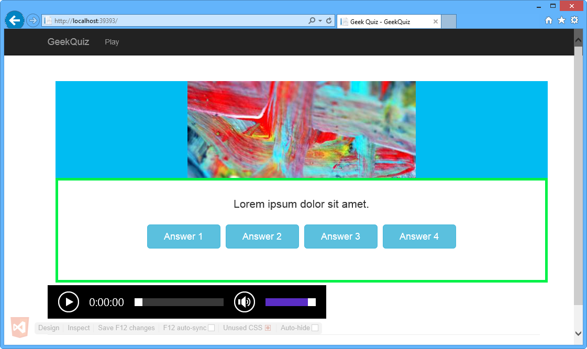

    *Audio player in Internet Explorer*

    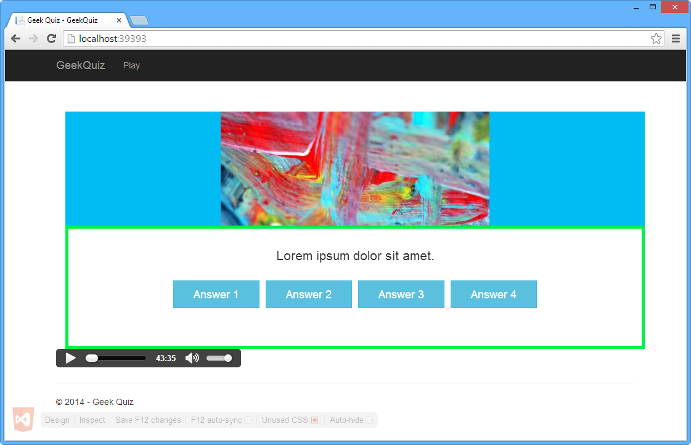

    *Audio player in Google Chrome*
7. Do not close the browsers. You will use them in the next task.

#### Task 3 - Using IntelliSense in JavaScript Documents

With Web Essentials 2013, style sheets and HTML pages produce a list of IDs and class names. In this task, you will learn how those lists improve JavaScript IntelliSense support in Web Essentials 2013.

1. In the **Index.cshtml** file, add the following code to define a **script** tag for JavaScript code.

    [!code-cshtml[Main](visual-studio-2013-web-tools/samples/sample8.cshtml)]
2. Add the following code inside the **script** tag to define the ready callback function.

    (Code Snippet - *VisualStudio2013WebTooling* - *Ex2* - *ReadyFunction*)

    [!code-javascript[Main](visual-studio-2013-web-tools/samples/sample9.js)]
3. Place the caret in the **script** tag and press **CTRL** + **.** to open the suggestion menu.
4. Click **Extract To File**.

    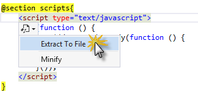

    *JavaScript extract to file suggestion*
5. In the **Save As** window, select the **Scripts** folder, name the file **init.js** and click **Save**.

    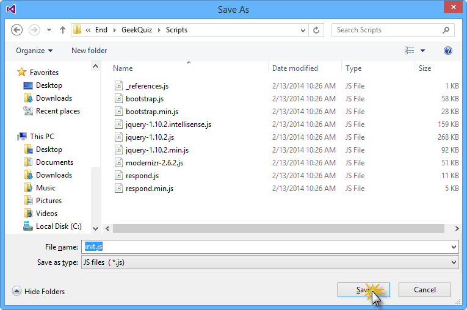

    *Save As window*

    > [!NOTE]
    > The **init.js** file is created and the content of the script is moved to the file.
    > 
    > 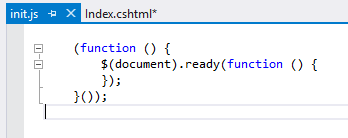
    > 
    > *Init.js file created with the content included*
6. Open the **Index.cshtml** file and check that the script tag was replaced with a reference to the **init.js** file.

    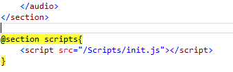

    *Init.js html reference*
7. Go to the **Solution Explorer** and notice that the **init.js** file was included automatically in the solution.

    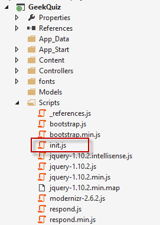

    *Init.js file included in solution*
8. Switch back to the **init.js** file to update the **ready** function callback.
9. Inside the function callback definition that is passed to *ready*, add the following code to get all the elements by a specific class attribute.

    [!code-javascript[Main](visual-studio-2013-web-tools/samples/sample10.js)]
10. Press **CTRL** + **Space** between the quotes inside the **getElementsByClassName** function call.

    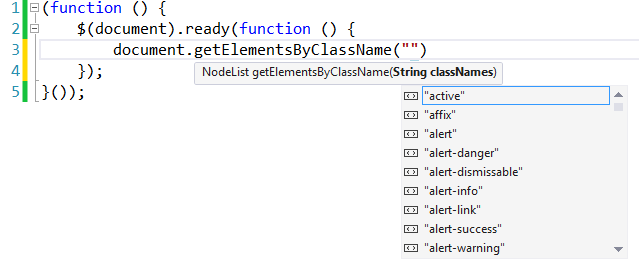

    *Showing IntelliSense for the getElementsByClassName function*

    > [!NOTE]
    > Notice that IntelliSense shows the classes defined in the project style sheets.
11. Replace the line that you have created with the following code.

    [!code-javascript[Main](visual-studio-2013-web-tools/samples/sample11.js)]
12. Position the cursor after **au** inside the quotes in the **getElementsByTagName** function and press **CTRL** + **Space**.

    

    *Showing IntelliSense for the getElementsByTagName method*
13. Select **&quot;audio&quot;** from the list and press **ENTER**. The result is shown in the following figure.

    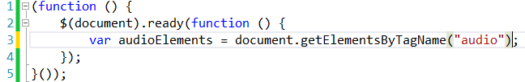

    *Retrieving Audio Elements*
14. In **Solution Explorer**, right-click the **init.js** file in the **Scripts** folder and select **Minify JavaScript file(s)** from the **Web Essentials** menu.

    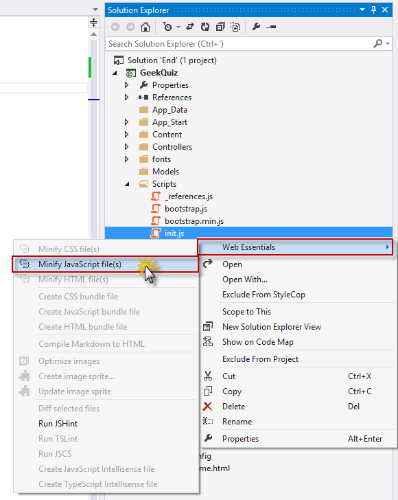

    *Minify JavaScript file(s)*
15. When prompted to enable automatic minification when the source file changes click **Yes**.

    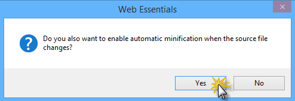

    *Enabling automatic minification warning*

    > [!NOTE]
    > The **init.min.js** is created and is added as a dependency of the **init.js** file.
    > 
    > 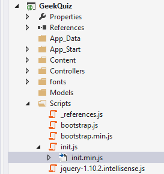
    > 
    > *Init.min.js file created*
16. Open the **init.min.js** file and notice that the file is minified.

    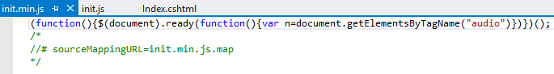

    *Init.min.js file content*
17. In the **init.js** file, add the following code below the **getElementsByTagName** function call to play all the audio elements.

    (Code Snippet - *VisualStudio2013WebTooling* - *Ex2* - *PlayAudioElements*)

    [!code-csharp[Main](visual-studio-2013-web-tools/samples/sample12.cs)]
18. Click **CTRL** + **S** to save the file. Since the minified file is already opened, you will see a dialog box saying that the file was modified outside of the source editor. Click **Yes**.

    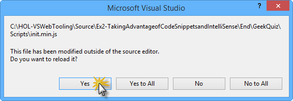

    *Microsoft Visual Studio warning*
19. Switch back to the **init.min.js** file to verify that the file was updated with the new code.

    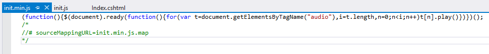

    *Init.min.js file updated*
20. Click the **Browser Link Refresh** button.
21. Once both browsers are refreshed the audio players you saw in the previous task will start playing automatically.

    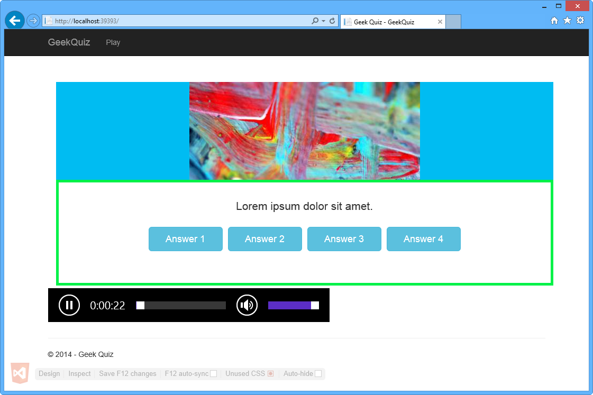

    *Audio player included in view*

* * *

## Summary

By completing this hands-on lab you have learned how to:

- Use new HTML editor features included in Web Essentials such as rich HTML5 code snippets and Zen coding
- Use new CSS editor features included in Web Essentials such as the Color picker and Browser matrix tooltip
- Use new JavaScript editor features included in Web Essentials such as Extract to File and IntelliSense for all HTML elements
- Exchange data between your browser and Visual Studio using Browser Link