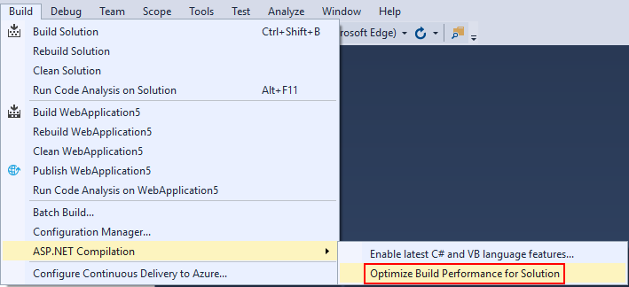

# Optimize build performance for solution

Visual Studio 2017 15.8 or later include a menu item: **Build** > **ASP.NET Compilation** > **Optimize Build Performance for Solution**.

ASP.NET compiles its views at runtime, which means that an ASP.NET project carries with it a copy of the compiler. However on a developer machine when the copy of the compiler doesn't match Visual Studio's copy, build performance is impacted on the order of 1-3 seconds per incremental build. This feature updates your project's copy of the compiler to match Visual Studio's, which usually speeds up incremental builds.

**This is applicable to ASP.NET Framework 4.7.1 or later projects only, it does not apply to ASP.NET Core.**
