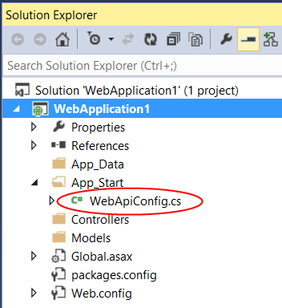

Configuring ASP.NET Web API 2
====================
by [Mike Wasson](https://github.com/MikeWasson)

This topic describes how to configure ASP.NET Web API.

- [Configuration Settings](#settings)
- [Configuring Web API with ASP.NET Hosting](#webhost)
- [Configuring Web API with OWIN Self-Hosting](#selfhost)
- [Global Web API Services](#services)
- [Per-Controller Configuration](#percontrollerconfig)

## Configuration Settings

Web API configuration setttings are defined in the [HttpConfiguration](https://msdn.microsoft.com/en-us/library/system.web.http.httpconfiguration.aspx) class.

| Member | Description |
| --- | --- |
| **DependencyResolver** | Enables dependency injection for controllers. See [Using the Web API Dependency Resolver](dependency-injection.md). |
| **Filters** | Action filters. |
| **Formatters** | [Media-type formatters](../formats-and-model-binding/media-formatters.md). |
| **IncludeErrorDetailPolicy** | Specifies whether the server should include error details, such as exception messages and stack traces, in HTTP response messages. See [IncludeErrorDetailPolicy](https://msdn.microsoft.com/en-us/library/system.web.http.includeerrordetailpolicy(v=vs.108)). |
| **Initializer** | A function that performs final initialization of the **HttpConfiguration**. |
| **MessageHandlers** | [HTTP message handlers](http-message-handlers.md). |
| **ParameterBindingRules** | A collection of rules for binding parameters on controller actions. |
| **Properties** | A generic property bag. |
| **Routes** | The collection of routes. See [Routing in ASP.NET Web API](../web-api-routing-and-actions/routing-in-aspnet-web-api.md). |
| **Services** | The collection of services. See [Services](#services). |

## Configuring Web API with ASP.NET Hosting

In an ASP.NET application, configure Web API by calling [GlobalConfiguration.Configure](https://msdn.microsoft.com/en-us/library/system.web.http.globalconfiguration.configure.aspx) in the **Application\_Start** method. The **Configure** method takes a delegate with a single parameter of type **HttpConfiguration**. Perform all of your configuation inside the delegate.

Here is an example using an anonymous delegate:

[!code-csharp[Main](configuring-aspnet-web-api/samples/sample1.cs)]

In Visual Studio 2013, the "ASP.NET Web Application" project template automatically sets up the configuration code, if you select "Web API" in the **New ASP.NET Project** dialog.

The project template creates a file named WebApiConfig.cs inside the App\_Start folder. This code file defines the delegate where you should put your Web API configuration code.

[!code-csharp[Main](configuring-aspnet-web-api/samples/sample2.cs?highlight=12)]

The project template also adds the code that calls the delegate from **Application\_Start**.

[!code-csharp[Main](configuring-aspnet-web-api/samples/sample3.cs?highlight=5)]

## Configuring Web API with OWIN Self-Hosting

If you are self-hosting with OWIN, create a new **HttpConfiguration** instance. Perform any configuration on this instance, and then pass the instance to the **Owin.UseWebApi** extension method.

[!code-csharp[Main](configuring-aspnet-web-api/samples/sample4.cs)]

The tutorial [Use OWIN to Self-Host ASP.NET Web API 2](../hosting-aspnet-web-api/use-owin-to-self-host-web-api.md) shows the complete steps.

## Global Web API Services

The **HttpConfiguration.Services** collection contains a set of global services that Web API uses to perform various tasks, such as controller selection and content negotiation.

> [!NOTE]
> The **Services** collection is not a general-purpose mechanism for service discovery or dependency injection. It only stores service types that are known to the Web API framework.

The **Services** collection is initialized with a default set of services, and you can provide your own custom implementations. Some services support multiple instances, while others can have only one instance. (However, you can also provide services at the controller level; see [Per-Controller Configuration](#percontrollerconfig).

Single-Instance Services

| Service | Description |
| --- | --- |
| **IActionValueBinder** | Gets a binding for a parameter. |
| **IApiExplorer** | Gets descriptions of the APIs exposed by the application. See [Creating a Help Page for a Web API](../getting-started-with-aspnet-web-api/creating-api-help-pages.md). |
| **IAssembliesResolver** | Gets a list of the assemblies for the application. See [Routing and Action Selection](../web-api-routing-and-actions/routing-and-action-selection.md). |
| **IBodyModelValidator** | Validates a model that is read from the request body by a media-type formatter. |
| **IContentNegotiator** | Performs content negotiation. |
| **IDocumentationProvider** | Provides documentation for APIs. The default is **null**. See [Creating a Help Page for a Web API](../getting-started-with-aspnet-web-api/creating-api-help-pages.md). |
| **IHostBufferPolicySelector** | Indicates whether the host should buffer HTTP message entity bodies. |
| **IHttpActionInvoker** | Invokes a controller action. See [Routing and Action Selection](../web-api-routing-and-actions/routing-and-action-selection.md). |
| **IHttpActionSelector** | Selects a controller action. See [Routing and Action Selection](../web-api-routing-and-actions/routing-and-action-selection.md). |
| **IHttpControllerActivator** | Activates a controller. See [Routing and Action Selection](../web-api-routing-and-actions/routing-and-action-selection.md). |
| **IHttpControllerSelector** | Selects a controller. See [Routing and Action Selection](../web-api-routing-and-actions/routing-and-action-selection.md). |
| **IHttpControllerTypeResolver** | Provides a list of the Web API controller types in the application. See [Routing and Action Selection](../web-api-routing-and-actions/routing-and-action-selection.md). |
| **ITraceManager** | Initializes the tracing framework. See [Tracing in ASP.NET Web API](../testing-and-debugging/tracing-in-aspnet-web-api.md). |
| **ITraceWriter** | Provides a trace writer. The default is a "no-op" trace writer. See [Tracing in ASP.NET Web API](../testing-and-debugging/tracing-in-aspnet-web-api.md). |
| **IModelValidatorCache** | Provides a cache of model validators. |

Multiple-Instance Services

| Service | Description |
| --- | --- |
| **IFilterProvider** | Returns a list of filters for a controller action. |
| **ModelBinderProvider** | Returns a model binder for a given type. |
| **ModelMetadataProvider** | Provides metadata for a model. |
| **ModelValidatorProvider** | Provides a validator for a model. |
| **ValueProviderFactory** | Creates a value provider. For more information, see Mike Stall's blog post [How to create a custom value provider in WebAPI](https://blogs.msdn.com/b/jmstall/archive/2012/04/23/how-to-create-a-custom-value-provider-in-webapi.aspx) |.

To add a custom implementation to a multi-instance service, call **Add** or **Insert** on the **Services** collection:

[!code-csharp[Main](configuring-aspnet-web-api/samples/sample5.cs)]

To replace a single-instance service with a custom implementation, call **Replace** on the **Services** collection:

[!code-csharp[Main](configuring-aspnet-web-api/samples/sample6.cs)]

## Per-Controller Configuration

You can override the following settings on a per-controller basis:

- Media-type formatters
- Parameter binding rules
- Services

To do so, define a custom attribute that implements the **IControllerConfiguration** interface. Then apply the attribute to the controller.

The following example replaces the default media-type formatters with a custom formatter.

[!code-csharp[Main](configuring-aspnet-web-api/samples/sample7.cs)]

The **IControllerConfiguration.Initialize** method takes two parameters:

- An **HttpControllerSettings** object
- An **HttpControllerDescriptor** object

The **HttpControllerDescriptor** contains a description of the controller, which you can examine for informational purposes (say, to distinguish between two controllers).

Use the **HttpControllerSettings** object to configure the controller. This object contains the subset of configuration parameters that you can override on a per-controller basis. Any settings that you don't change default to the global **HttpConfiguration** object.