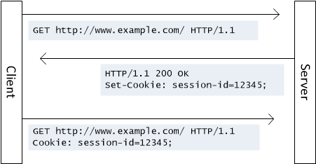
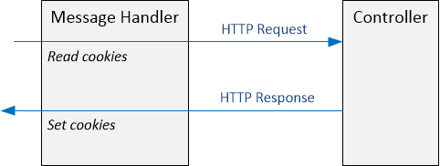

HTTP Cookies in ASP.NET Web API
====================
by [Mike Wasson](https://github.com/MikeWasson)

This topic describes how to send and receive HTTP cookies in Web API.

## Background on HTTP Cookies

This section gives a brief overview of how cookies are implemented at the HTTP level. For details, consult [RFC 6265](http://tools.ietf.org/html/rfc6265).

A cookie is a piece of data that a server sends in the HTTP response. The client (optionally) stores the cookie and returns it on subsequet requests. This allows the client and server to share state. To set a cookie, the server includes a Set-Cookie header in the response. The format of a cookie is a name-value pair, with optional attributes. For example:

[!code-powershell[Main](http-cookies/samples/sample1.ps1)]

Here is an example with attributes:

[!code-powershell[Main](http-cookies/samples/sample2.ps1)]

To return a cookie to the server, the client inclues a Cookie header in later requests.

[!code-console[Main](http-cookies/samples/sample3.cmd)]

An HTTP response can include multiple Set-Cookie headers.

[!code-powershell[Main](http-cookies/samples/sample4.ps1)]

The client returns multiple cookies using a single Cookie header.

[!code-console[Main](http-cookies/samples/sample5.cmd)]

The scope and duration of a cookie are controlled by following attributes in the Set-Cookie header:

- **Domain**: Tells the client which domain should receive the cookie. For example, if the domain is "example.com", the client returns the cookie to every subdomain of example.com. If not specified, the domain is the origin server.
- **Path**: Restricts the cookie to the specified path within the domain. If not specified, the path of the request URI is used.
- **Expires**: Sets an expiration date for the cookie. The client deletes the cookie when it expires.
- **Max-Age**: Sets the maximum age for the cookie. The client deletes the cookie when it reaches the maximum age.

If both `Expires` and `Max-Age` are set, `Max-Age` takes precedence. If neither is set, the client deletes the cookie when the current session ends. (The exact meaning of "session" is determined by the user-agent.)

However, be aware that clients may ignore cookies. For example, a user might disable cookies for privacy reasons. Clients may delete cookies before they expire, or limit the number of cookies stored. For privacy reasons, clients often reject "third party" cookies, where the domain does not match the origin server. In short, the server should not rely on getting back the cookies that it sets.

## Cookies in Web API

To add a cookie to an HTTP response, create a **CookieHeaderValue** instance that represents the cookie. Then call the **AddCookies** extension method, which is defined in the **System.Net.Http. HttpResponseHeadersExtensions** class, to add the cookie.

For example, the following code adds a cookie within a controller action:

[!code-csharp[Main](http-cookies/samples/sample6.cs)]

Notice that **AddCookies** takes an array of **CookieHeaderValue** instances.

To extract the cookies from a client request, call the **GetCookies** method:

[!code-csharp[Main](http-cookies/samples/sample7.cs)]

A **CookieHeaderValue** contains a collection of **CookieState** instances. Each **CookieState** represents one cookie. Use the indexer method to get a **CookieState** by name, as shown.

## Structured Cookie Data

Many browsers limit how many cookies they will store&#8212;both the total number, and the number per domain. Therefore, it can be useful to put structured data into a single cookie, instead of setting multiple cookies.

> [!NOTE]
> RFC 6265 does not define the structure of cookie data.

Using the **CookieHeaderValue** class, you can pass a list of name-value pairs for the cookie data. These name-value pairs are encoded as URL-encoded form data in the Set-Cookie header:

[!code-csharp[Main](http-cookies/samples/sample8.cs)]

The previous code produces the following Set-Cookie header:

[!code-powershell[Main](http-cookies/samples/sample9.ps1)]

The **CookieState** class provides an indexer method to read the sub-values from a cookie in the request message:

[!code-csharp[Main](http-cookies/samples/sample10.cs)]

## Example: Set and Retrieve Cookies in a Message Handler

The previous examples showed how to use cookies from within a Web API controller. Another option is to use [message handlers](http-message-handlers.md). Message handlers are invoked earlier in the pipeline than controllers. A message handler can read cookies from the request before the request reaches the controller, or add cookies to the response after the controller generates the response.

The following code shows a message handler for creating session IDs. The session ID is stored in a cookie. The handler checks the request for the session cookie. If the request does not include the cookie, the handler generates a new session ID. In either case, the handler stores the session ID in the **HttpRequestMessage.Properties** property bag. It also adds the session cookie to the HTTP response.

This implementation does not validate that the session ID from the client was actually issued by the server. Don't use it as a form of authentication! The point of the example is to show HTTP cookie management.

[!code-csharp[Main](http-cookies/samples/sample11.cs)]

A controller can get the session ID from the **HttpRequestMessage.Properties** property bag.

[!code-csharp[Main](http-cookies/samples/sample12.cs)]