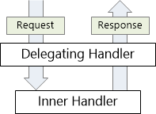
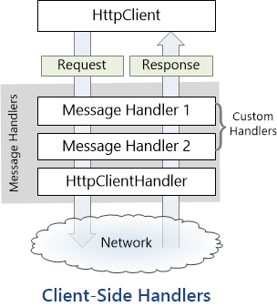

HttpClient Message Handlers in ASP.NET Web API
====================
by [Mike Wasson](https://github.com/MikeWasson)

A *message handler* is a class that receives an HTTP request and returns an HTTP response.

Typically, a series of message handlers are chained together. The first handler receives an HTTP request, does some processing, and gives the request to the next handler. At some point, the response is created and goes back up the chain. This pattern is called a *delegating* handler.

On the client side, the **HttpClient** class uses a message handler to process requests. The default handler is **HttpClientHandler**, which sends the request over the network and gets the response from the server. You can insert custom message handlers into the client pipeline:

> [!NOTE] ASP.NET Web API also uses message handlers on the server side. For more information, see [HTTP Message Handlers](http-message-handlers.md).

## Custom Message Handlers

To write a custom message handler, derive from **System.Net.Http.DelegatingHandler** and override the **SendAsync** method. Here is the method signature:

    Task<HttpResponseMessage> SendAsync(
        HttpRequestMessage request, CancellationToken cancellationToken);

The method takes an **HttpRequestMessage** as input and asynchronously returns an **HttpResponseMessage**. A typical implementation does the following:

1. Process the request message.
2. Call `base.SendAsync` to send the request to the inner handler.
3. The inner handler returns a response message. (This step is asynchronous.)
4. Process the response and return it to the caller.

The following example shows a message handler that adds a custom header to the outgoing request:

    class MessageHandler1 : DelegatingHandler
    {
        private int _count = 0;
    
        protected override Task<HttpResponseMessage> SendAsync(
            HttpRequestMessage request, System.Threading.CancellationToken cancellationToken)
        {
            _count++;
            request.Headers.Add("X-Custom-Header", _count.ToString());
            return base.SendAsync(request, cancellationToken);
        }
    }

The call to `base.SendAsync` is asynchronous. If the handler does any work after this call, use the **await** keyword to resume execution after the method completes. The following example shows a handler that logs error codes. The logging itself is not very interesting, but the example shows how to get at the response inside the handler.

[!code[Main](httpclient-message-handlers/samples/sample1.xml?highlight=10,13)]

## Adding Message Handlers to the Client Pipeline

To add custom handlers to **HttpClient**, use the **HttpClientFactory.Create** method:

    HttpClient client = HttpClientFactory.Create(new Handler1(), new Handler2(), new Handler3());

Message handlers are called in the order that you pass them into the **Create** method. Because handlers are nested, the response message travels in the other direction. That is, the last handler is the first to get the response message.