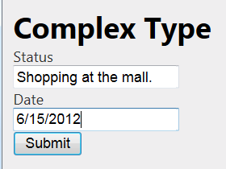
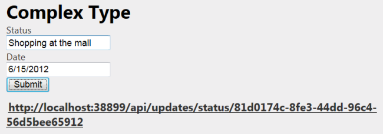

Sending HTML Form Data in ASP.NET Web API: Form-urlencoded Data
====================
by [Mike Wasson](https://github.com/MikeWasson)

## Part 1: Form-urlencoded Data

This article shows how to post form-urlencoded data to a Web API controller.

- [Overview of HTML Forms](#overview_of_html_forms)
- [Sending Complex Types](#sending_complex_types)
- [Sending Form Data via AJAX](#sending_form_data_via_ajax)
- [Sending Simple Types](#sending_simple_types)

> [!NOTE]
> [Download the completed project](https://code.msdn.microsoft.com/ASPNET-Web-API-Sending-a6f9d007).

## Overview of HTML Forms

HTML forms use either GET or POST to send data to the server. The **method** attribute of the **form** element gives the HTTP method:

[!code-html[Main](sending-html-form-data-part-1/samples/sample1.html)]

The default method is GET. If the form uses GET, the form data is encoded in the URI as a query string. If the form uses POST, the form data is placed in the request body. For POSTed data, the **enctype** attribute specifies the format of the request body:

| enctype | Description |
| --- | --- |
| application/x-www-form-urlencoded | Form data is encoded as name/value pairs, similar to a URI query string. This is the default format for POST. |
| multipart/form-data | Form data is encoded as a multipart MIME message. Use this format if you are uploading a file to the server. |

Part 1 of this article looks at x-www-form-urlencoded format. [Part 2](sending-html-form-data-part-2.md) describes multipart MIME.

## Sending Complex Types

Typically, you will send a complex type, composed of values taken from several form controls. Consider the following model that represents a status update:

[!code-csharp[Main](sending-html-form-data-part-1/samples/sample2.cs)]

Here is a Web API controller that accepts an `Update` object via POST.

[!code-csharp[Main](sending-html-form-data-part-1/samples/sample3.cs)]

> [!NOTE]
> This controller uses [action-based routing](../web-api-routing-and-actions/routing-in-aspnet-web-api.md#routing_by_action_name), so the route template is &quot;api/{controller}/{action}/{id}&quot;. The client will post the data to &quot;/api/updates/complex&quot;.

Now let's write an HTML form for users to submit a status update.

[!code-html[Main](sending-html-form-data-part-1/samples/sample4.html)]

Notice that the **action** attribute on the form is the URI of our controller action. Here is the form with some values entered in:

When the user clicks Submit, the browser sends an HTTP request similar to the following:

[!code-console[Main](sending-html-form-data-part-1/samples/sample5.cmd)]

Notice that the request body contains the form data, formatted as name/value pairs. Web API automatically converts the name/value pairs into an instance of the `Update` class.

## Sending Form Data via AJAX

When a user submits a form, the browser navigates away from the current page and renders the body of the response message. That's OK when the response is an HTML page. With a web API, however, the response body is usually either empty or contains structured data, such as JSON. In that case, it makes more sense to send the form data using an AJAX request, so that the page can process the response.

The following code shows how to post form data using jQuery.

[!code-html[Main](sending-html-form-data-part-1/samples/sample6.html)]

The jQuery **submit** function replaces the form action with a new function. This overrides the default behavior of the Submit button. The **serialize** function serializes the form data into name/value pairs. To send the form data to the server, call `$.post()`.

When the request completes, the `.success()` or `.error()` handler displays an appropriate message to the user.

## Sending Simple Types

In the previous sections, we sent a complex type, which Web API deserialized to an instance of a model class. You can also send simple types, such as a string.

> [!NOTE]
> Before sending a simple type, consider wrapping the value in a complex type instead. This gives you the benefits of model validation on the server side, and makes it easier to extend your model if needed.

The basic steps to send a simple type are the same, but there are two subtle differences. First, in the controller, you must decorate the parameter name with the **FromBody** attribute.

[!code-csharp[Main](sending-html-form-data-part-1/samples/sample7.cs?highlight=3)]

By default, Web API tries to get simple types from the request URI. The **FromBody** attribute tells Web API to read the value from the request body.

> [!NOTE]
> Web API reads the response body at most once, so only one parameter of an action can come from the request body. If you need to get multiple values from the request body, define a complex type.

Second, the client needs to send the value with the following format:

[!code-xml[Main](sending-html-form-data-part-1/samples/sample8.xml)]

Specifically, the name portion of the name/value pair must be empty for a simple type. Not all browsers support this for HTML forms, but you create this format in script as follows:

[!code-javascript[Main](sending-html-form-data-part-1/samples/sample9.js)]

Here is an example form:

[!code-html[Main](sending-html-form-data-part-1/samples/sample10.html)]

And here is the script to submit the form value. The only difference from the previous script is the argument passed into the **post** function.

[!code-javascript[Main](sending-html-form-data-part-1/samples/sample11.js?highlight=2)]

You can use the same approach to send an array of simple types:

[!code-javascript[Main](sending-html-form-data-part-1/samples/sample12.js)]

## Additional Resources

[Part 2: File Upload and Multipart MIME](sending-html-form-data-part-2.md)