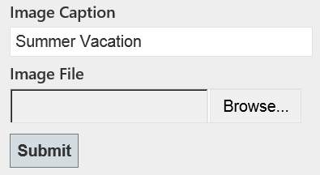
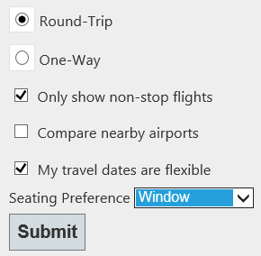

Sending HTML Form Data in ASP.NET Web API: File Upload and Multipart MIME
====================
by [Mike Wasson](https://github.com/MikeWasson)

## Part 2: File Upload and Multipart MIME

This tutorial shows how to upload files to a web API. It also describes how to process multipart MIME data.

> [!NOTE]
> [Download the completed project](https://code.msdn.microsoft.com/ASPNET-Web-API-File-Upload-a8c0fb0d).

Here is an example of an HTML form for uploading a file:

[!code-html[Main](sending-html-form-data-part-2/samples/sample1.html)]

This form contains a text input control and a file input control. When a form contains a file input control, the **enctype** attribute should always be &quot;multipart/form-data&quot;, which specifies that the form will be sent as a multipart MIME message.

The format of a multipart MIME message is easiest to understand by looking at an example request:

[!code-console[Main](sending-html-form-data-part-2/samples/sample2.cmd)]

This message is divided into two *parts*, one for each form control. Part boundaries are indicated by the lines that start with dashes.

> [!NOTE]
> The part boundary includes a random component (&quot;41184676334&quot;) to ensure that the boundary string does not accidentally appear inside a message part.

Each message part contains one or more headers, followed by the part contents.

- The Content-Disposition header includes the name of the control. For files, it also contains the file name.
- The Content-Type header describes the data in the part. If this header is omitted, the default is text/plain.

In the previous example, the user uploaded a file named GrandCanyon.jpg, with content type image/jpeg; and the value of the text input was &quot;Summer Vacation&quot;.

## File Upload

Now let's look at a Web API controller that reads files from a multipart MIME message. The controller will read the files asynchronously. Web API supports asynchronous actions using the [task-based programming model](https://msdn.microsoft.com/library/dd460693.aspx). First, here is the code if you are targeting .NET Framework 4.5, which supports the **async** and **await** keywords.

[!code-csharp[Main](sending-html-form-data-part-2/samples/sample3.cs)]

Notice that the controller action does not take any parameters. That's because we process the request body inside the action, without invoking a media-type formatter.

The **IsMultipartContent** method checks whether the request contains a multipart MIME message. If not, the controller returns HTTP status code 415 (Unsupported Media Type).

The **MultipartFormDataStreamProvider** class is a helper object that allocates file streams for uploaded files. To read the multipart MIME message, call the **ReadAsMultipartAsync** method. This method extracts all of the message parts and writes them into the streams provided by the **MultipartFormDataStreamProvider**.

When the method completes, you can get information about the files from the **FileData** property, which is a collection of **MultipartFileData** objects.

- **MultipartFileData.FileName** is the local file name on the server, where the file was saved.
- **MultipartFileData.Headers** contains the part header (*not* the request header). You can use this to access the Content\_Disposition and Content-Type headers.

As the name suggests, **ReadAsMultipartAsync** is an asynchronous method. To perform work after the method completes, use a [continuation task](https://msdn.microsoft.com/en-us/library/ee372288.aspx) (.NET 4.0) or the **await** keyword (.NET 4.5).

Here is the .NET Framework 4.0 version of the previous code:

[!code-csharp[Main](sending-html-form-data-part-2/samples/sample4.cs)]

## Reading Form Control Data

The HTML form that I showed earlier had a text input control.

[!code-html[Main](sending-html-form-data-part-2/samples/sample5.html)]

You can get the value of the control from the **FormData** property of the **MultipartFormDataStreamProvider**.

[!code-csharp[Main](sending-html-form-data-part-2/samples/sample6.cs?highlight=15)]

**FormData** is a **NameValueCollection** that contains name/value pairs for the form controls. The collection can contain duplicate keys. Consider this form:

[!code-html[Main](sending-html-form-data-part-2/samples/sample7.html)]

The request body might look like this:

[!code-console[Main](sending-html-form-data-part-2/samples/sample8.cmd)]

In that case, the **FormData** collection would contain the following key/value pairs:

- trip: round-trip
- options: nonstop
- options: dates
- seat: window