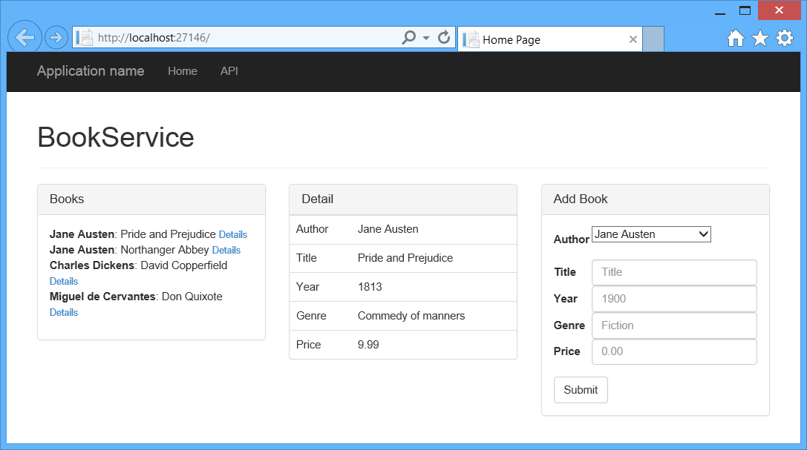
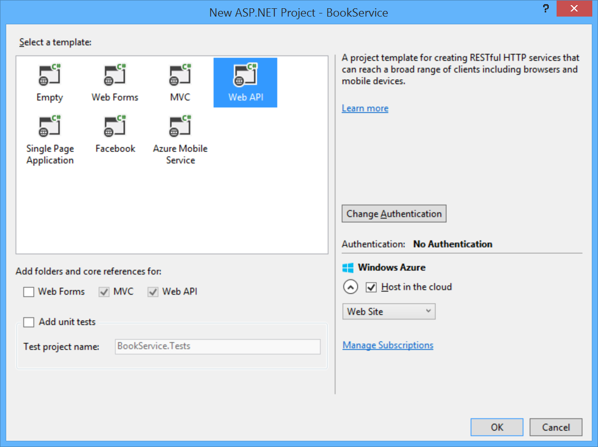

Using Web API 2 with Entity Framework 6
====================
by [Mike Wasson](https://github.com/MikeWasson)

[Download Completed Project](https://github.com/MikeWasson/BookService)

> This tutorial will teach you the basics of creating a web application with an ASP.NET Web API back end. The tutorial uses Entity Framework 6 for the data layer, and Knockout.js for the client-side JavaScript application. The tutorial also shows how to deploy the app to Azure App Service Web Apps.
> 
> ## Software versions used in the tutorial
> 
> 
> - Web API 2.1
> - [Visual Studio 2013 Update 2](https://www.visualstudio.com/downloads/download-visual-studio-vs)
> - Entity Framework 6
> - .NET 4.5
> - [Knockout.js](http://knockoutjs.com/) 3.1

This tutorial uses ASP.NET Web API 2 with Entity Framework 6 to create a web application that manipulates a back-end database. Here is a screen shot of the application that you will create.

The app uses a single-page application (SPA) design. "Single-page application" is the general term for a web application that loads a single HTML page and then updates the page dynamically, instead of loading new pages. After the initial page load, the app talks with the server through AJAX requests. The AJAX requests return JSON data, which the app uses to update the UI.

AJAX isn't new, but today there are JavaScript frameworks that make it easier to build and maintain a large sophisticated SPA application. This tutorial uses [Knockout.js](http://knockoutjs.com/), but you can use any JavaScript client framework.

Here are the main building blocks for this app:

- ASP.NET MVC creates the HTML page.
- ASP.NET Web API handles the AJAX requests and returns JSON data.
- Knockout.js data-binds the HTML elements to the JSON data.
- Entity Framework talks to the database.

## See this App Running on Azure

Would you like to see the finished site running as a live web app? You can deploy a complete version of the app to your Azure account by simply clicking the following button.

You need an Azure account to deploy this solution to Azure. If you do not already have an account, you have the following options:

- [Open an Azure account for free](https://azure.microsoft.com/en-us/pricing/free-trial/?WT.mc_id=A443DD604) - You get credits you can use to try out paid Azure services, and even after they're used up you can keep the account and use free Azure services.
- [Activate MSDN subscriber benefits](https://azure.microsoft.com/en-us/pricing/member-offers/msdn-benefits-details/?WT.mc_id=A443DD604) - Your MSDN subscription gives you credits every month that you can use for paid Azure services.

## Create the Project

Open Visual Studio. From the **File** menu, select **New**, then select **Project**. (Or click **New Project** on the Start page.)

In the **New Project** dialog, click **Web** in the left pane and **ASP.NET Web Application** in the middle pane. Name the project BookService and click **OK**.

In the **New ASP.NET Project** dialog, select the **Web API** template.

If you want to host the project in a Azure App Service, leave the **Host in the cloud** box checked.

Click **OK** to create the project.

## Configure Azure Settings (Optional)

If you left the **Host in Cloud** option checked, Visual Studio will prompt you to sign in to Microsoft Azure

After you sign in to Azure, Visual Studio prompts you to configure the web app. Enter a name for the site, select your Azure subscription, and select a geographical region. Under **Database server**, select **Create new server**. Enter an administrator username and password.

>[!div class="step-by-step"]
[Next](part-2.md)