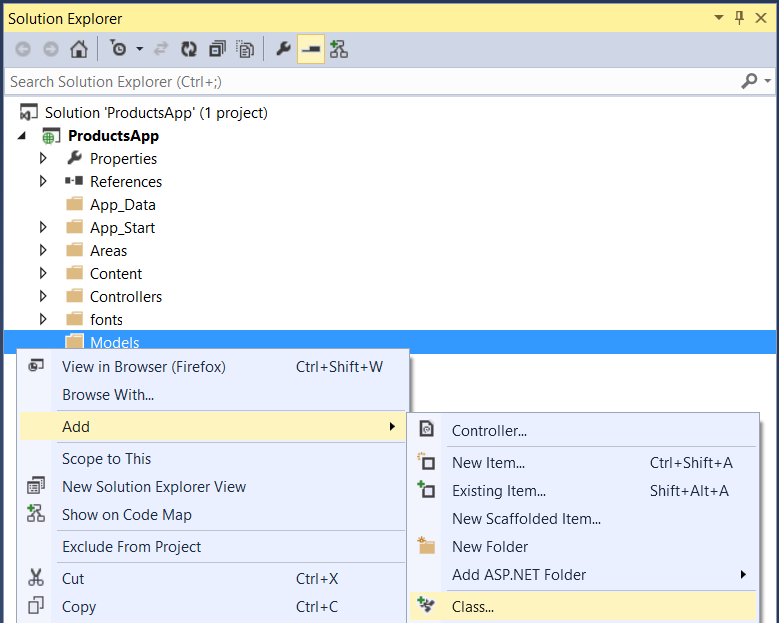
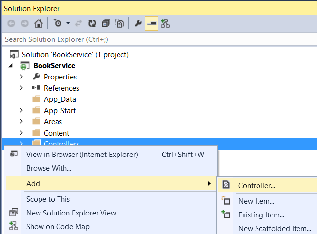
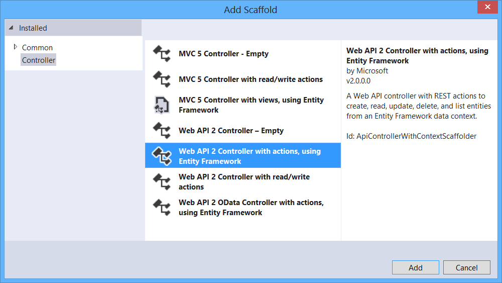
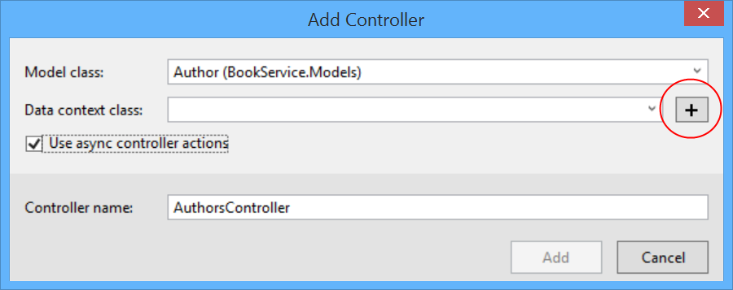
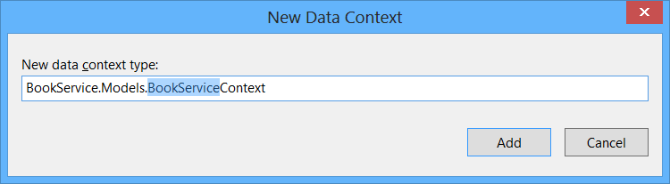
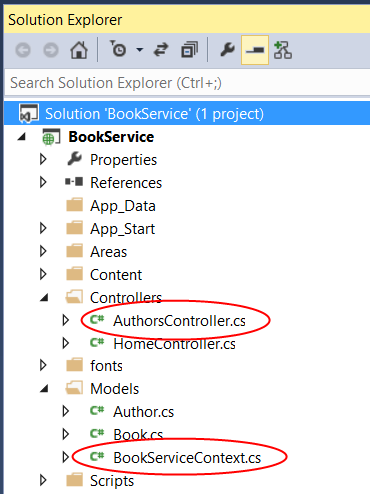
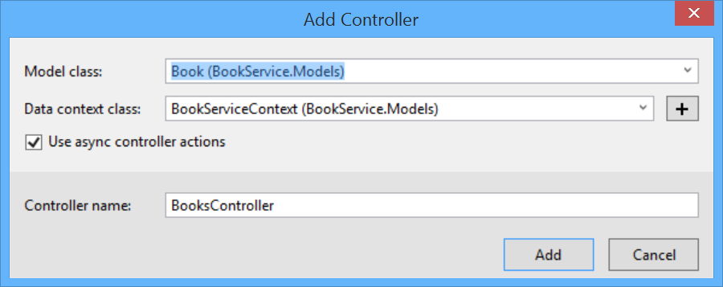

Add Models and Controllers
====================
by [Mike Wasson](https://github.com/MikeWasson)

[Download Completed Project](https://github.com/MikeWasson/BookService)

In this section, you will add model classes that define the database entities. Then you will add Web API controllers that perform CRUD operations on those entities.

## Add Model Classes

In this tutorial, we'll create the database by using the "Code First" approach to Entity Framework (EF). With Code First, you write C# classes that correspond to database tables, and EF creates the database. (For more information, see [Entity Framework Development Approaches](https://msdn.microsoft.com/en-us/library/ms178359%28v=vs.110%29.aspx#dbfmfcf).)

We start by defining our domain objects as POCOs (plain-old CLR objects). We will create the following POCOs:

- Author
- Book

In Solution Explorer, right click the Models folder. Select **Add**, then select **Class**. Name the class `Author`.

Replace all of the boilerplate code in Author.cs with the following code.

[!code-csharp[Main](part-2/samples/sample1.cs)]

Add another class named `Book`, with the following code.

[!code-csharp[Main](part-2/samples/sample2.cs)]

Entity Framework will use these models to create database tables. For each model, the `Id` property will become the primary key column of the database table.

In the Book class, the `AuthorId` defines a foreign key into the `Author` table. (For simplicity, I'm assuming that each book has a single author.) The book class also contains a navigation property to the related `Author`. You can use the navigation property to access the related `Author` in code. I say more about navigation properties in part 4, [Handling Entity Relations](part-4.md).

## Add Web API Controllers

In this section, we'll add Web API controllers that support CRUD operations (create, read, update, and delete). The controllers will use Entity Framework to communicate with the database layer.

First, you can delete the file Controllers/ValuesController.cs. This file contains an example Web API controller, but you don't need it for this tutorial.

Next, build the project. The Web API scaffolding uses reflection to find the model classes, so it needs the compiled assembly.

In Solution Explorer, right-click the Controllers folder. Select **Add**, then select **Controller**.

In the **Add Scaffold** dialog, select "Web API 2 Controller with actions, using Entity Framework". Click **Add**.

In the **Add Controller** dialog, do the following:

1. In the **Model class** dropdown, select the `Author` class. (If you don't see it listed in the dropdown, make sure that you built the project.)
2. Check "Use async controller actions".
3. Leave the controller name as &quot;AuthorsController&quot;.
4. Click plus (+) button next to **Data Context Class**.

In the **New Data Context** dialog, leave the default name and click **Add**.

Click **Add** to complete the **Add Controller** dialog. The dialog adds two classes to your project:

- `AuthorsController` defines a Web API controller. The controller implements the REST API that clients use to perform CRUD operations on the list of authors.
- `BookServiceContext` manages entity objects during run time, which includes populating objects with data from a database, change tracking, and persisting data to the database. It inherits from `DbContext`.

At this point, build the project again. Now go through the same steps to add an API controller for `Book` entities. This time, select `Book` for the model class, and select the existing `BookServiceContext` class for the data context class. (Don't create a new data context.) Click **Add** to add the controller.

>[!div class="step-by-step"]
[Previous](part-1.md)
[Next](part-3.md)
