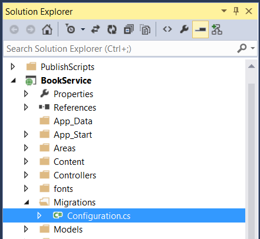
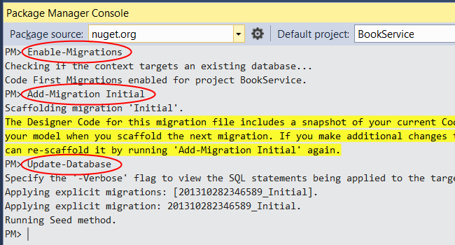
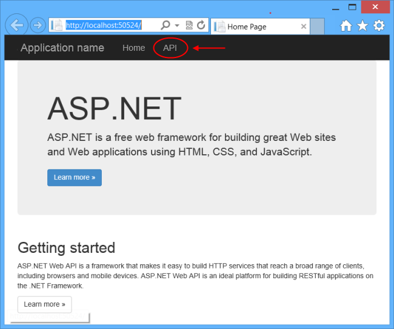
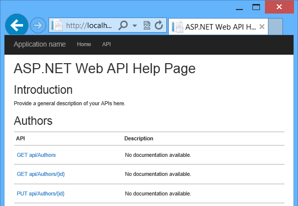
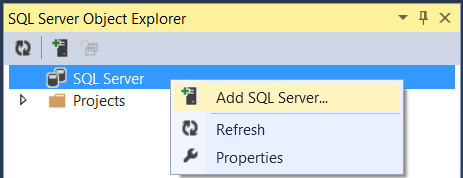
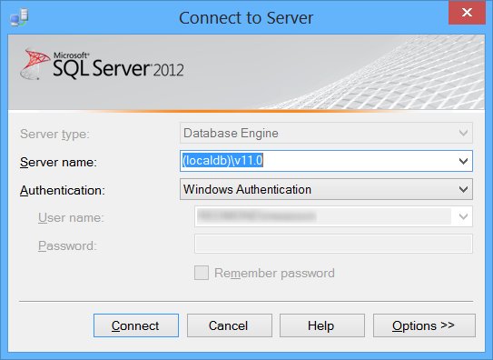
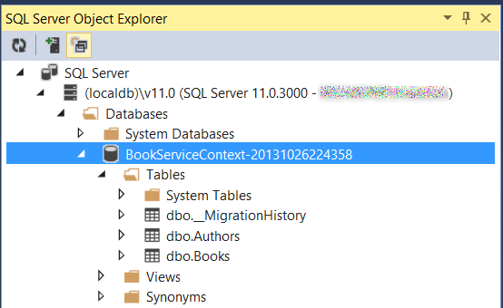
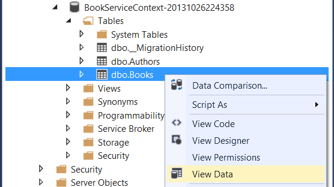
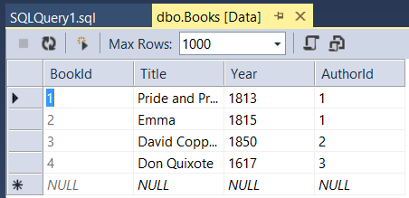

[Edit .md file](C:\Projects\msc\dev\Msc.Www\Web.ASP\App_Data\github\web-api\overview\data\using-web-api-with-entity-framework\part-3.md) | [Edit dev content](http://www.aspdev.net/umbraco#/content/content/edit/58254) | [View dev content](http://docs.aspdev.net/tutorials/web-api/overview/data/using-web-api-with-entity-framework/part-3.html) | [View prod content](http://www.asp.net/web-api/overview/data/using-web-api-with-entity-framework/part-3) | Picker: 58289

Use Code First Migrations to Seed the Database
====================
by [Mike Wasson](https://github.com/MikeWasson)

[Download Completed Project](https://github.com/MikeWasson/BookService)

In this section, you will use [Code First Migrations](https://msdn.microsoft.com/en-us/data/jj591621) in EF to seed the database with test data.

From the **Tools** menu, select **Library Package Manager**, then select **Package Manager Console**. In the Package Manager Console window, enter the following command:

    Enable-Migrations

This command adds a folder named Migrations to your project, plus a code file named Configuration.cs in the Migrations folder.

Open the Configuration.cs file. Add the following **using** statement.

    using BookService.Models;

Then add the following code to the **Configuration.Seed** method:

    protected override void Seed(BookService.Models.BookServiceContext context)
    {
        context.Authors.AddOrUpdate(x => x.Id,
            new Author() { Id = 1, Name = "Jane Austen" },
            new Author() { Id = 2, Name = "Charles Dickens" },
            new Author() { Id = 3, Name = "Miguel de Cervantes" }
            );
    
        context.Books.AddOrUpdate(x => x.Id,
            new Book() { Id = 1, Title = "Pride and Prejudice", Year = 1813, AuthorId = 1, 
                Price = 9.99M, Genre = "Comedy of manners" },
            new Book() { Id = 2, Title = "Northanger Abbey", Year = 1817, AuthorId = 1, 
                Price = 12.95M, Genre = "Gothic parody" },
            new Book() { Id = 3, Title = "David Copperfield", Year = 1850, AuthorId = 2, 
                Price = 15, Genre = "Bildungsroman" },
            new Book() { Id = 4, Title = "Don Quixote", Year = 1617, AuthorId = 3, 
                Price = 8.95M, Genre = "Picaresque" }
            );
    }

In the Package Manager Console window, type the following commands:

    Add-Migration Initial
    Update-Database

The first command generates code that creates the database, and the second command executes that code. The database is created locally, using [LocalDB](https://msdn.microsoft.com/en-us/library/hh510202.aspx).

## Explore the API (Optional)

Press F5 to run the application in debug mode. Visual Studio starts IIS Express and runs your web app. Visual Studio then launches a browser and opens the app's home page.

When Visual Studio runs a web project, it assigns a port number. In the image below, the port number is 50524. When you run the application, you'll see a different port number.

The home page is implemented using ASP.NET MVC. At the top of the page, there is a link that says "API". This link brings you to an auto-generated help page for the web API. (To learn how this help page is generated, and how you can add your own documentation to the page, see [Creating Help Pages for ASP.NET Web API](../../getting-started-with-aspnet-web-api/creating-api-help-pages.md).) You can click on the help page links to see details about the API, including the request and response format.

The API enables CRUD operations on the database. The following table summarizes the API.

| Authors |
| --- |
| GET api/authors | Get all authors. |
| GET api/authors/{id} | Get an author by ID. |
| POST /api/authors | Create a new author. |
| PUT /api/authors/{id} | Update an existing author. |
| DELETE /api/authors/{id} | Delete an author. |
| Books |
| GET /api/books | Get all books. |
| GET /api/books/{id} | Get a book by ID. |
| POST /api/books | Create a new book. |
| PUT /api/books/{id} | Update an existing book. |
| DELETE /api/books/{id} | Delete a book. |

## View the Database (Optional)

When you ran the Update-Database command, EF created the database and called the `Seed` method. When you run the application locally, EF uses [LocalDB](https://blogs.msdn.com/b/sqlexpress/archive/2011/07/12/introducing-localdb-a-better-sql-express.aspx). You can view the database in Visual Studio. From the **View** menu, select **SQL Server Object Explorer**.

In the **Connect to Server** dialog, in the **Server Name** edit box, type "(localdb)\v11.0". Leave the **Authentication** option as "Windows Authentication". Click **Connect**.

Visual Studio connects to LocalDB and shows your existing databases in the SQL Server Object Explorer window. You can expand the nodes to see the tables that EF created.

To view the data, right-click a table and select **View Data**.

The following screenshot shows the results for the Books table. Notice that EF populated the database with the seed data, and the table contains the foreign key to the Authors table.

>[!div class="step-by-step"] [Previous](part-2.md) [Next](part-4.md)