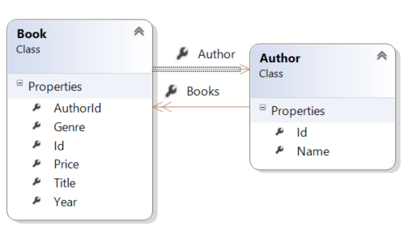

Handling Entity Relations
====================
by [Mike Wasson](https://github.com/MikeWasson)

[Download Completed Project](https://github.com/MikeWasson/BookService)

This section describes some details of how EF loads related entities, and how to handle circular navigation properties in your model classes. (This section provides background knowledge, and is not required to complete the tutorial. If you prefer, skip to [Part 5.](part-5.md).)

## Eager Loading versus Lazy Loading

When using EF with a relational database, it's important to understand how EF loads related data.

It's also useful to see the SQL queries that EF generates. To trace the SQL, add the following line of code to the `BookServiceContext` constructor:

[!code-csharp[Main](part-4/samples/sample1.cs)]

If you send a GET request to /api/books, it returns JSON like the following:

[!code-console[Main](part-4/samples/sample2.cmd)]

You can see that the Author property is null, even though the book contains a valid AuthorId. That's because EF is not loading the related Author entities. The trace log of the SQL query confirms this:

[!code-console[Main](part-4/samples/sample3.sql)]

The SELECT statement takes from the Books table, and does not reference the Author table.

For reference, here is the method in the `BooksController` class that returns the list of books.

[!code-csharp[Main](part-4/samples/sample4.cs)]

Let's see how we can return the Author as part of the JSON data. There are three ways to load related data in Entity Framework: eager loading, lazy loading, and explicit loading. There are trade-offs with each technique, so it's important to understand how they work.

### Eager Loading

With *eager loading*, EF loads related entities as part of the initial database query. To perform eager loading, use the **System.Data.Entity.Include** extension method.

[!code-csharp[Main](part-4/samples/sample5.cs)]

This tells EF to include the Author data in the query. If you make this change and run the app, now the JSON data looks like this:

[!code-console[Main](part-4/samples/sample6.cmd)]

The trace log shows that EF performed a join on the Book and Author tables.

[!code-console[Main](part-4/samples/sample7.cmd)]

### Lazy Loading

With lazy loading, EF automatically loads a related entity when the navigation property for that entity is dereferenced. To enable lazy loading, make the navigation property virtual. For example, in the Book class:

[!code-csharp[Main](part-4/samples/sample8.cs?highlight=6)]

Now consider the following code:

[!code-csharp[Main](part-4/samples/sample9.cs)]

When lazy loading is enabled, accessing the `Author` property on `books[0]` causes EF to query the database for the author.

Lazy loading requires multiple database trips, because EF sends a query each time it retrieves a related entity. Generally, you want lazy loading disabled for objects that you serialize. The serializer has to read all of the properties on the model, which triggers loading the related entities. For example, here are the SQL queries when EF serializes the list of books with lazy loading enabled. You can see that EF makes three separate queries for the three authors.

[!code-console[Main](part-4/samples/sample10.sql)]

There are still times when you might want to use lazy loading. Eager loading can cause EF to generate a very complex join. Or you might need related entities for a small subset of the data, and lazy loading would be more efficient.

One way to avoid serialization problems is to serialize data transfer objects (DTOs) instead of entity objects. I'll show this approach later in the article.

### Explicit Loading

Explicit loading is similar to lazy loading, except that you explicitly get the related data in code; it doesn't happen automatically when you access a navigation property. Explicit loading gives you more control over when to load related data, but requires extra code. For more information about explicit loading, see [Loading Related Entities](https://msdn.microsoft.com/en-us/data/jj574232#explicit).

## Navigation Properties and Circular References

When I defined the Book and Author models, I defined a navigation property on the `Book` class for the Book-Author relationship, but I did not define a navigation property in the other direction.

What happens if you add the corresponding navigation property to the `Author` class?

[!code-csharp[Main](part-4/samples/sample11.cs?highlight=7)]

Unfortunately, this creates a problem when you serialize the models. If you load the related data, it creates a circular object graph.

When the JSON or XML formatter tries to serialize the graph, it will throw an exception. The two formatters throw different exception messages. Here is an example for the JSON formatter:

[!code-console[Main](part-4/samples/sample12.cmd)]

Here is the XML formatter:

[!code-xml[Main](part-4/samples/sample13.xml)]

One solution is to use DTOs, which I describe in the next section. Alternatively, you can configure the JSON and XML formatters to handle graph cycles. For more information, see [Handling Circular Object References](../../formats-and-model-binding/json-and-xml-serialization.md#handling_circular_object_references).

For this tutorial, you don't need the `Author.Book` navigation property, so you can leave it out.

>[!div class="step-by-step"]
[Previous](part-3.md)
[Next](part-5.md)