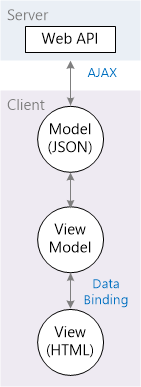

Create the JavaScript Client
====================
by [Mike Wasson](https://github.com/MikeWasson)

[Download Completed Project](https://github.com/MikeWasson/BookService)

In this section, you will create the client for the application, using HTML, JavaScript, and the [Knockout.js](http://knockoutjs.com/) library. We'll build the client app in stages:

- Showing a list of books.
- Showing a book detail.
- Adding a new book.

The Knockout library uses the Model-View-ViewModel (MVVM) pattern:

- The **model** is the server-side representation of the data in the business domain (in our case, books and authors).
- The **view** is the presentation layer (HTML).
- The **view model** is a JavaScript object that holds the models. The view model is a code abstraction of the UI. It has no knowledge of the HTML representation. Instead, it represents abstract features of the view, such as &quot;a list of books&quot;.

The view is data-bound to the view model. Updates to the view model are automatically reflected in the view. The view model also gets events from the view, such as button clicks.

This approach makes it easy to change the layout and UI of your app, because you can change the bindings, without rewriting any code. For example, you might show a list of items as a `<ul>`, then change it later to a table.

## Add the Knockout Library

In Visual Studio, from the **Tools** menu, select **Library Package Manager**. Then select **Package Manager Console**. In the Package Manager Console window, enter the following command:

[!code-console[Main](part-6/samples/sample1.cmd)]

This command adds the Knockout files to the Scripts folder.

## Create the View Model

Add a JavaScript file named app.js to the Scripts folder. (In Solution Explorer, right-click the Scripts folder, select **Add**, then select **JavaScript File**.) Paste in the following code:

[!code-javascript[Main](part-6/samples/sample2.js)]

In Knockout, the `observable` class enables data-binding. When the contents of an observable change, the observable notifies all of the data-bound controls, so they can update themselves. (The `observableArray` class is the array version of *observable*.) To start with, our view model has two observables:

- `books` holds the list of books.
- `error` contains an error message if an AJAX call fails.

The `getAllBooks` method makes an AJAX call to get the list of books. Then it pushes the result onto the `books` array.

The `ko.applyBindings` method is part of the Knockout library. It takes the view model as a parameter and sets up the data binding.

## Add a Script Bundle

Bundling is a feature in ASP.NET 4.5 that makes it easy to combine or bundle multiple files into a single file. Bundling reduces the number of requests to the server, which can improve page load time.

Open the file App\_Start/BundleConfig.cs. Add the following code to the RegisterBundles method.

[!code-csharp[Main](part-6/samples/sample3.cs)]

>[!div class="step-by-step"]
[Previous](part-5.md)
[Next](part-7.md)