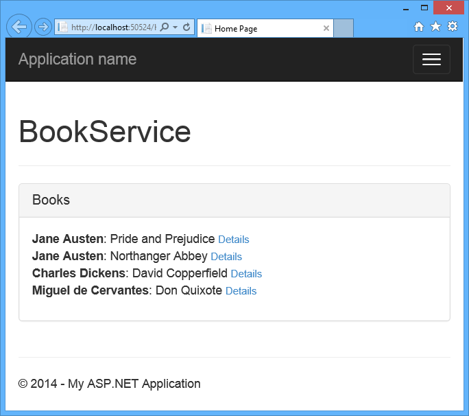

Create the View (UI)
====================
by [Mike Wasson](https://github.com/MikeWasson)

[Download Completed Project](https://github.com/MikeWasson/BookService)

In this section, you will start to define the HTML for the app, and add data binding between the HTML and the view model.

Open the file Views/Home/Index.cshtml. Replace the entire contents of that file with the following.

    @section scripts {
      @Scripts.Render("~/bundles/app")
    }
    
    

      <h1>BookService</h1>
    

    
    

    
      

        

          

            <h2 class="panel-title">Books</h2>
          

          

            <ul class="list-unstyled" data-bind="foreach: books">
              <li>
                <strong></strong>: 
                <small><a href="#">Details</a></small>
              </li>
            </ul>
          

        

        

      

    
      

        <!-- TODO: Book details -->
      

    
      

        <!-- TODO: Add new book -->
      

    

Most of the `div` elements are there for [Bootstrap](http://getbootstrap.com/) styling. The important elements are the ones with `data-bind` attributes. This attribute links the HTML to the view model.

For example:

    

In this example, the &quot;`text`&quot; binding causes the `
` element to show the value of the `error` property from the view model. Recall that `error` was declared as a `ko.observable`:

    self.error = ko.observable();

Whenever a new value is assigned to `error`, Knockout updates the text in the `
` element.

The `foreach` binding tells Knockout to loop through the contents of the `books` array. For each item in the array, Knockout creates a new &lt;li&gt; element. Bindings inside the context of the `foreach` refer to properties on the array item. For example:

    

Here the `text` binding reads the Author property of each book.

If you run the application now, it should look like this:

The list of books loads asynchronously, after the page loads. Right now, the &quot;Details&quot; links are not functional. We'll add this functionality in the next section.

>[!div class="step-by-step"] [Previous](part-6.md) [Next](part-8.md)