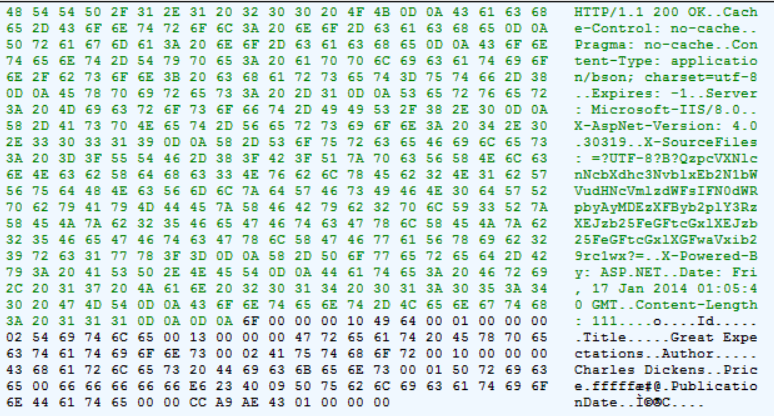

BSON Support in ASP.NET Web API 2.1
====================
by [Mike Wasson](https://github.com/MikeWasson)

Web API 2.1 introduces support for BSON. This topic shows how to use BSON in your Web API controller (server side) and in a .NET client app.

## What is BSON?

[BSON](http://bsonspec.org/) is a binary serialization format. "BSON" stands for "Binary JSON", but BSON and JSON are serialized very differently. BSON is "JSON-like", because objects are represented as name-value pairs, similar to JSON. Unlike JSON, numeric data types are stored as bytes, not strings

BSON was designed to be lightweight, easy to scan, and fast to encode/decode.

- BSON is comparable in size to JSON. Depending on the data, a BSON payload may be smaller or larger than a JSON payload. For serializing binary data, such as an image file, BSON is smaller than JSON, because the binary data does is not base64-encoded.
- BSON documents are easy to scan because elements are prefixed with a length field, so a parser can skip elements without decoding them.
- Encoding and decoding are efficient, because numeric data types are stored as numbers, not strings.

Native clients, such as .NET client apps, can benefit from using BSON in place of text-based formats such as JSON or XML. For browser clients, you will probably want to stick with JSON, because JavaScript can directly convert the JSON payload.

Fortunately, Web API uses [content negotiation](content-negotiation.md), so your API can support both formats and let the client choose.

## Enabling BSON on the Server

In your Web API configuration, add the **BsonMediaTypeFormatter** to the formatters collection.

[!code-csharp[Main](bson-support-in-web-api-21/samples/sample1.cs)]

Now if the client requests "application/bson", Web API will use the BSON formatter.

To associate BSON with other media types, add them to the SupportedMediaTypes collection. The following code adds "application/vnd.contoso" to the supported media types:

[!code-csharp[Main](bson-support-in-web-api-21/samples/sample2.cs)]

## Example HTTP Session

For this example, we'll use the following model class plus a simple Web API controller:

[!code-csharp[Main](bson-support-in-web-api-21/samples/sample3.cs)]

A client might send the following HTTP request:

[!code-console[Main](bson-support-in-web-api-21/samples/sample4.cmd)]

Here is the response:

[!code-console[Main](bson-support-in-web-api-21/samples/sample5.cmd)]

Here I've replaced the binary data with &quot;.&quot; characters. The following screen shot from Fiddler shows the raw hex values.

## Using BSON with HttpClient

.NET clients apps can use the BSON formatter with **HttpClient**. For more information about **HttpClient**, see [Calling a Web API From a .NET Client](../advanced/calling-a-web-api-from-a-net-client.md).

The following code sends a GET request that accepts BSON, and then deserializes the BSON payload in the response.

[!code-csharp[Main](bson-support-in-web-api-21/samples/sample6.cs)]

To request BSON from the server, set the Accept header to "application/bson":

[!code-csharp[Main](bson-support-in-web-api-21/samples/sample7.cs)]

To deserialize the response body, use the **BsonMediaTypeFormatter**. This formatter is not in the default formatters collection, so you have to specify it when you read the response body:

[!code-csharp[Main](bson-support-in-web-api-21/samples/sample8.cs)]

The next example shows how to send a POST request that contains BSON.

[!code-csharp[Main](bson-support-in-web-api-21/samples/sample9.cs)]

Much of this code is the same as the previous example. But in the **PostAsync** method, specify **BsonMediaTypeFormatter** as the formatter:

[!code-csharp[Main](bson-support-in-web-api-21/samples/sample10.cs)]

## Serializing Top-Level Primitive Types

Every BSON document is a list of key/value pairs.The BSON specification does not define a syntax for serializing a single raw value, such as an integer or string.

To work around this limitation, the **BsonMediaTypeFormatter** treats primitive types as a special case. Before serializing, it converts the value into a key/value pair with the key "Value". For example, suppose your API controller returns an integer:

[!code-csharp[Main](bson-support-in-web-api-21/samples/sample11.cs)]

Before serializing, the BSON formatter converts this to the following key/value pair:

[!code-json[Main](bson-support-in-web-api-21/samples/sample12.json)]

When you deserialize, the formatter converts the data back to the original value. However, clients using a different BSON parser will need to handle this case, if your web API returns raw values. In general, you should consider returning structured data, rather than raw values.

## Additional Resources

[Web API BSON Sample](https://aspnet.codeplex.com/SourceControl/latest#Samples/WebApi/BSONSample/)

[Media Formatters](media-formatters.md)
