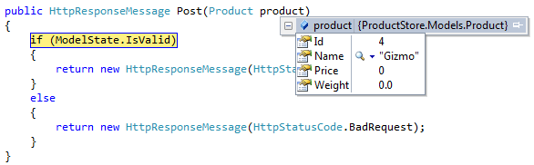

Model Validation in ASP.NET Web API
====================
by [Mike Wasson](https://github.com/MikeWasson)

When a client sends data to your web API, often you want to validate the data before doing any processing. This article shows how to annotate your models, use the annotations for data validation, and handle validation errors in your web API.

## Data Annotations

In ASP.NET Web API, you can use attributes from the [System.ComponentModel.DataAnnotations](https://msdn.microsoft.com/en-us/library/system.componentmodel.dataannotations.aspx) namespace to set validation rules for properties on your model. Consider the following model:

    using System.ComponentModel.DataAnnotations;
    
    namespace MyApi.Models
    {
        public class Product
        {
            public int Id { get; set; }
            [Required]
            public string Name { get; set; }
            public decimal Price { get; set; }
            [Range(0, 999)]
            public double Weight { get; set; }
        }
    }

If you have used model validation in ASP.NET MVC, this should look familiar. The **Required** attribute says that the `Name` property must not be null. The **Range** attribute says that `Weight` must be between zero and 999.

Suppose that a client sends a POST request with the following JSON representation:

    { "Id":4, "Price":2.99, "Weight":5 }

You can see that the client did not include the `Name` property, which is marked as required. When Web API converts the JSON into a `Product` instance, it validates the `Product` against the validation attributes. In your controller action, you can check whether the model is valid:

    using MyApi.Models;
    using System.Net;
    using System.Net.Http;
    using System.Web.Http;
    
    namespace MyApi.Controllers
    {
        public class ProductsController : ApiController
        {
            public HttpResponseMessage Post(Product product)
            {
                if (ModelState.IsValid)
                {
                    // Do something with the product (not shown).
    
                    return new HttpResponseMessage(HttpStatusCode.OK);
                }
                else
                {
                    return Request.CreateErrorResponse(HttpStatusCode.BadRequest, ModelState);
                }
            }
        }
    }

Model validation does not guarantee that client data is safe. Additional validation might be needed in other layers of the application. (For example, the data layer might enforce foreign key constraints.) The tutorial [Using Web API with Entity Framework](../data/using-web-api-with-entity-framework/part-1.md) explores some of these issues.

**"Under-Posting"**: Under-posting happens when the client leaves out some properties. For example, suppose the client sends the following:

    {"Id":4, "Name":"Gizmo"}

Here, the client did not specify values for `Price` or `Weight`. The JSON formatter assigns a default value of zero to the missing properties.

The model state is valid, because zero is a valid value for these properties. Whether this is a problem depends on your scenario. For example, in an update operation, you might want to distinguish between "zero" and "not set." To force clients to set a value, make the property nullable and set the **Required** attribute:

[!code[Main](model-validation-in-aspnet-web-api/samples/sample1.xml?highlight=1-2)]

**"Over-Posting"**: A client can also send *more* data than you expected. For example:

    {"Id":4, "Name":"Gizmo", "Color":"Blue"}

Here, the JSON includes a property ("Color") that does not exist in the `Product` model. In this case, the JSON formatter simply ignores this value. (The XML formatter does the same.) Over-posting causes problems if your model has properties that you intended to be read-only. For example:

    public class UserProfile
    {
        public string Name { get; set; }
        public Uri Blog { get; set; }
        public bool IsAdmin { get; set; }  // uh-oh!
    }

You don't want users to update the `IsAdmin` property and elevate themselves to administrators! The safest strategy is to use a model class that exactly matches what the client is allowed to send:

    public class UserProfileDTO
    {
        public string Name { get; set; }
        public Uri Blog { get; set; }
        // Leave out "IsAdmin"
    }

> [!NOTE] Brad Wilson's blog post "[Input Validation vs. Model Validation in ASP.NET MVC](http://bradwilson.typepad.com/blog/2010/01/input-validation-vs-model-validation-in-aspnet-mvc.html)" has a good discussion of under-posting and over-posting. Although the post is about ASP.NET MVC 2, the issues are still relevant to Web API.

## Handling Validation Errors

Web API does not automatically return an error to the client when validation fails. It is up to the controller action to check the model state and respond appropriately.

You can also create an action filter to check the model state before the controller action is invoked. The following code shows an example:

    using System.Collections.Generic;
    using System.Linq;
    using System.Net;
    using System.Net.Http;
    using System.Web.Http.Controllers;
    using System.Web.Http.Filters;
    using System.Web.Http.ModelBinding;
    
    namespace MyApi.Filters
    {
        public class ValidateModelAttribute : ActionFilterAttribute
        {
            public override void OnActionExecuting(HttpActionContext actionContext)
            {
                if (actionContext.ModelState.IsValid == false)
                {
                    actionContext.Response = actionContext.Request.CreateErrorResponse(
                        HttpStatusCode.BadRequest, actionContext.ModelState);
                }
            }
        }
    }

If model validation fails, this filter returns an HTTP response that contains the validation errors. In that case, the controller action is not invoked.

`HTTP/1.1 400 Bad Request Content-Type: application/json; charset=utf-8 Date: Tue, 16 Jul 2013 21:02:29 GMT Content-Length: 331 { "Message": "The request is invalid.", "ModelState": { "product": [ "Required property 'Name' not found in JSON. Path '', line 1, position 17." ], "product.Name": [ "The Name field is required." ], "product.Weight": [ "The field Weight must be between 0 and 999." ] } }`

To apply this filter to all Web API controllers, add an instance of the filter to the **HttpConfiguration.Filters** collection during configuration:

    public static class WebApiConfig
        {
            public static void Register(HttpConfiguration config)
            {
                config.Filters.Add(new ValidateModelAttribute());
    
                // ...
            }
    }

Another option is to set the filter as an attribute on individual controllers or controller actions:

    public class ProductsController : ApiController
    {
        [ValidateModel]
        public HttpResponseMessage Post(Product product)
        {
            // ...
        }
    }