Hands On Lab: Build a Single Page Application (SPA) with ASP.NET Web API and Angular.js
====================
by [Web Camps Team](https://twitter.com/webcamps)

[Download Web Camps Training Kit](http://aka.ms/webcamps-training-kit)

> In traditional web applications, the client (browser) initiates the communication with the server by requesting a page. The server then processes the request and sends the HTML of the page to the client. In subsequent interactions with the page –e.g. the user navigates to a link or submits a form with data– a new request is sent to the server, and the flow starts again: the server processes the request and sends a new page to the browser in response to the new action requested by the client.
> 
> In Single-Page Applications (SPAs) the entire page is loaded in the browser after the initial request, but subsequent interactions take place through Ajax requests. This means that the browser has to update only the portion of the page that has changed; there is no need to reload the entire page. The SPA approach reduces the time taken by the application to respond to user actions, resulting in a more fluid experience.
> 
> The architecture of a SPA involves certain challenges that are not present in traditional web applications. However, emerging technologies like ASP.NET Web API, JavaScript frameworks like AngularJS and new styling features provided by CSS3 make it really easy to design and build SPAs.
> 
> In this hand-on lab, you will take advantage of those technologies to implement Geek Quiz, a trivia website based on the SPA concept. You will first implement the service layer with ASP.NET Web API to expose the required endpoints to retrieve the quiz questions and store the answers. Then, you will build a rich and responsive UI using AngularJS and CSS3 transformation effects.
> 
> All sample code and snippets are included in the Web Camps Training Kit, available at [http://aka.ms/webcamps-training-kit](http://aka.ms/webcamps-training-kit).

## Overview

### Objectives

In this hands-on lab, you will learn how to:

- Create an ASP.NET Web API service to send and receive JSON data
- Create a responsive UI using AngularJS
- Enhance the UI experience with CSS3 transformations

### Prerequisites

The following is required to complete this hands-on lab:

- [Visual Studio Express 2013 for Web](https://www.microsoft.com/visualstudio/) or greater

### Setup

In order to run the exercises in this hands-on lab, you will need to set up your environment first.

1. Open Windows Explorer and browse to the lab's **Source** folder.
2. Right-click on **Setup.cmd** and select **Run as administrator** to launch the setup process that will configure your environment and install the Visual Studio code snippets for this lab.
3. If the User Account Control dialog box is shown, confirm the action to proceed.

> [!NOTE]
> Make sure you have checked all the dependencies for this lab before running the setup.

### Using the Code Snippets

Throughout the lab document, you will be instructed to insert code blocks. For your convenience, most of this code is provided as Visual Studio Code Snippets, which you can access from within Visual Studio 2013 to avoid having to add it manually.

> [!NOTE]
> Each exercise is accompanied by a starting solution located in the **Begin** folder of the exercise that allows you to follow each exercise independently of the others. Please be aware that the code snippets that are added during an exercise are missing from these starting solutions and may not work until you have completed the exercise. Inside the source code for an exercise, you will also find an **End** folder containing a Visual Studio solution with the code that results from completing the steps in the corresponding exercise. You can use these solutions as guidance if you need additional help as you work through this hands-on lab.

* * *

## Exercises

This hands-on lab includes the following exercises:

1. [Creating a Web API](#Exercise1)
2. [Creating a SPA Interface](#Exercise2)

Estimated time to complete this lab: **60 minutes**

> [!NOTE]
> When you first start Visual Studio, you must select one of the predefined settings collections. Each predefined collection is designed to match a particular development style and determines window layouts, editor behavior, IntelliSense code snippets, and dialog box options. The procedures in this lab describe the actions necessary to accomplish a given task in Visual Studio when using the **General Development Settings** collection. If you choose a different settings collection for your development environment, there may be differences in the steps that you should take into account.

### Exercise 1: Creating a Web API

One of the key parts of a SPA is the service layer. It is responsible for processing the Ajax calls sent by the UI and returning data in response to that call. The data retrieved should be presented in a machine-readable format in order to be parsed and consumed by the client.

The Web API framework is part of the ASP.NET Stack and is designed to make it easy to implement HTTP services, generally sending and receiving JSON- or XML-formatted data through a RESTful API. In this exercise you will create the Web site to host the Geek Quiz application and then implement the back-end service to expose and persist the quiz data using ASP.NET Web API.

#### Task 1 – Creating the Initial Project for Geek Quiz

In this task you will start creating a new ASP.NET MVC project with support for ASP.NET Web API based on the **One ASP.NET** project type that comes with Visual Studio. **One ASP.NET** unifies all ASP.NET technologies and gives you the option to mix and match them as desired. You will then add the Entity Framework's model classes and the database initializator to insert the quiz questions.

1. Open **Visual Studio Express 2013 for Web** and select **File | New Project...** to start a new solution.

    

    *Creating a New Project*
2. In the **New Project** dialog box, select **ASP.NET Web Application** under the **Visual C# | Web** tab. Make sure **.NET Framework 4.5** is selected, name it *GeekQuiz*, choose a **Location** and click **OK**.

    

    *Creating a new ASP.NET Web Application project*
3. In the **New ASP.NET Project** dialog box, select the **MVC** template and select the **Web API** option. Also, make sure that the **Authentication** option is set to **Individual User Accounts**. Click **OK** to continue.

    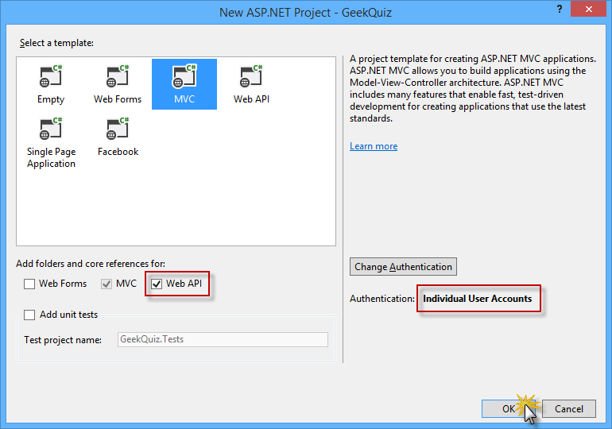

    *Creating a new project with the MVC template, including Web API components*
4. In **Solution Explorer**, right-click the **Models** folder of the **GeekQuiz** project and select **Add | Existing Item...**.

    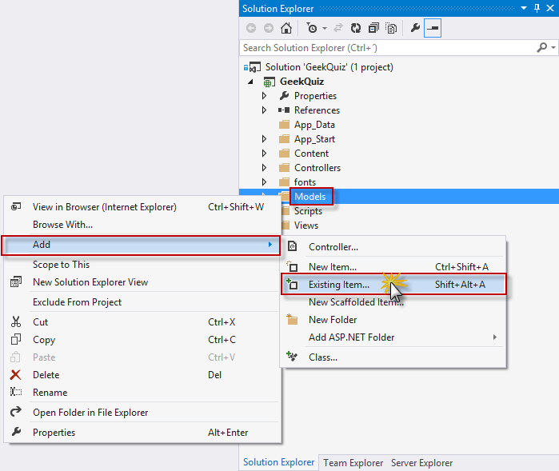

    *Adding an existing item*
5. In the **Add Existing Item** dialog box, navigate to the **Source/Assets/Models** folder and select all the files. Click **Add**.

    

    *Adding the model assets*

    > [!NOTE]
    > By adding these files, you are adding the data model, the Entity Framework's database context and the database initializer for the Geek Quiz application.
    > 
    > **Entity Framework (EF)** is an object-relational mapper (ORM) that enables you to create data access applications by programming with a conceptual application model instead of programming directly using a relational storage schema. You can learn more about Entity Framework [here](../../../entity-framework.md).
    > 
    > The following is a description of the classes you just added:
    > 
    > - **TriviaOption:** represents a single option associated with a quiz question
    > - **TriviaQuestion:** represents a quiz question and exposes the associated options through the **Options** property
    > - **TriviaAnswer:** represents the option selected by the user in response to a quiz question
    > - **TriviaContext:** represents the Entity Framework's database context of the Geek Quiz application. This class derives from **DContext** and exposes **DbSet** properties that represent collections of the entities described above.
    > - **TriviaDatabaseInitializer:** the implementation of the Entity Framework initializer for the **TriviaContext** class which inherits from **CreateDatabaseIfNotExists**. The default behavior of this class is to create the database only if it does not exist, inserting the entities specified in the **Seed** method.
6. Open the **Global.asax.cs** file and add the following using statement.

    [!code-csharp[Main](build-a-single-page-application-spa-with-aspnet-web-api-and-angularjs/samples/sample1.cs)]
7. Add the following code at the beginning of the **Application\_Start** method to set the **TriviaDatabaseInitializer** as the database initializer.

    [!code-csharp[Main](build-a-single-page-application-spa-with-aspnet-web-api-and-angularjs/samples/sample2.cs)]
8. Modify the **Home** controller to restrict access to authenticated users. To do this, open the **HomeController.cs** file inside the **Controllers** folder and add the **Authorize** attribute to the **HomeController** class definition.

    [!code-csharp[Main](build-a-single-page-application-spa-with-aspnet-web-api-and-angularjs/samples/sample3.cs)]

    > [!NOTE]
    > The **Authorize** filter checks to see if the user is authenticated. If the user is not authenticated, it returns HTTP status code 401 (Unauthorized) without invoking the action. You can apply the filter globally, at the controller level, or at the level of individual actions.
9. You will now customize the layout of the web pages and the branding. To do this, open the **\_Layout.cshtml** file inside the **Views | Shared** folder and update the content of the **&lt;title&gt;** element by replacing *My ASP.NET Application* with *Geek Quiz*.

    [!code-cshtml[Main](build-a-single-page-application-spa-with-aspnet-web-api-and-angularjs/samples/sample4.cshtml)]
10. In the same file, update the navigation bar by removing the *About* and *Contact* links and renaming the *Home* link to *Play*. Additionally, rename the *Application name* link to *Geek Quiz*. The HTML for the navigation bar should look like the following code.

    [!code-cshtml[Main](build-a-single-page-application-spa-with-aspnet-web-api-and-angularjs/samples/sample5.cshtml)]
11. Update the footer of the layout page by replacing *My ASP.NET Application* with *Geek Quiz*. To do this, replace the content of the **&lt;footer&gt;** element with the following highlighted code.

    [!code-html[Main](build-a-single-page-application-spa-with-aspnet-web-api-and-angularjs/samples/sample6.html)]

#### Task 2 – Creating the TriviaController Web API

In the previous task, you created the initial structure of the Geek Quiz web application. You will now build a simple Web API service that interacts with the quiz data model and exposes the following actions:

- **GET /api/trivia**: Retrieves the next question from the quiz list to be answered by the authenticated user.
- **POST /api/trivia**: Stores the quiz answer specified by the authenticated user.

You will use the ASP.NET Scaffolding tools provided by Visual Studio to create the baseline for the Web API controller class.

1. Open the **WebApiConfig.cs** file inside the **App\_Start** folder. This file defines the configuration of the Web API service, like how routes are mapped to Web API controller actions.
2. Add the following using statement at the beginning of the file.

    [!code-csharp[Main](build-a-single-page-application-spa-with-aspnet-web-api-and-angularjs/samples/sample7.cs)]
3. Add the following highlighted code to the **Register** method to globally configure the formatter for the JSON data retrieved by the Web API action methods.

    [!code-csharp[Main](build-a-single-page-application-spa-with-aspnet-web-api-and-angularjs/samples/sample8.cs)]

    > [!NOTE]
    > The **CamelCasePropertyNamesContractResolver** automatically converts property names to *camel* case, which is the general convention for property names in JavaScript.
4. In **Solution Explorer**, right-click the **Controllers** folder of the **GeekQuiz** project and select **Add | New Scaffolded Item...**.

    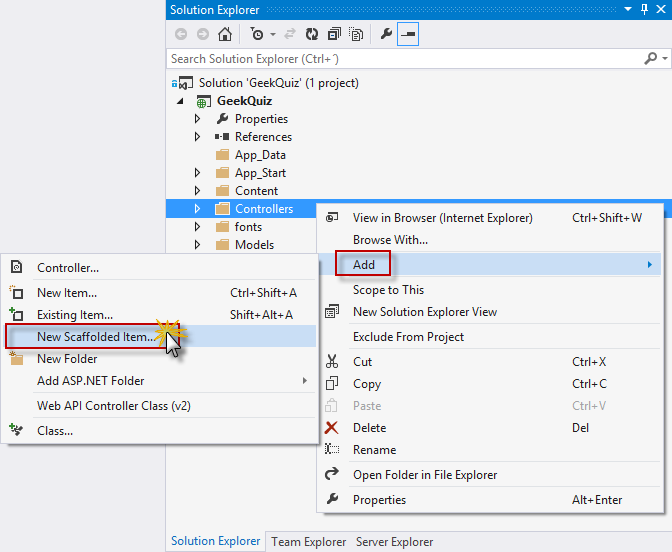

    *Creating a new scaffolded item*
5. In the **Add Scaffold** dialog box, make sure that the **Common** node is selected in the left pane. Then, select the **Web API 2 Controller - Empty** template in the center pane and click **Add**.

    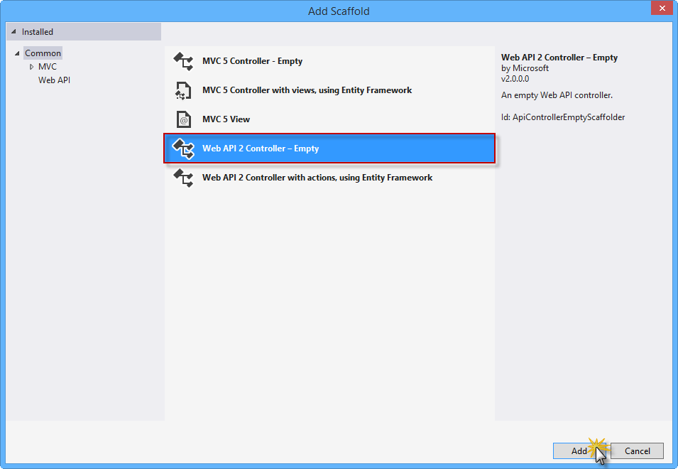

    *Selecting the Web API 2 Controller Empty template*

    > [!NOTE]
    > **ASP.NET Scaffolding** is a code generation framework for ASP.NET Web applications. Visual Studio 2013 includes pre-installed code generators for MVC and Web API projects. You should use scaffolding in your project when you want to quickly add code that interacts with data models in order to reduce the amount of time required to develop standard data operations.
    > 
    > The scaffolding process also ensures that all the required dependencies are installed in the project. For example, if you start with an empty ASP.NET project and then use scaffolding to add a Web API controller, the required Web API NuGet packages and references are added to your project automatically.
6. In the **Add Controller** dialog box, type *TriviaController* in the **Controller name** text box and click **Add**.

    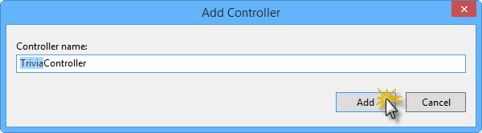

    *Adding the Trivia Controller*
7. The **TriviaController.cs** file is then added to the **Controllers** folder of the **GeekQuiz** project, containing an empty **TriviaController** class. Add the following using statements at the beginning of the file.

    (Code Snippet - *AspNetWebApiSpa - Ex1 - TriviaControllerUsings*)

    [!code-csharp[Main](build-a-single-page-application-spa-with-aspnet-web-api-and-angularjs/samples/sample9.cs)]
8. Add the following code at the beginning of the **TriviaController** class to define, initialize and dispose the **TriviaContext** instance in the controller.

    (Code Snippet - *AspNetWebApiSpa - Ex1 - TriviaControllerContext*)

    [!code-csharp[Main](build-a-single-page-application-spa-with-aspnet-web-api-and-angularjs/samples/sample10.cs)]

    > [!NOTE]
    > The **Dispose** method of **TriviaController** invokes the **Dispose** method of the **TriviaContext** instance, which ensures that all the resources used by the context object are released when the **TriviaContext** instance is disposed or garbage-collected. This includes closing all database connections opened by Entity Framework.
9. Add the following helper method at the end of the **TriviaController** class. This method retrieves the following quiz question from the database to be answered by the specified user.

    (Code Snippet - *AspNetWebApiSpa - Ex1 - TriviaControllerNextQuestion*)

    [!code-csharp[Main](build-a-single-page-application-spa-with-aspnet-web-api-and-angularjs/samples/sample11.cs)]
10. Add the following **Get** action method to the **TriviaController** class. This action method calls the **NextQuestionAsync** helper method defined in the previous step to retrieve the next question for the authenticated user.

    (Code Snippet - *AspNetWebApiSpa - Ex1 - TriviaControllerGetAction*)

    [!code-csharp[Main](build-a-single-page-application-spa-with-aspnet-web-api-and-angularjs/samples/sample12.cs)]
11. Add the following helper method at the end of the **TriviaController** class. This method stores the specified answer in the database and returns a Boolean value indicating whether or not the answer is correct.

    (Code Snippet - *AspNetWebApiSpa - Ex1 - TriviaControllerStoreAsync*)

    [!code-csharp[Main](build-a-single-page-application-spa-with-aspnet-web-api-and-angularjs/samples/sample13.cs)]
12. Add the following **Post** action method to the **TriviaController** class. This action method associates the answer to the authenticated user and calls the **StoreAsync** helper method. Then, it sends a response with the Boolean value returned by the helper method.

    (Code Snippet - *AspNetWebApiSpa - Ex1 - TriviaControllerPostAction*)

    [!code-csharp[Main](build-a-single-page-application-spa-with-aspnet-web-api-and-angularjs/samples/sample14.cs)]
13. Modify the Web API controller to restrict access to authenticated users by adding the **Authorize** attribute to the **TriviaController** class definition.

    [!code-csharp[Main](build-a-single-page-application-spa-with-aspnet-web-api-and-angularjs/samples/sample15.cs)]

#### Task 3 – Running the Solution

In this task you will verify that the Web API service you built in the previous task is working as expected. You will use the Internet Explorer **F12 Developer Tools** to capture the network traffic and inspect the full response from the Web API service.

> [!NOTE]
> Make sure that **Internet Explorer** is selected in the **Start** button located on the Visual Studio toolbar.
> 
> 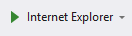

1. Press **F5** to run the solution. The **Log in** page should appear in the browser.

    > [!NOTE]
    > When the application starts, the default MVC route is triggered, which by default is mapped to the **Index** action of the **HomeController** class. Since **HomeController** is restricted to authenticated users (remember that you decorated that class with the **Authorize** attribute in Exercise 1) and there is no user authenticated yet, the application redirects the original request to the log in page.

    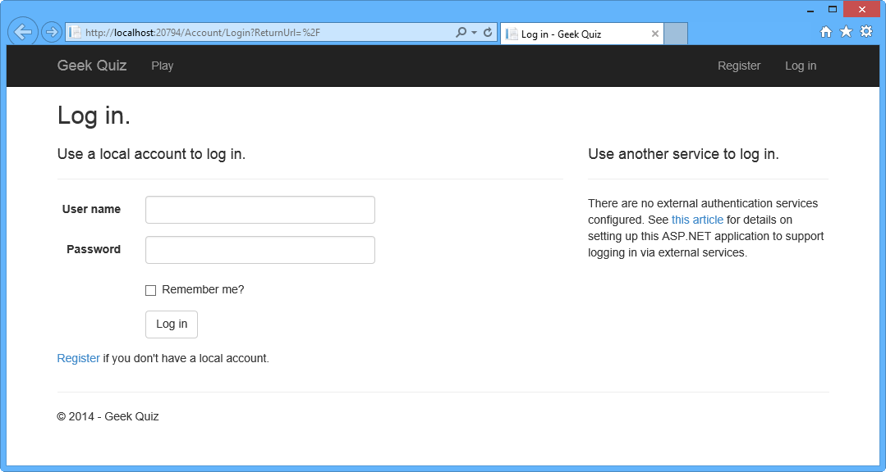

    *Running the solution*
2. Click **Register** to create a new user.

    

    *Registering a new user*
3. In the **Register** page, enter a **User name** and **Password**, and then click **Register**.

    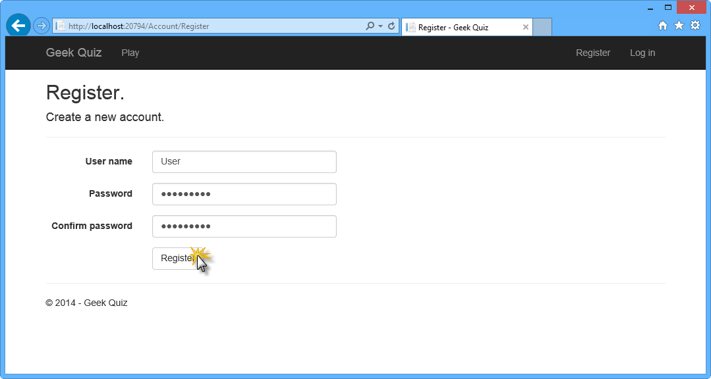

    *Register page*
4. The application registers the new account and the user is authenticated and redirected back to the home page.

    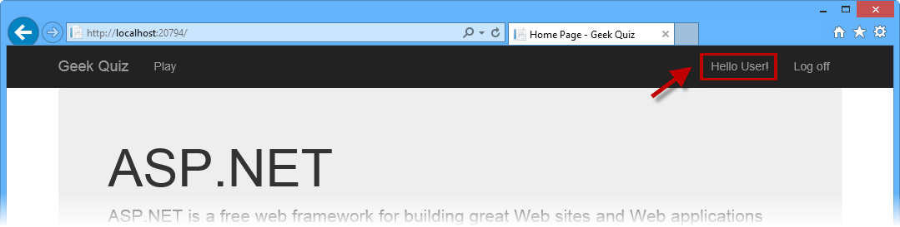

    *User is authenticated*
5. In the browser, press **F12** to open the **Developer Tools** panel. Press **CTRL + 4** or click the **Network** icon, and then click the green arrow button to begin capturing network traffic.

    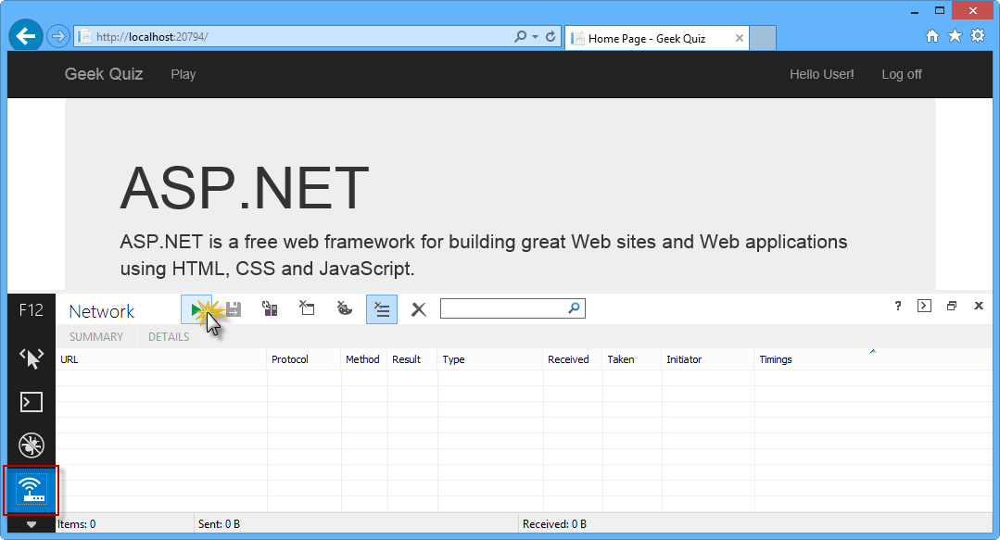

    *Initiating Web API network capture*
6. Append **api/trivia** to the URL in the browser's address bar. You will now inspect the details of the response from the **Get** action method in **TriviaController**.

    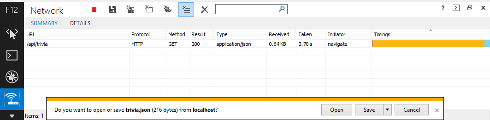

    *Retrieving the next question data through Web API*

    > [!NOTE]
    > Once the download finishes, you will be prompted to make an action with the downloaded file. Leave the dialog box open in order to be able to watch the response content through the Developers Tool window.
7. Now you will inspect the body of the response. To do this, click the **Details** tab and then click **Response body**. You can check that the downloaded data is an object with the properties **options** (which is a list of **TriviaOption** objects), **id** and **title** that correspond to the **TriviaQuestion** class.

    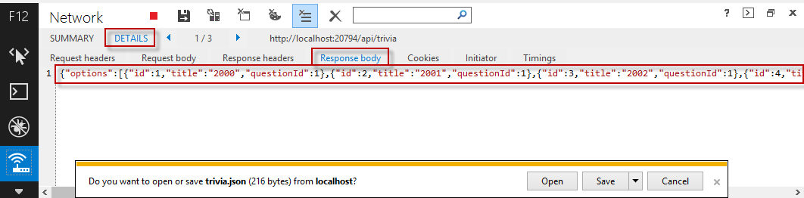

    *Viewing Web API Response Body*
8. Go back to Visual Studio and press **SHIFT + F5** to stop debugging.

### Exercise 2: Creating the SPA Interface

In this exercise you will first build the web front-end portion of Geek Quiz, focusing on the Single-Page Application interaction using **AngularJS**. You will then enhance the user experience with CSS3 to perform rich animations and provide a visual effect of context switching when transitioning from one question to the next.

#### Task 1 – Creating the SPA Interface Using AngularJS

In this task you will use **AngularJS** to implement the client side of the Geek Quiz application. **AngularJS** is an open-source JavaScript framework that augments browser-based applications with *Model-View-Controller* (MVC) capability, facilitating both development and testing.

You will start by installing AngularJS from Visual Studio's Package Manager Console. Then, you will create the controller to provide the behavior of the Geek Quiz app and the view to render the quiz questions and answers using the AngularJS template engine.

> [!NOTE]
> For more information about AngularJS, refer to [[http://angularjs.org/](http://angularjs.org/)](http://angularjs.org/).

1. Open **Visual Studio Express 2013 for Web** and open the **GeekQuiz.sln** solution located in the **Source/Ex2-CreatingASPAInterface/Begin** folder. Alternatively, you can continue with the solution that you obtained in the previous exercise.
2. Open the **Package Manager Console** from **Tools** | **Library Package Manager**. Type the following command to install the **AngularJS.Core** NuGet package.

    [!code-powershell[Main](build-a-single-page-application-spa-with-aspnet-web-api-and-angularjs/samples/sample16.ps1)]
3. In **Solution Explorer**, right-click the **Scripts** folder of the **GeekQuiz** project and select **Add | New Folder**. Name the folder **app** and press **Enter**.
4. Right-click the **app** folder you just created and select **Add | JavaScript File**.

    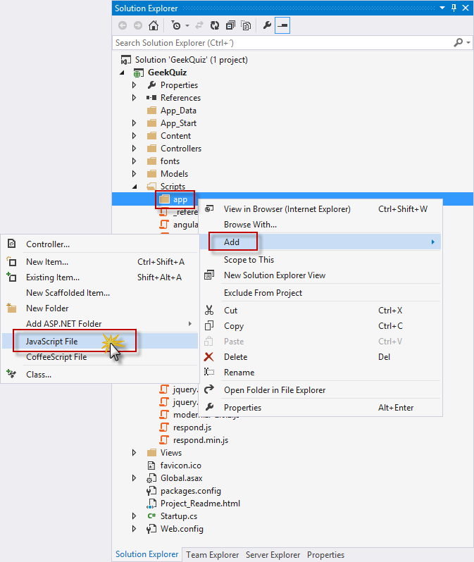

    *Creating a new JavaScript file*
5. In the **Specify Name for Item** dialog box, type *quiz-controller* in the **Item name** text box and click **OK**.

    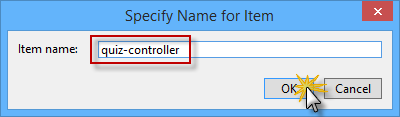

    *Naming the new JavaScript file*
6. In the **quiz-controller.js** file, add the following code to declare and initialize the AngularJS **QuizCtrl** controller.

    (Code Snippet - *AspNetWebApiSpa - Ex2 - AngularQuizController*)

    [!code-javascript[Main](build-a-single-page-application-spa-with-aspnet-web-api-and-angularjs/samples/sample17.js)]

    > [!NOTE]
    > The constructor function of the **QuizCtrl** controller expects an injectable parameter named **$scope**. The initial state of the scope should be set up in the constructor function by attaching properties to the **$scope** object. The properties contain the **view model**, and will be accessible to the template when the controller is registered.
    > 
    > The **QuizCtrl** controller is defined inside a module named **QuizApp**. Modules are units of work that let you break your application into separate components. The main advantages of using modules is that the code is easier to understand and facilitates unit testing, reusability and maintainability.
7. You will now add behavior to the scope in order to react to events triggered from the view. Add the following code at the end of the **QuizCtrl** controller to define the **nextQuestion** function in the **$scope** object.

    (Code Snippet - *AspNetWebApiSpa - Ex2 - AngularQuizControllerNextQuestion*)

    [!code-javascript[Main](build-a-single-page-application-spa-with-aspnet-web-api-and-angularjs/samples/sample18.js)]

    > [!NOTE]
    > This function retrieves the next question from the **Trivia** Web API created in the previous exercise and attaches the question data to the **$scope** object.
8. Insert the following code at the end of the **QuizCtrl** controller to define the **sendAnswer** function in the **$scope** object.

    (Code Snippet - *AspNetWebApiSpa - Ex2 - AngularQuizControllerSendAnswer*)

    [!code-javascript[Main](build-a-single-page-application-spa-with-aspnet-web-api-and-angularjs/samples/sample19.js)]

    > [!NOTE]
    > This function sends the answer selected by the user to the **Trivia** Web API and stores the result –i.e. if the answer is correct or not– in the **$scope** object.
    > 
    > The **nextQuestion** and **sendAnswer** functions from above use the AngularJS **$http** object to abstract the communication with the Web API via the XMLHttpRequest JavaScript object from the browser. AngularJS supports another service that brings a higher level of abstraction to perform CRUD operations against a resource through RESTful APIs. The AngularJS **$resource** object has action methods which provide high-level behaviors without the need to interact with the **$http** object. Consider using the **$resource** object in scenarios that requires the CRUD model (fore information, see the [$resource documentation](https://docs.angularjs.org/api/ngResource/service/$resource)).
9. The next step is to create the AngularJS template that defines the view for the quiz. To do this, open the **Index.cshtml** file inside the **Views | Home** folder and replace the content with the following code.

    (Code Snippet - *AspNetWebApiSpa - Ex2 - GeekQuizView*)

    [!code-cshtml[Main](build-a-single-page-application-spa-with-aspnet-web-api-and-angularjs/samples/sample20.cshtml)]

    > [!NOTE]
    > The AngularJS template is a declarative specification that uses information from the model and the controller to transform static markup into the dynamic view that the user sees in the browser. The following are examples of AngularJS elements and element attributes that can be used in a template:
    > 
    > - The **ng-app** directive tells AngularJS the DOM element that represents the root element of the application.
    > - The **ng-controller** directive attaches a controller to the DOM at the point where the directive is declared.
    > - The curly brace notation **{{ }}** denotes bindings to the scope properties defined in the controller.
    > - The **ng-click** directive is used to invoke the functions defined in the scope in response to user clicks.
10. Open the **Site.css** file inside the **Content** folder and add the following highlighted styles at the end of the file to provide a look and feel for the quiz view.

    (Code Snippet - *AspNetWebApiSpa - Ex2 - GeekQuizStyles*)

    [!code-css[Main](build-a-single-page-application-spa-with-aspnet-web-api-and-angularjs/samples/sample21.css)]

#### Task 2 – Running the Solution

In this task you will execute the solution using the new user interface you built with AngularJS to answer some of the quiz questions.

1. Press **F5** to run the solution.
2. Register a new user account. To do this, follow the registration steps described in Exercise 1, Task 3.

    > [!NOTE]
    > If you are using the solution from the previous exercise, you can log in with the user account you created before.
3. The **Home** page should appear, showing the first question of the quiz. Answer the question by clicking one of the options. This will trigger the **sendAnswer** function defined earlier, which sends the selected option to the **Trivia** Web API.

    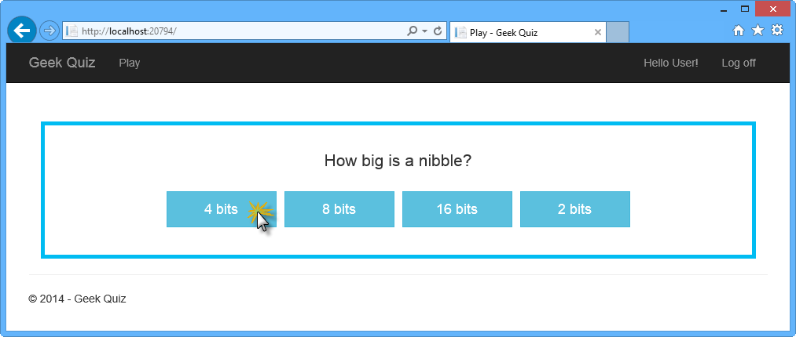

    *Answering a question*
4. After clicking one of the buttons, the answer should appear. Click **Next Question** to show the following question. This will trigger the **nextQuestion** function defined in the controller.

    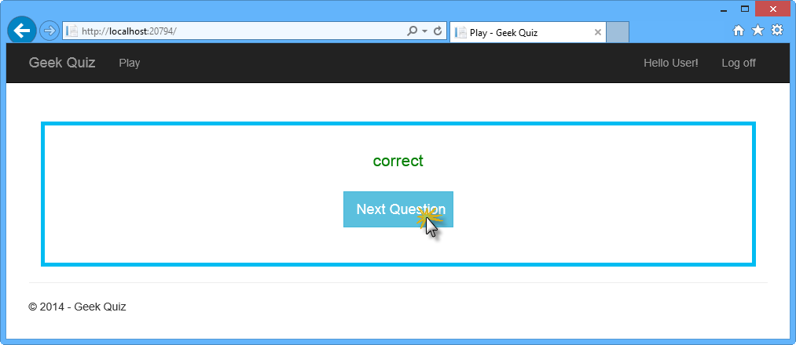

    *Requesting the next question*
5. The next question should appear. Continue answering questions as many times as you want. After completing all the questions you should return to the first question.

    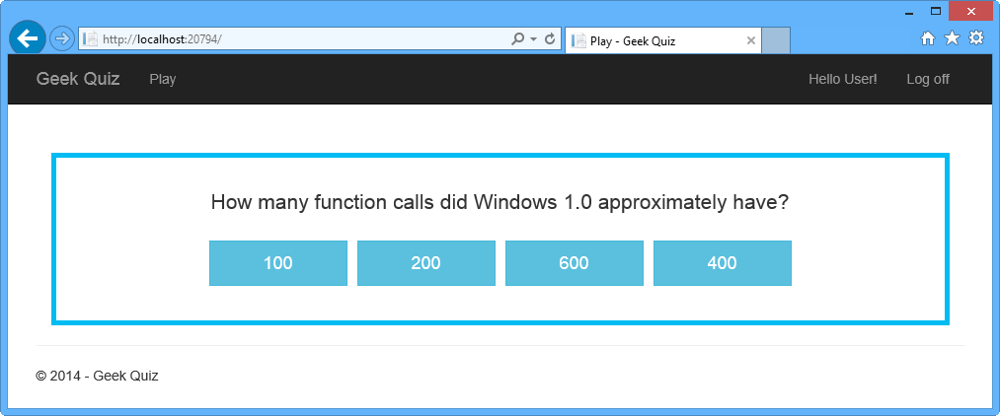

    *Next question*
6. Go back to Visual Studio and press **SHIFT + F5** to stop debugging.

#### Task 3 – Creating a Flip Animation Using CSS3

In this task you will use CSS3 properties to perform rich animations by adding a flip effect when a question is answered and when the next question is retrieved.

1. In **Solution Explorer**, right-click the **Content** folder of the **GeekQuiz** project and select **Add | Existing Item...**.

    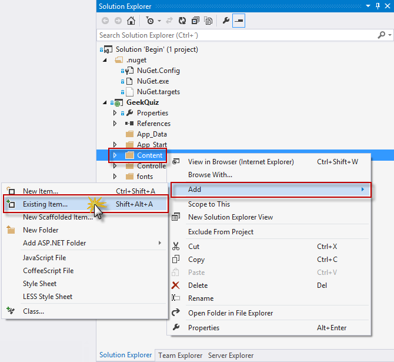

    *Adding an existing item to the Content folder*
2. In the **Add Existing Item** dialog box, navigate to the **Source/Assets** folder and select **Flip.css**. Click **Add**.

    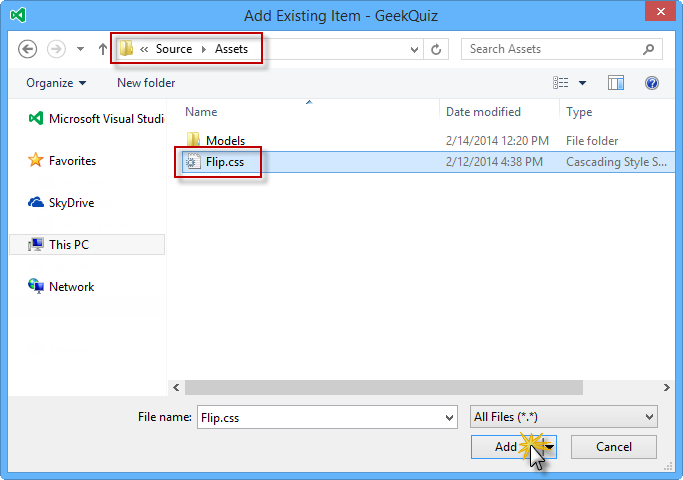

    *Adding the Flip.css file from Assets*
3. Open the **Flip.css** file you just added and inspect its content.
4. Locate the **flip transformation** comment. The styles below that comment use the CSS **perspective** and **rotateY** transformations to generate a &quot;card flip&quot; effect.

    [!code-css[Main](build-a-single-page-application-spa-with-aspnet-web-api-and-angularjs/samples/sample22.css)]
5. Locate the **hide back of pane during flip** comment. The style below that comment hides the back-side of the faces when they are facing away from the viewer by setting the **backface-visibility** CSS property to *hidden*.

    [!code-css[Main](build-a-single-page-application-spa-with-aspnet-web-api-and-angularjs/samples/sample23.css)]
6. Open the **BundleConfig.cs** file inside the **App\_Start** folder and add the reference to the **Flip.css** file in the **&quot;~/Content/css&quot;** style bundle

    [!code-csharp[Main](build-a-single-page-application-spa-with-aspnet-web-api-and-angularjs/samples/sample24.cs)]
7. Press **F5** to run the solution and log in with your credentials.
8. Answer a question by clicking one of the options. Notice the flip effect when transitioning between views.

    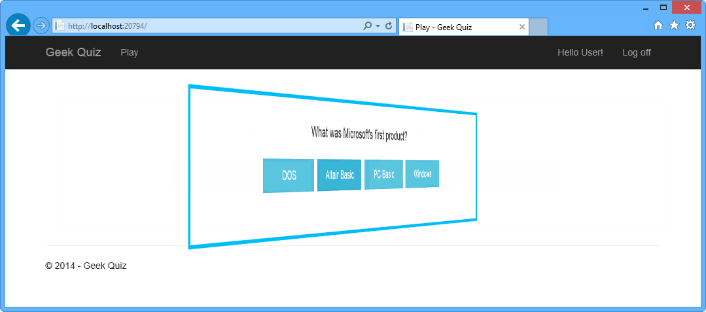

    *Answering a question with the flip effect*
9. Click **Next Question** to retrieve the following question. The flip effect should appear again.

    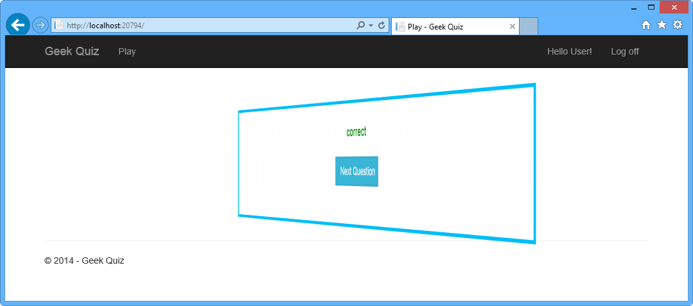

    *Retrieving the following question with the flip effect*

* * *

## Summary

By completing this hands-on lab you have learned how to:

- Create an ASP.NET Web API controller using ASP.NET Scaffolding
- Implement a Web API Get action to retrieve the next quiz question
- Implement a Web API Post action to store the quiz answers
- Install AngularJS from the Visual Studio Package Manager Console
- Implement AngularJS templates and controllers
- Use CSS3 transitions to perform animation effects