Getting Started with ASP.NET Web API 2 (C#)
====================
by [Mike Wasson](https://github.com/MikeWasson)

[Download Completed Project](https://code.msdn.microsoft.com/Sample-code-of-Getting-c56ccb28)

> HTTP is not just for serving up web pages. It is also a powerful platform for building APIs that expose services and data. HTTP is simple, flexible, and ubiquitous. Almost any platform that you can think of has an HTTP library, so HTTP services can reach a broad range of clients, including browsers, mobile devices, and traditional desktop applications.
> 
> ASP.NET Web API is a framework for building web APIs on top of the .NET Framework. In this tutorial, you will use ASP.NET Web API to create a web API that returns a list of products.
> 
> ## Software versions used in the tutorial
> 
> 
> - [Visual Studio 2017](https://www.visualstudio.com/downloads/)
> - Web API 2

## Create a Web API Project

In this tutorial, you will use ASP.NET Web API to create a web API that returns a list of products. The front-end web page uses jQuery to display the results.

Start Visual Studio and select **New Project** from the **Start** page. Or, from the **File** menu, select **New** and then **Project**.

In the **Templates** pane, select **Installed Templates** and expand the **Visual C#** node. Under **Visual C#**, select **Web**. In the list of project templates, select **ASP.NET Web Application**. Name the project "ProductsApp" and click **OK**.

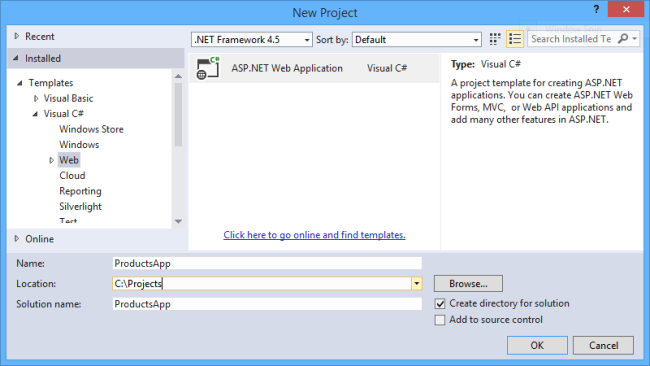

In the **New ASP.NET Project** dialog, select the **Empty** template. Under &quot;Add folders and core references for&quot;, check **Web API**. Click **OK**.

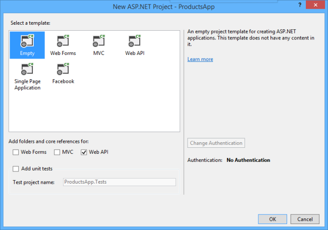

> [!NOTE]
> You can also create a Web API project using the &quot;Web API&quot; template. The Web API template uses ASP.NET MVC to provide API help pages. I'm using the Empty template for this tutorial because I want to show Web API without MVC. In general, you don't need to know ASP.NET MVC to use Web API.

## Adding a Model

A *model* is an object that represents the data in your application. ASP.NET Web API can automatically serialize your model to JSON, XML, or some other format, and then write the serialized data into the body of the HTTP response message. As long as a client can read the serialization format, it can deserialize the object. Most clients can parse either XML or JSON. Moreover, the client can indicate which format it wants by setting the Accept header in the HTTP request message.

Let's start by creating a simple model that represents a product.

If Solution Explorer is not already visible, click the **View** menu and select **Solution Explorer**. In Solution Explorer, right-click the Models folder. From the context menu, select **Add** then select **Class**.

Name the class &quot;Product&quot;. Add the following properties to the `Product` class.

[!code-csharp[Main](tutorial-your-first-web-api/samples/sample1.cs)]

## Adding a Controller

In Web API, a *controller* is an object that handles HTTP requests. We'll add a controller that can return either a list of products or a single product specified by ID.

> [!NOTE]
> If you have used ASP.NET MVC, you are already familiar with controllers. Web API controllers are similar to MVC controllers, but inherit the **ApiController** class instead of the **Controller** class.

In **Solution Explorer**, right-click the Controllers folder. Select **Add** and then select **Controller**.

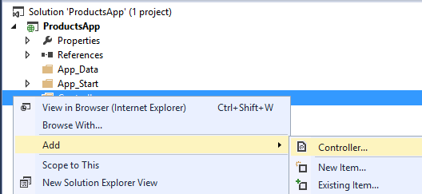

In the **Add Scaffold** dialog, select **Web API Controller - Empty**. Click **Add**.

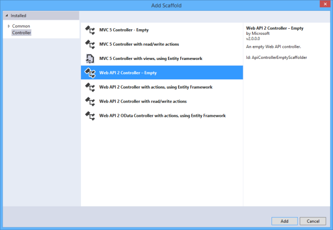

In the **Add Controller** dialog, name the controller &quot;ProductsController&quot;. Click **Add**.

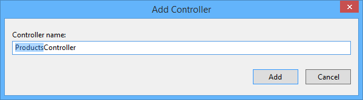

The scaffolding creates a file named ProductsController.cs in the Controllers folder.

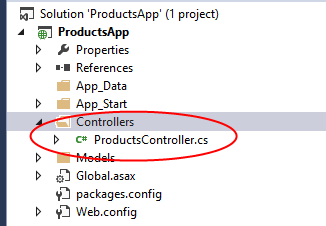

> [!NOTE]
> You don't need to put your controllers into a folder named Controllers. The folder name is just a convenient way to organize your source files.

If this file is not open already, double-click the file to open it. Replace the code in this file with the following:

[!code-csharp[Main](tutorial-your-first-web-api/samples/sample2.cs)]

To keep the example simple, products are stored in a fixed array inside the controller class. Of course, in a real application, you would query a database or use some other external data source.

The controller defines two methods that return products:

- The `GetAllProducts` method returns the entire list of products as an **IEnumerable&lt;Product&gt;** type.
- The `GetProduct` method looks up a single product by its ID.

That's it! You have a working web API. Each method on the controller corresponds to one or more URIs:

| Controller Method | URI |
| --- | --- |
| GetAllProducts | /api/products |
| GetProduct | /api/products/*id* |

For the `GetProduct` method, the *id* in the URI is a placeholder. For example, to get the product with ID of 5, the URI is `api/products/5`.

For more information about how Web API routes HTTP requests to controller methods, see [Routing in ASP.NET Web API](../web-api-routing-and-actions/routing-in-aspnet-web-api.md).

## Calling the Web API with Javascript and jQuery

In this section, we'll add an HTML page that uses AJAX to call the web API. We'll use jQuery to make the AJAX calls and also to update the page with the results.

In Solution Explorer, right-click the project and select **Add**, then select **New Item**.

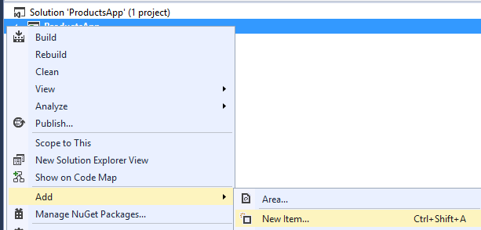

In the **Add New Item** dialog, select the **Web** node under **Visual C#**, and then select the **HTML Page** item. Name the page &quot;index.html&quot;.

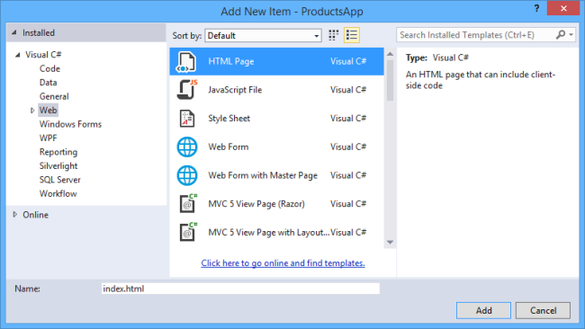

Replace everything in this file with the following:

[!code-html[Main](tutorial-your-first-web-api/samples/sample3.html)]

There are several ways to get jQuery. In this example, I used the [Microsoft Ajax CDN](../../../ajax/cdn/overview.md). You can also download it from [http://jquery.com/](http://jquery.com/), and the ASP.NET "Web API" project template includes jQuery as well.

### Getting a List of Products

To get a list of products, send an HTTP GET request to &quot;/api/products&quot;.

The jQuery [getJSON](http://api.jquery.com/jQuery.getJSON/) function sends an AJAX request. For response contains array of JSON objects. The `done` function specifies a callback that is called if the request succeeds. In the callback, we update the DOM with the product information.

[!code-html[Main](tutorial-your-first-web-api/samples/sample4.html)]

### Getting a Product By ID

To get a product by ID, send an HTTP GET request to &quot;/api/products/*id*&quot;, where *id* is the product ID.

[!code-javascript[Main](tutorial-your-first-web-api/samples/sample5.js)]

We still call `getJSON` to send the AJAX request, but this time we put the ID in the request URI. The response from this request is a JSON representation of a single product.

## Running the Application

Press F5 to start debugging the application. The web page should look like the following:

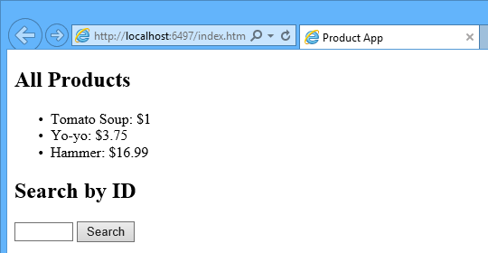

To get a product by ID, enter the ID and click Search:

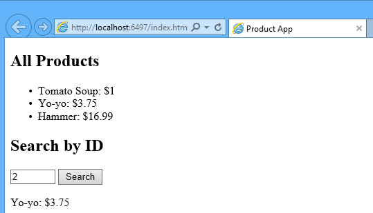

If you enter an invalid ID, the server returns an HTTP error:

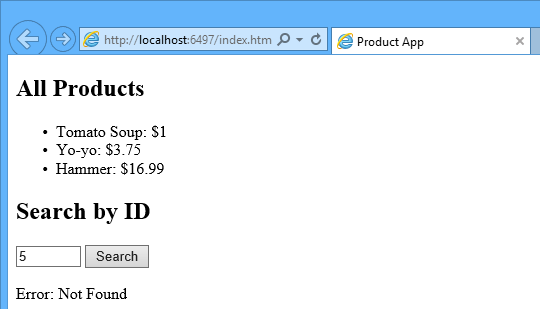

## Using F12 to View the HTTP Request and Response

When you are working with an HTTP service, it can be very useful to see the HTTP request and request messages. You can do this by using the F12 developer tools in Internet Explorer 9. From Internet Explorer 9, press **F12** to open the tools. Click the **Network** tab and press **Start Capturing**. Now go back to the web page and press **F5** to reload the web page. Internet Explorer will capture the HTTP traffic between the browser and the web server. The summary view shows all the network traffic for a page:

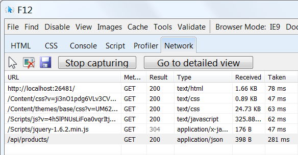

Locate the entry for the relative URI "api/products/". Select this entry and click **Go to detailed view**. In the detail view, there are tabs to view the request and response headers and bodies. For example, if you click the **Request headers** tab, you can see that the client requested &quot;application/json&quot; in the Accept header.

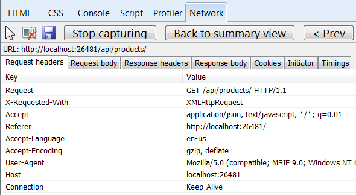

If you click the Response body tab, you can see how the product list was serialized to JSON. Other browsers have similar functionality. Another useful tool is [Fiddler](http://www.fiddler2.com/fiddler2/), a web debugging proxy. You can use Fiddler to view your HTTP traffic, and also to compose HTTP requests, which gives you full control over the HTTP headers in the request.

## See this App Running on Azure

Would you like to see the finished site running as a live web app? You can deploy a complete version of the app to your Azure account by simply clicking the following button.

You need an Azure account to deploy this solution to Azure. If you do not already have an account, you have the following options:

- [Open an Azure account for free](https://azure.microsoft.com/en-us/pricing/free-trial/?WT.mc_id=A443DD604) - You get credits you can use to try out paid Azure services, and even after they're used up you can keep the account and use free Azure services.
- [Activate MSDN subscriber benefits](https://azure.microsoft.com/en-us/pricing/member-offers/msdn-benefits-details/?WT.mc_id=A443DD604) - Your MSDN subscription gives you credits every month that you can use for paid Azure services.

## Next Steps

- For a more complete example of an HTTP service that supports POST, PUT, and DELETE actions and writes to a database, see [Using Web API 2 with Entity Framework 6](../data/using-web-api-with-entity-framework/part-1.md).
- For more about creating fluid and responsive web applications on top of an HTTP service, see [ASP.NET Single Page Application](../../../single-page-application/index.md).
- For information about how to deploy a Visual Studio web project to Azure App Service, see [Create an ASP.NET web app in Azure App Service](https://azure.microsoft.com/en-us/documentation/articles/web-sites-dotnet-get-started/).
