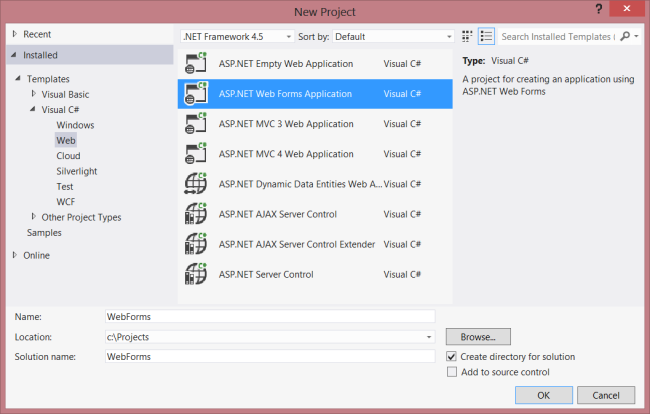
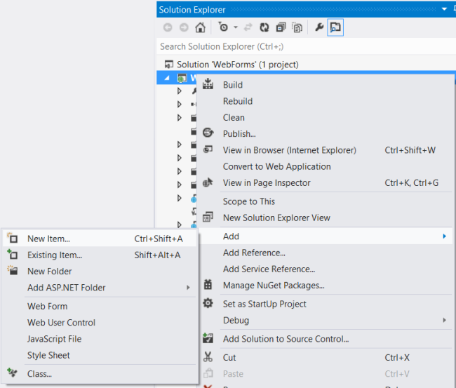
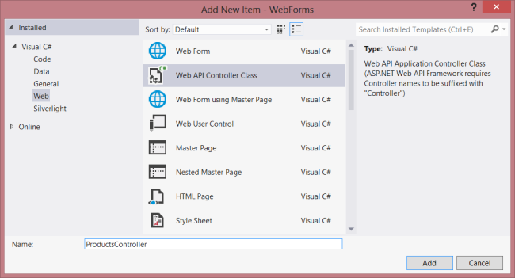
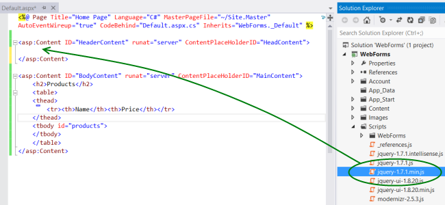

Using Web API with ASP.NET Web Forms
====================
by [Mike Wasson](https://github.com/MikeWasson)

Although ASP.NET Web API is packaged with ASP.NET MVC, it is easy to add Web API to a traditional ASP.NET Web Forms application. This tutorial walks you through the steps.

## Overview

To use Web API in a Web Forms application, there are two main steps:

- Add a Web API controller that derives from the **ApiController** class.
- Add a route table to the **Application\_Start** method.

## Create a Web Forms Project

Start Visual Studio and select **New Project** from the **Start** page. Or, from the **File** menu, select **New** and then **Project**.

In the **Templates** pane, select **Installed Templates** and expand the **Visual C#** node. Under **Visual C#**, select **Web**. In the list of project templates, select **ASP.NET Web Forms Application**. Enter a name for the project and click **OK**.

## Create the Model and Controller

This tutorial uses the same model and controller classes as the [Getting Started](tutorial-your-first-web-api.md) tutorial.

First, add a model class. In **Solution Explorer**, right-click the project and select **Add Class**. Name the class Product, and add the following implementation:

[!code-csharp[Main](using-web-api-with-aspnet-web-forms/samples/sample1.cs)]

Next, add a Web API controller to the project., A *controller* is the object that handles HTTP requests for Web API.

In **Solution Explorer**, right-click the project. Select **Add New Item**.

Under **Installed Templates**, expand **Visual C#** and select **Web**. Then, from the list of templates, select **Web API Controller Class**. Name the controller "ProductsController" and click **Add**.

The **Add New Item** wizard will create a file named ProductsController.cs. Delete the methods that the wizard included and add the following methods:

[!code-csharp[Main](using-web-api-with-aspnet-web-forms/samples/sample2.cs)]

For more information about the code in this controller, see the [Getting Started](tutorial-your-first-web-api.md) tutorial.

## Add Routing Information

Next, we'll add a URI route so that URIs of the form &quot;/api/products/&quot; are routed to the controller.

In **Solution Explorer**, double-click Global.asax to open the code-behind file Global.asax.cs. Add the following **using** statement.

[!code-csharp[Main](using-web-api-with-aspnet-web-forms/samples/sample3.cs)]

Then add the following code to the **Application\_Start** method:

[!code-csharp[Main](using-web-api-with-aspnet-web-forms/samples/sample4.cs)]

For more information about routing tables, see [Routing in ASP.NET Web API](../web-api-routing-and-actions/routing-in-aspnet-web-api.md).

## Add Client-Side AJAX

That's all you need to create a web API that clients can access. Now let's add an HTML page that uses jQuery to call the API.

Open the file Default.aspx. Replace the boilerplate text that is in the main content section, as shown:

[!code-aspx[Main](using-web-api-with-aspnet-web-forms/samples/sample5.aspx)]

Next, add a reference to the jQuery source file in the `HeaderContent` section:

[!code-aspx[Main](using-web-api-with-aspnet-web-forms/samples/sample6.aspx?highlight=2)]

Note: You can easily add the script reference by dragging and dropping the file from **Solution Explorer** into the code editor window.

Below the jQuery script tag, add the following script block:

[!code-html[Main](using-web-api-with-aspnet-web-forms/samples/sample7.html)]

When the document loads, this script makes an AJAX request to &quot;api/products&quot;. The request returns a list of products in JSON format. The script adds the product information to the HTML table.

When you run the application, it should look like this:

