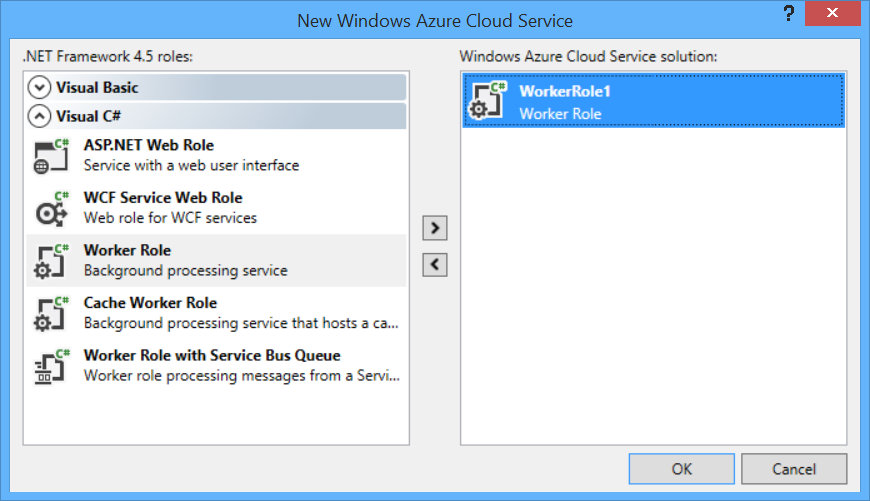
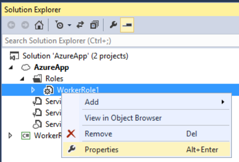
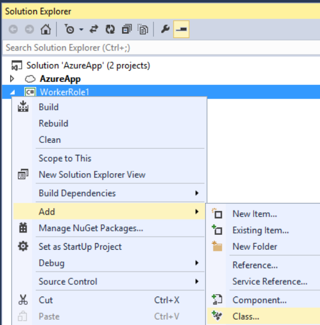
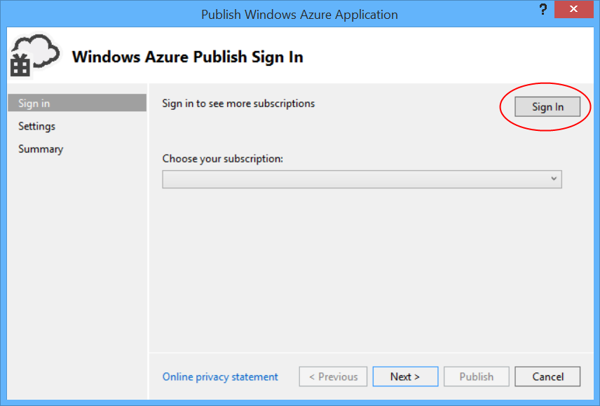
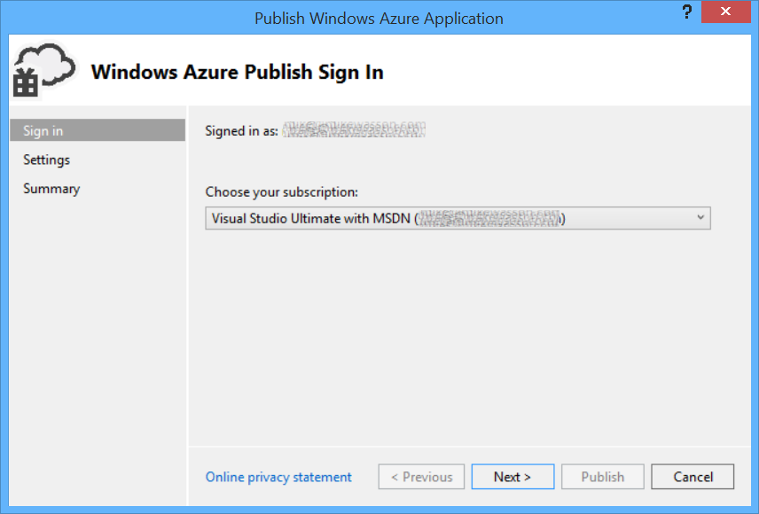
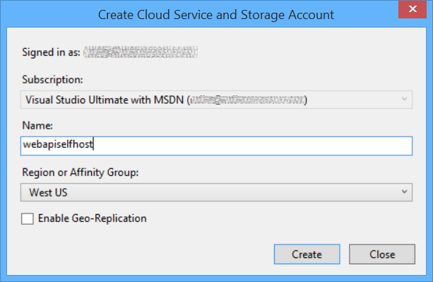
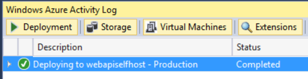

Host ASP.NET Web API 2 in an Azure Worker Role
====================
by [Mike Wasson](https://github.com/MikeWasson)

> This tutorial shows how to host ASP.NET Web API in an Azure Worker Role, using OWIN to self-host the Web API framework.
> 
> [Open Web Interface for .NET](http://owin.org/) (OWIN) defines an abstraction between .NET web servers and web applications. OWIN decouples the web application from the server, which makes OWIN ideal for self-hosting a web application in your own process, outside of IIS–for example, inside an Azure worker role.
> 
> In this tutorial, you'll use the Microsoft.Owin.Host.HttpListener package, which provides an HTTP server that be used to self-host OWIN applications.
> 
> ## Software versions used in the tutorial
> 
> 
> - [Visual Studio 2013](https://www.microsoft.com/visualstudio/eng/2013-downloads)
> - Web API 2
> - [Azure SDK for .NET 2.3](https://azure.microsoft.com/en-us/downloads/)

## Create a Microsoft Azure Project

Start Visual Studio with administrator privileges. Administrator privileges are needed to debug the application locally, using the Azure compute emulator.

On the **File** menu, click **New**, then click **Project**. From **Installed Templates**, under Visual C#, click **Cloud** and then click **Windows Azure Cloud Service**. Name the project "AzureApp" and click **OK**.

In the **New Windows Azure Cloud Service** dialog, double-click **Worker Role**. Leave the default name ("WorkerRole1"). This step adds a worker role to the solution. Click **OK**.

The Visual Studio solution that is created contains two projects:

- &quot;AzureApp&quot; defines the roles and configuration for the Azure application.
- &quot;WorkerRole1&quot; contains the code for the worker role.

In general, an Azure application can contain multiple roles, although this tutorial uses a single role.

## Add the Web API and OWIN Packages

From the **Tools** menu, click **Library Package Manager**, then click **Package Manager Console**.

In the Package Manager Console window, enter the following command:

[!code-console[Main](host-aspnet-web-api-in-an-azure-worker-role/samples/sample1.cmd)]

## Add an HTTP Endpoint

In Solution Explorer, expand the AzureApp project. Expand the Roles node, right-click WorkerRole1, and select **Properties**.

Click **Endpoints**, and then click **Add Endpoint**.

In the **Protocol** dropdown list, select "http". In **Public Port** and **Private Port**, type 80. These port numbers can be different. The public port is what clients use when they send a request to the role.

## Configure Web API for Self-Host

In Solution Explorer, right click the WorkerRole1 project and select **Add** / **Class** to add a new class. Name the class `Startup`.

Replace all of the boilerplate code in this file with the following:

[!code-csharp[Main](host-aspnet-web-api-in-an-azure-worker-role/samples/sample2.cs)]

## Add a Web API Controller

Next, add a Web API controller class. Right-click the WorkerRole1 project and select **Add** / **Class**. Name the class TestController. Replace all of the boilerplate code in this file with the following:

[!code-csharp[Main](host-aspnet-web-api-in-an-azure-worker-role/samples/sample3.cs)]

For simplicity, this controller just defines two GET methods that return plain text.

## Start the OWIN Host

Open the WorkerRole.cs file. This class defines the code that runs when the worker role is started and stopped.

Add the following using statement:

[!code-csharp[Main](host-aspnet-web-api-in-an-azure-worker-role/samples/sample4.cs)]

Add an **IDisposable** member to the `WorkerRole` class:

[!code-csharp[Main](host-aspnet-web-api-in-an-azure-worker-role/samples/sample5.cs)]

In the `OnStart` method, add the following code to start the host:

[!code-csharp[Main](host-aspnet-web-api-in-an-azure-worker-role/samples/sample6.cs?highlight=5)]

The **WebApp.Start** method starts the OWIN host. The name of the `Startup` class is a type parameter to the method. By convention, the host will call the `Configure` method of this class.

Override the `OnStop` to dispose of the *\_app* instance:

[!code-csharp[Main](host-aspnet-web-api-in-an-azure-worker-role/samples/sample7.cs)]

Here is the complete code for WorkerRole.cs:

[!code-csharp[Main](host-aspnet-web-api-in-an-azure-worker-role/samples/sample8.cs)]

Build the solution, and press F5 to run the application locally in the Azure Compute Emulator. Depending on your firewall settings, you might need to allow the emulator through your firewall.

> [!NOTE]
> If you get an exception like the following, please see [this blog post](https://blogs.msdn.com/b/praburaj/archive/2013/11/20/fileloadexception-on-microsoft-owin-when-running-on-worker-role.aspx) for a workaround. "Could not load file or assembly 'Microsoft.Owin, Version=2.0.2.0, Culture=neutral, PublicKeyToken=31bf3856ad364e35' or one of its dependencies. The located assembly's manifest definition does not match the assembly reference. (Exception from HRESULT: 0x80131040)"

The compute emulator assigns a local IP address to the endpoint. You can find the IP address by viewing the Compute Emulator UI. Right-click the emulator icon in the task bar notification area, and select **Show Compute Emulator UI**.

Find the IP address under Service Deployments, deployment [id], Service Details. Open a web browser and navigate to http://*address*/test/1, where *address* is the IP address assigned by the compute emulator; for example, `http://127.0.0.1:80/test/1`. You should see the response from the Web API controller:

## Deploy to Azure

For this step, you must have an Azure account. If you don't already have one, you can create a free trial account in just a couple of minutes. For details, see [Microsoft Azure Free Trial](https://azure.microsoft.com/en-us/pricing/free-trial/?WT.mc_id=A261C142F).

In Solution Explorer, right-click the AzureApp project. Select **Publish**.

If you are not signed in to your Azure account, click **Sign In**.

After you are signed in, choose a subscription and click **Next**.

Enter a name for the cloud service and choose a region. Click **Create**.

Click **Publish**.

The Azure Activity Log window shows the progress of the deployment. When the app is deployed, browse to http://appname.cloudapp.net/test/1.

## Additional Resources

- [An Overview of Project Katana](../../../aspnet/overview/owin-and-katana/an-overview-of-project-katana.md)
- [Katana Project on CodePlex](http://katanaproject.codeplex.com/)