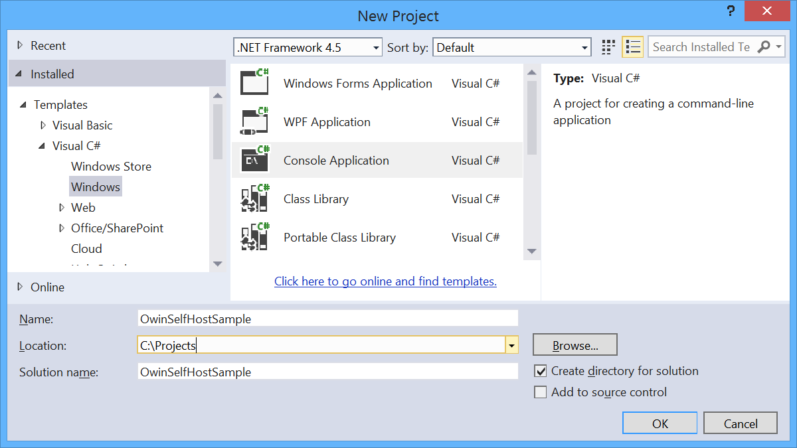
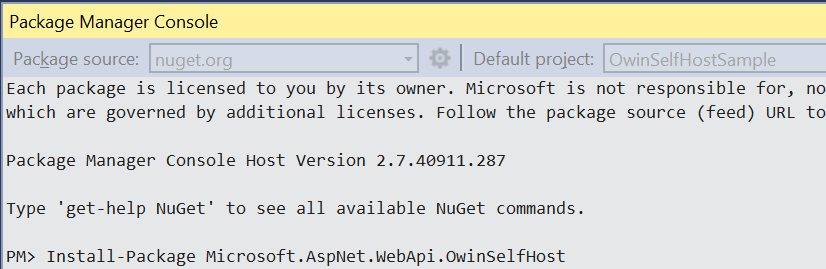
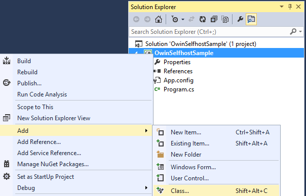
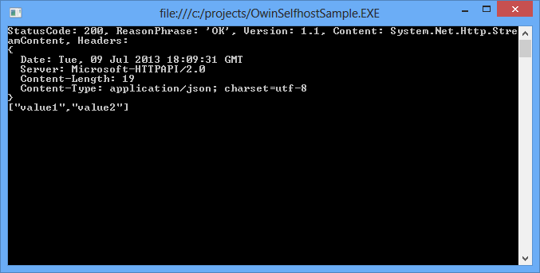

[Edit .md file](C:\Projects\msc\dev\Msc.Www\Web.ASP\App_Data\github\web-api\overview\hosting-aspnet-web-api\use-owin-to-self-host-web-api.md) | [Edit dev content](http://www.aspdev.net/umbraco#/content/content/edit/47786) | [View dev content](http://docs.aspdev.net/tutorials/web-api/overview/hosting-aspnet-web-api/use-owin-to-self-host-web-api.html) | [View prod content](http://www.asp.net/web-api/overview/hosting-aspnet-web-api/use-owin-to-self-host-web-api) | Picker: 47787

Use OWIN to Self-Host ASP.NET Web API 2
====================
by [Kanchan Mehrotra](https://twitter.com/kanchanmeh)

> This tutorial shows how to host ASP.NET Web API in a console application, using OWIN to self-host the Web API framework.
> 
> [Open Web Interface for .NET](http://owin.org) (OWIN) defines an abstraction between .NET web servers and web applications. OWIN decouples the web application from the server, which makes OWIN ideal for self-hosting a web application in your own process, outside of IIS.
> 
> ## Software versions used in the tutorial
> 
> 
> - [Visual Studio 2013](https://www.microsoft.com/visualstudio/eng/2013-downloads) (also works with Visual Studio 2012)
> - Web API 2

> [!NOTE] You can find the complete source code for this tutorial at [aspnet.codeplex.com](https://aspnet.codeplex.com/SourceControl/latest#Samples/WebApi/OwinSelfhostSample/ReadMe.txt).

## Create a Console Application

On the **File** menu, click **New**, then click **Project**. From **Installed Templates**, under Visual C#, click **Windows** and then click **Console Application**. Name the project "OwinSelfhostSample" and click **OK**.

## Add the Web API and OWIN Packages

From the **Tools** menu, click **Library Package Manager**, then click **Package Manager Console**. In the Package Manager Console window, enter the following command:

`Install-Package Microsoft.AspNet.WebApi.OwinSelfHost`

This will install the WebAPI OWIN selfhost package and all the required OWIN packages.

## Configure Web API for Self-Host

In Solution Explorer, right click the project and select **Add** / **Class** to add a new class. Name the class `Startup`.

Replace all of the boilerplate code in this file with the following:

    using Owin; 
    using System.Web.Http; 
    
    namespace OwinSelfhostSample 
    { 
        public class Startup 
        { 
            // This code configures Web API. The Startup class is specified as a type
            // parameter in the WebApp.Start method.
            public void Configuration(IAppBuilder appBuilder) 
            { 
                // Configure Web API for self-host. 
                HttpConfiguration config = new HttpConfiguration(); 
                config.Routes.MapHttpRoute( 
                    name: "DefaultApi", 
                    routeTemplate: "api/{controller}/{id}", 
                    defaults: new { id = RouteParameter.Optional } 
                ); 
    
                appBuilder.UseWebApi(config); 
            } 
        } 
    }

## Add a Web API Controller

Next, add a Web API controller class. In Solution Explorer, right click the project and select **Add** / **Class** to add a new class. Name the class `ValuesController`.

Replace all of the boilerplate code in this file with the following:

    using System.Collections.Generic;
    using System.Web.Http;
    
    namespace OwinSelfhostSample 
    { 
        public class ValuesController : ApiController 
        { 
            // GET api/values 
            public IEnumerable<string> Get() 
            { 
                return new string[] { "value1", "value2" }; 
            } 
    
            // GET api/values/5 
            public string Get(int id) 
            { 
                return "value"; 
            } 
    
            // POST api/values 
            public void Post([FromBody]string value) 
            { 
            } 
    
            // PUT api/values/5 
            public void Put(int id, [FromBody]string value) 
            { 
            } 
    
            // DELETE api/values/5 
            public void Delete(int id) 
            { 
            } 
        } 
    }

## Start the OWIN Host and Make a Request Using HttpClient

Replace all of the boilerplate code in the Program.cs file with the following:

    using Microsoft.Owin.Hosting;
    using System;
    using System.Net.Http;
    
    namespace OwinSelfhostSample 
    { 
        public class Program 
        { 
            static void Main() 
            { 
                string baseAddress = "http://localhost:9000/"; 
    
                // Start OWIN host 
                using (WebApp.Start<Startup>(url: baseAddress)) 
                { 
                    // Create HttpCient and make a request to api/values 
                    HttpClient client = new HttpClient(); 
    
                    var response = client.GetAsync(baseAddress + "api/values").Result; 
    
                    Console.WriteLine(response); 
                    Console.WriteLine(response.Content.ReadAsStringAsync().Result); 
                } 
    
                Console.ReadLine(); 
            } 
        } 
     }

## Running the Application

To run the application, press F5 in Visual Studio. The output should look like the following:

    StatusCode: 200, ReasonPhrase: 'OK', Version: 1.1, Content: System.Net.Http.StreamContent, Headers: 
    { 
      Date: Tue, 09 Jul 2013 18:10:15 GMT 
      Server: Microsoft-HTTPAPI/2.0 
      Content-Length: 19 
      Content-Type: application/json; charset=utf-8 
    } 
    ["value1","value2"]

## Additional Resources

[An Overview of Project Katana](../../../aspnet/overview/owin-and-katana/an-overview-of-project-katana.md)

[Host ASP.NET Web API in an Azure Worker Role](host-aspnet-web-api-in-an-azure-worker-role.md)