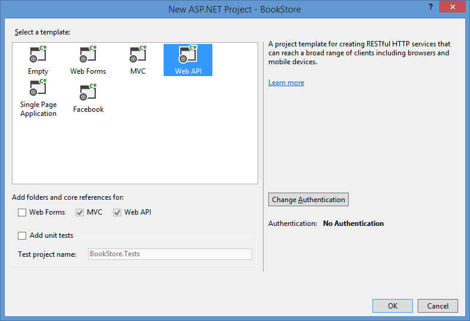
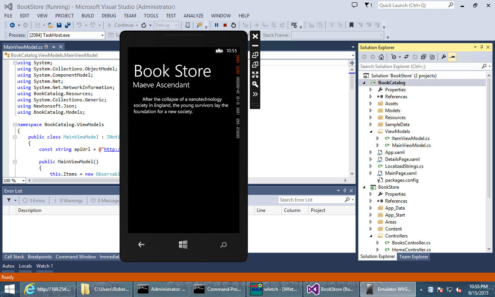
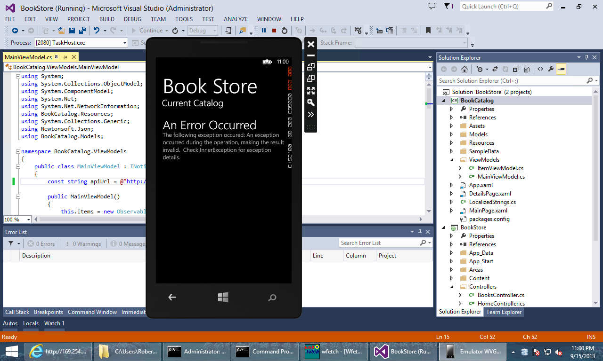

Calling Web API from a Windows Phone 8 Application (C#)
====================
by [Robert McMurray](https://github.com/rmcmurray)

In this tutorial, you will learn how to create a complete end-to-end scenario consisting of an ASP.NET Web API application that provides a catalog of books to a Windows Phone 8 application.

### Overview

RESTful services like ASP.NET Web API simplify the creation of HTTP-based applications for developers by abstracting the architecture for server-side and client-side applications. Instead of creating a proprietary socket-based protocol for communication, Web API developers simply need to publish the requisite HTTP methods for their application, (for example: GET, POST, PUT, DELETE), and client application developers only need to consume the HTTP methods that are necessary for their application.

In this end-to-end tutorial, you will learn how to use Web API to create the following projects:

- In the [first part of this tutorial](#STEP1), you will create an ASP.NET Web API application that supports all of the Create, Read, Update, and Delete (CRUD) operations to manage a book catalog. This application will use the [Sample XML File (books.xml)](https://msdn.microsoft.com/library/windows/desktop/ms762271.aspx) from MSDN.
- In the [second part of this tutorial](#STEP2), you will create an interactive Windows Phone 8 application that retrieves the data from your Web API application.

#### Prerequisites

- Visual Studio 2013 with the Windows Phone 8 SDK installed
- Windows 8 or later on a 64-bit system with Hyper-V installed
- For a list of additional requirements, see the *System Requirements* section on the [Windows Phone SDK 8.0](https://www.microsoft.com/en-us/download/details.aspx?id=35471) download page.

> [!NOTE]
> If you are going to test the connectivity between Web API and Windows Phone 8 projects on your local system, you will need to follow the instructions in the *[Connecting the Windows Phone 8 Emulator to Web API Applications on a Local Computer](https://go.microsoft.com/fwlink/?LinkId=324014)* article to set up your testing environment.

### Step 1: Creating the Web API Bookstore Project

The first step of this end-to-end tutorial is to create a Web API project that supports all of the CRUD operations; note that you will add the Windows Phone application project to this solution in [Step 2](#STEP2) of this tutorial.

1. Open **Visual Studio 2013**.
2. Click **File**, then **New**, and then **Project**.
3. When the **New Project** dialog box is displayed, expand **Installed**, then **Templates**, then **Visual C#**, and then **Web**.

    |  |
    | --- |
    | Click image to expand |
4. Highlight **ASP.NET Web Application**, enter **BookStore** for the project name, and then click **OK**.
5. When the **New ASP.NET Project** dialog box is displayed, select the **Web API** template, and then click **OK**.

    |  |
    | --- |
    | Click image to expand |
6. When the Web API project opens, remove the sample controller from the project:

    1. Expand the **Controllers** folder in the solution explorer.
    2. Right-click the **ValuesController.cs** file, and then click **Delete**.
    3. Click **OK** when prompted to confirm the deletion.
7. Add an XML data file to the Web API project; this file contains the contents of the bookstore catalog:

    1. Right-click the **App\_Data** folder in the solution explorer, then click **Add**, and then click **New Item**.
    2. When the **Add New Item** dialog box is displayed, highlight the **XML File** template.
    3. Name the file **Books.xml**, and then click **Add**.
    4. When the **Books.xml** file is opened, replace the code in the file with the XML from the sample **books.xml** file on MSDN: 

        [!code-xml[Main](calling-web-api-from-a-windows-phone-8-application/samples/sample1.xml)]
    5. Save and close the XML file.
8. Add the bookstore model to the Web API project; this model contains the Create, Read, Update, and Delete (CRUD) logic for the bookstore application:

    1. Right-click the **Models** folder in the solution explorer, then click **Add**, and then click **Class**.
    2. When the **Add New Item** dialog box is displayed, name the class file **BookDetails.cs**, and then click **Add**.
    3. When the **BookDetails.cs** file is opened, replace the code in the file with the following: 

        [!code-csharp[Main](calling-web-api-from-a-windows-phone-8-application/samples/sample2.cs)]
    4. Save and close the **BookDetails.cs** file.
9. Add the bookstore controller to the Web API project:

    1. Right-click the **Controllers** folder in the solution explorer, then click **Add**, and then click **Controller**.
    2. When the **Add Scaffold** dialog box is displayed, highlight **Web API 2 Controller - Empty**, and then click **Add**.
    3. When the **Add Controller** dialog box is displayed, name the controller **BooksController**, and then click **Add**.
    4. When the **BooksController.cs** file is opened, replace the code in the file with the following: 

        [!code-csharp[Main](calling-web-api-from-a-windows-phone-8-application/samples/sample3.cs)]
    5. Save and close the **BooksController.cs** file.
10. Build the Web API application to check for errors.

### Step 2: Adding the Windows Phone 8 Bookstore Catalog Project

The next step of this end-to-end scenario is to create the catalog application for Windows Phone 8. This application will use the *Windows Phone Databound App* template for the default user interface, and it will use the Web API application that you created in [Step 1](#STEP1) of this tutorial as the data source.

1. Right-click the **BookStore** solution in the in the solution explorer, then click **Add**, and then **New Project**.
2. When the **New Project** dialog box is displayed, expand **Installed**, then **Visual C#**, and then **Windows Phone**.
3. Highlight **Windows Phone Databound App**, enter **BookCatalog** for the name, and then click **OK**.
4. Add the Json.NET NuGet package to the **BookCatalog** project:

    1. Right-click **References** for the **BookCatalog** project in the solution explorer, and then click **Manage NuGet Packages**.
    2. When the **Manage NuGet Packages** dialog box is displayed, expand the **Online** section, and highlight **nuget.org**.
    3. Enter **Json.NET** in the search field and click the search icon.
    4. Highlight **Json.NET** in the search results, and then click **Install**.
    5. When the installation has completed, click **Close**.
5. Add the **BookDetails** model to the **BookCatalog** project; this contains a generic model of the bookstore class:

    1. Right-click the **BookCatalog** project in the solution explorer, then click **Add**, and then click **New Folder**.
    2. Name the new folder **Models**.
    3. Right-click the **Models** folder in the solution explorer, then click **Add**, and then click **Class**.
    4. When the **Add New Item** dialog box is displayed, name the class file **BookDetails.cs**, and then click **Add**.
    5. When the **BookDetails.cs** file is opened, replace the code in the file with the following: 

        [!code-csharp[Main](calling-web-api-from-a-windows-phone-8-application/samples/sample4.cs)]
    6. Save and close the **BookDetails.cs** file.
6. Update the **MainViewModel.cs** class to include the functionality to communicate with the BookStore Web API application:

    1. Expand the **ViewModels** folder in the solution explorer, and then double-click the **MainViewModel.cs** file.
    2. When the the **MainViewModel.cs** file is opened, replace the code in the file with the following; note that you will need to update the value of the `apiUrl` constant with the actual URL of your Web API: 

        [!code-csharp[Main](calling-web-api-from-a-windows-phone-8-application/samples/sample5.cs)]
    3. Save and close the **MainViewModel.cs** file.
7. Update the **MainPage.xaml** file to customize the application name:

    1. Double-click the **MainPage.xaml** file in the solution explorer.
    2. When the the **MainPage.xaml** file is opened, locate the following lines of code: 

        [!code-xml[Main](calling-web-api-from-a-windows-phone-8-application/samples/sample6.xml)]
    3. Replace those lines with the following: 

        [!code-xml[Main](calling-web-api-from-a-windows-phone-8-application/samples/sample7.xml)]
    4. Save and close the **MainPage.xaml** file.
8. Update the **DetailsPage.xaml** file to customize the displayed items:

    1. Double-click the **DetailsPage.xaml** file in the solution explorer.
    2. When the the **DetailsPage.xaml** file is opened, locate the following lines of code: 

        [!code-xml[Main](calling-web-api-from-a-windows-phone-8-application/samples/sample8.xml)]
    3. Replace those lines with the following: 

        [!code-xml[Main](calling-web-api-from-a-windows-phone-8-application/samples/sample9.xml)]
    4. Save and close the **DetailsPage.xaml** file.
9. Build the Windows Phone application to check for errors.

### Step 3: Testing the End-to-End Solution

As mentioned in the *Prerequisites* section of this tutorial, when you are testing the connectivity between Web API and Windows Phone 8 projects on your local system, you will need to follow the instructions in the *[Connecting the Windows Phone 8 Emulator to Web API Applications on a Local Computer](https://go.microsoft.com/fwlink/?LinkId=324014)* article to set up your testing environment.

Once you have the testing environment configured, you will need to set the Windows Phone application as the startup project. To do so, highlight the **BookCatalog** application in the solution explorer, and then click **Set as StartUp Project**:

|  |
| --- |
| Click image to expand |

When you press F5, Visual Studio will start both the Windows Phone Emulator, which will display a &quot;Please Wait&quot; message while the application data is retrieved from your Web API:

|  |
| --- |
| Click image to expand |

If everything is successful, you should see the catalog displayed:

|  |
| --- |
| Click image to expand |

If you tap on any book title, the application will display the book description:

|  |
| --- |
| Click image to expand |

If the application cannot communicate with your Web API, an error message will be displayed:

|  |
| --- |
| Click image to expand |

If you tap on the error message, any additional details about the error will be displayed:

|  |
| --- |
| Click image to expand |