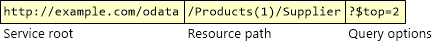

Routing Conventions in ASP.NET Web API 2 Odata
====================
by [Mike Wasson](https://github.com/MikeWasson)

> This article describes the routing conventions that Web API uses for OData endpoints.

When Web API gets an OData request, it maps the request to a controller name and an action name. The mapping is based on the HTTP method and the URI. For example, `GET /odata/Products(1)` maps to `ProductsController.GetProduct`.

In part 1 of this article, I describe the built-in OData routing conventions. These conventions are designed specifically for OData endpoints, and they replace the default Web API routing system. (The replacement happens when you call **MapODataRoute**.)

In part 2, I show how to add custom routing conventions. Currently the built-in conventions do not cover the entire range of OData URIs, but you can extend them to handle additional cases.

- [Built-in Routing Conventions](#conventions)
- [Custom Routing Conventions](#custom)

## Built-in Routing Conventions

Before I describe the OData routing conventions in Web API, it's helpful to understand OData URIs. An [OData URI](http://www.odata.org/documentation/odata-v3-documentation/url-conventions/) consists of:

- The service root
- The resource path
- Query options

For routing, the important part is the resource path. The resource path is divided into segments. For example, `/Products(1)/Supplier` has three segments:

- `Products` refers to an entity set named "Products".
- `1` is an entity key, selecting a single entity from the set.
- `Supplier` is a navigation property that selects a related entity.

So this path picks out the supplier of product 1.

> [!NOTE]
> OData path segments do not always correspond to URI segments. For example, "1" is considered a path segment.

**Controller Names.** The controller name is always derived from the entity set at the root of the resource path. For example, if the resource path is `/Products(1)/Supplier`, Web API looks for a controller named `ProductsController`.

**Action Names.** Action names are derived from the path segments plus the entity data model (EDM), as listed in the following tables. In some cases, you have two choices for the action name. For example, "Get" or &quot;GetProducts&quot;.

**Querying Entities**

| Request | Example URI | Action Name | Example Action |
| --- | --- | --- | --- |
| GET /entityset | /Products | GetEntitySet or Get | GetProducts |
| GET /entityset(key) | /Products(1) | GetEntityType or Get | GetProduct |
| GET /entityset(key)/cast | /Products(1)/Models.Book | GetEntityType or Get | GetBook |

For more information, see [Create a Read-Only OData Endpoint](odata-v3/creating-an-odata-endpoint.md).

**Creating, Updating, and Deleting Entities**

| Request | Example URI | Action Name | Example Action |
| --- | --- | --- | --- |
| POST /entityset | /Products | PostEntityType or Post | PostProduct |
| PUT /entityset(key) | /Products(1) | PutEntityType or Put | PutProduct |
| PUT /entityset(key)/cast | /Products(1)/Models.Book | PutEntityType or Put | PutBook |
| PATCH /entityset(key) | /Products(1) | PatchEntityType or Patch | PatchProduct |
| PATCH /entityset(key)/cast | /Products(1)/Models.Book | PatchEntityType or Patch | PatchBook |
| DELETE /entityset(key) | /Products(1) | DeleteEntityType or Delete | DeleteProduct |
| DELETE /entityset(key)/cast | /Products(1)/Models.Book | DeleteEntityType or Delete | DeleteBook |

**Querying a Navigation Property**

| Request | Example URI | Action Name | Example Action |
| --- | --- | --- | --- |
| GET /entityset(key)/navigation | /Products(1)/Supplier | GetNavigationFromEntityType or GetNavigation | GetSupplierFromProduct |
| GET /entityset(key)/cast/navigation | /Products(1)/Models.Book/Author | GetNavigationFromEntityType or GetNavigation | GetAuthorFromBook |

For more information, see [Working with Entity Relations](odata-v3/working-with-entity-relations.md).

**Creating and Deleting Links**

| Request | Example URI | Action Name |
| --- | --- | --- |
| POST /entityset(key)/$links/navigation | /Products(1)/$links/Supplier | CreateLink |
| PUT /entityset(key)/$links/navigation | /Products(1)/$links/Supplier | CreateLink |
| DELETE /entityset(key)/$links/navigation | /Products(1)/$links/Supplier | DeleteLink |
| DELETE /entityset(key)/$links/navigation(relatedKey) | /Products/(1)/$links/Suppliers(1) | DeleteLink |

For more information, see [Working with Entity Relations](odata-v3/working-with-entity-relations.md).

**Properties**

*Requires Web API 2*

| Request | Example URI | Action Name | Example Action |
| --- | --- | --- | --- |
| GET /entityset(key)/property | /Products(1)/Name | GetPropertyFromEntityType or GetProperty | GetNameFromProduct |
| GET /entityset(key)/cast/property | /Products(1)/Models.Book/Author | GetPropertyFromEntityType or GetProperty | GetTitleFromBook |

**Actions**

| Request | Example URI | Action Name | Example Action |
| --- | --- | --- | --- |
| POST /entityset(key)/action | /Products(1)/Rate | ActionNameOnEntityType or ActionName | RateOnProduct |
| POST /entityset(key)/cast/action | /Products(1)/Models.Book/CheckOut | ActionNameOnEntityType or ActionName | CheckOutOnBook |

For more information, see [OData Actions](odata-v3/odata-actions.md).

**Method Signatures**

Here are some rules for the method signatures:

- If the path contains a key, the action should have a parameter named *key*.
- If the path contains a key into a navigation property, the action should have a parameter named *relatedKey*.
- Decorate *key* and *relatedKey* parameters with the **[FromODataUri]** parameter.
- POST and PUT requests take a parameter of the entity type.
- PATCH requests take a parameter of type **Delta&lt;T&gt;**, where *T* is the entity type.

For reference, here is an example that shows method signatures for every built-in OData routing convention.

[!code-csharp[Main](odata-routing-conventions/samples/sample1.cs)]

## Custom Routing Conventions

Currently the built-in conventions do not cover all possible OData URIs. You can add new conventions by implementing the **IODataRoutingConvention** interface. This interface has two methods:

[!code-csharp[Main](odata-routing-conventions/samples/sample2.cs)]

- **SelectController** returns the name of the controller.
- **SelectAction** returns the name of the action.

For both methods, if the convention does not apply to that request, the method should return null.

The **ODataPath** parameter represents the parsed OData resource path. It contains a list of **[ODataPathSegment](https://msdn.microsoft.com/en-us/library/system.web.http.odata.routing.odatapathsegment.aspx)** instances, one for each segment of the resource path. **ODataPathSegment** is an abstract class; each segment type is represented by a class that derives from **ODataPathSegment**.

The **ODataPath.TemplatePath** property is a string that represents the concatenation all of the path segments. For example, if the URI is `/Products(1)/Supplier`, the path template is &quot;~/entityset/key/navigation&quot;. Notice that the segments don't correspond directly to URI segments. For example, the entity key (1) is represented as its own **ODataPathSegment**.

Typically, an implementation of **IODataRoutingConvention** does the following:

1. Compare the path template to see if this convention applies to the current request. If it does not apply, return null.
2. If the convention applies, use properties of the **ODataPathSegment** instances to derive controller and action names.
3. For actions, add any values to the route dictionary that should bind to the action parameters (typically entity keys).

Let's look at a specific example. The built-in routing conventions do not support indexing into a navigation collection. In other words, there is no convention for URIs like the following:

[!code-javascript[Main](odata-routing-conventions/samples/sample3.js)]

Here is a custom routing convention to handle this type of query.

[!code-csharp[Main](odata-routing-conventions/samples/sample4.cs)]

Notes:

1. I derive from **EntitySetRoutingConvention**, because the **SelectController** method in that class is appropriate for this new routing convention. That means I don't need to re-implement **SelectController**.
2. The convention applies only to GET requests, and only when the path template is &quot;~/entityset/key/navigation/key&quot;.
3. The action name is &quot;Get{EntityType}&quot;, where *{EntityType}* is the type of the navigation collection. For example, &quot;GetSupplier&quot;. You can use any naming convention that you like &#8212; just make sure your controller actions match.
4. The action takes two parameters named *key* and *relatedKey*. (For a list of some predefined parameter names, see [ODataRouteConstants](https://msdn.microsoft.com/en-us/library/system.web.http.odata.routing.odatarouteconstants.aspx).)

The next step is adding the new convention to the list of routing conventions. This happens during configuration, as shown in the following code:

[!code-csharp[Main](odata-routing-conventions/samples/sample5.cs)]

Here are some other sample routing conventions that be useful to study:

- [CompositeKeyRoutingConvention](http://aspnet.codeplex.com/sourcecontrol/latest#Samples/WebApi/ODataCompositeKeySample/ODataCompositeKeySample/Extensions/CompositeKeyRoutingConvention.cs)
- [CustomNavigationRoutingConvention](http://aspnet.codeplex.com/sourcecontrol/latest#Samples/WebApi/ODataServiceSample/ODataService/Extensions/CustomNavigationRoutingConvention.cs)
- [NonBindableActionRoutingConvention](http://aspnet.codeplex.com/sourcecontrol/latest#Samples/WebApi/ODataActionsSample/ODataActionsSample/NonBindableActionRoutingConvention.cs)
- [ODataVersionRouteConstraint](http://aspnet.codeplex.com/sourcecontrol/latest#Samples/WebApi/ODataVersioningSample/ODataVersioningSample/Extensions/ODataVersionRouteConstraint.cs)

And of course Web API itself is open-source, so you can see the [source code](http://aspnetwebstack.codeplex.com/) for the built-in routing conventions. These are defined in the **System.Web.Http.OData.Routing.Conventions** namespace.