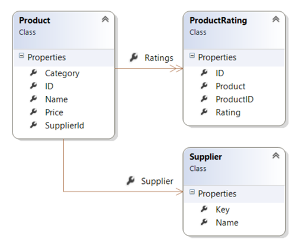
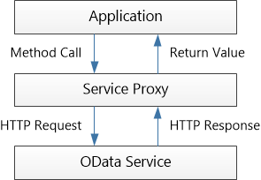
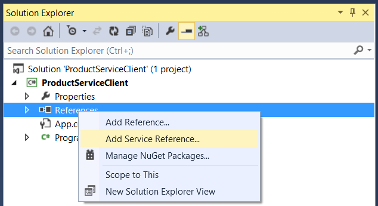
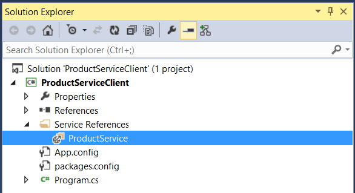

Calling an OData Service From a .NET Client (C#)
====================
by [Mike Wasson](https://github.com/MikeWasson)

[Download Completed Project](http://code.msdn.microsoft.com/ASPNET-Web-API-OData-cecdb524)

> This tutorial shows how to call an OData service from a C# client application.
> 
> ## Software versions used in the tutorial
> 
> 
> - [Visual Studio 2013](https://www.microsoft.com/visualstudio/eng/2013-downloads) (works with Visual Studio 2012)
> - [WCF Data Services Client Library](https://msdn.microsoft.com/en-us/library/cc668772.aspx)
> - Web API 2. (The example OData service is built using Web API 2, but the client application does not depend on Web API.)

In this tutorial, I'll walk through creating a client application that calls an OData service. The OData service exposes the following entities:

- `Product`
- `Supplier`
- `ProductRating`

The following articles describe how to implement the OData service in Web API. (You don't need to read them to understand this tutorial, however.)

- [Creating an OData Endpoint in Web API 2](creating-an-odata-endpoint.md)
- [OData Entity Relations in Web API 2](working-with-entity-relations.md)
- [OData Actions in Web API 2](odata-actions.md)

## Generate the Service Proxy

The first step is to generate a service proxy. The service proxy is a .NET class that defines methods for accessing the OData service. The proxy translates method calls into HTTP requests.

Start by opening the OData service project in Visual Studio. Press CTRL+F5 to run the service locally in IIS Express. Note the local address, including the port number that Visual Studio assigns. You will need this address when you create the proxy.

Next, open another instance of Visual Studio and create a console application project. The console application will be our OData client application. (You can also add the project to the same solution as the service.)

> [!NOTE]
> The remaining steps refer the console project.

In Solution Explorer, right-click **References** and select **Add Service Reference**.

In the **Add Service Reference** dialog, type the address of the OData service:

[!code-console[Main](calling-an-odata-service-from-a-net-client/samples/sample1.cmd)]

where *port* is the port number.

For **Namespace**, type "ProductService". This option defines the namespace of the proxy class.

Click **Go**. Visual Studio reads the OData metadata document to discover the entities in the service.

Click **OK** to add the proxy class to your project.

## Create an Instance of the Service Proxy Class

Inside your `Main` method, create a new instance of the proxy class, as follows:

[!code-csharp[Main](calling-an-odata-service-from-a-net-client/samples/sample2.cs)]

Again, use the actual port number where your service is running. When you deploy your service, you will use the URI of the live service. You don't need to update the proxy.

The following code adds an event handler that prints the request URIs to the console window. This step isn't required, but it's interesting to see the URIs for each query.

[!code-csharp[Main](calling-an-odata-service-from-a-net-client/samples/sample3.cs)]

## Query the Service

The following code gets the list of products from the OData service.

[!code-csharp[Main](calling-an-odata-service-from-a-net-client/samples/sample4.cs)]

Notice that you don't need to write any code to send the HTTP request or parse the response. The proxy class does this automatically when you enumerate the `Container.Products` collection in the **foreach** loop.

When you run the application, the output should look like the following:

[!code-console[Main](calling-an-odata-service-from-a-net-client/samples/sample5.cmd)]

To get an entity by ID, use a `where` clause.

[!code-csharp[Main](calling-an-odata-service-from-a-net-client/samples/sample6.cs)]

For the rest of this topic, I won't show the entire `Main` function, just the code needed to call the service.

## Apply Query Options

OData defines [query options](../supporting-odata-query-options.md) that can be used to filter, sort, page data, and so forth. In the service proxy, you can apply these options by using various LINQ expressions.

In this section, I'll show brief examples. For more details, see the topic [LINQ Considerations (WCF Data Services)](https://msdn.microsoft.com/en-us/library/ee622463.aspx) on MSDN.

### Filtering ($filter)

To filter, use a `where` clause. The following example filters by product category.

[!code-csharp[Main](calling-an-odata-service-from-a-net-client/samples/sample7.cs)]

This code corresponds to the following OData query.

[!code-console[Main](calling-an-odata-service-from-a-net-client/samples/sample8.cmd)]

Notice that the proxy converts the `where` clause into an OData `$filter` expression.

### Sorting ($orderby)

To sort, use an `orderby` clause. The following example sorts by price, from highest to lowest.

[!code-csharp[Main](calling-an-odata-service-from-a-net-client/samples/sample9.cs)]

Here is the corresponding OData request.

[!code-console[Main](calling-an-odata-service-from-a-net-client/samples/sample10.cmd)]

### Client-Side Paging ($skip and $top)

For large entity sets, the client might want to limit the number of results. For example, a client might show 10 entries at a time. This is called *client-side paging*. (There is also [server-side paging](../supporting-odata-query-options.md#server-paging), where the server limits the number of results.) To perform client-side paging, use the LINQ **Skip** and **Take** methods. The following example skips the first 40 results and takes the next 10.

[!code-csharp[Main](calling-an-odata-service-from-a-net-client/samples/sample11.cs)]

Here is the corresponding OData request:

[!code-console[Main](calling-an-odata-service-from-a-net-client/samples/sample12.cmd)]

### Select ($select) and Expand ($expand)

To include related entities, use the `DataServiceQuery<t>.Expand` method. For example, to include the `Supplier` for each `Product`:

[!code-csharp[Main](calling-an-odata-service-from-a-net-client/samples/sample13.cs)]

Here is the corresponding OData request:

[!code-console[Main](calling-an-odata-service-from-a-net-client/samples/sample14.cmd)]

To change the shape of the response, use the LINQ **select** clause. The following example gets just the name of each product, with no other properties.

[!code-csharp[Main](calling-an-odata-service-from-a-net-client/samples/sample15.cs)]

Here is the corresponding OData request:

[!code-console[Main](calling-an-odata-service-from-a-net-client/samples/sample16.cmd)]

A select clause can include related entities. In that case, do not call **Expand**; the proxy automatically includes the expansion in this case. The following example gets the name and supplier of each product.

[!code-csharp[Main](calling-an-odata-service-from-a-net-client/samples/sample17.cs)]

Here is the corresponding OData request. Notice that it includes the **$expand** option.

[!code-console[Main](calling-an-odata-service-from-a-net-client/samples/sample18.cmd)]

For more information about $select and $expand, see [Using $select, $expand, and $value in Web API 2](../using-select-expand-and-value.md).

## Add a New Entity

To add a new entity to an entity set, call `AddToEntitySet`, where *EntitySet* is the name of the entity set. For example, `AddToProducts` adds a new `Product` to the `Products` entity set. When you generate the proxy, WCF Data Services automatically creates these strongly-typed **AddTo** methods.

[!code-csharp[Main](calling-an-odata-service-from-a-net-client/samples/sample19.cs)]

To add a link between two entities, use the **AddLink** and **SetLink** methods. The following code adds a new supplier and a new product, and then creates links between them.

[!code-csharp[Main](calling-an-odata-service-from-a-net-client/samples/sample20.cs)]

Use **AddLink** when the navigation property is a collection. In this example, we are adding a product to the `Products` collection on the supplier.

Use **SetLink** when the navigation property is a single entity. In this example, we are setting the `Supplier` property on the product.

## Update / Patch

To update an entity, call the **UpdateObject** method.

[!code-csharp[Main](calling-an-odata-service-from-a-net-client/samples/sample21.cs)]

The update is performed when you call **SaveChanges**. By default, WCF sends an HTTP MERGE request. The **PatchOnUpdate** option tells WCF to send an HTTP PATCH instead.

> [!NOTE]
> Why PATCH versus MERGE? The original HTTP 1.1 specification ([RCF 2616](http://tools.ietf.org/html/rfc2616)) did not define any HTTP method with "partial update" semantics. To support partial updates, the OData specification defined the MERGE method. In 2010, [RFC 5789](http://tools.ietf.org/html/rfc5789) defined the PATCH method for partial updates. You can read some of the history in this [blog post](https://blogs.msdn.com/b/astoriateam/archive/2008/05/20/merge-vs-replace-semantics-for-update-operations.aspx) on the WCF Data Services Blog. Today, PATCH is preferred over MERGE. The OData controller created by the Web API scaffolding supports both methods.

If you want to replace the entire entity (PUT semantics), specify the **ReplaceOnUpdate** option. This causes WCF to send an HTTP PUT request.

[!code-csharp[Main](calling-an-odata-service-from-a-net-client/samples/sample22.cs)]

## Delete an Entity

To delete an entity, call **DeleteObject**.

[!code-csharp[Main](calling-an-odata-service-from-a-net-client/samples/sample23.cs)]

## Invoke an OData Action

In OData, [actions](odata-actions.md) are a way to add server-side behaviors that are not easily defined as CRUD operations on entities.

Although the OData metadata document describes the actions, the proxy class does not create any strongly-typed methods for them. You can still invoke an OData action by using the generic **Execute** method. However, you will need to know the data types of the parameters and the return value.

For example, the `RateProduct` action takes parameter named "Rating" of type `Int32` and returns a `double`. The following code shows how to invoke this action.

[!code-csharp[Main](calling-an-odata-service-from-a-net-client/samples/sample24.cs)]

For more information, see[Calling Service Operations and Actions](https://msdn.microsoft.com/en-us/library/hh230677.aspx).

One option is to extend the **Container** class to provide a strongly typed method that invokes the action:

[!code-csharp[Main](calling-an-odata-service-from-a-net-client/samples/sample25.cs)]