Creating an OData v3 Endpoint with Web API 2
====================
by [Mike Wasson](https://github.com/MikeWasson)

[Download Completed Project](http://code.msdn.microsoft.com/ASPNET-Web-API-OData-cecdb524)

> The [Open Data Protocol](http://www.odata.org/) (OData) is a data access protocol for the web. OData provides a uniform way to structure data, query the data, and manipulate the data set through CRUD operations (create, read, update, and delete). OData supports both AtomPub (XML) and JSON formats. OData also defines a way to expose metadata about the data. Clients can use the metadata to discover the type information and relationships for the data set.
> 
> ASP.NET Web API makes it easy to create an OData endpoint for a data set. You can control exactly which OData operations the endpoint supports. You can host multiple OData endpoints, alongside non-OData endpoints. You have full control over your data model, back-end business logic, and data layer.
> 
> ## Software versions used in the tutorial
> 
> 
> - [Visual Studio 2013](https://www.microsoft.com/visualstudio/eng/2013-downloads)
> - Web API 2
> - OData Version 3
> - Entity Framework 6
> - [Fiddler Web Debugging Proxy (Optional)](http://www.fiddler2.com)
> 
> Web API OData support was added in [ASP.NET and Web Tools 2012.2 Update](https://go.microsoft.com/fwlink/?LinkId=282650). However, this tutorial uses scaffolding that was added in Visual Studio 2013.

In this tutorial, you will create a simple OData endpoint that clients can query. You will also create a C# client for the endpoint. After you complete this tutorial, the next set of tutorials show how to add more functionality, including entity relations, actions, and $expand/$select.

- [Create the Visual Studio Project](#create-project)
- [Add an Entity Model](#add-model)
- [Add an OData Controller](#add-controller)
- [Add the EDM and Route](#edm)
- [Seed the Database (Optional)](#seed-db)
- [Exploring the OData Endpoint](#explore)
- [OData Serialization Formats](#formats)

## Create the Visual Studio Project

In this tutorial, you will create an OData endpoint that supports basic CRUD operations. The endpoint will expose a single resource, a list of products. Later tutorials will add more features.

Start Visual Studio and select **New Project** from the Start page. Or, from the **File** menu, select **New** and then **Project**.

In the **Templates** pane, select **Installed Templates** and expand the Visual C# node. Under **Visual C#**, select **Web**. Select **the ASP.NET Web Application** template.

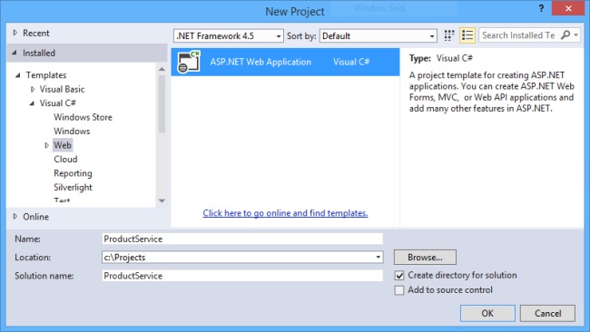

In the **New ASP.NET Project** dialog, select the **Empty** template. Under &quot;Add folders and core references for...&quot;, check **Web API**. Click **OK**.

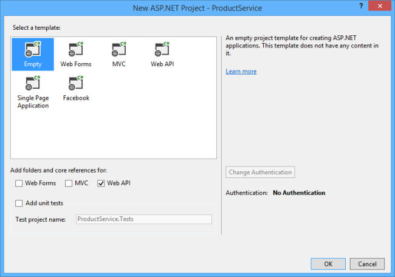

## Add an Entity Model

A *model* is an object that represents the data in your application. For this tutorial, we need a model that represents a product. The model corresponds to our OData entity type.

In Solution Explorer, right-click the Models folder. From the context menu, select **Add** then select **Class**.

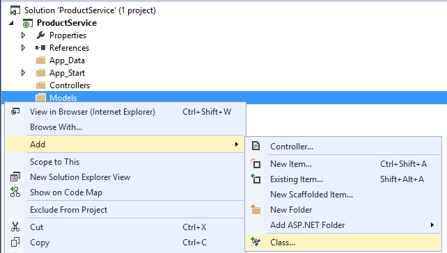

In the **Add New** Item dialog, name the class &quot;Product&quot;.

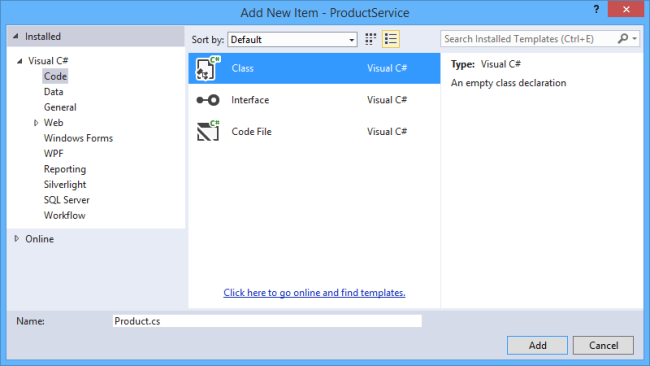

> [!NOTE]
> By convention, model classes are placed in the Models folder. You don't have to follow this convention in your own projects, but we'll use it for this tutorial.

In the Product.cs file, add the following class definition:

[!code-csharp[Main](creating-an-odata-endpoint/samples/sample1.cs)]

The ID property will be the entity key. Clients can query products by ID. This field would also be the primary key in the back-end database.

Build the project now. In the next step, we'll use some Visual Studio scaffolding that uses reflection to find the Product type.

## Add an OData Controller

A *controller* is a class that handles HTTP requests. You define a separate controller for each entity set in you OData service. In this tutorial, we'll create a single controller.

In Solution Explorer, right-click the the Controllers folder. Select **Add** and then select **Controller**.

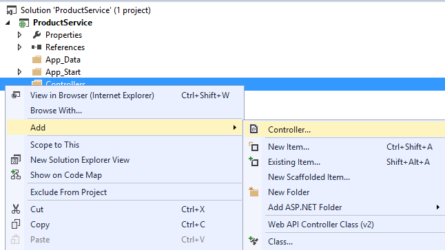

In the **Add Scaffold** dialog, select &quot;Web API 2 OData Controller with actions, using Entity Framework&quot;.

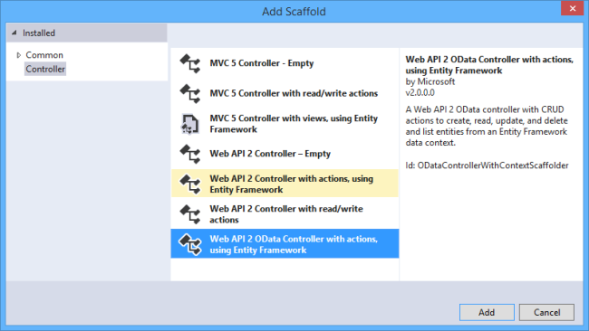

In the **Add Controller** dialog, name the controller "ProductsController". Select the &quot;Use async controller actions&quot; checkbox. In the **Model** drop-down list, select the Product class.

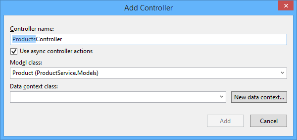

Click the **New data context...** button. Leave the default name for the data context type, and click **Add**.

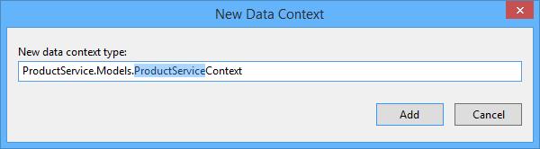

Click Add in the Add Controller dialog to add the controller.

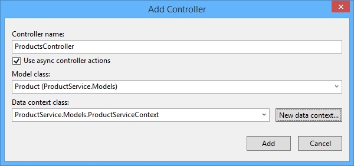

Note: If you get an error message that says &quot;There was an error getting the type...&quot;, make sure that you built the Visual Studio project after you added the Product class. The scaffolding uses reflection to find the class.

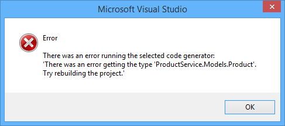

The scaffolding adds two code files to the project:

- Products.cs defines the Web API controller that implements the OData endpoint.
- ProductServiceContext.cs provides methods to query the underlying database, using Entity Framework.

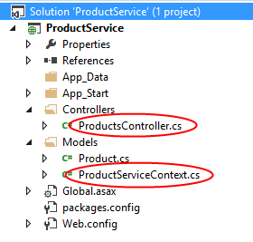

## Add the EDM and Route

In Solution Explorer, expand the App\_Start folder and open the file named WebApiConfig.cs. This class holds configuration code for Web API. Replace this code with the following:

[!code-csharp[Main](creating-an-odata-endpoint/samples/sample2.cs)]

This code does two things:

- Creates an Entity Data Model (EDM) for the OData endpoint.
- Adds a route for the endpoint.

An EDM is an abstract model of the data. The EDM is used to create the metadata document and define the URIs for the service. The **ODataConventionModelBuilder** creates an EDM by using a set of default naming conventions EDM. This approach requires the least code. If you want more control over the EDM, you can use the **ODataModelBuilder** class to create the EDM by adding properties, keys, and navigation properties explicitly.

The **EntitySet** method adds an entity set to the EDM:

[!code-csharp[Main](creating-an-odata-endpoint/samples/sample3.cs)]

The string "Products" defines the name of the entity set. The name of the controller must match the name of the entity set. In this tutorial, the entity set is named "Products" and the controller is named `ProductsController`. If you named the entity set "ProductSet", you would name the controller `ProductSetController`. Note that an endpoint can have multiple entity sets. Call **EntitySet&lt;T&gt;** for each entity set, and then define a corresponding controller.

The **MapODataRoute** method adds a route for the OData endpoint.

[!code-csharp[Main](creating-an-odata-endpoint/samples/sample4.cs)]

The first parameter is a friendly name for the route. Clients of your service do not see this name. The second parameter is the URI prefix for the endpoint. Given this code, the URI for the Products entity set is http://*hostname*/odata/Products. Your application can have more than one OData endpoint. For each endpoint, call **MapODataRoute** and provide a unique route name and a unique URI prefix.

## Seed the Database (Optional)

In this step, you will use Entity Framework to seed the database with some test data. This step is optional, but it lets you test out your OData endpoint right away.

From the **Tools** menu, select **Library Package Manager**, then select **Package Manager Console**. In the Package Manager Console window, enter the following command:

[!code-console[Main](creating-an-odata-endpoint/samples/sample5.cmd)]

This adds a folder named Migrations and a code file named Configuration.cs.

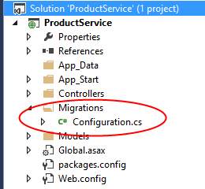

Open this file and add the following code to the `Configuration.Seed` method.

[!code-csharp[Main](creating-an-odata-endpoint/samples/sample6.cs)]

In the Package Manager Console Window, enter the following commands:

[!code-console[Main](creating-an-odata-endpoint/samples/sample7.cmd)]

These commands generate code that creates the database, and then executes that code.

## Exploring the OData Endpoint

In this section, we'll use the [Fiddler Web Debugging Proxy](http://www.fiddler2.com) to send requests to the endpoint and examine the response messages. This will help you to understand the capabilities of an OData endpoint.

In Visual Studio, press F5 to start debugging. By default, Visual Studio opens your browser to `http://localhost:*port*`, where *port* is the port number configured in the project settings.

You can change the port number in the project settings. In Solution Explorer, right-click the project and select **Properties**. In the properties window, select **Web**. Enter the port number under **Project Url**.

### Service Document

The *service document* contains a list of the entity sets for the OData endpoint. To get the service document, send a GET request to the root URI of the service.

Using Fiddler, enter the following URI in the **Composer** tab: `http://localhost:port/odata/`, where *port* is the port number.

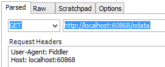

Click the **Execute** button. Fiddler sends an HTTP GET request to your application. You should see the response in the Web Sessions list. If everything is working, the status code will be 200.

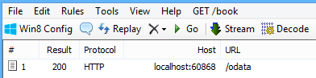

Double-click the response in the Web Sessions list to see the details of the response message in the Inspectors tab.

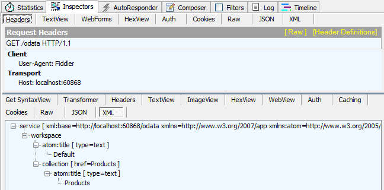

The raw HTTP response message should look similar to the following:

[!code-console[Main](creating-an-odata-endpoint/samples/sample8.cmd)]

By default, Web API returns the service document in AtomPub format. To request JSON, add the following header to the HTTP request:

`Accept: application/json`

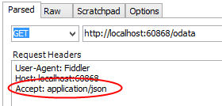

Now the HTTP response contains a JSON payload:

[!code-console[Main](creating-an-odata-endpoint/samples/sample9.cmd)]

### Service Metadata Document

The *service metadata document* describes the data model of the service, using an XML language called the Conceptual Schema Definition Language (CSDL). The metadata document shows the structure of the data in the service, and can be used to generate client code.

To get the metadata document, send a GET request to `http://localhost:port/odata/$metadata`. Here is the metadata for the endpoint shown in this tutorial.

[!code-console[Main](creating-an-odata-endpoint/samples/sample10.cmd)]

### Entity Set

To get the Products entity set, send a GET request to `http://localhost:port/odata/Products`.

[!code-console[Main](creating-an-odata-endpoint/samples/sample11.cmd)]

### Entity

To get an individual product, send a GET request to `http://localhost:port/odata/Products(1)`, where "1" is the product ID.

[!code-console[Main](creating-an-odata-endpoint/samples/sample12.cmd)]

## OData Serialization Formats

OData supports several serialization formats:

- Atom Pub (XML)
- JSON "light" (introduced in OData v3)
- JSON "verbose" (OData v2)

By default, Web API uses AtomPubJSON "light" format. 

To get AtomPub format, set the Accept header to "application/atom+xml". Here is an example response body:

[!code-console[Main](creating-an-odata-endpoint/samples/sample13.cmd)]

You can see one obvious disadvantage of the Atom format: It's a lot more verbose than the JSON light. However, if you have a client that understands AtomPub, the client might prefer that format over JSON.

Here is the JSON light version of the same entity:

[!code-console[Main](creating-an-odata-endpoint/samples/sample14.cmd)]

The JSON light format was introduced in version 3 of the OData protocol. For backward compatibility, a client can request the older "verbose" JSON format. To request verbose JSON, set the Accept header to `application/json;odata=verbose`. Here is the verbose version:

[!code-console[Main](creating-an-odata-endpoint/samples/sample15.cmd)]

This format conveys more metadata in the response body, which can add considerable overhead over an entire session. Also, it adds a level of indirection by wrapping the object in a property named "d".

## Next Steps

- [Add Entity Relations](working-with-entity-relations.md)
- [Add OData Actions](odata-actions.md)
- [Call the OData Service From a .NET Client](calling-an-odata-service-from-a-net-client.md)