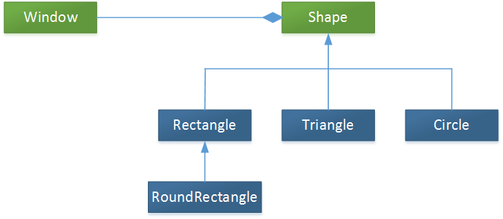

Complex Type Inheritance in OData v4 with ASP.NET Web API
====================
by [Microsoft](https://github.com/microsoft)

> According to the OData v4 [specification](http://www.odata.org/documentation/odata-version-4-0/), a complex type can inherit from another complex type. (A *complex* type is a structured type without a key.) Web API OData 5.3 supports complex type inheritance.
> 
> This topic shows how to build an entity data model (EDM) with complex inheritance types. For the complete source code, see [OData Complex Type Inheritance Sample](http://aspnet.codeplex.com/sourcecontrol/latest#Samples/WebApi/OData/v4/ODataComplexTypeInheritanceSample/ReadMe.txt).
> 
> ## Software versions used in the tutorial
> 
> 
> - Web API OData 5.3
> - OData v4

## Model Hierarchy

To illustrate complex type inheritance, we'll use the following class hierarchy.

`Shape` is an abstract complex type. `Rectangle`, `Triangle`, and `Circle` are complex types derived from `Shape`, and `RoundRectangle` derives from `Rectangle`. `Window` is an entity type and contains a `Shape` instance.

Here are the CLR classes that define these types.

[!code-csharp[Main](complex-type-inheritance-in-odata-v4/samples/sample1.cs)]

## Build the EDM Model

To create the EDM, you can use **ODataConventionModelBuilder**, which infers the inheritance relationships from the CLR types.

[!code-csharp[Main](complex-type-inheritance-in-odata-v4/samples/sample2.cs)]

You can also build the EDM explicitly, using **ODataModelBuilder**. This takes more code, but gives you more control over the EDM.

[!code-csharp[Main](complex-type-inheritance-in-odata-v4/samples/sample3.cs)]

These two examples create the same EDM schema.

## Metadata Document

Here is the OData metadata document, showing complex type inheritance.

[!code-xml[Main](complex-type-inheritance-in-odata-v4/samples/sample4.xml?highlight=13,17,25,30)]

From the metadata document, you can see that:

- The `Shape` complex type is abstract.
- The `Rectangle`, `Triangle`, and `Circle` complex type have the base type `Shape`.
- The `RoundRectangle` type has the base type `Rectangle`.

## Casting Complex Types

Casting on complex types is now supported. For example, the following query casts a `Shape` to a `Rectangle`.

[!code-console[Main](complex-type-inheritance-in-odata-v4/samples/sample5.cmd)]

Here's the response payload:

[!code-console[Main](complex-type-inheritance-in-odata-v4/samples/sample6.cmd)]