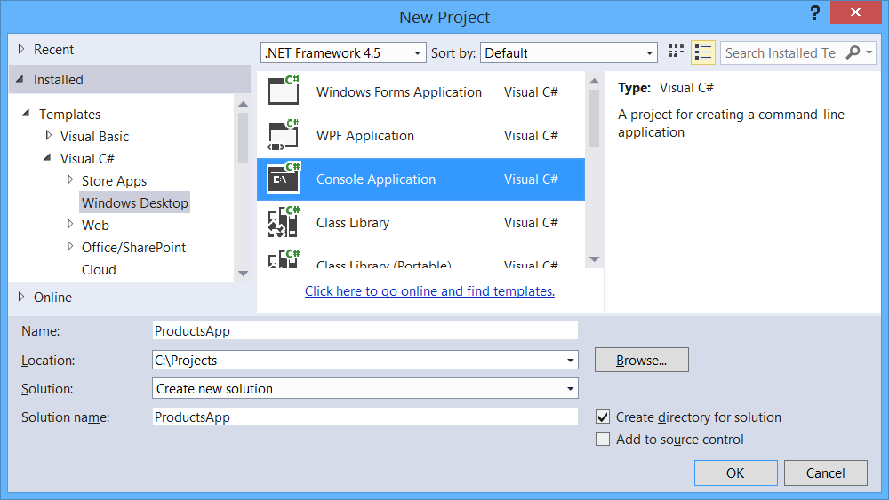
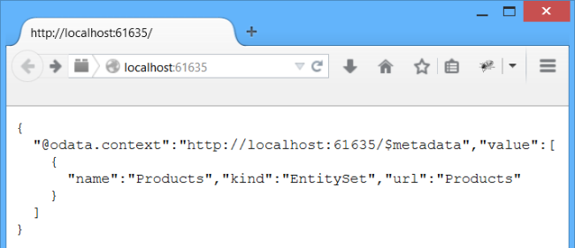
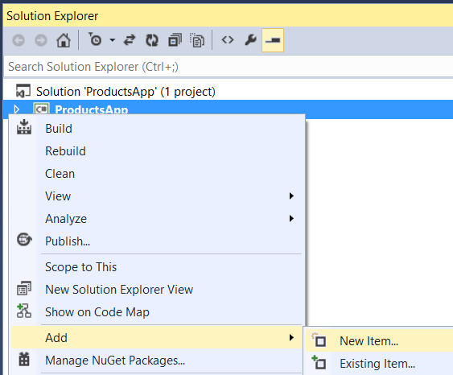
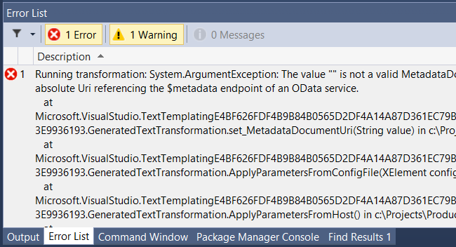
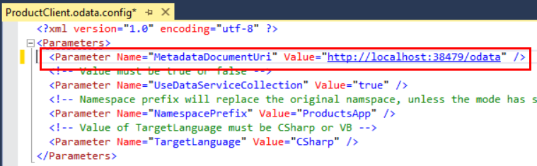
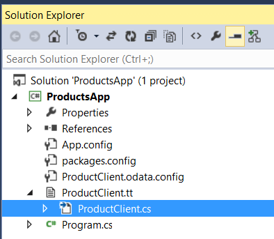

Create an OData v4 Client App (C#)
====================
by [Mike Wasson](https://github.com/MikeWasson)

In the previous tutorial, you created a basic OData service that supports CRUD operations. Now let's create a client for the service.

Start a new instance of Visual Studio and create a new console application project. In the **New Project** dialog, select **Installed** &gt; **Templates** &gt; **Visual C#** &gt; **Windows Desktop**, and select the **Console Application** template. Name the project &quot;ProductsApp&quot;.

> [!NOTE]
> You can also add the console app to the same Visual Studio solution that contains the OData service.

## Install the OData Client Code Generator

From the **Tools** menu, select **Extensions and Updates**. Select **Online** &gt; **Visual Studio Gallery**. In the search box, search for &quot;OData Client Code Generator&quot;. Click **Download** to install the VSIX. You might be prompted to restart Visual Studio.

## Run the OData Service Locally

Run the ProductService project from Visual Studio. By default, Visual Studio launches a browser to the application root. Note the URI; you will need this in the next step. Leave the application running.

> [!NOTE]
> If you put both projects in the same solution, make sure to run the ProductService project without debugging. In the next step, you will need to keep the service running while you modify the console application project.

## Generate the Service Proxy

The service proxy is a .NET class that defines methods for accessing the OData service. The proxy translates method calls into HTTP requests. You will create the proxy class by running a [T4 template](https://msdn.microsoft.com/en-us/library/bb126445.aspx).

Right-click the project. Select **Add** &gt; **New Item**.

In the **Add New Item** dialog, select **Visual C# Items** &gt; **Code** &gt; **OData Client**. Name the template &quot;ProductClient.tt&quot;. Click **Add** and click through the security warning.

At this point, you'll get an error, which you can ignore. Visual Studio automatically runs the template, but the template needs some configuration settings first.

Open the file ProductClient.odata.config. In the `Parameter` element, paste in the URI from the ProductService project (previous step). For example:

[!code-xml[Main](create-an-odata-v4-client-app/samples/sample1.xml)]

Run the template again. In Solution Explorer, right click the ProductClient.tt file and select **Run Custom Tool**.

The template creates a code file named ProductClient.cs that defines the proxy. As you develop your app, if you change the OData endpoint, run the template again to update the proxy.

## Use the Service Proxy to Call the OData Service

Open the file Program.cs and replace the boilerplate code with the following.

[!code-csharp[Main](create-an-odata-v4-client-app/samples/sample2.cs)]

Replace the value of *serviceUri* with the service URI from earlier.

[!code-csharp[Main](create-an-odata-v4-client-app/samples/sample3.cs)]

When you run the app, it should output the following:

[!code-console[Main](create-an-odata-v4-client-app/samples/sample4.cmd)]