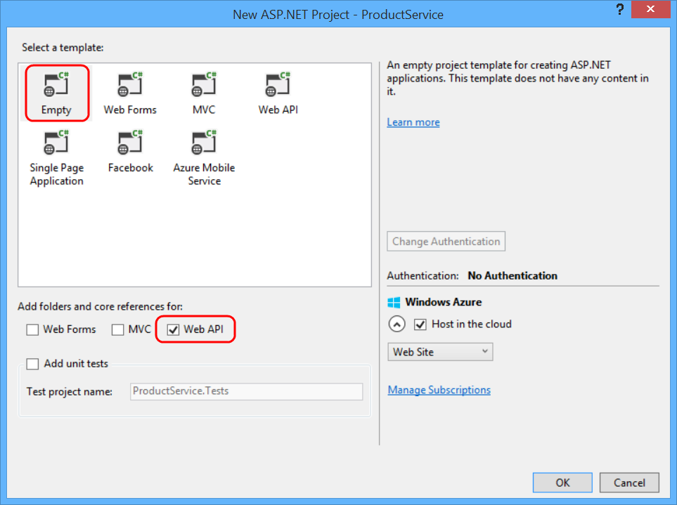

Create an OData v4 Endpoint Using ASP.NET Web API 2.2
====================
by [Mike Wasson](https://github.com/MikeWasson)

> The Open Data Protocol (OData) is a data access protocol for the web. OData provides a uniform way to query and manipulate data sets through CRUD operations (create, read, update, and delete).
> 
> ASP.NET Web API supports both v3 and v4 of the protocol. You can even have a v4 endpoint that runs side-by-side with a v3 endpoint.
> 
> This tutorial shows how to create an OData v4 endpoint that supports CRUD operations.
> 
> ## Software versions used in the tutorial
> 
> 
> - Web API 2.2
> - OData v4
> - [Visual Studio 2013 Update 2](https://www.visualstudio.com/downloads/download-visual-studio-vs)
> - Entity Framework 6
> - .NET 4.5
> 
> 
> ## Tutorial versions
> 
> For the OData Version 3, see [Creating an OData v3 Endpoint](../odata-v3/creating-an-odata-endpoint.md).

## Create the Visual Studio Project

In Visual Studio, from the **File** menu, select **New** &gt; **Project**.

Expand **Installed** &gt; **Templates** &gt; **Visual C#** &gt; **Web**, and select the **ASP.NET Web Application** template. Name the project &quot;ProductService&quot;.

In the **New Project** dialog, select the **Empty** template. Under &quot;Add folders and core references...&quot;, click **Web API**. Click **OK**.

## Install the OData Packages

From the **Tools** menu, select **NuGet Package Manager** &gt; **Package Manager Console**. In the Package Manager Console window, type:

    Install-Package Microsoft.AspNet.Odata

This command installs the latest OData NuGet packages.

## Add a Model Class

A *model* is an object that represents a data entity in your application.

In Solution Explorer, right-click the Models folder. From the context menu, select **Add** &gt; **Class**.

> [!NOTE] By convention, model classes are placed in the Models folder, but you don't have to follow this convention in your own projects.

Name the class `Product`. In the Product.cs file, replace the boilerplate code with the following:

    namespace ProductService.Models
    {
        public class Product
        {
            public int Id { get; set; }
            public string Name { get; set; }
            public decimal Price { get; set; }
            public string Category { get; set; }
        }
    }

The `Id` property is the entity key. Clients can query entities by key. For example, to get the product with ID of 5, the URI is `/Products(5)`. The `Id` property will also be the primary key in the back-end database.

## Enable Entity Framework

For this tutorial, we'll use Entity Framework (EF) Code First to create the back-end database.

> [!NOTE] Web API OData does not require EF. Use any data-access layer that can translate database entities into models.

First, install the NuGet package for EF. From the **Tools** menu, select **NuGet Package Manager** &gt; **Package Manager Console**. In the Package Manager Console window, type:

    Install-Package EntityFramework

Open the Web.config file, and add the following section inside the **configuration** element, after the **configSections** element.

[!code[Main](create-an-odata-v4-endpoint/samples/sample1.xml?highlight=6)]

This setting adds a connection string for a LocalDB database. This database will be used when you run the app locally.

Next, add a class named `ProductsContext` to the Models folder:

    using System.Data.Entity;
    namespace ProductService.Models
    {
        public class ProductsContext : DbContext
        {
            public ProductsContext() 
                    : base("name=ProductsContext")
            {
            }
            public DbSet<Product> Products { get; set; }
        }
    }

In the constructor, `"name=ProductsContext"` gives the name of the connection string.

## Configure the OData Endpoint

Open the file App\_Start/WebApiConfig.cs. Add the following **using** statements:

    using ProductService.Models;
    using System.Web.OData.Builder;
    using System.Web.OData.Extensions;

Then add the following code to the **Register** method:

    public static class WebApiConfig
    {
        public static void Register(HttpConfiguration config)
        {
            // New code:
            ODataModelBuilder builder = new ODataConventionModelBuilder();
            builder.EntitySet<Product>("Products");
            config.MapODataServiceRoute(
                routeName: "ODataRoute",
                routePrefix: null,
                model: builder.GetEdmModel());
        }
    }

This code does two things:

- Creates an Entity Data Model (EDM).
- Adds a route.

An EDM is an abstract model of the data. The EDM is used to create the service metadata document. The **ODataConventionModelBuilder** class creates an EDM by using default naming conventions. This approach requires the least code. If you want more control over the EDM, you can use the **ODataModelBuilder** class to create the EDM by adding properties, keys, and navigation properties explicitly.

A *route* tells Web API how to route HTTP requests to the endpoint. To create an OData v4 route, call the **MapODataServiceRoute** extension method.

If your application has multiple OData endpoints, create a separate route for each. Give each route a unique route name and prefix.

## Add the OData Controller

A *controller* is a class that handles HTTP requests. You create a separate controller for each entity set in your OData service. In this tutorial, you will create one controller, for the `Product` entity.

In Solution Explorer, right-click the Controllers folder and select **Add** &gt; **Class**. Name the class `ProductsController`.

> [!NOTE] The version of this tutorial for OData v3 uses the **Add Controller** scaffolding. Currently, there is no scaffolding for OData v4.

Replace the boilerplate code in ProductsController.cs with the following.

    using ProductService.Models;
    using System.Data.Entity;
    using System.Data.Entity.Infrastructure;
    using System.Linq;
    using System.Net;
    using System.Threading.Tasks;
    using System.Web.Http;
    using System.Web.OData;
    namespace ProductService.Controllers
    {
        public class ProductsController : ODataController
        {
            ProductsContext db = new ProductsContext();
            private bool ProductExists(int key)
            {
                return db.Products.Any(p => p.Id == key);
            } 
            protected override void Dispose(bool disposing)
            {
                db.Dispose();
                base.Dispose(disposing);
            }
        }
    }

The controller uses the `ProductsContext` class to access the database using EF. Notice that the controller overrides the **Dispose** method to dispose of the **ProductsContext**.

This is the starting point for the controller. Next, we'll add methods for all of the CRUD operations.

## Querying the Entity Set

Add the following methods to `ProductsController`.

    [EnableQuery]
    public IQueryable<Product> Get()
    {
        return db.Products;
    }
    [EnableQuery]
    public SingleResult<Product> Get([FromODataUri] int key)
    {
        IQueryable<Product> result = db.Products.Where(p => p.Id == key);
        return SingleResult.Create(result);
    }

The parameterless version of the `Get` method returns the entire Products collection. The `Get` method with a *key* parameter looks up a product by its key (in this case, the `Id` property).

The **[EnableQuery]** attribute enables clients to modify the query, by using query options such as $filter, $sort, and $page. For more information, see [Supporting OData Query Options](../supporting-odata-query-options.md).

## Adding an Entity to the Entity Set

To enable clients to add a new product to the database, add the following method to `ProductsController`.

    public async Task<IHttpActionResult> Post(Product product)
    {
        if (!ModelState.IsValid)
        {
            return BadRequest(ModelState);
        }
        db.Products.Add(product);
        await db.SaveChangesAsync();
        return Created(product);
    }

## Updating an Entity

OData supports two different semantics for updating an entity, PATCH and PUT.

- PATCH performs a partial update. The client specifies just the properties to update.
- PUT replaces the entire entity.

The disadvantage of PUT is that the client must send values for all of the properties in the entity, including values that are not changing. The [OData spec](http://docs.oasis-open.org/odata/odata/v4.0/os/part1-protocol/odata-v4.0-os-part1-protocol.html#_Toc372793719) states that PATCH is preferred.

In any case, here is the code for both PATCH and PUT methods:

    public async Task<IHttpActionResult> Patch([FromODataUri] int key, Delta<Product> product)
    {
        if (!ModelState.IsValid)
        {
            return BadRequest(ModelState);
        }
        var entity = await db.Products.FindAsync(key);
        if (entity == null)
        {
            return NotFound();
        }
        product.Patch(entity);
        try
        {
            await db.SaveChangesAsync();
        }
        catch (DbUpdateConcurrencyException)
        {
            if (!ProductExists(key))
            {
                return NotFound();
            }
            else
            {
                throw;
            }
        }
        return Updated(entity);
    }
    public async Task<IHttpActionResult> Put([FromODataUri] int key, Product update)
    {
        if (!ModelState.IsValid)
        {
            return BadRequest(ModelState);
        }
        if (key != update.Id)
        {
            return BadRequest();
        }
        db.Entry(update).State = EntityState.Modified;
        try
        {
            await db.SaveChangesAsync();
        }
        catch (DbUpdateConcurrencyException)
        {
            if (!ProductExists(key))
            {
                return NotFound();
            }
            else
            {
                throw;
            }
        }
        return Updated(update);
    }

In the case of PATCH, the controller uses the **Delta&lt;T&gt;** type to track the changes.

## Deleting an Entity

To enable clients to delete a product from the database, add the following method to `ProductsController`.

    public async Task<IHttpActionResult> Delete([FromODataUri] int key)
    {
        var product = await db.Products.FindAsync(key);
        if (product == null)
        {
            return NotFound();
        }
        db.Products.Remove(product);
        await db.SaveChangesAsync();
        return StatusCode(HttpStatusCode.NoContent);
    }