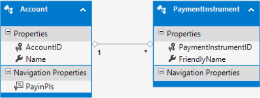

Containment in OData v4 Using Web API 2.2
====================
by Jinfu Tan

> Traditionally, an entity could only be accessed if it were encapsulated inside an entity set. But OData v4 provides two additional options, Singleton and Containment, both of which WebAPI 2.2 supports.

This topic shows how to define a containment in an OData endpoint in WebApi 2.2. For more information about containment, see [Containment is coming with OData v4](https://blogs.msdn.com/b/odatateam/archive/2014/03/13/containment-is-coming-with-odata-v4.aspx). To create an OData V4 endpoint in Web API, see [Create an OData v4 Endpoint Using ASP.NET Web API 2.2](create-an-odata-v4-endpoint.md).

First, we'll create a containment domain model in the OData service, using this data model:

An account contains many PaymentInstruments (PI), but we don't define an entity set for a PI. Instead, the PIs can only be accessed through an Account.

You can download the solution used in this topic from [CodePlex](https://aspnet.codeplex.com/SourceControl/latest#Samples/WebApi/OData/v4/ODataContainmentSample/).

## Defining the data model

1. Define the CLR types.

    [!code-csharp[Main](odata-containment-in-web-api-22/samples/sample1.cs)]

    The `Contained` attribute is used for containment navigation properties.
2. Generate the EDM model based on the CLR types.

    [!code-csharp[Main](odata-containment-in-web-api-22/samples/sample2.cs)]

    The `ODataConventionModelBuilder` will handle building the EDM model if the `Contained` attribute is added to the corresponding navigation property. If the property is a collection type, a `GetCount(string NameContains)` function will also be created.

    The generated metadata will look like the following:

    [!code-xml[Main](odata-containment-in-web-api-22/samples/sample3.xml?highlight=10)]

    The `ContainsTarget` attribute indicates that the navigation property is a containment.

## Define the containing entity set controller

Contained entities don't have their own controller; the action is defined in the containing entity set controller. In this sample, there is an AccountsController, but no PaymentInstrumentsController.

[!code-csharp[Main](odata-containment-in-web-api-22/samples/sample4.cs)]

If the OData path is 4 or more segments, only attribute routing works, such as `[ODataRoute("Accounts({accountId})/PayinPIs({paymentInstrumentId})")]` in the above controller. Otherwise, both attribute and conventional routing works: for instance, `GetPayInPIs(int key)` matches `GET ~/Accounts(1)/PayinPIs`.

*Thanks to Leo Hu for the original content of this article.*