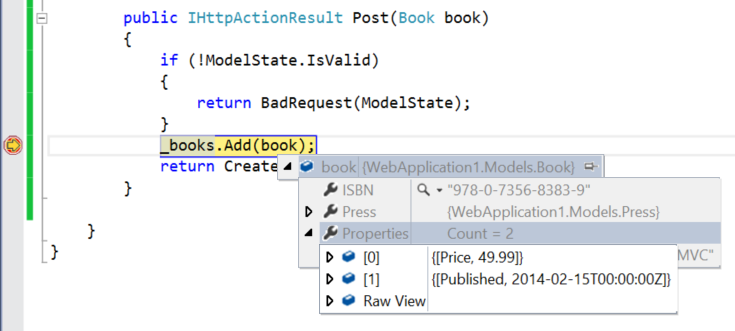

Open Types in OData v4 with ASP.NET Web API
====================
by [Microsoft](https://github.com/microsoft)

> In OData v4, an *open type* is a stuctured type that contains dynamic properties, in addition to any properties that are declared in the type definition. Open types let you add flexibility to your data models. This tutorial shows how to use open types in ASP.NET Web API OData.
> 
> This tutorial assumes that you already know how to create an OData endpoint in ASP.NET Web API. If not, start by reading [Create an OData v4 Endpoint](create-an-odata-v4-endpoint.md) first.
> 
> ## Software versions used in the tutorial
> 
> 
> - Web API OData 5.3
> - OData v4

First, some OData terminology:

- Entity type: A structured type with a key.
- Complex type: A structured type without a key.
- Open type: A type with dynamic properties. Both entity types and complex types can be open.

The value of a dynamic property can be a primitive type, complex type, or enumeration type; or a collection of any of those types. For more information about open types, see the [OData v4 specification](http://www.odata.org/documentation/odata-version-4-0/).

## Install the Web OData Libraries

Use NuGet Package Manager to install the latest Web API OData libraries. From the Package Manager Console window:

[!code-console[Main](use-open-types-in-odata-v4/samples/sample1.cmd)]

## Define the CLR Types

Start by defining the EDM models as CLR types.

[!code-csharp[Main](use-open-types-in-odata-v4/samples/sample2.cs)]

When the Entity Data Model (EDM) is created,

- `Category` is an enumeration type.
- `Address` is a complex type. (It does not have a key, so it is not an entity type.)
- `Customer` is an entity type. (It has a key.)
- `Press` is an open complex type.
- `Book` is an open entity type.

To create an open type, the CLR type must have a property of type `IDictionary<string, object>`, which holds the dynamic properties.

## Build the EDM Model

If you use **ODataConventionModelBuilder** to create the EDM, `Press` and `Book` are automatically added as open types, based on the presence of a `IDictionary<string, object>` property.

[!code-csharp[Main](use-open-types-in-odata-v4/samples/sample3.cs)]

You can also build the EDM explicitly, using **ODataModelBuilder**.

[!code-csharp[Main](use-open-types-in-odata-v4/samples/sample4.cs)]

## Add an OData Controller

Next, add an OData controller. For this tutorial, we'll use a simplified controller that just supports GET and POST requests, and uses an in-memory list to store entities.

[!code-csharp[Main](use-open-types-in-odata-v4/samples/sample5.cs)]

Notice that the first `Book` instance has no dynamic properties. The second `Book` instance has the following dynamic properties:

- "Published": Primitive type
- "Authors": Collection of primitive types
- "OtherCategories": Collection of enumeration types.

Also, the `Press` property of that `Book` instance has the following dynamic properties:

- "Blog": Primitive type
- "Address": Complex type

## Query the Metadata

To get the OData metadata document, send a GET request to `~/$metadata`. The response body should look similar to this:

[!code-xml[Main](use-open-types-in-odata-v4/samples/sample6.xml?highlight=5,21)]

From the metadata document, you can see that:

- For the `Book` and `Press` types, the value of the `OpenType` attribute is true. The `Customer` and `Address` types don't have this attribute.
- The `Book` entity type has three declared properties: ISBN, Title, and Press. The OData metadata does not include the `Book.Properties` property from the CLR class.
- Similarly, the `Press` complex type has only two declared properties: Name and Category. The metadata does not not include the `Press.DynamicProperties` property from the CLR class.

## Query an Entity

To get the book with ISBN equal to "978-0-7356-7942-9", send send a GET request to `~/Books('978-0-7356-7942-9')`. The response body should look similar to the following. (Indented to make it more readable.)

[!code-console[Main](use-open-types-in-odata-v4/samples/sample7.cmd?highlight=8-13,15-23)]

Notice that the dynamic properties are included inline with the declared properties.

## POST an Entity

To add a Book entity, send a POST request to `~/Books`. The client can set dynamic properties in the request payload.

Here is an example request. Note the "Price" and "Published" properties.

[!code-console[Main](use-open-types-in-odata-v4/samples/sample8.cmd?highlight=10)]

If you set a breakpoint in the controller method, you can see that Web API added these properties to the `Properties` dictionary.

## Additional Resources

[OData Open Type Sample](http://aspnet.codeplex.com/sourcecontrol/latest#Samples/WebApi/OData/v4/ODataOpenTypeSample/ReadMe.txt)