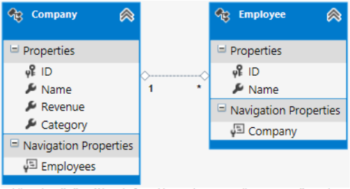

Create a Singleton in OData v4 Using Web API 2.2
====================
by Zoe Luo

> Traditionally, an entity could only be accessed if it were encapsulated inside an entity set. But OData v4 provides two additional options, Singleton and Containment, both of which WebAPI 2.2 supports.

This article shows how to define a singleton in an OData endpoint in Web API 2.2. For information on what a singleton is and how you can benefit from using it, see [Using a singleton to define your special entity](https://blogs.msdn.com/b/odatateam/archive/2014/03/05/use-singleton-to-define-your-special-entity.aspx). To create an OData V4 endpoint in Web API, see [Create an OData v4 Endpoint Using ASP.NET Web API 2.2](create-an-odata-v4-endpoint.md). 

We'll create a singleton in your Web API project using the following data model:

A singleton named `Umbrella` will be defined based on type `Company`, and an entity set named `Employees` will be defined based on type `Employee`.

The solution used in this tutorial can be downloaded from [CodePlex](http://aspnet.codeplex.com/sourcecontrol/latest#Samples/WebApi/OData/v4/ODataSingletonSample/).

## Define the data model

1. Define the CLR types.

    [!code-csharp[Main](using-a-singleton-in-an-odata-endpoint-in-web-api-22/samples/sample1.cs)]
2. Generate the EDM model based on the CLR types.

    [!code-csharp[Main](using-a-singleton-in-an-odata-endpoint-in-web-api-22/samples/sample2.cs)]

    Here, `builder.Singleton<Company>("Umbrella")` tells the model builder to create a singleton named `Umbrella` in the EDM model.

    The generated metadata will look like the following:

    [!code-xml[Main](using-a-singleton-in-an-odata-endpoint-in-web-api-22/samples/sample3.xml)]

    From the metadata we can see that the navigation property `Company` in the `Employees` entity set is bound to the singleton `Umbrella`. The binding is done automatically by `ODataConventionModelBuilder`, since only `Umbrella` has the `Company` type. If there is any ambiguity in the model, you can use `HasSingletonBinding` to explicitly bind a navigation property to a singleton; `HasSingletonBinding` has the same effect as using the `Singleton` attribute in the CLR type definition:

    [!code-csharp[Main](using-a-singleton-in-an-odata-endpoint-in-web-api-22/samples/sample4.cs)]

## Define the singleton controller

Like the EntitySet controller, the singleton controller inherits from `ODataController`, and the singleton controller name should be `[singletonName]Controller`.

[!code-csharp[Main](using-a-singleton-in-an-odata-endpoint-in-web-api-22/samples/sample5.cs)]

In order to handle different kinds of requests, actions are required to be pre-defined in the controller. **Attribute routing** is enabled by default in WebApi 2.2. For example, to define an action to handle querying `Revenue` from `Company` using attribute routing, use the following:

[!code-csharp[Main](using-a-singleton-in-an-odata-endpoint-in-web-api-22/samples/sample6.cs)]

If you are not willing to define attributes for each action, just define your actions following [OData Routing Conventions](../odata-routing-conventions.md). Since a key is not required for querying a singleton, the actions defined in the singleton controller are slightly different from actions defined in the entityset controller.

For reference, method signatures for every action definition in the singleton controller are listed below.

[!code-csharp[Main](using-a-singleton-in-an-odata-endpoint-in-web-api-22/samples/sample7.cs)]

Basically, this is all you need to do on the service side. The [sample project](http://aspnet.codeplex.com/sourcecontrol/latest#Samples/WebApi/OData/v4/ODataSingletonSample/) contains all of the code for the solution and the OData client that shows how to use the singleton. The client is built by following the steps in [Create an OData v4 Client App](create-an-odata-v4-client-app.md).

. 

*Thanks to Leo Hu for the original content of this article.*