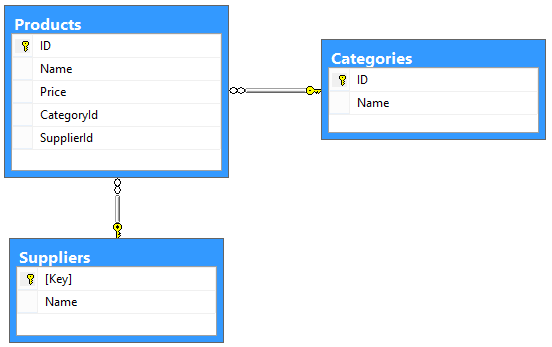

Using $select, $expand, and $value in ASP.NET Web API 2 OData
====================
by [Mike Wasson](https://github.com/MikeWasson)

Web API 2 adds support for the $expand, $select, and $value options in OData. These options allow a client to control the representation that it gets back from the server.

- **$expand** causes related entities to be included inline in the response.
- **$select** selects a subset of properties to include in the response.
- **$value** gets the raw value of a property.

## Example Schema

For this article, I'll use an OData service that defines three entities: Product, Supplier, and Category. Each product has one category and one supplier.

Here are the C# classes that define the entity models:

[!code-csharp[Main](using-select-expand-and-value/samples/sample1.cs)]

Notice that the `Product` class defines navigation properties for the `Supplier` and `Category`. The `Category` class defines a navigation property for the products in each category.

To create an OData endpoint for this schema, use the Visual Studio 2013 scaffolding, as described in [Creating an OData Endpoint in ASP.NET Web API](odata-v3/creating-an-odata-endpoint.md). Add separate controllers for Product, Category, and Supplier.

## Enabling $expand and $select

In Visual Studio 2013, the Web API OData scaffolding creates a controller that automatically supports $expand and $select. For reference, here are the requirements to support $expand and $select in a controller.

For collections, the controller's `Get` method must return an **IQueryable**.

[!code-csharp[Main](using-select-expand-and-value/samples/sample2.cs)]

For single entities, return a **SingleResult&lt;T&gt;**, where T is an **IQueryable** that contains zero or one entities.

[!code-csharp[Main](using-select-expand-and-value/samples/sample3.cs)]

Also, decorate your `Get` methods with the **[Queryable]** attribute, as shown in the previous code snippets. Alternatively, call **EnableQuerySupport** on the **HttpConfiguration** object at startup. (For more information, see [Enabling OData Query Options](supporting-odata-query-options.md#enable).)

## Using $expand

When you query an OData entity or collection, the default response does not include related entities. For example, here is the default response for the Categories entity set:

[!code-console[Main](using-select-expand-and-value/samples/sample4.cmd)]

As you can see, the response does not include any products, even though the Category entity has a Products navigation link. However, the client can use $expand to get the list of products for each category. The $expand option goes in the query string of the request:

[!code-console[Main](using-select-expand-and-value/samples/sample5.cmd)]

Now the server will include the products for each category, inline with the categories. Here is the response payload:

[!code-console[Main](using-select-expand-and-value/samples/sample6.cmd)]

Notice that each entry in the "value" array contains a Products list.

The $expand option takes a comma-separated list of navigation properties to expand. The following request expands both the category and the supplier for a product.

[!code-console[Main](using-select-expand-and-value/samples/sample7.cmd)]

Here is the response body:

[!code-console[Main](using-select-expand-and-value/samples/sample8.cmd)]

You can expand more than one level of navigation property. The following example includes all the products for a category and also the supplier for each product.

[!code-console[Main](using-select-expand-and-value/samples/sample9.cmd)]

Here is the response body:

[!code-console[Main](using-select-expand-and-value/samples/sample10.cmd)]

By default, Web API limits the maximum expansion depth to 2. That prevents the client from sending complex requests like `$expand=Orders/OrderDetails/Product/Supplier/Region`, which might be inefficient to query and create large responses. To override the default, set the **MaxExpansionDepth** property on the **[Queryable]** attribute.

[!code-csharp[Main](using-select-expand-and-value/samples/sample11.cs)]

For more information about the $expand option, see [Expand System Query Option ($expand)](http://www.odata.org/documentation/odata-v2-documentation/uri-conventions/#46_Expand_System_Query_Option_expand) in the official OData documentation.

## Using $select

The $select option specifies a subset of properties to include in the response body. For example, to get only the name and price of each product, use the following query:

[!code-console[Main](using-select-expand-and-value/samples/sample12.cmd)]

Here is the response body:

[!code-console[Main](using-select-expand-and-value/samples/sample13.cmd)]

You can combine $select and $expand in the same query. Make sure to include the expanded property in the $select option. For example, the following request gets the product name and supplier.

[!code-console[Main](using-select-expand-and-value/samples/sample14.cmd)]

Here is the response body:

[!code-console[Main](using-select-expand-and-value/samples/sample15.cmd)]

You can also select the properties within an expanded property. The following request expands Products and selects category name plus product name.

[!code-console[Main](using-select-expand-and-value/samples/sample16.cmd)]

Here is the response body:

[!code-console[Main](using-select-expand-and-value/samples/sample17.cmd)]

For more information about the $select option, see [Select System Query Option ($select)](http://www.odata.org/documentation/odata-v2-documentation/uri-conventions/#48_Select_System_Query_Option_select) in the official OData documentation.

## Getting Individual Properties of an Entity ($value)

There are two ways for an OData client to get an individual property from an entity. The client can either get the value in OData format, or get the raw value of the property.

The following request gets a property in OData format.

[!code-console[Main](using-select-expand-and-value/samples/sample18.cmd)]

Here is an example response in JSON format:

[!code-console[Main](using-select-expand-and-value/samples/sample19.cmd)]

To get the raw value of the property, append $value to the URI:

[!code-console[Main](using-select-expand-and-value/samples/sample20.cmd)]

Here is the response. Notice that the content type is "text/plain", not JSON.

[!code-console[Main](using-select-expand-and-value/samples/sample21.cmd)]

To support these queries in your OData controller, add a method named `GetProperty`, where `Property` is the name of the property. For example, the method to get the Name property would be named `GetName`. The method should return the value of that property:

[!code-csharp[Main](using-select-expand-and-value/samples/sample22.cs)]