Build RESTful APIs with ASP.NET Web API
====================
by [Web Camps Team](https://twitter.com/webcamps)

> In recent years, it has become clear that HTTP is not just for serving up HTML pages. It is also a powerful platform for building Web APIs, using a handful of verbs (GET, POST, and so forth) plus a few simple concepts such as *URIs* and *headers*. ASP.NET Web API is a set of components that simplify HTTP programming. Because it is built on top of the ASP.NET MVC runtime, Web API automatically handles the low-level transport details of HTTP. At the same time, Web API naturally exposes the HTTP programming model. In fact, one goal of Web API is to *not* abstract away the reality of HTTP. As a result, Web API is both flexible and easy to extend. In this hands-on lab, you will use Web API to build a simple REST API for a contact manager application. You will also build a client to consume the API. The REST architectural style has proven to be an effective way to leverage HTTP - although it is certainly not the only valid approach to HTTP. The contact manager will expose the RESTful for listing, adding and removing contacts, among others. This lab requires a basic understanding of HTTP, REST, and assumes you have a basic working knowledge of HTML, JavaScript, and jQuery.
> 
> > [!NOTE]
> > The ASP.NET Web site has an area dedicated to the ASP.NET Web API framework at [[https://asp.net/web-api](https://asp.net/web-api)](https://asp.net/web-api). This site will continue to provide late-breaking information, samples, and news related to Web API, so check it frequently if you'd like to delve deeper into the art of creating custom Web APIs available to virtually any device or development framework.
> > 
> > ASP.NET Web API, similar to ASP.NET MVC 4, has great flexibility in terms of separating the service layer from the controllers allowing you to use several of the available Dependency Injection frameworks fairly easy. There is a good sample in MSDN that shows how to use Ninject for dependency injection in an ASP.NET Web API project that you can download it from [here](https://code.msdn.microsoft.com/ASPNET-Web-API-JavaScript-d0d64dd7).
> 
> 
> All sample code and snippets are included in the Web Camps Training Kit, available at [https://go.microsoft.com/fwlink/?LinkID=248297&clcid=0x409](https://go.microsoft.com/fwlink/?LinkID=248297&clcid=0x409).

### Objectives

In this hands-on lab, you will learn how to:

- Implement a RESTful Web API
- Call the API from an HTML client

### Prerequisites

The following is required to complete this hands-on lab:

- [Microsoft Visual Studio Express 2012 for Web](https://www.microsoft.com/visualstudio/eng/products/visual-studio-express-for-web) or superior (read [Appendix B](#AppendixB) for instructions on how to install it).

### Setup

**Installing Code Snippets**

For convenience, much of the code you will be managing along this lab is available as Visual Studio code snippets. To install the code snippets run **.\Source\Setup\CodeSnippets.vsi** file.

If you are not familiar with the Visual Studio Code Snippets, and want to learn how to use them, you can refer to the appendix from this document &quot;[Appendix A: Using Code Snippets](#AppendixA)&quot;.

## Exercises

This hands-on lab includes the following exercise:

1. [Exercise 1: Create a Read-Only Web API](#Exercise1)
2. [Exercise 2: Create a Read/Write Web API](#Exercise2)
3. [Exercise 3: Consume the Web API from an HTML Client](#Exercise3)

> [!NOTE]
> Each exercise is accompanied by an **End** folder containing the resulting solution you should obtain after completing the exercises. You can use this solution as a guide if you need additional help working through the exercises.

Estimated time to complete this lab: **60 minutes**.

### Exercise 1: Create a Read-Only Web API

In this exercise, you will implement the read-only GET methods for the contact manager.

#### Task 1 - Creating the API Project

In this task, you will use the new ASP.NET web project templates to create a Web API web application.

1. Run **Visual Studio 2012 Express for Web**, to do this go to **Start** and type **VS Express for Web** then press **Enter**.
2. From the **File** menu, select **New Project**. Select the **Visual C# | Web** project type from the project type tree view, then select the **ASP.NET MVC 4 Web Application** project type. Set the project's **Name** to *ContactManager* and the **Solution name** to *Begin*, then click **OK**.

    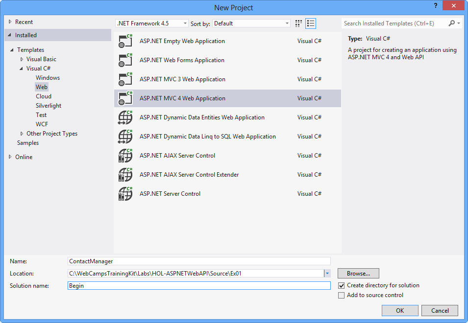

    *Creating a new ASP.NET MVC 4.0 Web Application Project*
3. In the ASP.NET MVC 4 project type dialog, select the **Web API** project type. Click **OK**.

    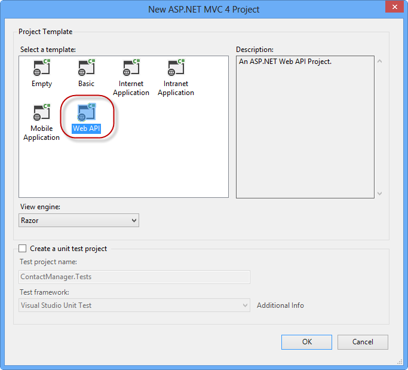

    *Specifying the Web API project type*

#### Task 2 - Creating the Contact Manager API Controllers

In this task, you will create the controller classes in which API methods will reside.

1. Delete the file named **ValuesController.cs** within **Controllers** folder from the project.
2. Right-click the **Controllers** folder in the project and select **Add | Controller** from the context menu.

    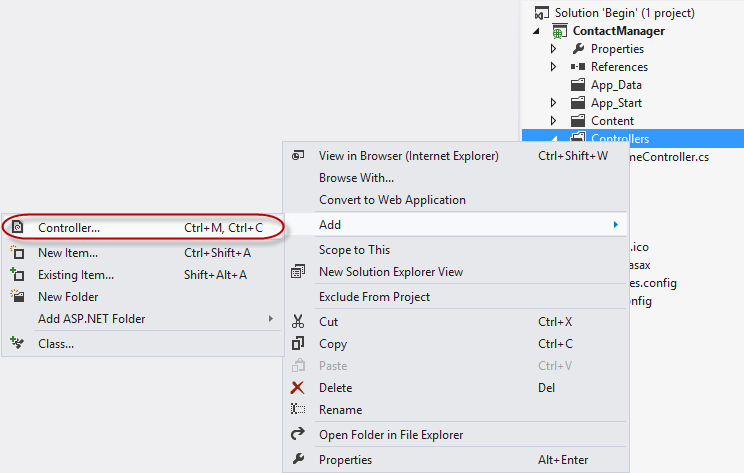

    *Adding a new controller to the project*
3. In the **Add Controller** dialog that appears, select **Empty API Controller** from the Template menu. Name the controller class **ContactController**. Then, click **Add.**

    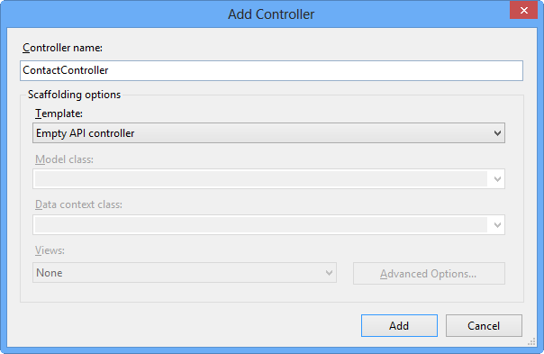

    *Using the Add Controller dialog to create a new Web API controller*
4. Add the following code to the **ContactController**.

    (Code Snippet - *Web API Lab - Ex01 - Get API Method*)

    [!code-csharp[Main](build-restful-apis-with-aspnet-web-api/samples/sample1.cs)]
5. Press **F5** to debug the application. The default home page for a Web API project should appear.

    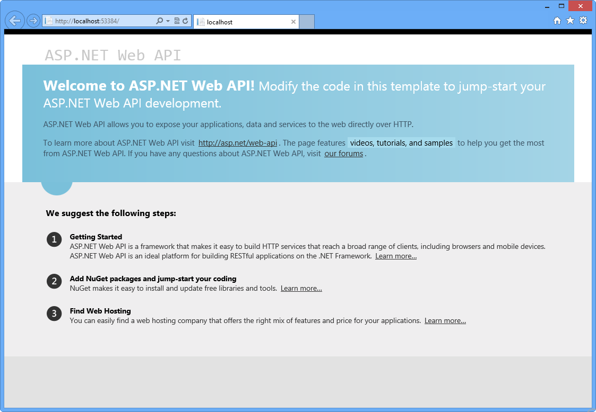

    *The default home page of an ASP.NET Web API application*
6. In the Internet Explorer window, press the **F12** key to open the **Developer Tools** window. Click the **Network** tab, and then click the **Start Capturing** button to begin capturing network traffic into the window.

    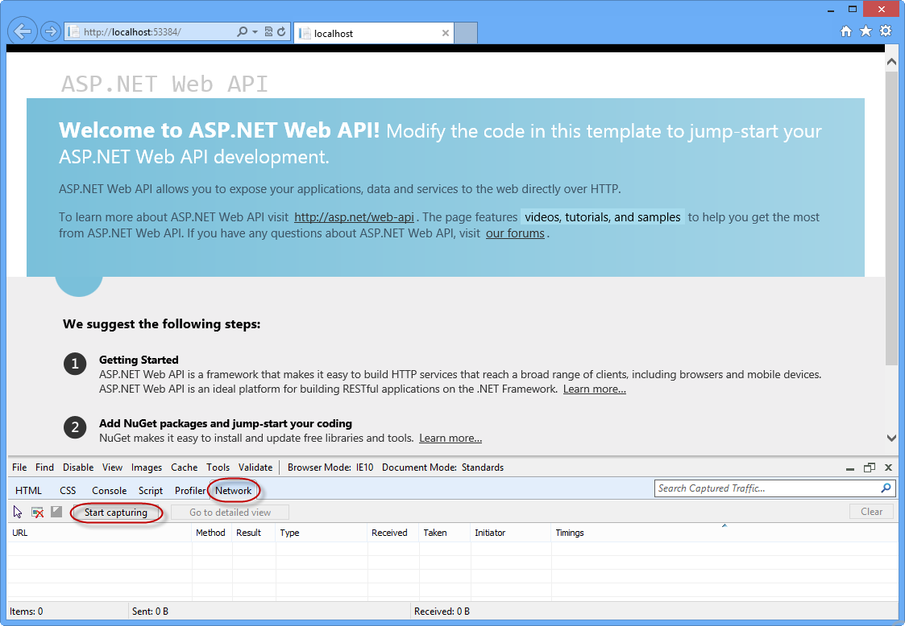

    *Opening the network tab and initiating network capture*
7. Append the URL in the browser's address bar with **/api/contact** and press enter. The transmission details will appear in the network capture window. Note that the response's MIME type is **application/json**. This demonstrates how the default output format is JSON.

    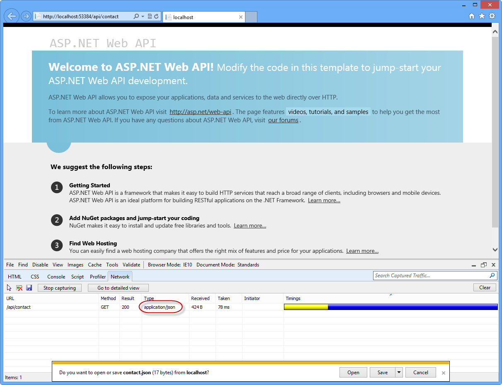

    *Viewing the output of the Web API request in the Network view*

    > [!NOTE]
    > Internet Explorer 10's default behavior at this point will be to ask if the user would like to save or open the stream resulting from the Web API call. The output will be a text file containing the JSON result of the Web API URL call. Do not cancel the dialog in order to be able to watch the response's content through Developers Tool window.
8. Click the **Go to detailed view** button to see more details about the response of this API call.

    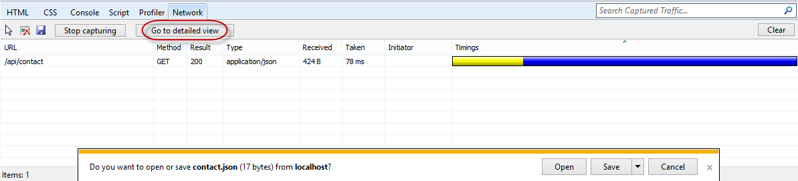

    *Switch to Detailed View*
9. Click the **Response body** tab to view the actual JSON response text.

    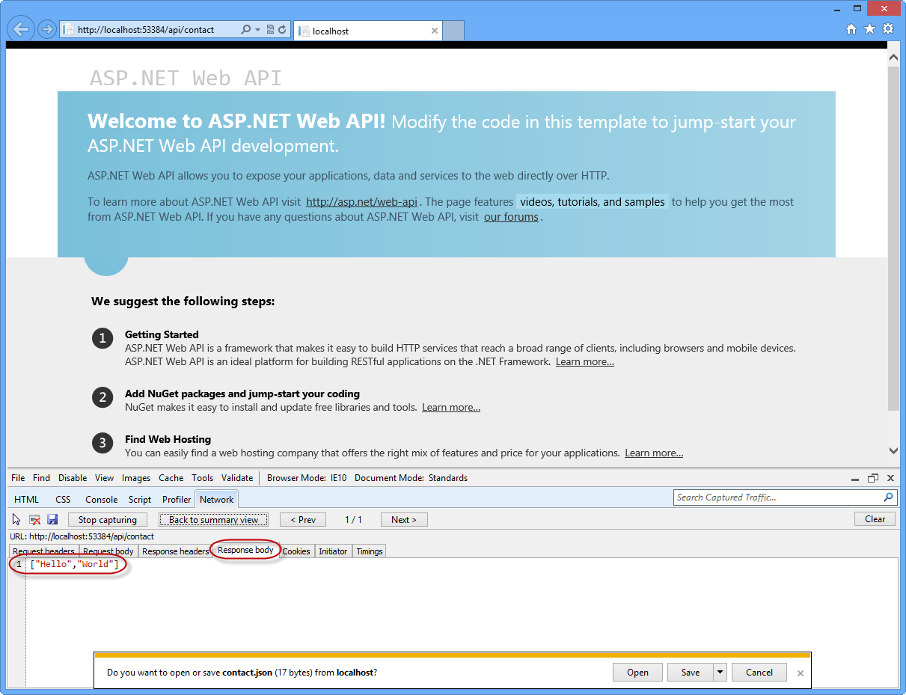

    *Viewing the JSON output text in the network monitor*

#### Task 3 - Creating the Contact Models and Augment the Contact Controller

In this task, you will create the controller classes in which API methods will reside.

1. Right-click the **Models** folder and select **Add | Class...** from the context menu.

    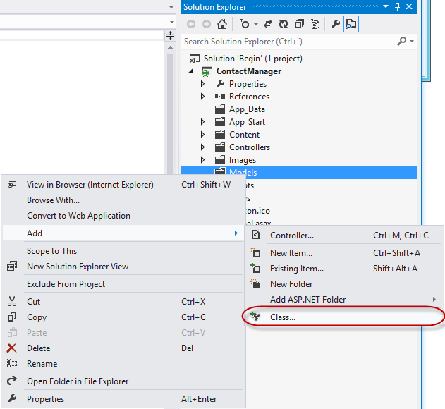

    *Adding a new model to the web application*
2. In the **Add New Item** dialog, name the new file **Contact.cs** and click **Add.**

    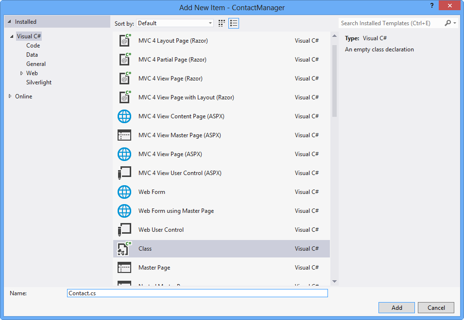

    *Creating the new Contact class file*
3. Add the following highlighted code to the **Contact** class.

    (Code Snippet - *Web API Lab - Ex01 - Contact Class*)

    [!code-csharp[Main](build-restful-apis-with-aspnet-web-api/samples/sample2.cs)]
4. In the **ContactController** class, select the word **string** in method definition of the **Get** method, and type the word *Contact*. Once the word is typed in, an indicator will appear at the beginning of the word **Contact**. Either hold down the **Ctrl** key and press the period (.) key or click the icon using your mouse to open up the assistance dialog in the code editor, to automatically fill in the **using** directive for the Models namespace.

    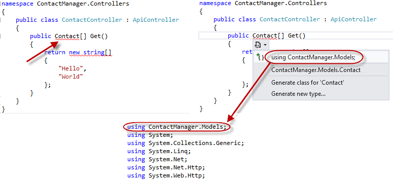

    *Using Intellisense assistance for namespace declarations*
5. Modify the code for the **Get** method so that it returns an array of Contact model instances.

    (Code Snippet - *Web API Lab - Ex01 - Returning a list of contacts*)

    [!code-csharp[Main](build-restful-apis-with-aspnet-web-api/samples/sample3.cs)]
6. Press **F5** to debug the web application in the browser. To view the changes made to the response output of the API, perform the following steps.

    1. Once the browser opens, press **F12** if the developer tools are not open yet.
    2. Click the **Network** tab.
    3. Press the **Start Capturing** button.
    4. Add the URL suffix **/api/contact** to the URL in the address bar and press the **Enter** key.
    5. Press the **Go to detailed view** button.
    6. Select the **Response body** tab. You should see a JSON string representing the serialized form of an array of Contact instances.

    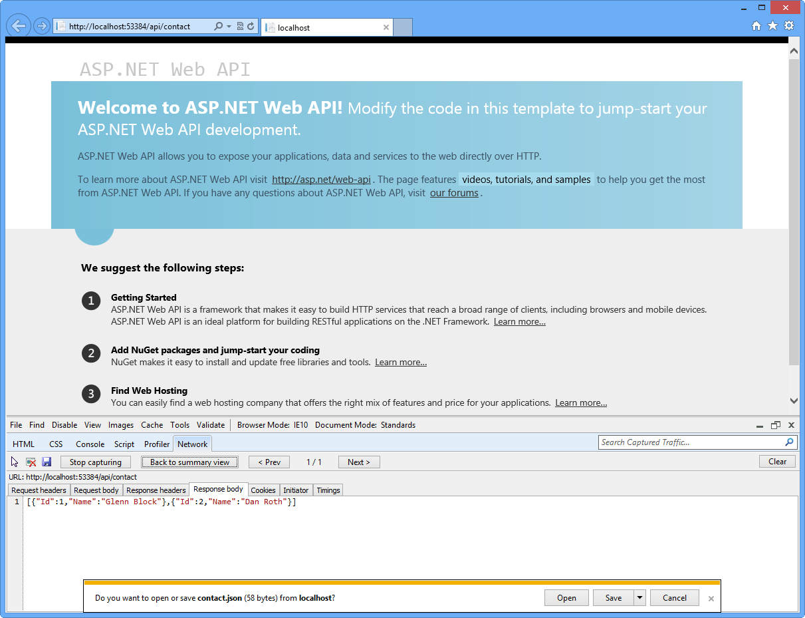

    *JSON serialized output of a complex Web API method call*

#### Task 4 - Extracting Functionality into a Service Layer

This task will demonstrate how to extract functionality into a Service layer to make it easy for developers to separate their service functionality from the controller layer, thereby allowing reusability of the services that actually do the work.

1. Create a new folder in the solution root and name it **Services**. To do this, right-click **ContactManager** project, select **Add** | **New Folder**, name it *Services*.

    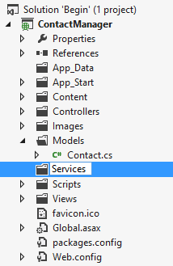

    *Creating Services folder*
2. Right-click the **Services** folder and select **Add | Class...** from the context menu.

    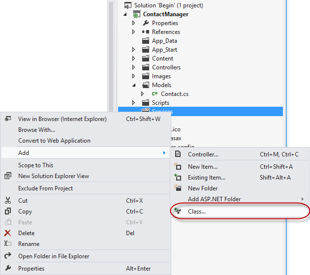

    *Adding a new class to the Services folder*
3. When the **Add New Item** dialog appears, name the new class **ContactRepository** and click **Add**.

    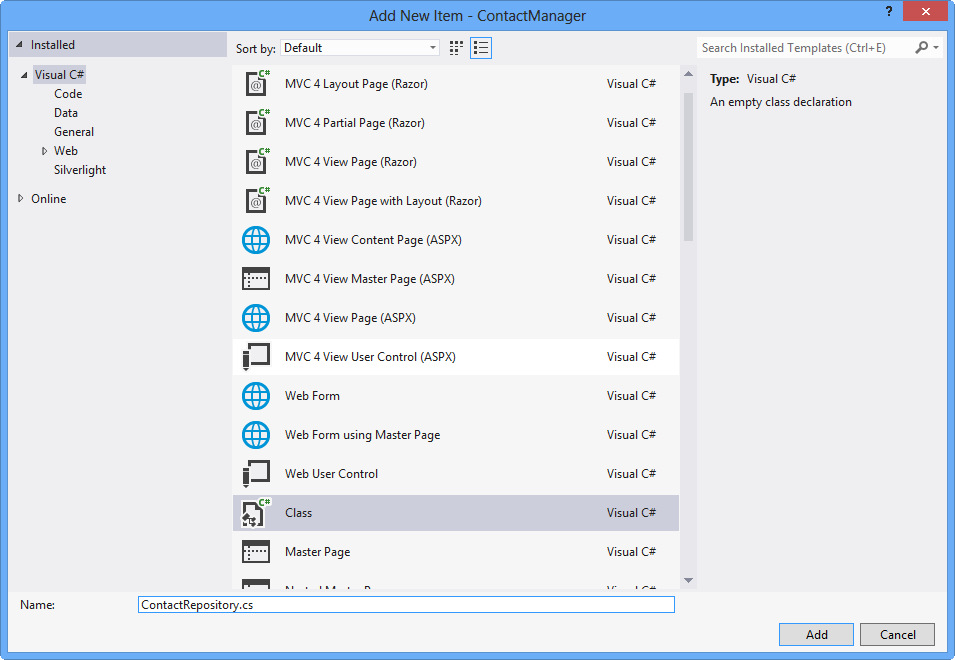

    *Creating a class file to contain the code for the Contact Repository service layer*
4. Add a using directive to the **ContactRepository.cs** file to include the models namespace.

    [!code-csharp[Main](build-restful-apis-with-aspnet-web-api/samples/sample4.cs)]
5. Add the following highlighted code to the **ContactRepository.cs** file to implement GetAllContacts method.

    (Code Snippet - *Web API Lab - Ex01 - Contact Repository*)

    [!code-csharp[Main](build-restful-apis-with-aspnet-web-api/samples/sample5.cs)]
6. Open the **ContactController.cs** file if it is not already open.
7. Add the following using statement to the namespace declaration section of the file.

    [!code-csharp[Main](build-restful-apis-with-aspnet-web-api/samples/sample6.cs)]
8. Add the following highlighted code to the **ContactController.cs** class to add a private field to represent the instance of the repository, so that the rest of the class members can make use of the service implementation.

    (Code Snippet - *Web API Lab - Ex01 - Contact Controller*)

    [!code-csharp[Main](build-restful-apis-with-aspnet-web-api/samples/sample7.cs)]
9. Change the **Get** method so that it makes use of the contact repository service.

    (Code Snippet - *Web API Lab - Ex01 - Returning a list of contacts via the repository*)

    [!code-csharp[Main](build-restful-apis-with-aspnet-web-api/samples/sample8.cs)]
10. Put a breakpoint on the **ContactController**'s **Get** method definition.

    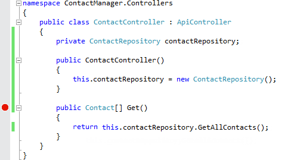

    *Adding breakpoints to the contact controller*
11. Press **F5** to run the application.
12. When the browser opens, press **F12** to open the developer tools.
13. Click the **Network** tab.
14. Click the **Start Capturing** button.
15. Append the URL in the address bar with the suffix **/api/contact** and press **Enter** to load the API controller.
16. Visual Studio 2012 should break once **Get** method begins execution.

    

    *Breaking within the Get method*
17. Press **F5** to continue.
18. Go back to Internet Explorer if it is not already in focus. Note the network capture window.

    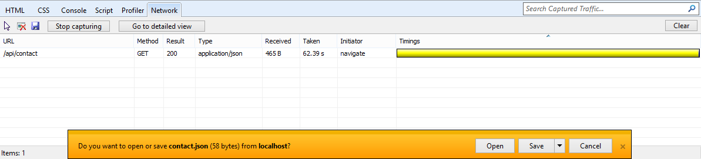

    *Network view in Internet Explorer showing results of the Web API call*
19. Click the **Go to detailed view** button.
20. Click the **Response body** tab. Note the JSON output of the API call, and how it represents the two contacts retrieved by the service layer.

    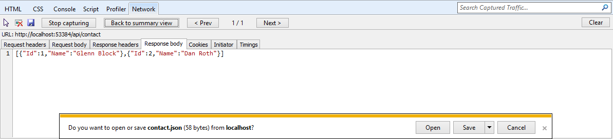

    *Viewing the JSON output from the Web API in the developer tools window*

### Exercise 2: Create a Read/Write Web API

In this exercise, you will implement POST and PUT methods for the contact manager to enable it with data-editing features.

#### Task 1 - Opening the Web API Project

In this task, you will prepare to enhance the Web API project created in Exercise 1 so that it can accept user input.

1. Run **Visual Studio 2012 Express for Web**, to do this go to **Start** and type **VS Express for Web** then press **Enter**.
2. Open the **Begin** solution located at **Source/Ex02-ReadWriteWebAPI/Begin/** folder. Otherwise, you might continue using the **End** solution obtained by completing the previous exercise.

    1. If you opened the provided **Begin** solution, you will need to download some missing NuGet packages before continue. To do this, click the **Project** menu and select **Manage NuGet Packages**.
    2. In the **Manage NuGet Packages** dialog, click **Restore** in order to download missing packages.
    3. Finally, build the solution by clicking **Build** | **Build Solution**.

    > [!NOTE]
    > One of the advantages of using NuGet is that you don't have to ship all the libraries in your project, reducing the project size. With NuGet Power Tools, by specifying the package versions in the Packages.config file, you will be able to download all the required libraries the first time you run the project. This is why you will have to run these steps after you open an existing solution from this lab.
3. Open the **Services/ContactRepository.cs** file.

#### Task 2 - Adding Data-Persistence Features to the Contact Repository Implementation

In this task, you will augment the ContactRepository class of the Web API project created in Exercise 1 so that it can persist and accept user input and new Contact instances.

1. Add the following constant to the **ContactRepository** class to represent the name of the web server cache item key name later in this exercise.

    [!code-csharp[Main](build-restful-apis-with-aspnet-web-api/samples/sample9.cs)]
2. Add a constructor to the **ContactRepository** containing the following code.

    (Code Snippet - *Web API Lab - Ex02 - Contact Repository Constructor*)

    [!code-csharp[Main](build-restful-apis-with-aspnet-web-api/samples/sample10.cs)]
3. Modify the code for the **GetAllContacts** method as demonstrated below.

    (Code Snippet - *Web API Lab - Ex02 - Get All Contacts*)

    [!code-csharp[Main](build-restful-apis-with-aspnet-web-api/samples/sample11.cs)]

    > [!NOTE]
    > This example is for demonstration purposes and will use the web server's cache as a storage medium, so that the values will be available to multiple clients simultaneously, rather than use a Session storage mechanism or a Request storage lifetime. One could use Entity Framework, XML storage, or any other variety in place of the web server cache.
4. Implement a new method named **SaveContact** to the **ContactRepository** class to do the work of saving a contact. The **SaveContact** method should take a single **Contact** parameter and return a Boolean value indicating success or failure.

    (Code Snippet - *Web API Lab - Ex02 - Implementing the SaveContact Method*)

    [!code-csharp[Main](build-restful-apis-with-aspnet-web-api/samples/sample12.cs)]

### Exercise 3: Consume the Web API from an HTML Client

In this exercise, you will create an HTML client to call the Web API. This client will facilitate data exchange with the Web API using JavaScript and will display the results in a web browser using HTML markup.

#### Task 1 - Modifying the Index View to Provide a GUI for Displaying Contacts

In this task, you will modify the default Index view of the web application to support the requirement of displaying the list of existing contacts in an HTML browser.

1. Open **Visual Studio 2012 Express for Web** if it is not already open.
2. Open the **Begin** solution located at **Source/Ex03-ConsumingWebAPI/Begin/** folder. Otherwise, you might continue using the **End** solution obtained by completing the previous exercise.

    1. If you opened the provided **Begin** solution, you will need to download some missing NuGet packages before continue. To do this, click the **Project** menu and select **Manage NuGet Packages**.
    2. In the **Manage NuGet Packages** dialog, click **Restore** in order to download missing packages.
    3. Finally, build the solution by clicking **Build** | **Build Solution**.

    > [!NOTE]
    > One of the advantages of using NuGet is that you don't have to ship all the libraries in your project, reducing the project size. With NuGet Power Tools, by specifying the package versions in the Packages.config file, you will be able to download all the required libraries the first time you run the project. This is why you will have to run these steps after you open an existing solution from this lab.
3. Open the **Index.cshtml** file located at **Views/Home** folder.
4. Replace the HTML code within the div element with id **body** so that it looks like the following code.

    [!code-html[Main](build-restful-apis-with-aspnet-web-api/samples/sample13.html)]
5. Add the following Javascript code at the bottom of the file to perform the HTTP request to the Web API.

    [!code-cshtml[Main](build-restful-apis-with-aspnet-web-api/samples/sample14.cshtml)]
6. Open the **ContactController.cs** file if it is not already open.
7. Place a breakpoint on the **Get** method of the **ContactController** class.

    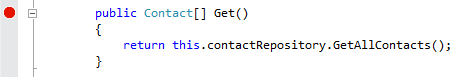

    *Placing a breakpoint on the Get method of the API controller*
8. Press **F5** to run the project. The browser will load the HTML document.

    > [!NOTE]
    > Ensure that you are browsing to the root URL of your application.
9. Once the page loads and the JavaScript executes, the breakpoint will be hit and the code execution will pause in the controller.

    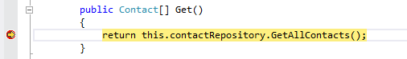

    *Debugging into the Web API call using Visual Studio 2012 Express for Web*
10. Remove the breakpoint and press **F5** or the debugging toolbar's **Continue** button to continue loading the view in the browser. Once the Web API call completes you should see the contacts returned from the Web API call displayed as list items in the browser.

    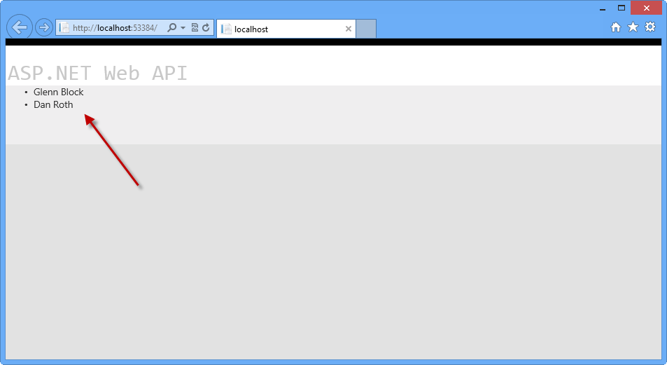

    *Results of the API call displayed in the browser as list items*
11. Stop debugging.

#### Task 2 - Modifying the Index View to Provide a GUI for Creating Contacts

In this task, you will continue to modify the Index view of the MVC application. A form will be added to the HTML page that will capture user input and send it to the Web API to create a new Contact, and a new Web API controller method will be created to collect date from the GUI.

1. Open the **ContactController.cs** file.
2. Add a new method to the controller class named **Post** as shown in the following code.

    (Code Snippet - *Web API Lab - Ex03 - Post Method*)

    [!code-csharp[Main](build-restful-apis-with-aspnet-web-api/samples/sample15.cs)]
3. Open the **Index.cshtml** file in Visual Studio if it is not already open.
4. Add the HTML code below to the file just after the unordered list you added in the previous task.

    [!code-html[Main](build-restful-apis-with-aspnet-web-api/samples/sample16.html)]
5. Within the script element at the bottom of the document, add the following highlighted code to handle button-click events, which will post the data to the Web API using an HTTP POST call.

    [!code-html[Main](build-restful-apis-with-aspnet-web-api/samples/sample17.html)]
6. In **ContactController.cs**, place a breakpoint on the **Post** method.
7. Press **F5** to run the application in the browser.
8. Once the page is loaded in the browser, type in a new contact name and Id and click the **Save** button.

    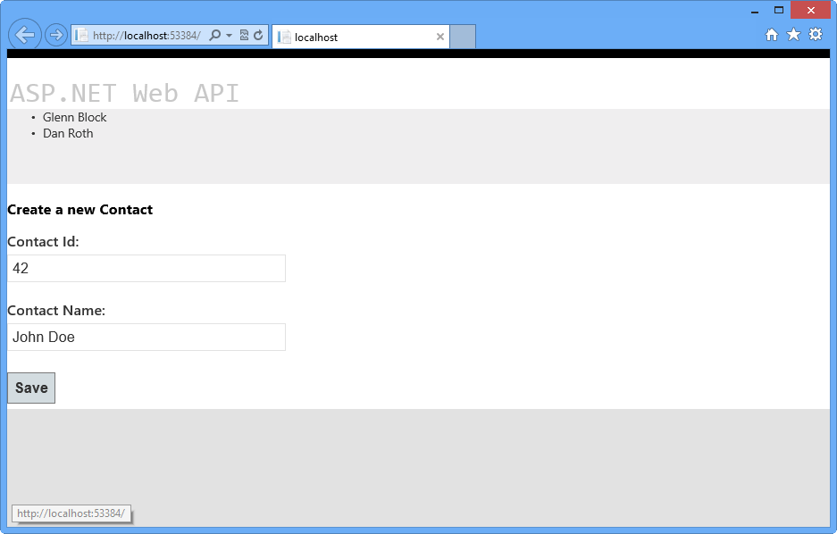

    *The client HTML document loaded in the browser*
9. When the debugger window breaks in the **Post** method, take a look at the properties of the **contact** parameter. The values should match the data you entered in the form.

    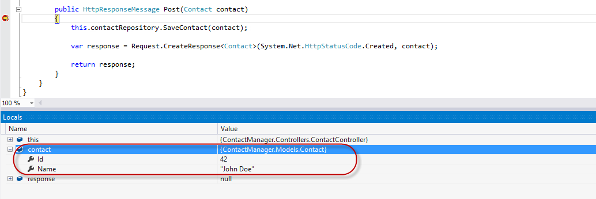

    *The Contact object being sent to the Web API from the client*
10. Step through the method in the debugger until the **response** variable has been created. Upon inspection in the **Locals** window in the debugger, you'll see that all the properties have been set.

    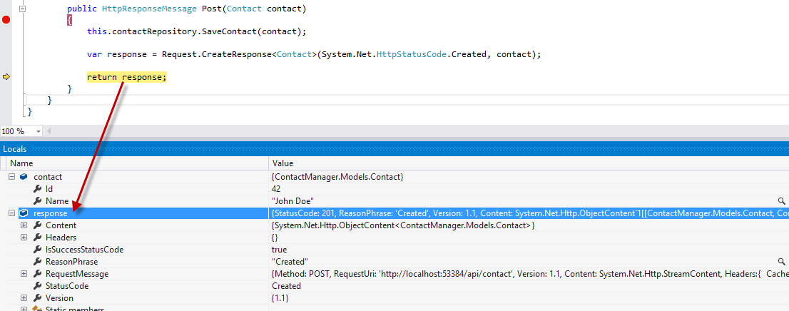

    *The response following creation in the debugger*
11. If you press **F5** or click **Continue** in the debugger the request will complete. Once you switch back to the browser, the new contact has been added to the list of contacts stored by the **ContactRepository** implementation.

    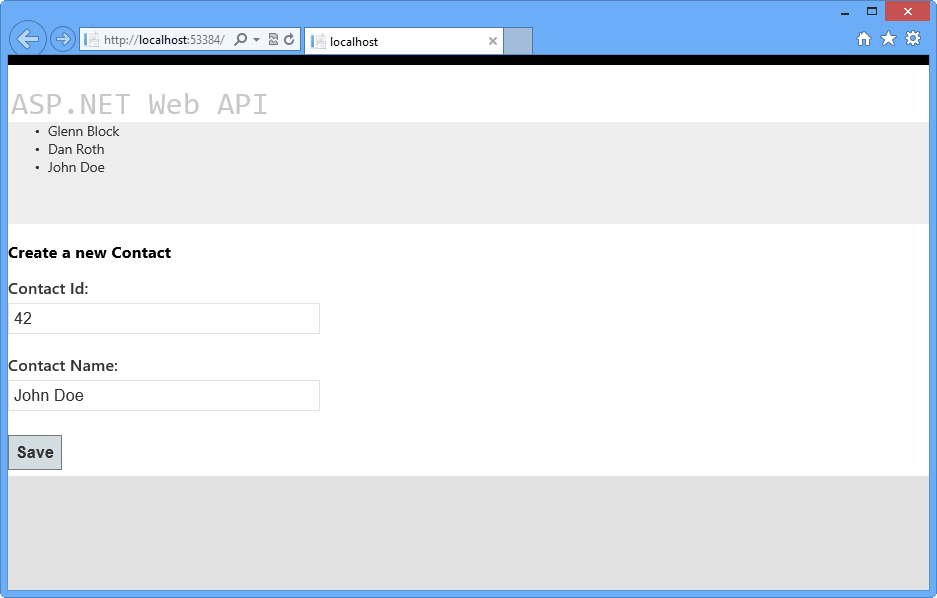

    *The browser reflects successful creation of the new contact instance*

> [!NOTE]
> Additionally, you can deploy this application to Azure following [Appendix C: Publishing an ASP.NET MVC 4 Application using Web Deploy](#AppendixC).

* * *

## Summary

This lab has introduced you to the new ASP.NET Web API framework and to the implementation of RESTful Web APIs using the framework. From here, you could create a new repository that facilitates data persistence using any number of mechanisms and wire that service up rather than the simple one provided as an example in this lab. Web API supports a number of additional features, such as enabling communication from non-HTML clients written in any language that supports HTTP and JSON or XML. The ability to host a Web API outside of a typical web application is also possible, as well as is the ability to create your own serialization formats.

The ASP.NET Web site has an area dedicated to the ASP.NET Web API framework at [[https://asp.net/web-api](https://asp.net/web-api)](https://asp.net/web-api). This site will continue to provide late-breaking information, samples, and news related to Web API, so check it frequently if you'd like to delve deeper into the art of creating custom Web APIs available to virtually any device or development framework.

## Appendix A: Using Code Snippets

With code snippets, you have all the code you need at your fingertips. The lab document will tell you exactly when you can use them, as shown in the following figure.

*Using Visual Studio code snippets to insert code into your project*

### To add a code snippet using the keyboard (C# only)

1. Place the cursor where you would like to insert the code.
2. Start typing the snippet name (without spaces or hyphens).
3. Watch as IntelliSense displays matching snippets' names.
4. Select the correct snippet (or keep typing until the entire snippet's name is selected).
5. Press the Tab key twice to insert the snippet at the cursor location.

    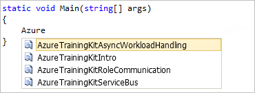

    *Start typing the snippet name*

    

    *Press Tab to select the highlighted snippet*

    

    *Press Tab again and the snippet will expand*

### To add a code snippet using the mouse (C#, Visual Basic and XML)

1. Right-click where you want to insert the code snippet.
2. Select **Insert Snippet** followed by **My Code Snippets**.
3. Pick the relevant snippet from the list, by clicking on it.

    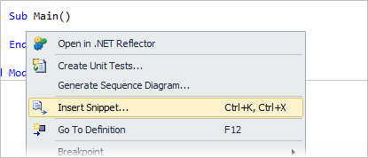

    *Right-click where you want to insert the code snippet and select Insert Snippet*

    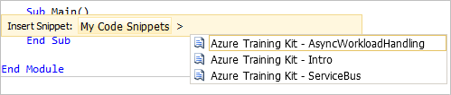

    *Pick the relevant snippet from the list, by clicking on it*

## Appendix B: Installing Visual Studio Express 2012 for Web

You can install **Microsoft Visual Studio Express 2012 for Web** or another &quot;Express&quot; version using the **[Microsoft Web Platform Installer](https://www.microsoft.com/web/downloads/platform.aspx)**. The following instructions guide you through the steps required to install *Visual studio Express 2012 for Web* using *Microsoft Web Platform Installer*.

1. Go to [[https://go.microsoft.com/?linkid=9810169](https://go.microsoft.com/?linkid=9810169)](https://go.microsoft.com/?linkid=9810169). Alternatively, if you already have installed Web Platform Installer, you can open it and search for the product &quot;*Visual Studio Express 2012 for Web with Azure SDK*&quot;.
2. Click on **Install Now**. If you do not have **Web Platform Installer** you will be redirected to download and install it first.
3. Once **Web Platform Installer** is open, click **Install** to start the setup.

    

    *Install Visual Studio Express*
4. Read all the products' licenses and terms and click **I Accept** to continue.

    

    *Accepting the license terms*
5. Wait until the downloading and installation process completes.

    

    *Installation progress*
6. When the installation completes, click **Finish**.

    

    *Installation completed*
7. Click **Exit** to close Web Platform Installer.
8. To open Visual Studio Express for Web, go to the **Start** screen and start writing &quot;**VS Express**&quot;, then click on the **VS Express for Web** tile.

    

    *VS Express for Web tile*

## Appendix C: Publishing an ASP.NET MVC 4 Application using Web Deploy

This appendix will show you how to create a new web site from the Azure Portal and publish the application you obtained by following the lab, taking advantage of the Web Deploy publishing feature provided by Azure.

#### Task 1 - Creating a New Web Site from the Azure Portal

1. Go to the [Azure Management Portal](https://manage.windowsazure.com/) and sign in using the Microsoft credentials associated with your subscription.

    > [!NOTE]
    > With Azure you can host 10 ASP.NET Web Sites for free and then scale as your traffic grows. You can sign up [here](http://aka.ms/aspnet-hol-azure).

    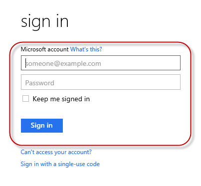

    *Log on to Portal*
2. Click **New** on the command bar.

    

    *Creating a new Web Site*
3. Click **Compute** | **Web Site**. Then select **Quick Create** option. Provide an available URL for the new web site and click **Create Web Site**.

    > [!NOTE]
    > Azure is the host for a web application running in the cloud that you can control and manage. The Quick Create option allows you to deploy a completed web application to the Azure from outside the portal. It does not include steps for setting up a database.

    

    *Creating a new Web Site using Quick Create*
4. Wait until the new **Web Site** is created.
5. Once the Web Site is created click the link under the **URL** column. Check that the new Web Site is working.

    

    *Browsing to the new web site*

    

    *Web site running*
6. Go back to the portal and click the name of the web site under the **Name** column to display the management pages.

    

    *Opening the Web Site management pages*
7. In the **Dashboard** page, under the **quick glance** section, click the **Download publish profile** link.

    > [!NOTE]
    > The *publish profile* contains all of the information required to publish a web application to a Azure for each enabled publication method. The publish profile contains the URLs, user credentials and database strings required to connect to and authenticate against each of the endpoints for which a publication method is enabled. **Microsoft WebMatrix 2**, **Microsoft Visual Studio Express for Web** and **Microsoft Visual Studio 2012** support reading publish profiles to automate configuration of these programs for publishing web applications to Azure.

    

    *Downloading the Web Site publish profile*
8. Download the publish profile file to a known location. Further in this exercise you will see how to use this file to publish a web application to Azure from Visual Studio.

    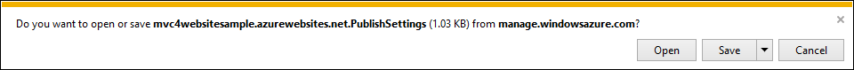

    *Saving the publish profile file*

#### Task 2 - Configuring the Database Server

If your application makes use of SQL Server databases you will need to create a SQL Database server. If you want to deploy a simple application that does not use SQL Server you might skip this task.

1. You will need a SQL Database server for storing the application database. You can view the SQL Database servers from your subscription in the Azure Management portal at **Sql Databases** | **Servers** | **Server's Dashboard**. If you do not have a server created, you can create one using the **Add** button on the command bar. Take note of the **server name and URL, administrator login name and password**, as you will use them in the next tasks. Do not create the database yet, as it will be created in a later stage.

    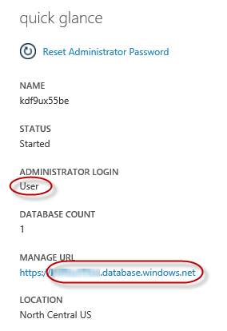

    *SQL Database Server Dashboard*
2. In the next task you will test the database connection from Visual Studio, for that reason you need to include your local IP address in the server's list of **Allowed IP Addresses**. To do that, click **Configure**, select the IP address from **Current Client IP Address** and paste it on the **Start IP Address** and **End IP Address** text boxes and click the  button.

    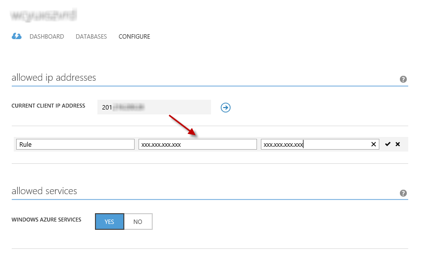

    *Adding Client IP Address*
3. Once the **Client IP Address** is added to the allowed IP addresses list, click on **Save** to confirm the changes.

    

    *Confirm Changes*

#### Task 3 - Publishing an ASP.NET MVC 4 Application using Web Deploy

1. Go back to the ASP.NET MVC 4 solution. In the **Solution Explorer**, right-click the web site project and select **Publish**.

    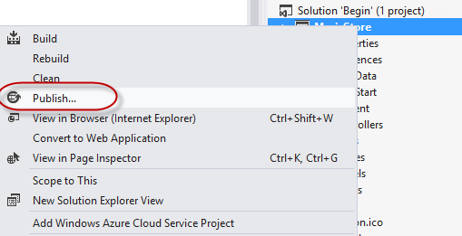

    *Publishing the web site*
2. Import the publish profile you saved in the first task.

    

    *Importing publish profile*
3. Click **Validate Connection**. Once Validation is complete click **Next**.

    > [!NOTE]
    > Validation is complete once you see a green checkmark appear next to the Validate Connection button.

    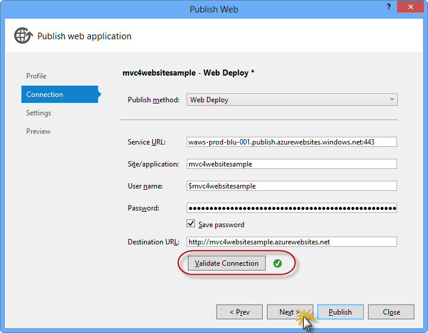

    *Validating connection*
4. In the **Settings** page, under the **Databases** section, click the button next to your database connection's textbox (i.e. **DefaultConnection**).

    

    *Web deploy configuration*
5. Configure the database connection as follows:

    - In the **Server name** type your SQL Database server URL using the *tcp:* prefix.
    - In **User name** type your server administrator login name.
    - In **Password** type your server administrator login password.
    - Type a new database name, for example: *MVC4SampleDB*.

    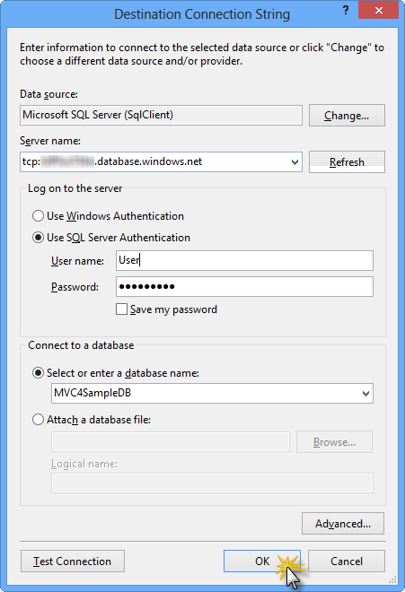

    *Configuring destination connection string*
6. Then click **OK**. When prompted to create the database click **Yes**.

    

    *Creating the database*
7. The connection string you will use to connect to SQL Database in Windows Azure is shown within Default Connection textbox. Then click **Next**.

    

    *Connection string pointing to SQL Database*
8. In the **Preview** page, click **Publish**.

    

    *Publishing the web application*
9. Once the publishing process finishes, your default browser will open the published web site.

    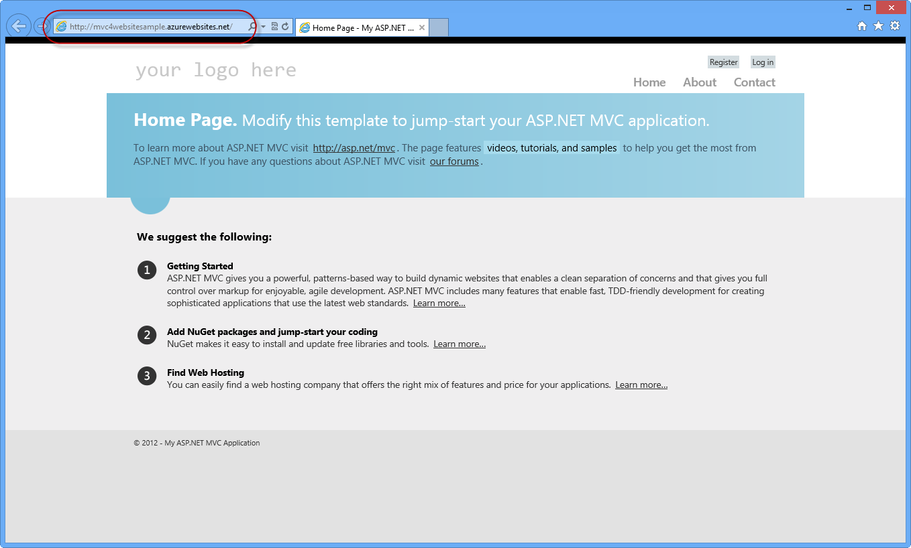

    *Application published to Azure*
