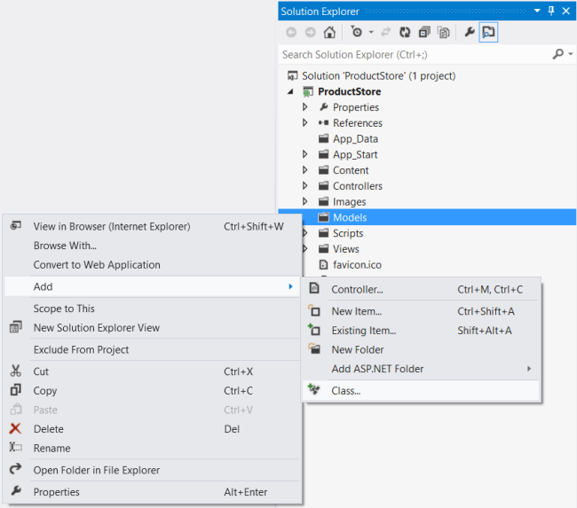
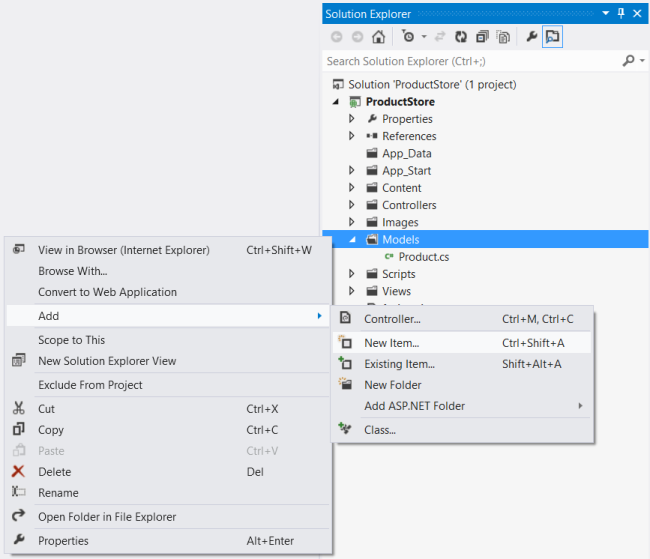
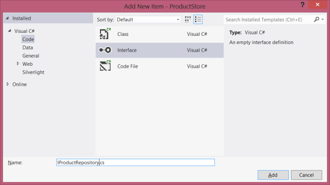
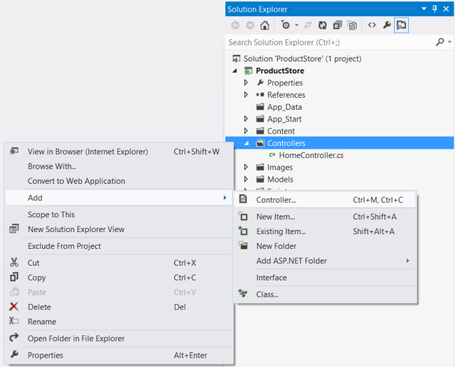
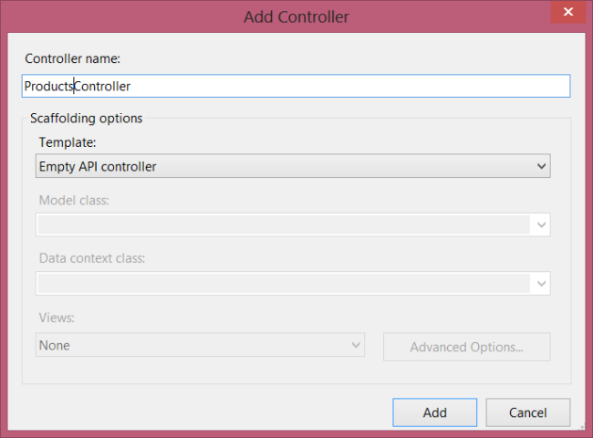

Enabling CRUD Operations in ASP.NET Web API 1
====================
by [Mike Wasson](https://github.com/MikeWasson)

[Download Completed Project](http://code.msdn.microsoft.com/ASP-NET-Web-API-Tutorial-c4761894)

> This tutorial shows how to support CRUD operations in an HTTP service using ASP.NET Web API.
> 
> ## Software versions used in the tutorial
> 
> 
> - Visual Studio 2012
> - Web API 1 (also works with Web API 2)

CRUD stands for &quot;Create, Read, Update, and Delete,&quot; which are the four basic database operations. Many HTTP services also model CRUD operations through REST or REST-like APIs.

In this tutorial, you will build a very simple web API to manage a list of products. Each product will contain a name, price, and category (such as &quot;toys&quot; or &quot;hardware&quot;), plus a product ID.

The products API will expose following methods.

| Action | HTTP method | Relative URI |
| --- | --- | --- |
| Get a list of all products | GET | /api/products |
| Get a product by ID | GET | /api/products/*id* |
| Get a product by category | GET | /api/products?category=*category* |
| Create a new product | POST | /api/products |
| Update a product | PUT | /api/products/*id* |
| Delete a product | DELETE | /api/products/*id* |

Notice that some of the URIs include the product ID in path. For example, to get the product whose ID is 28, the client sends a GET request for `http://hostname/api/products/28`.

### Resources

The products API defines URIs for two resource types:

| Resource | URI |
| --- | --- |
| The list of all the products. | /api/products |
| An individual product. | /api/products/*id* |

### Methods

The four main HTTP methods (GET, PUT, POST, and DELETE) can be mapped to CRUD operations as follows:

- GET retrieves the representation of the resource at a specified URI. GET should have no side effects on the server.
- PUT updates a resource at a specified URI. PUT can also be used to create a new resource at a specified URI, if the server allows clients to specify new URIs. For this tutorial, the API will not support creation through PUT.
- POST creates a new resource. The server assigns the URI for the new object and returns this URI as part of the response message.
- DELETE deletes a resource at a specified URI.

Note: The PUT method replaces the entire product entity. That is, the client is expected to send a complete representation of the updated product. If you want to support partial updates, the PATCH method is preferred. This tutorial does not implement PATCH.

## Create a New Web API Project

Start by running Visual Studio and select **New Project** from the **Start** page. Or, from the **File** menu, select **New** and then **Project**.

In the **Templates** pane, select **Installed Templates** and expand the **Visual C#** node. Under **Visual C#**, select **Web**. In the list of project templates, select **ASP.NET MVC 4 Web Application**. Name the project &quot;ProductStore&quot; and click **OK**.

In the **New ASP.NET MVC 4 Project** dialog, select **Web API** and click **OK**.

## Adding a Model

A *model* is an object that represents the data in your application. In ASP.NET Web API, you can use strongly typed CLR objects as models, and they will automatically be serialized to XML or JSON for the client.

For the ProductStore API, our data consists of products, so we'll create a new class named `Product`.

If Solution Explorer is not already visible, click the **View** menu and select **Solution Explorer**. In Solution Explorer, right-click the **Models** folder. From the context meny, select **Add**, then select **Class**. Name the class &quot;Product&quot;.

Add the following properties to the `Product` class.

[!code-csharp[Main](creating-a-web-api-that-supports-crud-operations/samples/sample1.cs)]

## Adding a Repository

We need to store a collection of products. It's a good idea to separate the collection from our service implementation. That way, we can change the backing store without rewriting the service class. This type of design is called the *repository* pattern. Start by defining a generic interface for the repository.

In Solution Explorer, right-click the **Models** folder. Select **Add**, then select **New Item**.

In the **Templates** pane, select **Installed Templates** and expand the C# node. Under C#, select **Code**. In the list of code templates, select **Interface**. Name the interface &quot;IProductRepository&quot;.

Add the following implementation:

[!code-csharp[Main](creating-a-web-api-that-supports-crud-operations/samples/sample2.cs)]

Now add another class to the Models folder, named &quot;ProductRepository.&quot; This class will implement the `IProductRespository` interface. Add the following implementation:

[!code-csharp[Main](creating-a-web-api-that-supports-crud-operations/samples/sample3.cs)]

The repository keeps the list in local memory. This is OK for a tutorial, but in a real application, you would store the data externally, either a database or in cloud storage. The repository pattern will make it easier to change the implementation later.

## Adding a Web API Controller

If you have worked with ASP.NET MVC, then you are already familiar with controllers. In ASP.NET Web API, a *controller* is a class that handles HTTP requests from the client. The New Project wizard created two controllers for you when it created the project. To see them, expand the Controllers folder in Solution Explorer.

- HomeController is a traditional ASP.NET MVC controller. It is responsible for serving HTML pages for the site, and is not directly related to our web API.
- ValuesController is an example WebAPI controller.

Go ahead and delete ValuesController, by right-clicking the file in Solution Explorer and selecting **Delete.** Now add a new controller, as follows:

In **Solution Explorer**, right-click the the Controllers folder. Select **Add** and then select **Controller**.

In the **Add Controller** wizard, name the controller &quot;ProductsController&quot;. In the **Template** drop-down list, select **Empty API Controller**. Then click **Add**.

> [!NOTE]
> It is not necessary to put your contollers into a folder named Controllers. The folder name is not important; it is simply a convenient way to organize your source files.

The **Add Controller** wizard will create a file named ProductsController.cs in the Controllers folder. If this file is not open already, double-click the file to open it. Add the following **using** statement:

[!code-csharp[Main](creating-a-web-api-that-supports-crud-operations/samples/sample4.cs)]

Add a field that holds an **IProductRepository** instance.

[!code-csharp[Main](creating-a-web-api-that-supports-crud-operations/samples/sample5.cs)]

> [!NOTE]
> Calling `new ProductRepository()` in the controller is not the best design, because it ties the controller to a particular implementation of `IProductRepository`. For a better approach, see [Using the Web API Dependency Resolver](../advanced/dependency-injection.md).

## Getting a Resource

The ProductStore API will expose several &quot;read&quot; actions as HTTP GET methods. Each action will correspond to a method in the `ProductsController` class.

| Action | HTTP method | Relative URI |
| --- | --- | --- |
| Get a list of all products | GET | /api/products |
| Get a product by ID | GET | /api/products/*id* |
| Get a product by category | GET | /api/products?category=*category* |

To get the list of all products, add this method to the `ProductsController` class:

[!code-csharp[Main](creating-a-web-api-that-supports-crud-operations/samples/sample6.cs)]

The method name starts with &quot;Get&quot;, so by convention it maps to GET requests. Also, because the method has no parameters, it maps to a URI that does not contain an *&quot;id&quot;* segment in the path.

To get a product by ID, add this method to the `ProductsController` class:

[!code-csharp[Main](creating-a-web-api-that-supports-crud-operations/samples/sample7.cs)]

This method name also starts with &quot;Get&quot;, but the method has a parameter named *id*. This parameter is mapped to the &quot;id&quot; segment of the URI path. The ASP.NET Web API framework automatically converts the ID to the correct data type (**int**) for the parameter.

The GetProduct method throws an exception of type **HttpResponseException** if *id* is not valid. This exception will be translated by the framework into a 404 (Not Found) error.

Finally, add a method to find products by category:

[!code-csharp[Main](creating-a-web-api-that-supports-crud-operations/samples/sample8.cs)]

If the request URI has a query string, Web API tries to match the query parameters to parameters on the controller method. Therefore, a URI of the form "api/products?category=*category*" will map to this method.

## Creating a Resource

Next, we'll add a method to the `ProductsController` class to create a new product. Here is a simple implementation of the method:

[!code-csharp[Main](creating-a-web-api-that-supports-crud-operations/samples/sample9.cs)]

Note two things about this method:

- The method name starts with &quot;Post...&quot;. To create a new product, the client sends an HTTP POST request.
- The method takes a parameter of type Product. In Web API, parameters with complex types are deserialized from the request body. Therefore, we expect the client to send a serialized representation of a product object, in either XML or JSON format.

This implementation will work, but it is not quite complete. Ideally, we would like the HTTP response to include the following:

- **Response code:** By default, the Web API framework sets the response status code to 200 (OK). But according to the HTTP/1.1 protocol, when a POST request results in the creation of a resource, the server should reply with status 201 (Created).
- **Location:** When the server creates a resource, it should include the URI of the new resource in the Location header of the response.

ASP.NET Web API makes it easy to manipulate the HTTP response message. Here is the improved implementation:

[!code-csharp[Main](creating-a-web-api-that-supports-crud-operations/samples/sample10.cs)]

Notice that the method return type is now **HttpResponseMessage**. By returning an **HttpResponseMessage** instead of a Product, we can control the details of the HTTP response message, including the status code and the Location header.

The **CreateResponse** method creates an **HttpResponseMessage** and automatically writes a serialized representation of the Product object into the body fo the response message.

> [!NOTE]
> This example does not validate the `Product`. For information about model validation, see [Model Validation in ASP.NET Web API](../formats-and-model-binding/model-validation-in-aspnet-web-api.md).

## Updating a Resource

Updating a product with PUT is straightforward:

[!code-csharp[Main](creating-a-web-api-that-supports-crud-operations/samples/sample11.cs)]

The method name starts with &quot;Put...&quot;, so Web API matches it to PUT requests. The method takes two parameters, the product ID and the updated product. The *id* parameter is taken from the URI path, and the *product* parameter is deserialized from the request body. By default, the ASP.NET Web API framework takes simple parameter types from the route and complex types from the request body.

## Deleting a Resource

To delete a resourse, define a "Delete..." method.

[!code-csharp[Main](creating-a-web-api-that-supports-crud-operations/samples/sample12.cs)]

If a DELETE request succeeds, it can return status 200 (OK) with an entity-body that describes the status; status 202 (Accepted) if the deletion is still pending; or status 204 (No Content) with no entity body. In this case, the `DeleteProduct` method has a `void` return type, so ASP.NET Web API automatically translates this into status code 204 (No Content).