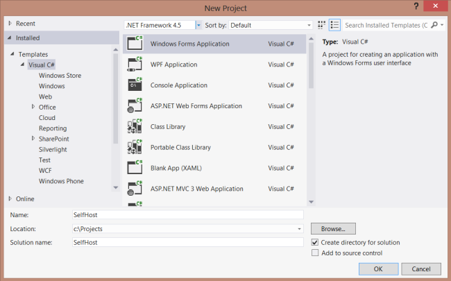
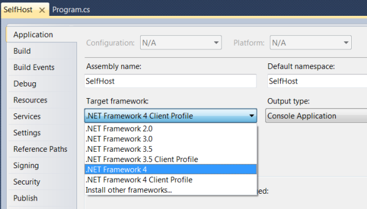
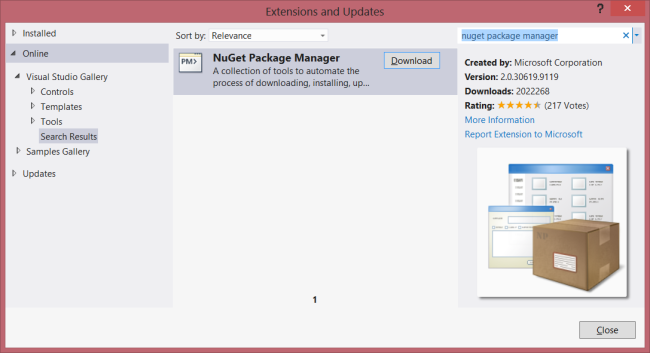
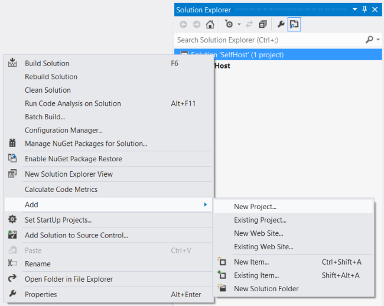
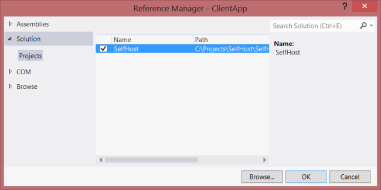
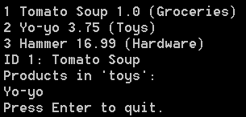

[Edit .md file](C:\Projects\msc\dev\Msc.Www\Web.ASP\App_Data\github\web-api\overview\older-versions\self-host-a-web-api.md) | [Edit dev content](http://www.aspdev.net/umbraco#/content/content/edit/36889) | [View dev content](http://docs.aspdev.net/tutorials/web-api/overview/older-versions/self-host-a-web-api.html) | [View prod content](http://www.asp.net/web-api/overview/older-versions/self-host-a-web-api) | Picker: 36893

Self-Host ASP.NET Web API 1 (C#)
====================
by [Mike Wasson](https://github.com/MikeWasson)

> ASP.NET Web API does not require IIS. You can self-host a web API in your own host process. This tutorial shows how to host a web API inside a console application.
> 
> **New applications should use OWIN to self-host Web API.** See [Use OWIN to Self-Host ASP.NET Web API 2](../hosting-aspnet-web-api/use-owin-to-self-host-web-api.md).
> 
> ## Software versions used in the tutorial
> 
> 
> - Web API 1
> - Visual Studio 2012

## Create the Console Application Project

Start Visual Studio and select **New Project** from the **Start** page. Or, from the **File** menu, select **New** and then **Project**.

In the **Templates** pane, select **Installed Templates** and expand the **Visual C#** node. Under **Visual C#**, select **Windows**. In the list of project templates, select **Console Application**. Name the project &quot;SelfHost&quot; and click **OK**.

## Set the Target Framework (Visual Studio 2010)

If you are using Visual Studio 2010, change the target framework to .NET Framework 4.0. (By default, the project template targets the [.Net Framework Client Profile](https://msdn.microsoft.com/en-us/library/cc656912.aspx#features_not_included_in_the_net_framework_client_profile).)

In Solution Explorer, right-click the project and select **Properties**. In the **Target framework** dropdown list, change the target framework to .NET Framework 4.0. When prompted to apply the change, click **Yes**.

## Install NuGet Package Manager

The NuGet Package Manager is the easiest way to add the Web API assemblies to a non-ASP.NET project.

To check if NuGet Package Manager is installed, click the **Tools** menu in Visual Studio. If you see a menu item called **Library Package Manager**, then you have NuGet Package Manager.

To install NuGet Package Manager:

1. Start Visual Studio.
2. From the **Tools** menu, select **Extensions and Updates**.
3. In the **Extensions and Updates** dialog, select **Online**.
4. If you don't see "NuGet Package Manager", type "nuget package manager" in the search box.
5. Select the NuGet Package Manager and click **Download**.
6. After the download completes, you will be prompted to install.
7. After the installation completes, you might be prompted to restart Visual Studio.

## Add the Web API NuGet Package

After NuGet Package Manager is installed, add the Web API Self-Host package to your project.

1. From the **Tools** menu, select **Library Package Manager**. *Note*: If do you not see this menu item, make sure that NuGet Package Manager installed correctly.
2. Select **Manage NuGet Packages for Solution...**
3. In the **Manage NugGet Packages** dialog, select **Online**.
4. In the search box, type &quot;Microsoft.AspNet.WebApi.SelfHost&quot;.
5. Select the ASP.NET Web API Self Host package and click **Install**.
6. After the package installs, click **Close** to close the dialog.

> [!NOTE] Make sure to install the package named Microsoft.AspNet.WebApi.SelfHost, not AspNetWebApi.SelfHost.

## Create the Model and Controller

This tutorial uses the same model and controller classes as the [Getting Started](../getting-started-with-aspnet-web-api/tutorial-your-first-web-api.md) tutorial.

Add a public class named `Product`.

    namespace SelfHost
    {
        public class Product
        {
            public int Id { get; set; }
            public string Name { get; set; }
            public string Category { get; set; }
            public decimal Price { get; set; }
        }
    }

Add a public class named `ProductsController`. Derive this class from **System.Web.Http.ApiController**.

    namespace SelfHost
    {
        using System;
        using System.Collections.Generic;
        using System.Linq;
        using System.Net;
        using System.Web.Http;
        
        public class ProductsController : ApiController
        {
            Product[] products = new Product[]  
            {  
                new Product { Id = 1, Name = "Tomato Soup", Category = "Groceries", Price = 1 },  
                new Product { Id = 2, Name = "Yo-yo", Category = "Toys", Price = 3.75M },  
                new Product { Id = 3, Name = "Hammer", Category = "Hardware", Price = 16.99M }  
            };
    
            public IEnumerable<Product> GetAllProducts()
            {
                return products;
            }
    
            public Product GetProductById(int id)
            {
                var product = products.FirstOrDefault((p) => p.Id == id);
                if (product == null)
                {
                    throw new HttpResponseException(HttpStatusCode.NotFound);
                }
                return product;
            }
    
            public IEnumerable<Product> GetProductsByCategory(string category)
            {
                return products.Where(p => string.Equals(p.Category, category,
                        StringComparison.OrdinalIgnoreCase));
            }
        }
    }

For more information about the code in this controller, see the [Getting Started](../getting-started-with-aspnet-web-api/tutorial-your-first-web-api.md) tutorial. This controller defines three GET actions:

| URI | Description |
| --- | --- |
| /api/products | Get a list of all products. |
| /api/products/*id* | Get a product by ID. |
| /api/products/?category=*category* | Get a list of products by category. |

## Host the Web API

Open the file Program.cs and add the following using statements:

    using System.Web.Http;
    using System.Web.Http.SelfHost;

Add the following code to the **Program** class.

    var config = new HttpSelfHostConfiguration("http://localhost:8080");
    
    config.Routes.MapHttpRoute(
        "API Default", "api/{controller}/{id}", 
        new { id = RouteParameter.Optional });
    
    using (HttpSelfHostServer server = new HttpSelfHostServer(config))
    {
        server.OpenAsync().Wait();
        Console.WriteLine("Press Enter to quit.");
        Console.ReadLine();
    }

## (Optional) Add an HTTP URL Namespace Reservation

This application listens to `http://localhost:8080/`. By default, listening at a particular HTTP address requires administrator privileges. When you run the tutorial, therefore, you may get this error: "HTTP could not register URL http://+:8080/" There are two ways to avoid this error:

- Run Visual Studio with elevated administrator permissions, or
- Use Netsh.exe to give your account permissions to reserve the URL.

To use Netsh.exe, open a command prompt with administrator privileges and enter the following command:following command:

    netsh http add urlacl url=http://+:8080/ user=machine\username

where *machine\username* is your user account.

When you are finished self-hosting, be sure to delete the reservation:

    netsh http delete urlacl url=http://+:8080/

## Call the Web API from a Client Application (C#)

Let's write a simple console application that calls the web API.

Add a new console application project to the solution:

- In Solution Explorer, right-click the solution and select **Add New Project**.
- Create a new console application named &quot;ClientApp&quot;.

Use NuGet Package Manager to add the ASP.NET Web API Core Libraries package:

- From the Tools menu, select **Library Package Manager**.
- Select **Manage NuGet Packages for Solution...**
- In the **Manage NuGet Packages** dialog, select **Online**.
- In the search box, type &quot;Microsoft.AspNet.WebApi.Client&quot;.
- Select the Microsoft ASP.NET Web API Client Libraries package and click **Install**.

Add a reference in ClientApp to the SelfHost project:

- In Solution Explorer, right-click the ClientApp project.
- Select **Add Reference**.
- In the **Reference Manager** dialog, under **Solution**, select **Projects**.
- Select the SelfHost project.
- Click **OK**.

Open the Client/Program.cs file. Add the following **using** statement:

    using System.Net.Http;

Add a static **HttpClient** instance:

    namespace Client
    {
        class Program
        {
            static HttpClient client = new HttpClient();
        }
    }

Add the following methods to list all products, list a product by ID, and list products by category.

    static void ListAllProducts()
    {
        HttpResponseMessage resp = client.GetAsync("api/products").Result;
        resp.EnsureSuccessStatusCode();
    
        var products = resp.Content.ReadAsAsync<IEnumerable<SelfHost.Product>>().Result;
        foreach (var p in products)
        {
            Console.WriteLine("{0} {1} {2} ({3})", p.Id, p.Name, p.Price, p.Category);
        }
    }
    
    static void ListProduct(int id)
    {
        var resp = client.GetAsync(string.Format("api/products/{0}", id)).Result;
        resp.EnsureSuccessStatusCode();
    
        var product = resp.Content.ReadAsAsync<SelfHost.Product>().Result;
        Console.WriteLine("ID {0}: {1}", id, product.Name);
    }
    
    static void ListProducts(string category)
    {
        Console.WriteLine("Products in '{0}':", category);
    
        string query = string.Format("api/products?category={0}", category);
    
        var resp = client.GetAsync(query).Result;
        resp.EnsureSuccessStatusCode();
    
        var products = resp.Content.ReadAsAsync<IEnumerable<SelfHost.Product>>().Result;
        foreach (var product in products)
        {
            Console.WriteLine(product.Name);
        }
    }

Each of these methods follows the same pattern:

1. Call **HttpClient.GetAsync** to send a GET request to the appropriate URI.
2. Call **HttpResponseMessage.EnsureSuccessStatusCode**. This method throws an exception if the HTTP response status is an error code.
3. Call **ReadAsAsync&lt;T&gt;** to deserialize a CLR type from the HTTP response. This method is an extension method, defined in **System.Net.Http.HttpContentExtensions**.

The **GetAsync** and **ReadAsAsync** methods are both asynchronous. They return **Task** objects that represent the asynchronous operation. Getting the **Result** property blocks the thread until the operation completes.

For more information about using HttpClient, including how to make non-blocking calls, see [Calling a Web API From a .NET Client](../advanced/calling-a-web-api-from-a-net-client.md).

Before calling these methods, set the BaseAddress property on the HttpClient instance to "`http://localhost:8080`". For example:

    static void Main(string[] args)
    {
        client.BaseAddress = new Uri("http://localhost:8080");
    
        ListAllProducts();
        ListProduct(1);
        ListProducts("toys");
    
        Console.WriteLine("Press Enter to quit.");
        Console.ReadLine();
    }

This should output the following. (Remember to run the SelfHost application first.)

    1 Tomato Soup 1.0 (Groceries)
    2 Yo-yo 3.75 (Toys)
    3 Hammer 16.99 (Hardware)
    ID 1: Tomato Soup
    Products in 'toys':
    Yo-yo
    Press Enter to quit.

