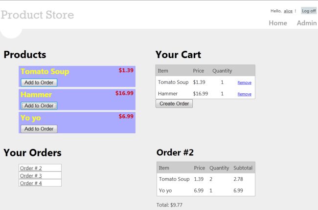
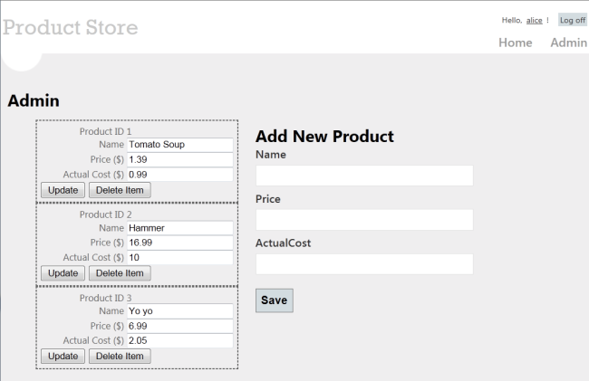
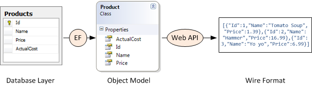
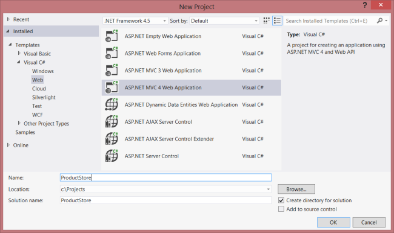
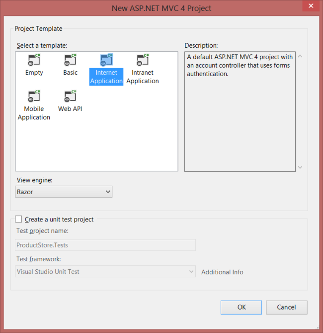

Part 1: Overview and Creating the Project
====================
by [Mike Wasson](https://github.com/MikeWasson)

[Download Completed Project](http://code.msdn.microsoft.com/ASP-NET-Web-API-with-afa30545)

Entity Framework is an object/relational mapping framework. It maps the domain objects in your code to entities in a relational database. For the most part, you do not have to worry about the database layer, because Entity Framework takes care of it for you. Your code manipulates the objects, and changes are persisted to a database.

## About the Tutorial

In this tutorial, you will create a simple store application. There are two main parts to the application. Normal users can view products and create orders:

Administrators can create, delete, or edit products:

## Skills You'll Learn

Here's what you'll learn:

- How to use Entity Framework with ASP.NET Web API.
- How to use knockout.js to create a dynamic client UI.
- How to use forms authentication with Web API to authenticate users.

Although this tutorial is self-contained, you might want to read the following tutorials first:

- [Your First ASP.NET Web API](../../getting-started-with-aspnet-web-api/tutorial-your-first-web-api.md)
- [Creating a Web API that Supports CRUD Operations](../creating-a-web-api-that-supports-crud-operations.md)

Some knowledge of [ASP.NET MVC](../../../../mvc/index.md) is also helpful.

## Overview

At a high level, here is the architecture of the application:

- ASP.NET MVC generates the HTML pages for the client.
- ASP.NET Web API exposes CRUD operations on the data (products and orders).
- Entity Framework translates the C# models used by Web API into database entities.

The following diagram shows how the domain objects are represented at various layers of the application: The database layer, the object model, and finally the wire format, which is used to transmit data to the client via HTTP.

## Create the Visual Studio Project

You can create the tutorial project using either Visual Web Developer Express or the full version of Visual Studio.

From the **Start** page, click **New Project**.

In the **Templates** pane, select **Installed Templates** and expand the **Visual C#** node. Under **Visual C#**, select **Web**. In the list of project templates, select **ASP.NET MVC 4 Web Application**. Name the project "ProductStore" and click **OK**.

In the **New ASP.NET MVC 4 Project** dialog, select **Internet Application** and click **OK**.

The "Internet Application" template creates an ASP.NET MVC application that supports forms authentication. If you run the application now, it already has some features:

- New users can register by clicking the "Register" link in the upper right corner.
- Registered users can log in by clicking the "Log in" link.

Membership information is persisted in a database that gets created automatically. For more information about forms authentication in ASP.NET MVC, see [Walkthrough: Using Forms Authentication in ASP.NET MVC](https://msdn.microsoft.com/en-us/library/ff398049(VS.98).aspx).

## Update the CSS File

This step is cosmetic, but it will make the pages render like the earlier screen shots.

In Solution Explorer, expand the Content folder and open the file named Site.css. Add the following CSS styles:

[!code-css[Main](using-web-api-with-entity-framework-part-1/samples/sample1.css)]

>[!div class="step-by-step"]
[Next](using-web-api-with-entity-framework-part-2.md)