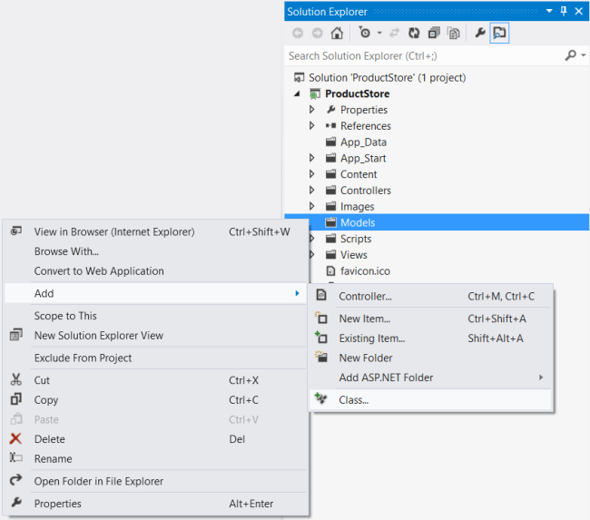
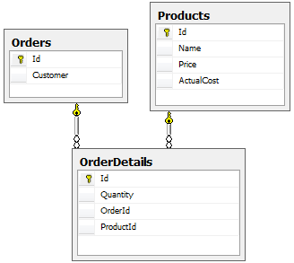

Part 2: Creating the Domain Models
====================
by [Mike Wasson](https://github.com/MikeWasson)

[Download Completed Project](http://code.msdn.microsoft.com/ASP-NET-Web-API-with-afa30545)

## Add Models

There are three ways to approach Entity Framework:

- Database-first: You start with a database, and Entity Framework generates the code.
- Model-first: You start with a visual model, and Entity Framework generates both the database and code.
- Code-first: You start with code, and Entity Framework generates the database.

We are using the code-first approach, so we start by defining our domain objects as POCOs (plain-old CLR objects). With the code-first approach, domain objects don't need any extra code to support the database layer, such as transactions or persistence. (Specifically, they do not need to inherit from the [EntityObject](https://msdn.microsoft.com/en-us/library/system.data.objects.dataclasses.entityobject.aspx) class.) You can still use data annotations to control how Entity Framework creates the database schema.

Because POCOs do not carry any extra properties that describe [database state](https://msdn.microsoft.com/en-us/library/system.data.entitystate.aspx), they can easily be serialized to JSON or XML. However, that does not mean you should always expose your Entity Framework models directly to clients, as we'll see later in the tutorial.

We will create the following POCOs:

- Product
- Order
- OrderDetail

To create each class, right-click the Models folder in Solution Explorer. From the context menu, select **Add** and then select **Class.**

Add a `Product` class with the following implementation:

[!code-csharp[Main](using-web-api-with-entity-framework-part-2/samples/sample1.cs)]

By convention, Entity Framework uses the `Id` property as the primary key and maps it to an identity column in the database table. When you create a new `Product` instance, you won't set a value for `Id`, because the database generates the value.

The **ScaffoldColumn** attribute tells ASP.NET MVC to skip the `Id` property when generating an editor form. The **Required** attribute is used to validate the model. It specifies that the `Name` property must be a non-empty string.

Add the `Order` class:

[!code-csharp[Main](using-web-api-with-entity-framework-part-2/samples/sample2.cs)]

Add the `OrderDetail` class:

[!code-csharp[Main](using-web-api-with-entity-framework-part-2/samples/sample3.cs)]

## Foreign Key Relations

An order contains many order details, and each order detail refers to a single product. To represent these relations, the `OrderDetail` class defines properties named `OrderId` and `ProductId`. Entity Framework will infer that these properties represent foreign keys, and will add foreign-key constraints to the database.

The `Order` and `OrderDetail` classes also include "navigation" properties, which contain references to the related objects. Given an order, you can navigate to the products in the order by following the navigation properties.

Compile the project now. Entity Framework uses reflection to discover the properties of the models, so it requires a compiled assembly to create the database schema.

## Configure the Media-Type Formatters

A [media-type formatter](../../formats-and-model-binding/media-formatters.md) is an object that serializes your data when Web API writes the HTTP response body. The built-in formatters support JSON and XML output. By default, both of these formatters serialize all objects by value.

Serialization by value creates a problem if an object graph contains circular references. That's exactly the case with the `Order` and `OrderDetail` classes, because each holds a reference to the other. The formatter will follow the references, writing each object by value, and go in circles. Therefore, we need to change the default behavior.

In Solution Explorer, expand the App\_Start folder and open the file named WebApiConfig.cs. Add the following code to the `WebApiConfig` class:

[!code-csharp[Main](using-web-api-with-entity-framework-part-2/samples/sample4.cs?highlight=11)]

This code sets the JSON formatter to preserve object references, and removes the XML formatter from the pipeline entirely. (You can configure the XML formatter to preserve object references, but it's a little more work, and we only need JSON for this application. For more information, see [Handling Circular Object References](../../formats-and-model-binding/json-and-xml-serialization.md#handling_circular_object_references).)

>[!div class="step-by-step"]
[Previous](using-web-api-with-entity-framework-part-1.md)
[Next](using-web-api-with-entity-framework-part-3.md)