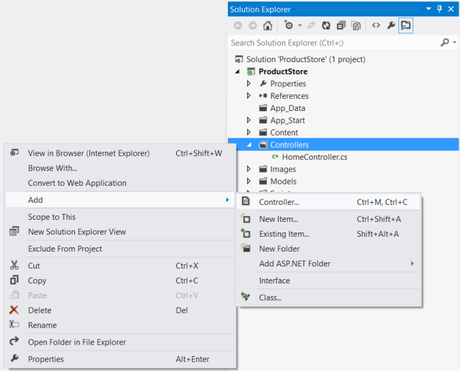
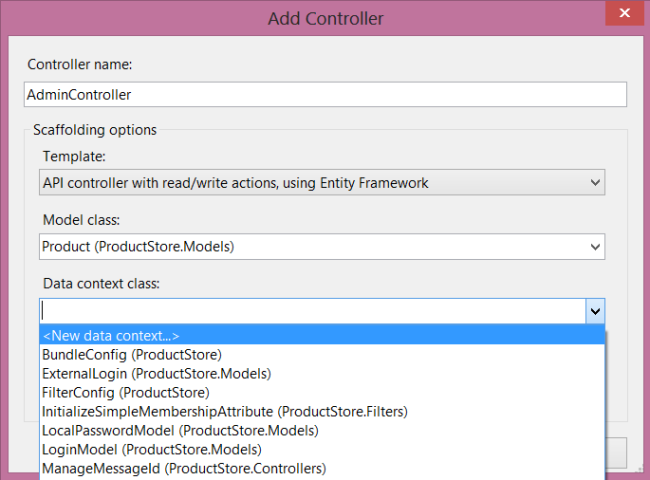
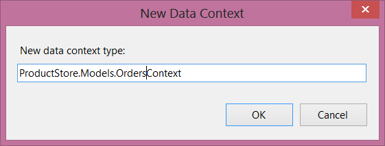
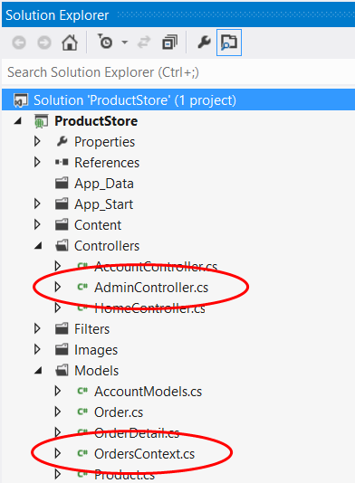

Part 3: Creating an Admin Controller
====================
by [Mike Wasson](https://github.com/MikeWasson)

[Download Completed Project](http://code.msdn.microsoft.com/ASP-NET-Web-API-with-afa30545)

## Add an Admin Controller

In this section, we'll add a Web API controller that supports CRUD (create, read, update, and delete) operations on products. The controller will use Entity Framework to communicate with the database layer. Only administrators will be able to use this controller. Customers will access the products through another controller.

In Solution Explorer, right-click the Controllers folder. Select **Add** and then **Controller**.

In the **Add Controller** dialog, name the controller `AdminController`. Under **Template**, select &quot;API controller with read/write actions, using Entity Framework&quot;. Under **Model class**, select "Product (ProductStore.Models)". Under **Data Context**, select "&lt;New Data Context&gt;".

> [!NOTE]
> If the **Model class** drop-down does not show any model classes, make sure you compiled the project. Entity Framework uses reflection, so it needs the compiled assembly.

Selecting "&lt;New Data Context&gt;" will open the **New Data Context** dialog. Name the data context `ProductStore.Models.OrdersContext`.

Click **OK** to dismiss the **New Data Context** dialog. In the **Add Controller** dialog, click **Add**.

Here's what got added to the project:

- A class named `OrdersContext` that derives from **DbContext**. This class provides the glue between the POCO models and the database.
- A Web API controller named `AdminController`. This controller supports CRUD operations on `Product` instances. It uses the `OrdersContext` class to communicate with Entity Framework.
- A new database connection string in the Web.config file.

Open the OrdersContext.cs file. Notice that the constructor specifies the name of the database connection string. This name refers to the connection string that was added to Web.config.

[!code-csharp[Main](using-web-api-with-entity-framework-part-3/samples/sample1.cs)]

Add the following properties to the `OrdersContext` class:

[!code-csharp[Main](using-web-api-with-entity-framework-part-3/samples/sample2.cs)]

A **DbSet** represents a set of entities that can be queried. Here is the complete listing for the `OrdersContext` class:

[!code-csharp[Main](using-web-api-with-entity-framework-part-3/samples/sample3.cs)]

The `AdminController` class defines five methods that implement basic CRUD functionality. Each method corresponds to a URI that the client can invoke:

| Controller Method | Description | URI | HTTP Method |
| --- | --- | --- | --- |
| GetProducts | Gets all products. | api/products | GET |
| GetProduct | Finds a product by ID. | api/products/*id* | GET |
| PutProduct | Updates a product. | api/products/*id* | PUT |
| PostProduct | Creates a new product. | api/products | POST |
| DeleteProduct | Deletes a product. | api/products/*id* | DELETE |

Each method calls into `OrdersContext` to query the database. The methods that modify the collection (PUT, POST, and DELETE) call `db.SaveChanges` to persist the changes to the database. Controllers are created per HTTP request and then disposed, so it is necessary to persist changes before a method returns.

## Add a Database Initializer

Entity Framework has a nice feature that lets you populate the database on startup, and automatically recreate the database whenever the models change. This feature is useful during development, because you always have some test data, even if you change the models.

In Solution Explorer, right-click the Models folder and create a new class named `OrdersContextInitializer`. Paste in the following implementation:

[!code-csharp[Main](using-web-api-with-entity-framework-part-3/samples/sample4.cs)]

By inheriting from the **DropCreateDatabaseIfModelChanges** class, we are telling Entity Framework to drop the database whenever we modify the model classes. When Entity Framework creates (or recreates) the database, it calls the **Seed** method to populate the tables. We use the **Seed** method to add some example products plus an example order.

This feature is great for testing, but don't use the **DropCreateDatabaseIfModelChanges** class in production,, because you could lose your data if someone changes a model class.

Next, open Global.asax and add the following code to the **Application\_Start** method:

[!code-csharp[Main](using-web-api-with-entity-framework-part-3/samples/sample5.cs)]

## Send a Request to the Controller

At this point, we haven't written any client code, but you can invoke the web API using a web browser or an HTTP debugging tool such as [Fiddler](http://www.fiddler2.com/fiddler2/). In Visual Studio, press F5 to start debugging. Your web browser will open to `http://localhost:*portnum*/`, where *portnum* is some port number.

Send an HTTP request to "`http://localhost:*portnum*/api/admin`. The first request may be slow to complete, because Entify Framework needs to create and seed the database. The response should something similar to the following:

[!code-console[Main](using-web-api-with-entity-framework-part-3/samples/sample6.cmd)]

>[!div class="step-by-step"]
[Previous](using-web-api-with-entity-framework-part-2.md)
[Next](using-web-api-with-entity-framework-part-4.md)