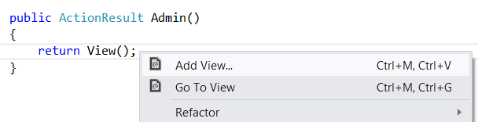
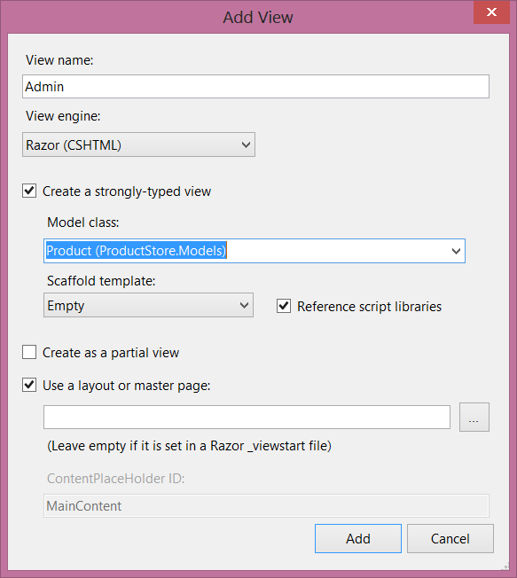

Part 4: Adding an Admin View
====================
by [Mike Wasson](https://github.com/MikeWasson)

[Download Completed Project](http://code.msdn.microsoft.com/ASP-NET-Web-API-with-afa30545)

## Add an Admin View

Now we'll turn to the client side, and add a page that can consume data from the Admin controller. The page will allow users to create, edit, or delete products, by sending AJAX requests to the controller.

In Solution Explorer, expand the Controllers folder and open the file named HomeController.cs. This file contains an MVC controller. Add a method named `Admin`:

    public ActionResult Admin()
    {
        string apiUri= Url.HttpRouteUrl("DefaultApi", new { controller = "admin", });
        ViewBag.ApiUrl = new Uri(Request.Url, apiUri).AbsoluteUri.ToString();
    
        return View();
    }

The **HttpRouteUrl** method creates the URI to the web API, and we store this in the view bag for later.

Next, position the text cursor within the `Admin` action method, then right-click and select **Add View**. This will bring up the **Add View** dialog.

In the **Add View** dialog, name the view "Admin". Select the check box labeled **Create a strongly-typed view**. Under **Model Class**, select "Product (ProductStore.Models)". Leave all the other options as their default values.

Clicking **Add** adds a file named Admin.cshtml under Views/Home. Open this file and add the following HTML. This HTML defines the structure of the page, but no functionality is wired up yet.

    

        

            <ul id="update-products">
                <li>
                    

Product ID

                    

Name
 <input type="text" />
 
                    

Price ($)
 <input type="text" />

                    

Actual Cost ($)
 <input type="text" />

                    

                        <input type="button" value="Update" />
                        <input type="button" value="Delete Item" />
                    

             </li>
            </ul>
        

    
        

        <h2>Add New Product</h2>
        <form id="product">
            @Html.ValidationSummary(true)
            <fieldset>
                <legend>Contact</legend>
                @Html.EditorForModel()
                

                    <input type="submit" value="Save" />
                

            </fieldset>
        </form>
        

    

## Create a Link to the Admin Page

In Solution Explorer, expand the Views folder and then expand the Shared folder. Open the file named \_Layout.cshtml. Locate the **ul** element with id = "menu", and an action link for the Admin view:

    <li>@Html.ActionLink("Admin", "Admin", "Home")</li>

> [!NOTE] In the sample project, I made a few other cosmetic changes, such as replacing the string "Your logo here". These don't affect the functionality of the application. You can download the project and compare the files.

Run the application and click the "Admin" link that appears at the top of the home page. The Admin page should look like the following:

Right now, the page doesn't do anything. In the next section, we'll use Knockout.js to create a dynamic UI.

## Add Authorization

The Admin page is currently accessible to anyone visiting the site. Let's change this to restrict permission to administrators.

Start by adding an "Administrator" role and an administrator user. In Solution Explorer, expand the Filters folder and open the file named InitializeSimpleMembershipAttribute.cs. Locate the `SimpleMembershipInitializer` constructor. After the call to **WebSecurity.InitializeDatabaseConnection**, add the following code:

    const string adminRole = "Administrator";
    const string adminName = "Administrator";
    
    if (!Roles.RoleExists(adminRole))
    {
        Roles.CreateRole(adminRole);
    }
    if (!WebSecurity.UserExists(adminName))
    {
        WebSecurity.CreateUserAndAccount(adminName, "password");
        Roles.AddUserToRole(adminName, adminRole);
    }

This is a quick-and-dirty way to add the "Administrator" role and create a user for the role.

In Solution Explorer, expand the Controllers folder and open the HomeController.cs file. Add the **Authorize** attribute to the `Admin` method.

    [Authorize(Roles="Administrator")]
    public ActionResult Admin()
    {
        return View();
    }

Open the AdminController.cs file and add the **Authorize** attribute to the entire `AdminController` class.

    [Authorize(Roles="Administrator")]
    public class AdminController : ApiController
    {
        // ...

> [!NOTE] MVC and Web API both define **Authorize** attributes, in different namespaces. MVC uses **System.Web.Mvc.AuthorizeAttribute**, while Web API uses **System.Web.Http.AuthorizeAttribute**.

Now only administrators can view the Admin page. Also, if you send an HTTP request to the Admin controller, the request must contain an authentication cookie. If not, the server sends an HTTP 401 (Unauthorized) response. You can see this in Fiddler by sending a GET request to `http://localhost:*port*/api/admin`.

>[!div class="step-by-step"] [Previous](using-web-api-with-entity-framework-part-3.md) [Next](using-web-api-with-entity-framework-part-5.md)