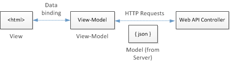

Part 5: Creating a Dynamic UI with Knockout.js
====================
by [Mike Wasson](https://github.com/MikeWasson)

[Download Completed Project](http://code.msdn.microsoft.com/ASP-NET-Web-API-with-afa30545)

## Creating a Dynamic UI with Knockout.js

In this section, we'll use Knockout.js to add functionality to the Admin view.

[Knockout.js](http://knockoutjs.com/) is a Javascript library that makes it easy to bind HTML controls to data. Knockout.js uses the Model-View-ViewModel (MVVM) pattern.

- The *model* is the server-side representation of the data in the business domain (in our case, products and orders).
- The *view* is the presentation layer (HTML).
- The *view-model* is a Javascript object that holds the model data. The view-model is a code abstraction of the UI. It has no knowledge of the HTML representation. Instead, it represents abstract features of the view, such as "a list of items".

The view is data-bound to the view-model. Updates to the view-model are automatically reflected in the view. The view-model also gets events from the view, such as button clicks, and performs operations on the model, such as creating an order.

First we'll define the view-model. After that, we will bind the HTML markup to the view-model.

Add the following Razor section to Admin.cshtml:

    @section Scripts {
      @Scripts.Render("~/bundles/jqueryval")
       
      
    }

You can add this section anywhere in the file. When the view is rendered, the section appears at the bottom of the HTML page, right before the closing &lt;/body&gt; tag.

All of the script for this page will go inside the script tag indicated by the comment:

    

First, define a view-model class:

    function ProductsViewModel() {
        var self = this;
        self.products = ko.observableArray();
    }

**ko.observableArray** is a special kind of object in Knockout, called an *observable*. From the [Knockout.js documentation](http://knockoutjs.com/documentation/observables.html): An observable is a "JavaScript object that can notify subscribers about changes." When the contents of an observable change, the view is automatically updated to match.

To populate the `products` array, make an AJAX request to the web API. Recall that we stored the base URI for the API in the view bag (see [Part 4](using-web-api-with-entity-framework-part-4.md) of the tutorial).

[!code[Main](using-web-api-with-entity-framework-part-5/samples/sample1.xml?highlight=5)]

Next, add functions to the view-model to create, update, and delete products. These functions submit AJAX calls to the web API and use the results to update the view-model.

[!code[Main](using-web-api-with-entity-framework-part-5/samples/sample2.xml?highlight=7)]

Now the most important part: When the DOM is fulled loaded, call the **ko.applyBindings** function and pass in a new instance of the `ProductsViewModel`:

    $(document).ready(function () {
        ko.applyBindings(new ProductsViewModel());
    })

The **ko.applyBindings** method activates Knockout and wires up the view-model to the view.

Now that we have a view-model, we can create the bindings. In Knockout.js, you do this by adding `data-bind` attributes to HTML elements. For example, to bind an HTML list to an array, use the `foreach` binding:

[!code[Main](using-web-api-with-entity-framework-part-5/samples/sample3.xml?highlight=1)]

The `foreach` binding iterates through the array and creates child elements for each object in the array. Bindings on the child elements can refer to properties on the array objects.

Add the following bindings to the "update-products" list:

    <ul id="update-products" data-bind="foreach: products">
        <li>
            

                
Product ID
 
            

            

                
Name
 
                <input type="text" data-bind="value: $data.Name"/>
            
 
            

                
Price ($)
 
                <input type="text" data-bind="value: $data.Price"/>
            

            

                
Actual Cost ($)
 
                <input type="text" data-bind="value: $data.ActualCost"/>
            

            

                <input type="button" value="Update" data-bind="click: $root.update"/>
                <input type="button" value="Delete Item" data-bind="click: $root.remove"/>
            

        </li>
    </ul>

The `<li>` element occurs within the scope of the **foreach** binding. That means Knockout will render the element once for each product in the `products` array. All of the bindings within the `<li>` element refer to that product instance. For example, `$data.Name` refers to the `Name` property on the product.

To set the values of the text inputs, use the `value` binding. The buttons are bound to functions on the model-view, using the `click` binding. The product instance is passed as a parameter to each function. For more information, the [Knockout.js documentation](http://knockoutjs.com/documentation/observables.html) has good descriptions of the various bindings.

Next, add a binding for the **submit** event on the Add Product form:

    <form id="addProduct" data-bind="submit: create">

This binding calls the `create` function on the view-model to create a new product.

Here is the complete code for the Admin view:

    @model ProductStore.Models.Product
    
    @{
        ViewBag.Title = "Admin";
    }
    
    @section Scripts {
      @Scripts.Render("~/bundles/jqueryval")
       
      
    }
    
    <h2>Admin</h2>
    

        

        <ul id="update-products" data-bind="foreach: products">
            <li>
                

                    
Product ID
 
                

                

                    
Name
 
                    <input type="text" data-bind="value: $data.Name"/>
                
 
                

                    
Price ($)
 
                    <input type="text" data-bind="value: $data.Price"/>
                

                

                    
Actual Cost ($)
 
                    <input type="text" data-bind="value: $data.ActualCost"/>
                

                

                    <input type="button" value="Update" data-bind="click: $root.update"/>
                    <input type="button" value="Delete Item" data-bind="click: $root.remove"/>
                

            </li>
        </ul>
        

    
        

        <h2>Add New Product</h2>
        <form id="addProduct" data-bind="submit: create">
            @Html.ValidationSummary(true)
            <fieldset>
                <legend>Contact</legend>
                @Html.EditorForModel()
                

                    <input type="submit" value="Save" />
                

            </fieldset>
        </form>
        

    

Run the application, log in with the Administrator account, and click the "Admin" link. You should see the list of products, and be able to create, update, or delete products.

>[!div class="step-by-step"] [Previous](using-web-api-with-entity-framework-part-4.md) [Next](using-web-api-with-entity-framework-part-6.md)