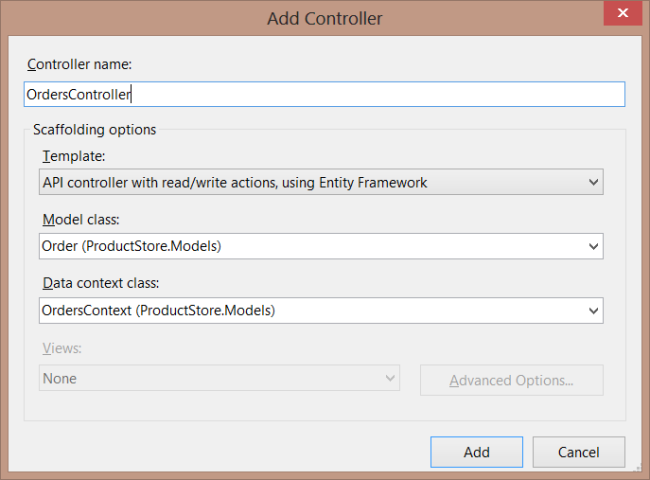

Part 6: Creating Product and Order Controllers
====================
by [Mike Wasson](https://github.com/MikeWasson)

[Download Completed Project](http://code.msdn.microsoft.com/ASP-NET-Web-API-with-afa30545)

## Add a Products Controller

The Admin controller is for users who have administrator privileges. Customers, on the other hand, can view products but cannot create, update, or delete them.

We can easily restrict access to the Post, Put, and Delete methods, while leaving the Get methods open. But look at the data that is returned for a product:

[!code-json[Main](using-web-api-with-entity-framework-part-6/samples/sample1.json?highlight=1)]

The `ActualCost` property should not be visible to customers! The solution is to define a *data transfer object* (DTO) that includes a subset of properties that should be visible to customers. We will use LINQ to project `Product` instances to `ProductDTO` instances.

Add a class named `ProductDTO` to the Models folder.

[!code-csharp[Main](using-web-api-with-entity-framework-part-6/samples/sample2.cs)]

Now add the controller. In Solution Explorer, right-click the Controllers folder. Select **Add**, then select **Controller**. In the **Add Controller** dialog, name the controller &quot;ProductsController&quot;. Under **Template**, select **Empty API controller**.

Replace everything in the source file with the following code:

[!code-csharp[Main](using-web-api-with-entity-framework-part-6/samples/sample3.cs)]

The controller still uses the `OrdersContext` to query the database. But instead of returning `Product` instances directly, we call `MapProducts` to project them onto `ProductDTO` instances:

[!code-csharp[Main](using-web-api-with-entity-framework-part-6/samples/sample4.cs?highlight=1)]

The `MapProducts` method returns an **IQueryable**, so we can compose the result with other query parameters. You can see this in the `GetProduct` method, which adds a **where** clause to the query:

[!code-csharp[Main](using-web-api-with-entity-framework-part-6/samples/sample5.cs?highlight=2)]

## Add an Orders Controller

Next, add a controller that lets users create and view orders.

We'll start with another DTO. In Solution Explorer, right-click the Models folder and add a class named `OrderDTO` Use the following implementation:

[!code-csharp[Main](using-web-api-with-entity-framework-part-6/samples/sample6.cs)]

Now add the controller. In Solution Explorer, right-click the Controllers folder. Select **Add**, then select **Controller**. In the **Add Controller** dialog, set the following options:

- Under **Controller Name**, enter "OrdersController".
- Under **Template**, select "API controller with read/write actions, using Entity Framework".
- Under **Model class**, select &quot;Order (ProductStore.Models)&quot;.
- Under **Data context class**, select &quot;OrdersContext (ProductStore.Models)&quot;.

Click **Add**. This adds a file named OrdersController.cs. Next, we need to modify the default implementation of the controller.

First, delete the `PutOrder` and `DeleteOrder` methods. For this sample, customers cannot modify or delete existing orders. In a real application, you would need lots of back-end logic to handle these cases. (For example, was the order already shipped?)

Change the `GetOrders` method to return just the orders that belong to the user:

[!code-csharp[Main](using-web-api-with-entity-framework-part-6/samples/sample7.cs)]

Change the `GetOrder` method as follows:

[!code-csharp[Main](using-web-api-with-entity-framework-part-6/samples/sample8.cs)]

Here are the changes that we made to the method:

- The return value is an `OrderDTO` instance, instead of an `Order`.
- When we query the database for the order, we use the [DbQuery.Include](https://msdn.microsoft.com/en-us/library/gg696395) method to fetch the related `OrderDetail` and `Product` entities.
- We flatten the result by using a projection.

The HTTP response will contain an array of products with quantities:

[!code-json[Main](using-web-api-with-entity-framework-part-6/samples/sample9.json)]

This format is easier for clients to consume than the original object graph, which contains nested entities (order, details, and products).

The last method to consider it `PostOrder`. Right now, this method takes an `Order` instance. But consider what happens if a client sends a request body like this:

[!code-json[Main](using-web-api-with-entity-framework-part-6/samples/sample10.json)]

This is a well-structured order, and Entity Framework will happily insert it into the database. But it contains a Product entity that did not exist previously. The client just created a new product in our database! This will be a suprise to the order fullfilment department, when they see an order for koala bears. The moral is, be really careful about the data you accept in a POST or PUT request.

To avoid this problem, change the `PostOrder` method to take an `OrderDTO` instance. Use the `OrderDTO` to create the `Order`.

[!code-csharp[Main](using-web-api-with-entity-framework-part-6/samples/sample11.cs)]

Notice that we use the `ProductID` and `Quantity` properties, and we ignore any values that the client sent for either product name or price. If the product ID is not valid, it will violate the foreign key constraint in the database, and the insert will fail, as it should.

Here is the complete `PostOrder` method:

[!code-csharp[Main](using-web-api-with-entity-framework-part-6/samples/sample12.cs)]

Finally, add the **Authorize** attribute to the controller:

[!code-csharp[Main](using-web-api-with-entity-framework-part-6/samples/sample13.cs)]

Now only registered users can create or view orders.

>[!div class="step-by-step"]
[Previous](using-web-api-with-entity-framework-part-5.md)
[Next](using-web-api-with-entity-framework-part-7.md)