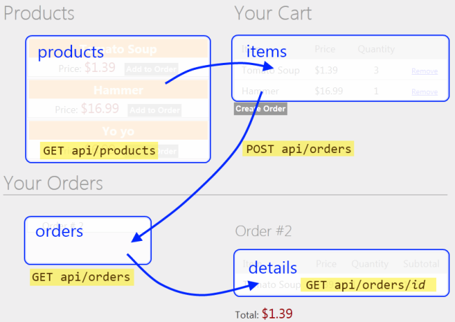

Part 7: Creating the Main Page
====================
by [Mike Wasson](https://github.com/MikeWasson)

[Download Completed Project](http://code.msdn.microsoft.com/ASP-NET-Web-API-with-afa30545)

## Creating the Main Page

In this section, you will create the main application page. This page will be more complex than the Admin page, so we'll approach it in several steps. Along the way, you'll see some more advanced Knockout.js techniques. Here is the basic layout of the page:

- "Products" holds an array of products.
- "Cart" holds an array of products with quantities. Clicking "Add to Cart" updates the cart.
- "Orders" holds an array of order IDs.
- "Details" holds an order detail, which is an array of items (products with quantities)

We'll start by defining some basic layout in HTML, with no data binding or script. Open the file Views/Home/Index.cshtml and replace all of the contents with the following:

[!code-html[Main](using-web-api-with-entity-framework-part-7/samples/sample1.html)]

Next, add a Scripts section and create an empty view-model:

[!code-cshtml[Main](using-web-api-with-entity-framework-part-7/samples/sample2.cshtml)]

Based on the design sketched earlier, our view model needs observables for products, cart, orders, and details. Add the following variables to the `AppViewModel` object:

[!code-javascript[Main](using-web-api-with-entity-framework-part-7/samples/sample3.js)]

Users can add items from the products list into the cart, and remove items from the cart. To encapsulate these functions, we'll create another view-model class that represents a product. Add the following code to `AppViewModel`:

[!code-javascript[Main](using-web-api-with-entity-framework-part-7/samples/sample4.js?highlight=4)]

The `ProductViewModel` class contains two functions that are used to move the product to and from the cart: `addItemToCart` adds one unit of the product to the cart, and `removeAllFromCart` removes all quantities of the product.

Users can select an existing order and get the order details. We'll encapsulate this functionality into another view-model:

[!code-javascript[Main](using-web-api-with-entity-framework-part-7/samples/sample5.js?highlight=4)]

The `OrderDetailsViewModel` is initialized with an order, and it fetches the order details by sending an AJAX request to the server.

Also, notice the `total` property on the `OrderDetailsViewModel`. This property is a special kind of observable called a [computed observable](http://knockoutjs.com/documentation/computedObservables.html). As the name implies, a computed observable lets you data bind to a computed value&#8212;in this case, the total cost of the order.

Next, add these functions to `AppViewModel`:

- `resetCart` removes all items from the cart.
- `getDetails` gets the details for an order (by pusing a new `OrderDetailsViewModel` onto the `details` list).
- `createOrder` creates a new order and empties the cart.

[!code-javascript[Main](using-web-api-with-entity-framework-part-7/samples/sample6.js?highlight=4)]

Finally, initialize the view model by making AJAX requests for the products and orders:

[!code-javascript[Main](using-web-api-with-entity-framework-part-7/samples/sample7.js)]

OK, that's a lot of code, but we built it up step-by-step, so hopefully the design is clear. Now we can add some Knockout.js bindings to the HTML.

**Products**

Here are the bindings for the product list:

[!code-html[Main](using-web-api-with-entity-framework-part-7/samples/sample8.html)]

This iterates over the products array and displays the name and price. The "Add to Order" button is visible only when the user is logged in.

The "Add to Order" button calls `addItemToCart` on the `ProductViewModel` instance for the product. This demonstrates a nice feature of Knockout.js: When a view-model contains other view-models, you can apply the bindings to the inner model. In this example, the bindings within the `foreach` are applied to each of the `ProductViewModel` instances. This approach is much cleaner than putting all of the functionality into a single view-model.

**Cart**

Here are the bindings for the cart:

[!code-html[Main](using-web-api-with-entity-framework-part-7/samples/sample9.html)]

This iterates over the cart array and displays the name, price, and quantity. Note that the "Remove" link and the "Create Order" button are bound to view-model functions.

**Orders**

Here are the bindings for the orders list:

[!code-html[Main](using-web-api-with-entity-framework-part-7/samples/sample10.html)]

This iterates over the orders and shows the order ID. The click event on the link is bound to the `getDetails` function.

**Order Details**

Here are the bindings for the order details:

[!code-html[Main](using-web-api-with-entity-framework-part-7/samples/sample11.html)]

This iterates over the items in the order and displays the product, price, and quanity. The surrounding div is visible only if the details array contains one or more items.

## Conclusion

In this tutorial, you created an application that uses Entity Framework to communicate with the database, and ASP.NET Web API to provide a public-facing interface on top of the data layer. We use ASP.NET MVC 4 to render the HTML pages, and Knockout.js plus jQuery to provide dynamic interactions without page reloads.

Additional resources:

- [ASP.NET Data Access Content Map](https://msdn.microsoft.com/en-us/library/6759sth4.aspx)
- [Entity Framework Developer Center](https://msdn.microsoft.com/en-US/data/ef)

>[!div class="step-by-step"]
[Previous](using-web-api-with-entity-framework-part-6.md)