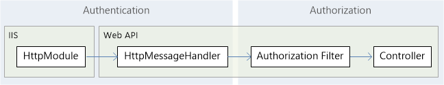
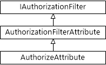

Authentication and Authorization in ASP.NET Web API
====================
by [Mike Wasson](https://github.com/MikeWasson)

You've created a web API, but now you want to control access to it. In this series of articles, we'll look at some options for securing a web API from unauthorized users. This series will cover both authentication and authorization.

- *Authentication* is knowing the identity of the user. For example, Alice logs in with her username and password, and the server uses the password to authenticate Alice.
- *Authorization* is deciding whether a user is allowed to perform an action. For example, Alice has permission to get a resource but not create a resource.

The first article in the series gives a general overview of authentication and authorization in ASP.NET Web API. Other topics describe common authentication scenarios for Web API.

> [!NOTE]
> Thanks to the people who reviewed this series and provided valuable feedback: Rick Anderson, Levi Broderick, Barry Dorrans, Tom Dykstra, Hongmei Ge, David Matson, Daniel Roth, Tim Teebken.

## Authentication

Web API assumes that authentication happens in the host. For web-hosting, the host is IIS, which uses HTTP modules for authentication. You can configure your project to use any of the authentication modules built in to IIS or ASP.NET, or write your own HTTP module to perform custom authentication.

When the host authenticates the user, it creates a *principal*, which is an [IPrincipal](https://msdn.microsoft.com/en-us/library/System.Security.Principal.IPrincipal.aspx) object that represents the security context under which code is running. The host attaches the principal to the current thread by setting **Thread.CurrentPrincipal**. The principal contains an associated **Identity** object that contains information about the user. If the user is authenticated, the **Identity.IsAuthenticated** property returns **true**. For anonymous requests, **IsAuthenticated** returns **false**. For more information about principals, see [Role-Based Security](https://msdn.microsoft.com/en-us/library/shz8h065.aspx).

### HTTP Message Handlers for Authentication

Instead of using the host for authentication, you can put authentication logic into an [HTTP message handler](../advanced/http-message-handlers.md). In that case, the message handler examines the HTTP request and sets the principal.

When should you use message handlers for authentication? Here are some tradeoffs:

- An HTTP module sees all requests that go through the ASP.NET pipeline. A message handler only sees requests that are routed to Web API.
- You can set per-route message handlers, which lets you apply an authentication scheme to a specific route.
- HTTP modules are specific to IIS. Message handlers are host-agnostic, so they can be used with both web-hosting and self-hosting.
- HTTP modules participate in IIS logging, auditing, and so on.
- HTTP modules run earlier in the pipeline. If you handle authentication in a message handler, the principal does not get set until the handler runs. Moreover, the principal reverts back to the previous principal when the response leaves the message handler.

Generally, if you don't need to support self-hosting, an HTTP module is a better option. If you need to support self-hosting, consider a message handler.

### Setting the Principal

If your application performs any custom authentication logic, you must set the principal on two places:

- **Thread.CurrentPrincipal**. This property is the standard way to set the thread's principal in .NET.
- **HttpContext.Current.User**. This property is specific to ASP.NET.

The following code shows how to set the principal:

[!code-csharp[Main](authentication-and-authorization-in-aspnet-web-api/samples/sample1.cs)]

For web-hosting, you must set the principal in both places; otherwise the security context may become inconsistent. For self-hosting, however, **HttpContext.Current** is null. To ensure your code is host-agnostic, therefore, check for null before assigning to **HttpContext.Current**, as shown.

## Authorization

Authorization happens later in the pipeline, closer to the controller. That lets you make more granular choices when you grant access to resources.

- *Authorization filters* run before the controller action. If the request is not authorized, the filter returns an error response, and the action is not invoked.
- Within a controller action, you can get the current principal from the **ApiController.User** property. For example, you might filter a list of resources based on the user name, returning only those resources that belong to that user.

### Using the [Authorize] Attribute

Web API provides a built-in authorization filter, [AuthorizeAttribute](https://msdn.microsoft.com/en-us/library/system.web.http.authorizeattribute.aspx). This filter checks whether the user is authenticated. If not, it returns HTTP status code 401 (Unauthorized), without invoking the action.

You can apply the filter globally, at the controller level, or at the level of inidivual actions.

**Globally**: To restrict access for every Web API controller, add the **AuthorizeAttribute** filter to the global filter list:

[!code-csharp[Main](authentication-and-authorization-in-aspnet-web-api/samples/sample2.cs)]

**Controller**: To restrict access for a specific controller, add the filter as an attribute to the controller:

[!code-csharp[Main](authentication-and-authorization-in-aspnet-web-api/samples/sample3.cs)]

**Action**: To restrict access for specific actions, add the attribute to the action method:

[!code-csharp[Main](authentication-and-authorization-in-aspnet-web-api/samples/sample4.cs)]

Alternatively, you can restrict the controller and then allow anonymous access to specific actions, by using the `[AllowAnonymous]` attribute. In the following example, the `Post` method is restricted, but the `Get` method allows anonymous access.

[!code-csharp[Main](authentication-and-authorization-in-aspnet-web-api/samples/sample5.cs)]

In the previous examples, the filter allows any authenticated user to access the restricted methods; only anonymous users are kept out. You can also limit access to specific users or to users in specific roles:

[!code-csharp[Main](authentication-and-authorization-in-aspnet-web-api/samples/sample6.cs)]

> [!NOTE]
> The **AuthorizeAttribute** filter for Web API controllers is located in the **System.Web.Http** namespace. There is a similar filter for MVC controllers in the **System.Web.Mvc** namespace, which is not compatible with Web API controllers.

### Custom Authorization Filters

To write a custom authorization filter, derive from one of these types:

- **AuthorizeAttribute**. Extend this class to perform authorization logic based on the current user and the user's roles.
- **AuthorizationFilterAttribute**. Extend this class to perform synchronous authorization logic that is not necessarily based on the current user or role.
- **IAuthorizationFilter**. Implement this interface to perform asynchronous authorization logic; for example, if your authorization logic makes asynchronous I/O or network calls. (If your authorization logic is CPU-bound, it is simpler to derive from **AuthorizationFilterAttribute**, because then you don't need to write an asynchronous method.)

The following diagram shows the class hierarchy for the **AuthorizeAttribute** class.

### Authorization Inside a Controller Action

In some cases, you might allow a request to proceed, but change the behavior based on the principal. For example, the information that you return might change depending on the user's role. Within a controller method, you can get the current principle from the **ApiController.User** property.

[!code-csharp[Main](authentication-and-authorization-in-aspnet-web-api/samples/sample7.cs)]