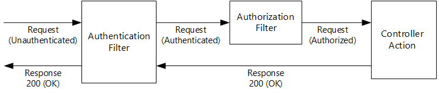
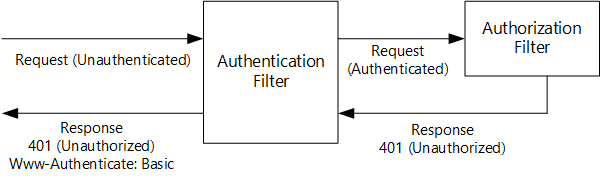
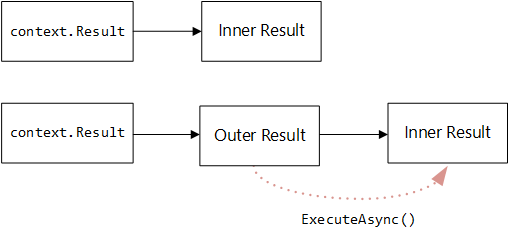

Authentication Filters in ASP.NET Web API 2
====================
by [Mike Wasson](https://github.com/MikeWasson)

> An authentication filter is a component that authenticates an HTTP request. Web API 2 and MVC 5 both support authentication filters, but they differ slightly, mostly in the naming conventions for the filter interface. This topic describes Web API authentication filters.

Authentication filters let you set an authentication scheme for individual controllers or actions. That way, your app can support different authentication mechanisms for different HTTP resources.

In this article, I'll show code from the [Basic Authentication](http://aspnet.codeplex.com/sourcecontrol/latest#Samples/WebApi/BasicAuthentication/ReadMe.txt) sample on [http://aspnet.codeplex.com](http://aspnet.codeplex.com). The sample shows an authentication filter that implements the HTTP Basic Access Authentication scheme (RFC 2617). The filter is implemented in a class named `IdentityBasicAuthenticationAttribute`. I won't show all of the code from the sample, just the parts that illustrate how to write an authentication filter.

## Setting an Authentication Filter

Like other filters, authentication filters can be applied per-controller, per-action, or globally to all Web API controllers.

To apply an authentication filter to a controller, decorate the controller class with the filter attribute. The following code sets the `[IdentityBasicAuthentication]` filter on a controller class, which enables Basic Authentication for all of the controller's actions.

[!code-csharp[Main](authentication-filters/samples/sample1.cs)]

To apply the filter to one action, decorate the action with the filter. The following code sets the `[IdentityBasicAuthentication]` filter on the controller's `Post` method.

[!code-csharp[Main](authentication-filters/samples/sample2.cs)]

To apply the filter to all Web API controllers, add it to **GlobalConfiguration.Filters**.

[!code-csharp[Main](authentication-filters/samples/sample3.cs)]

## Implementing a Web API Authentication Filter

In Web API, authentication filters implement the [System.Web.Http.Filters.IAuthenticationFilter](https://msdn.microsoft.com/en-us/library/system.web.http.filters.iauthenticationfilter.aspx) interface. They should also inherit from **System.Attribute**, in order to be applied as attributes.

The **IAuthenticationFilter** interface has two methods:

- **AuthenticateAsync** authenticates the request by validating credentials in the request, if present.
- **ChallengeAsync** adds an authentication challenge to the HTTP response, if needed.

These methods correspond to the authentication flow defined in [RFC 2612](http://tools.ietf.org/html/rfc2616) and [RFC 2617](http://tools.ietf.org/html/rfc2617):

1. The client sends credentials in the Authorization header. This typically happens after the client receives a 401 (Unauthorized) response from the server. However, a client can send credentials with any request, not just after getting a 401.
2. If the server does not accept the credentials, it returns a 401 (Unauthorized) response. The response includes a Www-Authenticate header that contains one or more challenges. Each challenge specifies an authentication scheme recognized by the server.

The server can also return 401 from an anonymous request. In fact, that's typically how the authentication process is initiated:

1. The client sends an anonymous request.
2. The server returns 401.
3. The clients resends the request with credentials.

This flow includes both *authentication* and *authorization* steps.

- Authentication proves the identity of the client.
- Authorization determines whether the client can access a particular resource.

In Web API, authentication filters handle authentication, but not authorization. Authorization should be done by an authorization filter or inside the controller action.

Here is the flow in the Web API 2 pipeline:

1. Before invoking an action, Web API creates a list of the authentication filters for that action. This includes filters with action scope, controller scope, and global scope.
2. Web API calls **AuthenticateAsync** on every filter in the list. Each filter can validate credentials in the request. If any filter successfully validates credentials, the filter creates an **IPrincipal** and attaches it to the request. A filter can also trigger an error at this point. If so, the rest of the pipeline does not run.
3. Assuming there is no error, the request flows through the rest of the pipeline.
4. Finally, Web API calls every authentication filter's **ChallengeAsync** method. Filters use this method to add a challenge to the response, if needed. Typically (but not always) that would happen in response to a 401 error.

The following diagrams show two possible cases. In the first, the authentication filter successfully authenticates the request, an authorization filter authorizes the request, and the controller action returns 200 (OK).

In the second example, the authentication filter authenticates the request, but the authorization filter returns 401 (Unauthorized). In this case, the controller action is not invoked. The authentication filter adds a Www-Authenticate header to the response.

Other combinations are possible&mdash;for example, if the controller action allows anonymous requests, you might have an authentication filter but no authorization.

## Implementing the AuthenticateAsync Method

The **AuthenticateAsync** method tries to authenticate the request. Here is the method signature:

[!code-csharp[Main](authentication-filters/samples/sample4.cs)]

The **AuthenticateAsync** method must do one of the following:

1. Nothing (no-op).
2. Create an **IPrincipal** and set it on the request.
3. Set an error result.

Option (1) means the request did not have any credentials that the filter understands. Option (2) means the filter successfully authenticated the request. Option (3) means the request had invalid credentials (like the wrong password), which triggers an error response.

Here is a general outline for implementing **AuthenticateAsync**.

1. Look for credentials in the request.
2. If there are no credentials, do nothing and return (no-op).
3. If there are credentials but the filter does not recognize the authentication scheme, do nothing and return (no-op). Another filter in the pipeline might understand the scheme.
4. If there are credentials that the filter understands, try to authenticate them.
5. If the credentials are bad, return 401 by setting `context.ErrorResult`.
6. If the credentials are valid, create an **IPrincipal** and set `context.Principal`.

The follow code shows the **AuthenticateAsync** method from the [Basic Authentication](http://aspnet.codeplex.com/sourcecontrol/latest#Samples/WebApi/BasicAuthentication/ReadMe.txt) sample. The comments indicate each step. The code shows several types of error: An Authorization header with no credentials, malformed credentials, and bad username/password.

[!code-csharp[Main](authentication-filters/samples/sample5.cs)]

## Setting an Error Result

If the credentials are invalid, the filter must set `context.ErrorResult` to an **IHttpActionResult** that creates an error response. For more information about **IHttpActionResult**, see [Action Results in Web API 2](../getting-started-with-aspnet-web-api/action-results.md).

The Basic Authentication sample includes an `AuthenticationFailureResult` class that is suitable for this purpose.

[!code-csharp[Main](authentication-filters/samples/sample6.cs)]

## Implementing ChallengeAsync

The purpose of the **ChallengeAsync** method is to add authentication challenges to the response, if needed. Here is the method signature:

[!code-csharp[Main](authentication-filters/samples/sample7.cs)]

The method is called on every authentication filter in the request pipeline.

It's important to understand that **ChallengeAsync** is called *before* the HTTP response is created, and possibly even before the controller action runs. When **ChallengeAsync** is called, `context.Result` contains an **IHttpActionResult**, which is used later to create the HTTP response. So when **ChallengeAsync** is called, you don't know anything about the HTTP response yet. The **ChallengeAsync** method should replace the original value of `context.Result` with a new **IHttpActionResult**. This **IHttpActionResult** must wrap the original `context.Result`.

I'll call the original **IHttpActionResult** the *inner result*, and the new **IHttpActionResult** the *outer result*. The outer result must do the following:

1. Invoke the inner result to create the HTTP response.
2. Examine the response.
3. Add an authentication challenge to the response, if needed.

The following example is taken from the Basic Authentication sample. It defines an **IHttpActionResult** for the outer result.

[!code-csharp[Main](authentication-filters/samples/sample8.cs)]

The `InnerResult` property holds the inner **IHttpActionResult**. The `Challenge` property represents a Www-Authentication header. Notice that **ExecuteAsync** first calls `InnerResult.ExecuteAsync` to create the HTTP response, and then adds the challenge if needed.

Check the response code before adding the challenge. Most authentication schemes only add a challenge if the response is 401, as shown here. However, some authentication schemes do add a challenge to a success response. For example, see [Negotiate](http://tools.ietf.org/html/rfc4559#section-5) (RFC 4559).

Given the `AddChallengeOnUnauthorizedResult` class, the actual code in **ChallengeAsync** is simple. You just create the result and attach it to `context.Result`.

[!code-csharp[Main](authentication-filters/samples/sample9.cs)]

Note: The Basic Authentication sample abstracts this logic a bit, by placing it in an extension method.

## Combining Authentication Filters with Host-Level Authentication

"Host-level authentication" is authentication performed by the host (such as IIS), before the request reaches the Web API framework.

Often, you may want to to enable host-level authentication for the rest of your application, but disable it for your Web API controllers. For example, a typical scenario is to enable Forms Authentication at the host level, but use token-based authentication for Web API.

To disable host-level authentication inside the Web API pipeline, call `config.SuppressHostPrincipal()` in your configuration. This causes Web API to remove the **IPrincipal** from any request that enters the Web API pipeline. Effectively, it &quot;un-authenticates&quot; the request.

[!code-csharp[Main](authentication-filters/samples/sample10.cs)]

## Additional Resources

[ASP.NET Web API Security Filters](https://msdn.microsoft.com/en-us/magazine/dn781361.aspx) (MSDN Magazine)