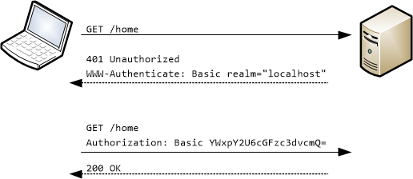
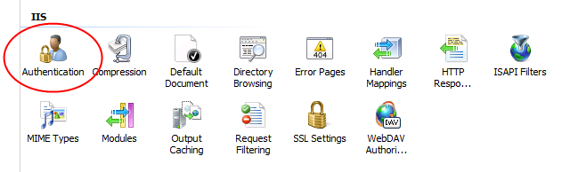

Basic Authentication in ASP.NET Web API
====================
by [Mike Wasson](https://github.com/MikeWasson)

Basic authentication is defined in [RFC 2617, HTTP Authentication: Basic and Digest Access Authentication](http://www.ietf.org/rfc/rfc2617.txt).

Disadvantages

- User credentials are sent in the request.
- Credentials are sent as plaintext.
- Credentials are sent with every request.
- No way to log out, except by ending the browser session.
- Vulnerable to cross-site request forgery (CSRF); requires anti-CSRF measures.

Advantages

- Internet standard.
- Supported by all major browsers.
- Relatively simple protocol.

Basic authentication works as follows:

1. If a request requires authentication, the server returns 401 (Unauthorized). The response includes a WWW-Authenticate header, indicating the server supports Basic authentication.
2. The client sends another request, with the client credentials in the Authorization header. The credentials are formatted as the string "name:password", base64-encoded. The credentials are not encrypted.

Basic authentication is performed within the context of a "realm." The server includes the name of the realm in the WWW-Authenticate header. The user's credentials are valid within that realm. The exact scope of a realm is defined by the server. For example, you might define several realms in order to partition resources.

Because the credentials are sent unencrypted, Basic authentication is only secure over HTTPS. See [Working with SSL in Web API](working-with-ssl-in-web-api.md).

Basic authentication is also vulnerable to CSRF attacks. After the user enters credentials, the browser automatically sends them on subsequent requests to the same domain, for the duration of the session. This includes AJAX requests. See [Preventing Cross-Site Request Forgery (CSRF) Attacks](preventing-cross-site-request-forgery-csrf-attacks.md).

## Basic Authentication with IIS

IIS supports Basic authentication, but there is a caveat: The user is authenticated against their Windows credentials. That means the user must have an account on the server's domain. For a public-facing web site, you typically want to authenticate against an ASP.NET membership provider.

To enable Basic authentication using IIS, set the authentication mode to "Windows" in the Web.config of your ASP.NET project:

[!code-xml[Main](basic-authentication/samples/sample1.xml)]

In this mode, IIS uses Windows credentials to authenticate. In addition, you must enable Basic authentication in IIS. In IIS Manager, go to Features View, select Authentication, and enable Basic authentication.

In your Web API project, add the `[Authorize]` attribute for any controller actions that need authentication.

A client authenticates itself by setting the Authorization header in the request. Browser clients perform this step automatically. Nonbrowser clients will need to set the header.

## Basic Authentication with Custom Membership

As mentioned, the Basic Authentication built into IIS uses Windows credentials. That means you need to create accounts for your users on the hosting server. But for an internet application, user accounts are typically stored in an external database.

The following code how an HTTP module that performs Basic Authentication. You can easily plug in an ASP.NET membership provider by replacing the `CheckPassword` method, which is a dummy method in this example.

In Web API 2, you should consider writing an [authentication filter](authentication-filters.md) or [OWIN middleware](../../../aspnet/overview/owin-and-katana/index.md), instead of an HTTP module.

[!code-csharp[Main](basic-authentication/samples/sample2.cs)]

To enable the HTTP module, add the following to your web.config file in the **system.webServer** section:

[!code-xml[Main](basic-authentication/samples/sample3.xml?highlight=4)]

Replace "YourAssemblyName" with the name of the assembly (not including the "dll" extension).

You should disable other authentication schemes, such as Forms or Windows auth.