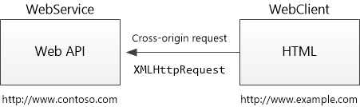
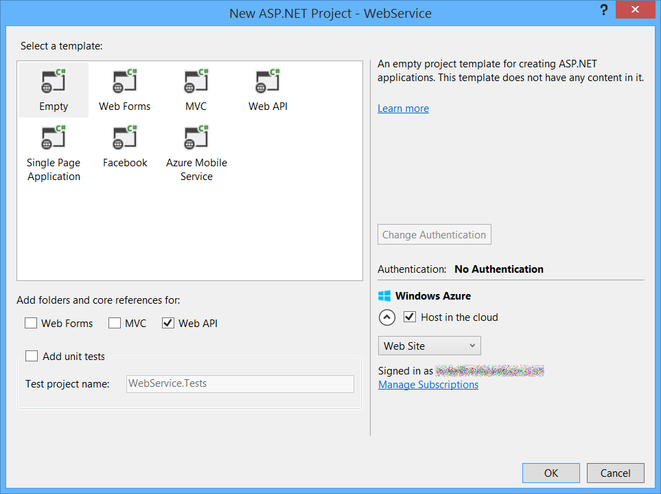
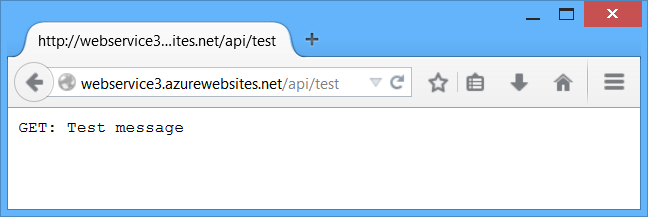
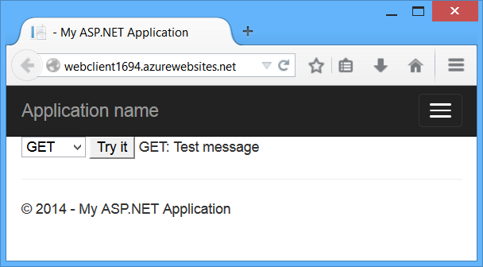

Enabling Cross-Origin Requests in ASP.NET Web API 2
====================
by [Mike Wasson](https://github.com/MikeWasson)

> Browser security prevents a web page from making AJAX requests to another domain. This restriction is called the *same-origin policy*, and prevents a malicious site from reading sensitive data from another site. However, sometimes you might want to let other sites call your web API.
> 
> [Cross Origin Resource Sharing](http://www.w3.org/TR/cors/) (CORS) is a W3C standard that allows a server to relax the same-origin policy. Using CORS, a server can explicitly allow some cross-origin requests while rejecting others. CORS is safer and more flexible than earlier techniques such as [JSONP](http://en.wikipedia.org/wiki/JSONP). This tutorial shows how to enable CORS in your Web API application.
> 
> ## Software versions used in the tutorial
> 
> 
> - [Visual Studio 2013 Update 2](https://www.microsoft.com/visualstudio/eng/2013-downloads)
> - Web API 2.2

## Introduction

This tutorial demonstrates CORS support in ASP.NET Web API. We'll start by creating two ASP.NET projects – one called "WebService", which hosts a Web API controller, and the other called "WebClient", which calls WebService. Because the two applications are hosted at different domains, an AJAX request from WebClient to WebService is a cross-origin request.

### What is "Same Origin"?

Two URLs have the same origin if they have identical schemes, hosts, and ports. ([RFC 6454](http://tools.ietf.org/html/rfc6454))

These two URLs have the same origin:

- `http://example.com/foo.html`
- `http://example.com/bar.html`

These URLs have different origins than the previous two:

- `http://example.net` - Different domain
- `http://example.com:9000/foo.html` - Different port
- `https://example.com/foo.html` - Different scheme
- `http://www.example.com/foo.html` - Different subdomain

> [!NOTE]
> Internet Explorer does not consider the port when comparing origins.

## Create the WebService Project

> [!NOTE]
> This section assumes you already know how to create Web API projects. If not, see [Getting Started with ASP.NET Web API](../getting-started-with-aspnet-web-api/tutorial-your-first-web-api.md).

Start Visual Studio and create a new **ASP.NET Web Application** project. Select the **Empty** project template. Under "Add folders and core references for", select the **Web API** checkbox. Optionally, select the "Host in Cloud" option to deploy the app to Mircosoft Azure. Microsoft offers free web hosting for up to 10 websites in a [free Azure trial account](https://www.windowsazure.com/en-us/pricing/free-trial/?WT.mc_id=A443DD604).

Add a Web API controller named `TestController` with the following code:

[!code-csharp[Main](enabling-cross-origin-requests-in-web-api/samples/sample1.cs)]

You can run the application locally or deploy to Azure. (For the screenshots in this tutorial, I deployed to Azure App Service Web Apps.) To verify that the web API is working, navigate to `http://hostname/api/test/`, where *hostname* is the domain where you deployed the application. You should see the response text, &quot;GET: Test Message&quot;.

## Create the WebClient Project

Create another ASP.NET Web Application project and select the **MVC** project template. Optionally, select **Change Authentication** > **No Authentication**. You don't need authentication for this tutorial.

In Solution Explorer, open the file Views/Home/Index.cshtml. Replace the code in this file with the following:

[!code-cshtml[Main](enabling-cross-origin-requests-in-web-api/samples/sample2.cshtml?highlight=13)]

For the *serviceUrl* variable, use the URI of the WebService app. Now run the WebClient app locally or publish it to another website.

Clicking the "Try It" button submits an AJAX request to the WebService app, using the HTTP method listed in the dropdown box (GET, POST, or PUT). This lets us examine different cross-origin requests. Right now, the WebService app does not support CORS, so if you click the button, you will get an error.

> [!NOTE]
> If you watch the HTTP traffic in a tool like [Fiddler](http://www.telerik.com/fiddler), you will see that the browser does send the GET request, and the request succeeds, but the AJAX call returns an error. It's important to understand that same-origin policy does not prevent the browser from *sending* the request. Instead, it prevents the application from seeing the *response*.

## Enable CORS

Now let's enable CORS in the WebService app. First, add the CORS NuGet package. In Visual Studio, from the **Tools** menu, select **Library Package Manager**, then select **Package Manager Console**. In the Package Manager Console window, type the following command:

[!code-powershell[Main](enabling-cross-origin-requests-in-web-api/samples/sample3.ps1)]

This command installs the latest package and updates all dependencies, including the core Web API libraries. User the -Version flag to target a specific version. The CORS package requires Web API 2.0 or later.

Open the file App\_Start/WebApiConfig.cs. Add the following code to the **WebApiConfig.Register** method.

[!code-csharp[Main](enabling-cross-origin-requests-in-web-api/samples/sample4.cs?highlight=9)]

Next, add the **[EnableCors]** attribute to the `TestController` class:

[!code-csharp[Main](enabling-cross-origin-requests-in-web-api/samples/sample5.cs?highlight=3,7)]

For the *origins* parameter, use the URI where you deployed the WebClient application. This allows cross-origin requests from WebClient, while still disallowing all other cross-domain requests. Later, I'll describe the parameters for **[EnableCors]** in more detail.

Do not include a forward slash at the end of the *origins* URL.

Redeploy the updated WebService application. You don't need to update WebClient. Now the AJAX request from WebClient should succeed. The GET, PUT, and POST methods are all allowed.

## How CORS Works

This section describes what happens in a CORS request, at the level of the HTTP messages. It's important to understand how CORS works, so that you can configure the **[EnableCors]** attribute correctly, and troubleshoot if things don't work as you expect.

The CORS specification introduces several new HTTP headers that enable cross-origin requests. If a browser supports CORS, it sets these headers automatically for cross-origin requests; you don't need to do anything special in your JavaScript code.

Here is an example of a cross-origin request. The "Origin" header gives the domain of the site that is making the request.

[!code-console[Main](enabling-cross-origin-requests-in-web-api/samples/sample6.cmd?highlight=5)]

If the server allows the request, it sets the Access-Control-Allow-Origin header. The value of this header either matches the Origin header, or is the wildcard value "\*", meaning that any origin is allowed.

[!code-console[Main](enabling-cross-origin-requests-in-web-api/samples/sample7.cmd?highlight=5)]

If the response does not include the Access-Control-Allow-Origin header, the AJAX request fails. Specifically, the browser disallows the request. Even if the server returns a successful response, the browser does not make the response available to the client application.

**Preflight Requests**

For some CORS requests, the browser sends an additional request, called a "preflight request", before it sends the actual request for the resource.

The browser can skip the preflight request if the following conditions are true:

- The request method is GET, HEAD, or POST, *and*
- The application does not set any request headers other than Accept, Accept-Language, Content-Language, Content-Type, or Last-Event-ID, *and*
- The Content-Type header (if set) is one of the following: 

    - application/x-www-form-urlencoded
    - multipart/form-data
    - text/plain

The rule about request headers applies to headers that the application sets by calling **setRequestHeader** on the **XMLHttpRequest** object. (The CORS specification calls these "author request headers".) The rule does not apply to headers the *browser* can set, such as User-Agent, Host, or Content-Length.

Here is an example of a preflight request:

[!code-console[Main](enabling-cross-origin-requests-in-web-api/samples/sample8.cmd?highlight=4-5)]

The pre-flight request uses the HTTP OPTIONS method. It includes two special headers:

- Access-Control-Request-Method: The HTTP method that will be used for the actual request.
- Access-Control-Request-Headers: A list of request headers that the *application* set on the actual request. (Again, this does not include headers that the browser sets.)

Here is an example response, assuming that the server allows the request:

[!code-console[Main](enabling-cross-origin-requests-in-web-api/samples/sample9.cmd?highlight=6-7)]

The response includes an Access-Control-Allow-Methods header that lists the allowed methods, and optionally an Access-Control-Allow-Headers header, which lists the allowed headers. If the preflight request succeeds, the browser sends the actual request, as described earlier.

## Scope Rules for [EnableCors]

You can enable CORS per action, per controller, or globally for all Web API controllers in your application.

**Per Action**

To enable CORS for a single action, set the **[EnableCors]** attribute on the action method. The following example enables CORS for the `GetItem` method only.

[!code-csharp[Main](enabling-cross-origin-requests-in-web-api/samples/sample10.cs)]

**Per Controller**

If you set **[EnableCors]** on the controller class, it applies to all the actions on the controller. To disable CORS for an action, add the **[DisableCors]** attribute to the action. The following example enables CORS for every method except `PutItem`.

[!code-csharp[Main](enabling-cross-origin-requests-in-web-api/samples/sample11.cs)]

**Globally**

To enable CORS for all Web API controllers in your application, pass an **EnableCorsAttribute** instance to the **EnableCors** method:

[!code-csharp[Main](enabling-cross-origin-requests-in-web-api/samples/sample12.cs)]

If you set the attribute at more than one scope, the order of precedence is:

1. Action
2. Controller
3. Global

## Set the Allowed Origins

The *origins* parameter of the **[EnableCors]** attribute specifies which origins are allowed to access the resource. The value is a comma-separated list of the allowed origins.

[!code-csharp[Main](enabling-cross-origin-requests-in-web-api/samples/sample13.cs)]

You can also use the wildcard value "\*" to allow requests from any origins.

Consider carefully before allowing requests from any origin. It means that literally any website can make AJAX calls to your web API.

[!code-csharp[Main](enabling-cross-origin-requests-in-web-api/samples/sample14.cs)]

## Set the Allowed HTTP Methods

The *methods* parameter of the **[EnableCors]** attribute specifies which HTTP methods are allowed to access the resource. To allow all methods, use the wildcard value "\*". The following example allows only GET and POST requests.

[!code-csharp[Main](enabling-cross-origin-requests-in-web-api/samples/sample15.cs)]

## Set the Allowed Request Headers

Earlier I described how a preflight request might include an Access-Control-Request-Headers header, listing the HTTP headers set by the application (the so-called "author request headers"). The *headers* parameter of the **[EnableCors]** attribute specifies which author request headers are allowed. To allow any headers, set *headers* to "\*". To whitelist specific headers, set *headers* to a comma-separated list of the allowed headers:

[!code-csharp[Main](enabling-cross-origin-requests-in-web-api/samples/sample16.cs)]

However, browsers are not entirely consistent in how they set Access-Control-Request-Headers. For example, Chrome currently includes "origin"; while FireFox does not include standard headers such as "Accept", even when the application sets them in script.

If you set *headers* to anything other than "\*", you should include at least "accept", "content-type", and "origin", plus any custom headers that you want to support.

## Set the Allowed Response Headers

By default, the browser does not expose all of the response headers to the application. The response headers that are available by default are:

- Cache-Control
- Content-Language
- Content-Type
- Expires
- Last-Modified
- Pragma

The CORS spec calls these [simple response headers](https://dvcs.w3.org/hg/cors/raw-file/tip/Overview.html#simple-response-header). To make other headers available to the application, set the *exposedHeaders* parameter of **[EnableCors]**.

In the following example, the controller's `Get` method sets a custom header named ‘X-Custom-Header'. By default, the browser will not expose this header in a cross-origin request. To make the header available, include ‘X-Custom-Header' in *exposedHeaders*.

[!code-csharp[Main](enabling-cross-origin-requests-in-web-api/samples/sample17.cs)]

## Passing Credentials in Cross-Origin Requests

Credentials require special handling in a CORS request. By default, the browser does not send any credentials with a cross-origin request. Credentials include cookies as well as HTTP authentication schemes. To send credentials with a cross-origin request, the client must set **XMLHttpRequest.withCredentials** to true.

Using **XMLHttpRequest** directly:

[!code-csharp[Main](enabling-cross-origin-requests-in-web-api/samples/sample18.cs)]

In jQuery:

[!code-javascript[Main](enabling-cross-origin-requests-in-web-api/samples/sample19.js)]

In addition, the server must allow the credentials. To allow cross-origin credentials in Web API, set the **SupportsCredentials** property to true on the **[EnableCors]** attribute:

[!code-csharp[Main](enabling-cross-origin-requests-in-web-api/samples/sample20.cs)]

If this property is true, the HTTP response will include an Access-Control-Allow-Credentials header. This header tells the browser that the server allows credentials for a cross-origin request.

If the browser sends credentials, but the response does not include a valid Access-Control-Allow-Credentials header, the browser will not expose the response to the application, and the AJAX request fails.

Be very careful about setting **SupportsCredentials** to true, because it means a website at another domain can send a logged-in user's credentials to your Web API on the user's behalf, without the user being aware. The CORS spec also states that setting *origins* to &quot;\*&quot; is invalid if **SupportsCredentials** is true.

## Custom CORS Policy Providers

The **[EnableCors]** attribute implements the **ICorsPolicyProvider** interface. You can provide your own implementation by creating a class that derives from **Attribute** and implements **ICorsProlicyProvider**.

[!code-csharp[Main](enabling-cross-origin-requests-in-web-api/samples/sample21.cs)]

Now you can apply the attribute any place that you would put **[EnableCors]**.

[!code-csharp[Main](enabling-cross-origin-requests-in-web-api/samples/sample22.cs)]

For example, a custom CORS policy provider could read the settings from a configuration file.

As an alternative to using attributes, you can register an **ICorsPolicyProviderFactory** object that creates **ICorsPolicyProvider** objects.

[!code-csharp[Main](enabling-cross-origin-requests-in-web-api/samples/sample23.cs)]

To set the **ICorsPolicyProviderFactory**, call the **SetCorsPolicyProviderFactory** extension method at startup, as follows:

[!code-csharp[Main](enabling-cross-origin-requests-in-web-api/samples/sample24.cs)]

## Browser Support

The Web API CORS package is a server-side technology. The user's browser also needs to support CORS. Fortunately, the current versions of all major browsers include [support for CORS](http://caniuse.com/cors).

Internet Explorer 8 and Internet Explorer 9 have partial support for CORS, using the legacy XDomainRequest object instead of XMLHttpRequest. For more information, see [XDomainRequest - Restrictions, Limitations and Workarounds](https://blogs.msdn.com/b/ieinternals/archive/2010/05/13/xdomainrequest-restrictions-limitations-and-workarounds.aspx).
