External Authentication Services with ASP.NET Web API (C#)
====================
by [Robert McMurray](https://github.com/rmcmurray)

Visual Studio 2013 and ASP.NET 4.5.1 expand the security options for [Single Page Applications](../../../single-page-application/index.md) (SPA) and [Web API](../../index.md) services to integrate with external authentication services, which include several OAuth/OpenID and social media authentication services: Microsoft Accounts, Twitter, Facebook, and Google.

### In This Walkthrough

- [Using External Authentication Services](#USING)
- [Creating the Sample Web Application](#SAMPLE)
- [Enabling Facebook Authentication](#FACEBOOK)
- [Enabling Google Authentication](#GOOGLE)
- [Enabling Microsoft Authentication](#MICROSOFT)
- [Enabling Twitter Authentication](#TWITTER)
- [Additional Information](#MOREINFO)

    - [Combining External Authentication Services](#COMBINE)
    - [Configuring IIS Express to use a Fully Qualified Domain Name](#FQDN)
    - [How to Obtain your Application Settings for Microsoft Authentication](#OBTAIN)
    - [Optional: Disable Local Registration](#DISABLE)

### Prerequisites

To follow the examples in this walkthrough, you need to have the following:

- Visual Studio 2013
- An account for at least one of the following external authentication services:

    - A Google user account
    - A developer account with the application identifier and secret key for one of the following social media authentication services:

        - Microsoft Accounts ([https://go.microsoft.com/fwlink/?LinkID=144070](https://go.microsoft.com/fwlink/?LinkID=144070))
        - Twitter ([https://dev.twitter.com/](https://dev.twitter.com/))
        - Facebook ([https://developers.facebook.com/](https://developers.facebook.com/))

## Using External Authentication Services

The abundance of external authentication services that are currently available to web developers help to reduce development time when creating new web applications. Web users typically have several existing accounts for popular web services and social media websites, therefore when a web application implements the authentication services from an external web service or social media website, it saves the development time that would have been spent creating an authentication implementation. Using an external authentication service saves end users from having to create another account for your web application, and also from having to remember another username and password.

In the past, developers have had two choices: create their own authentication implementation, or learn how to integrate an external authentication service into their applications. At the most basic level, the following diagram illustrates a simple request flow for a user agent (web browser) that is requesting information from a web application that is configured to use an external authentication service:

[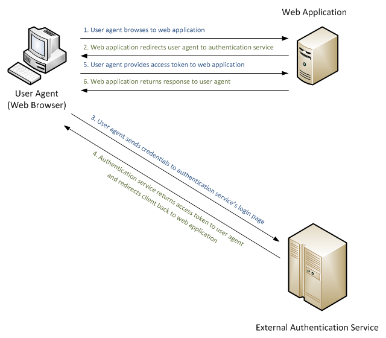](external-authentication-services/_static/image1.png)

In the preceding diagram, the user agent (or web browser in this example) makes a request to a web application, which redirects the web browser to an external authentication service. The user agent sends its credentials to the external authentication service, and if the user agent has successfully authenticated, the external authentication service will redirect the user agent to the original web application with some form of token which the user agent will send to the web application. The web application will use the token to verify that the user agent has been successfully authenticated by the external authentication service, and the web application may use the token to gather more information about the user agent. Once the application is done processing the user agent's information, the web application will return the appropriate response to the user agent based on its authorization settings.

In this second example, the user agent negotiates with the web application and external authorization server, and the web application performs additional communication with the external authorization server to retrieve additional information about the user agent:

Visual Studio 2013 and ASP.NET 4.5.1 make integration with external authentication services easier for developers by providing built-in integration for the following authentication services:

- Facebook
- Google
- Microsoft Accounts (Windows Live ID accounts)
- Twitter

The examples in this walkthrough will demonstrate how to configure each of the supported external authentication services by using the new ASP.NET Web Application template that ships with Visual Studio 2013.

> [!NOTE]
> If necessary, you may need to add your FQDN to the settings for your external authentication service. This requirement is based on security constraints for some external authentication services which require the FQDN in your application settings to match the FQDN that is used by your clients. (The steps for this will vary greatly for each external authentication service; you will need to consult the documentation for each external authentication service to see if this is required and how to configure these settings.) If you need to configure IIS Express to use an FQDN for testing this environment, see the [Configuring IIS Express to use a Fully Qualified Domain Name](#FQDN) section later in this walkthrough.

## Creating a Sample Web Application

The following steps will lead you through creating a sample application by using the ASP.NET Web Application template, and you will use this sample application for each of the external authentication services later in this walkthrough.

Start Visual Studio 2013 select **New Project** from the Start page. Or, from the **File** menu, select **New** and then **Project**.

[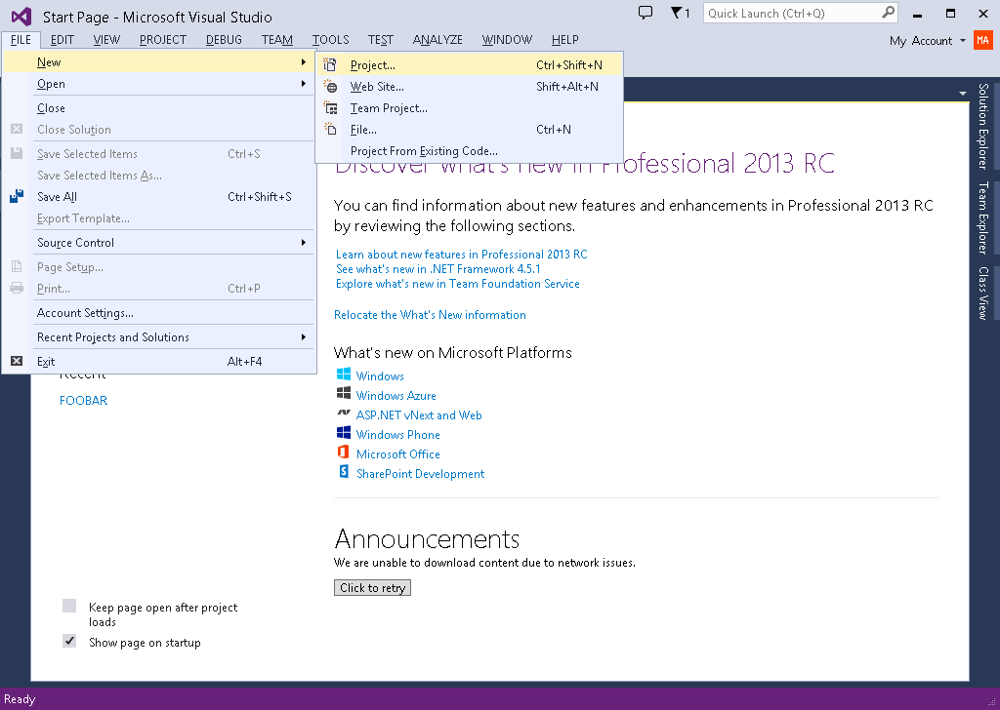](external-authentication-services/_static/image5.png)

When the **New Project** dialog box is displayed, select **Installed** **Templates** and expand **Visual C#**. Under **Visual C#**, select **Web**. In the list of project templates, select **ASP.NET Web Application**. Enter a name for your project and click **OK**.

[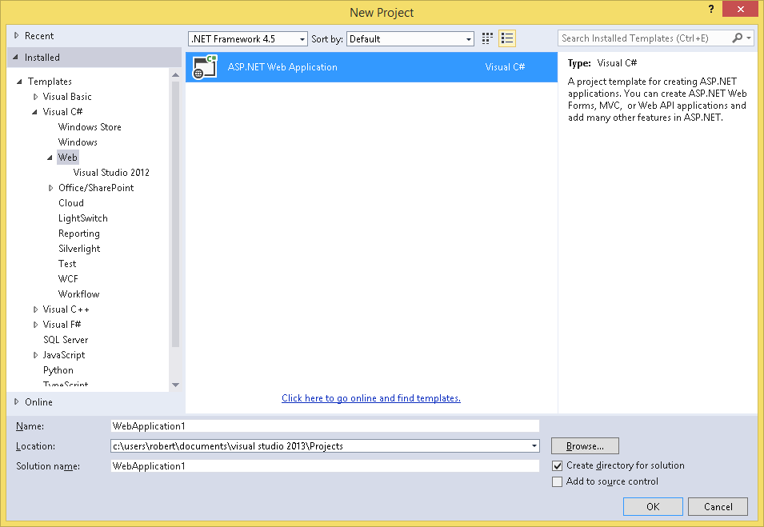](external-authentication-services/_static/image7.png)

When the **New ASP.NET Project** is displayed, select the **SPA** template and click **Create Project**.

[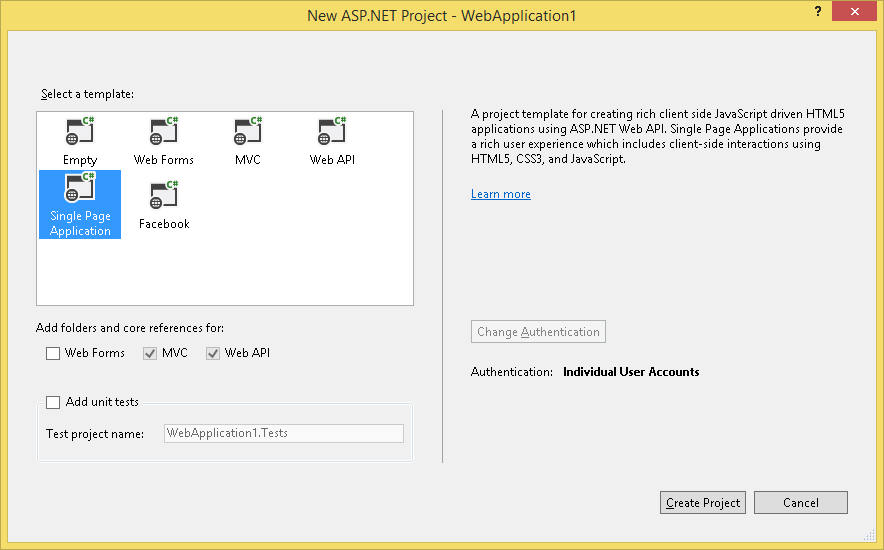](external-authentication-services/_static/image9.png)

Wait as Visual Studio 2013 creates your project.

[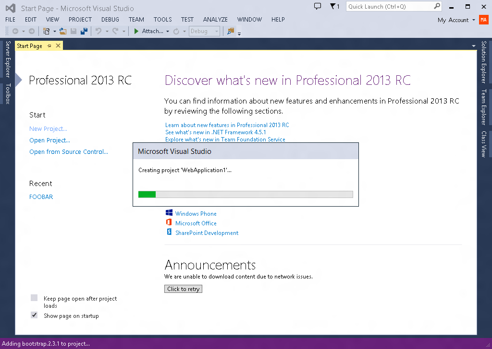](external-authentication-services/_static/image11.png)

When Visual Studio 2013 has finished creating your project, open the *Startup.Auth.cs* file that is located in the **App\_Start** folder.

When you first create the project, none of the external authentication services are enabled in *Startup.Auth.cs* file; the following illustrates what your code might resemble, with the sections highlighted for where you would enable an external authentication service and any relevant settings in order to use Microsoft Accounts, Twitter, Facebook, or Google authentication with your ASP.NET application:

[!code-csharp[Main](external-authentication-services/samples/sample1.cs)]

When you press F5 to build and debug your web application, it will display a login screen where you will see that no external authentication services have been defined.

In the following sections, you will learn how to enable each of the external authentication services that are provided with ASP.NET in Visual Studio 2013.

## Enabling Facebook Authentication

Using Facebook authentication requires you to create a Facebook developer account, and your project will require an application ID and secret key from Facebook in order to function. For information about creating a Facebook developer account and obtaining your application ID and secret key, see [https://go.microsoft.com/fwlink/?LinkID=252166](https://go.microsoft.com/fwlink/?LinkID=252166).

Once you have obtained your application ID and secret key, use the following steps to enable Facebook authentication for your web application:

1. When your project is open in Visual Studio 2013, open the *Startup.Auth.cs* file:

    
2. Locate the highlighted section of code:

    [!code-csharp[Main](external-authentication-services/samples/sample2.cs)]
3. Remove the &quot;//&quot; characters to uncomment the highlighted lines of code, and then add your application ID and secret key. Once you have added those parameters, you can recompile your project:

    [!code-csharp[Main](external-authentication-services/samples/sample3.cs)]
4. When you press F5 to open your web application in your web browser, you will see that Facebook has been defined as an external authentication service:

    [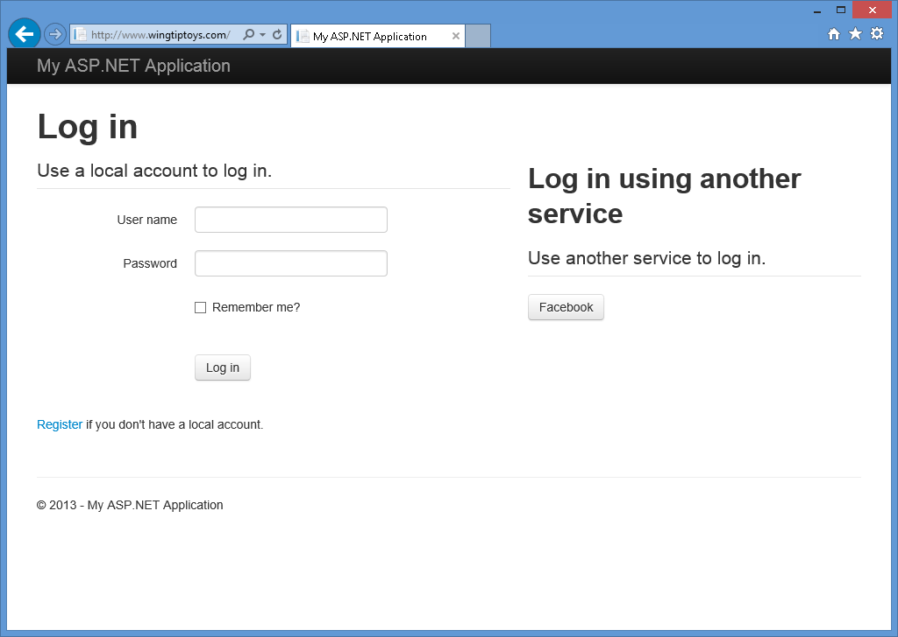](external-authentication-services/_static/image19.png)
5. When you click the **Facebook** button, your browser will be redirected to the Facebook login page:

    [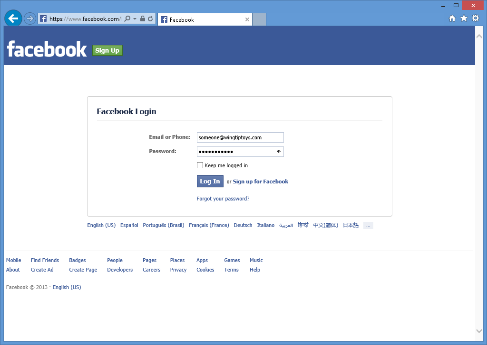](external-authentication-services/_static/image21.png)
6. After you enter your Facebook credentials and click **Log in**, your web browser will be redirected back to your web application, which will prompt you for the **User name** that you want to associate with your Facebook account:

    [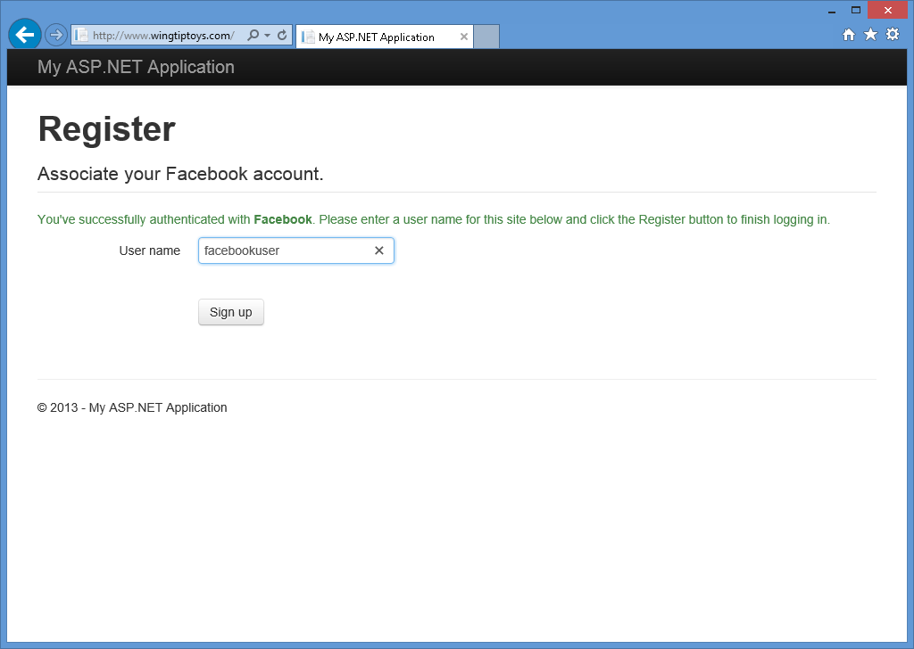](external-authentication-services/_static/image23.png)
7. After you have entered your user name and clicked the **Sign up** button, your web application will display the default **home page** for your Facebook account:

    

## Enabling Google Authentication

Google is by far the easiest of the external authentication services to enable because it doesn't require a developer account, nor does it require additional information like your application ID or secret key as the other external authentication services necessitate.

To enable Google authentication for your web application, use the following steps:

1. When your project is open in Visual Studio 2013, open the *Startup.Auth.cs* file:

    
2. Locate the highlighted section of code:

    [!code-csharp[Main](external-authentication-services/samples/sample4.cs)]
3. Remove the &quot;//&quot; characters to uncomment the highlighted line of code, and then recompile your project:

    [!code-csharp[Main](external-authentication-services/samples/sample5.cs)]
4. When you press F5 to open your web application in your web browser, you will see that Google has been defined as an external authentication service:

    
5. When you click the **Google** button, your browser will be redirected to the Google login page:

    [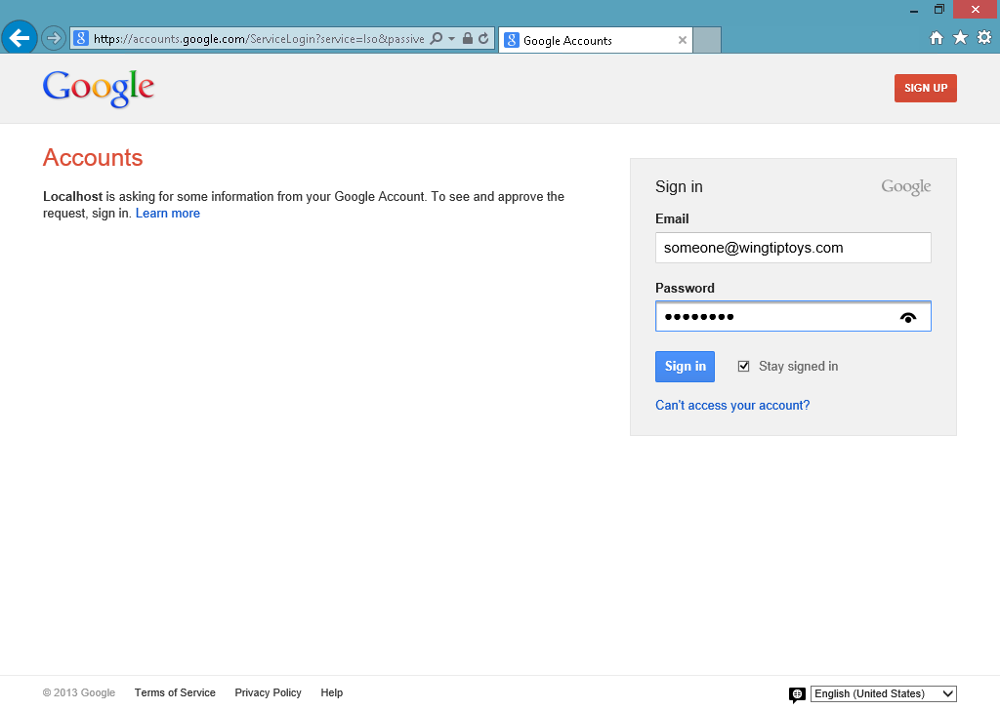](external-authentication-services/_static/image31.png)
6. After you enter your Google credentials and click **Sign in**, Google will prompt you to verify that your web application has permissions to access your Google account:

    [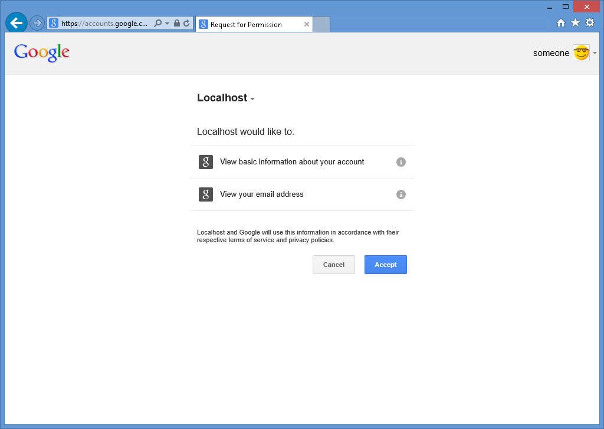](external-authentication-services/_static/image33.png)
7. When you click **Accept**, your web browser will be redirected back to your web application, which will prompt you for the **User name** that you want to associate with your Google account:

    
8. After you have entered your user name and clicked the **Sign up** button, your web application will display the default **home page** for your Google account:

    

## Enabling Microsoft Authentication

Microsoft authentication requires you to create a developer account, and it requires a client ID and client secret in order to function. For information about creating a Microsoft developer account and obtaining your client ID and client secret, see [https://go.microsoft.com/fwlink/?LinkID=144070](https://go.microsoft.com/fwlink/?LinkID=144070).

Once you have obtained your consumer key and consumer secret, use the following steps to enable Microsoft authentication for your web application:

1. When your project is open in Visual Studio 2013, open the *Startup.Auth.cs* file:

    
2. Locate the highlighted section of code:

    [!code-csharp[Main](external-authentication-services/samples/sample6.cs)]
3. Remove the &quot;//&quot; characters to uncomment the highlighted lines of code, and then add your client ID and client secret. Once you have added those parameters, you can recompile your project:

    [!code-csharp[Main](external-authentication-services/samples/sample7.cs)]
4. When you press F5 to open your web application in your web browser, you will see that Microsoft has been defined as an external authentication service:

    
5. When you click the **Microsoft** button, your browser will be redirected to the Microsoft login page:

    
6. After you enter your Microsoft credentials and click **Sign in**, you will be prompted to verify that your web application has permissions to access your Microsoft account:

    [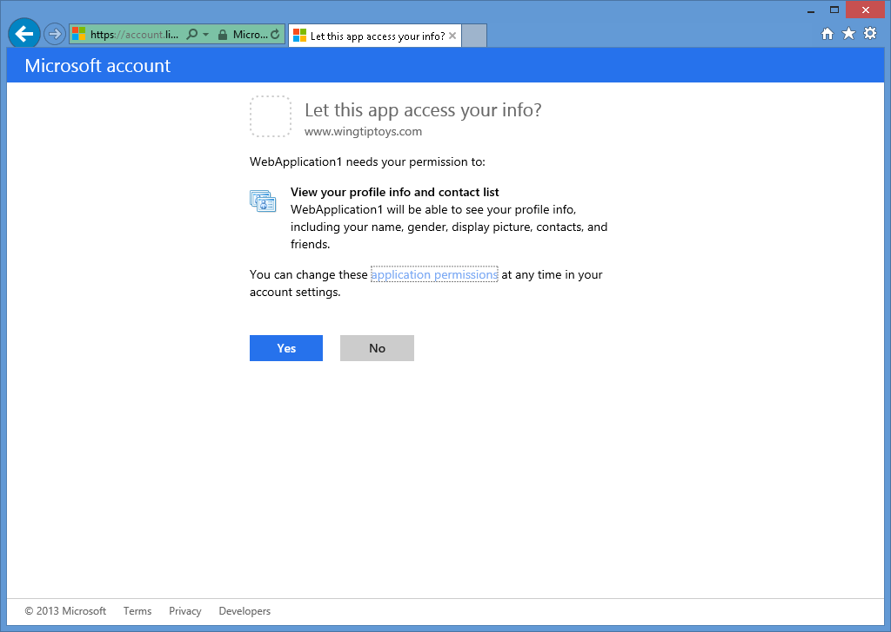](external-authentication-services/_static/image45.png)
7. When you click **Yes**, your web browser will be redirected back to your web application, which will prompt you for the **User name** that you want to associate with your Microsoft account:

    
8. After you have entered your user name and clicked the **Sign up** button, your web application will display the default **home page** for your Microsoft account:

    [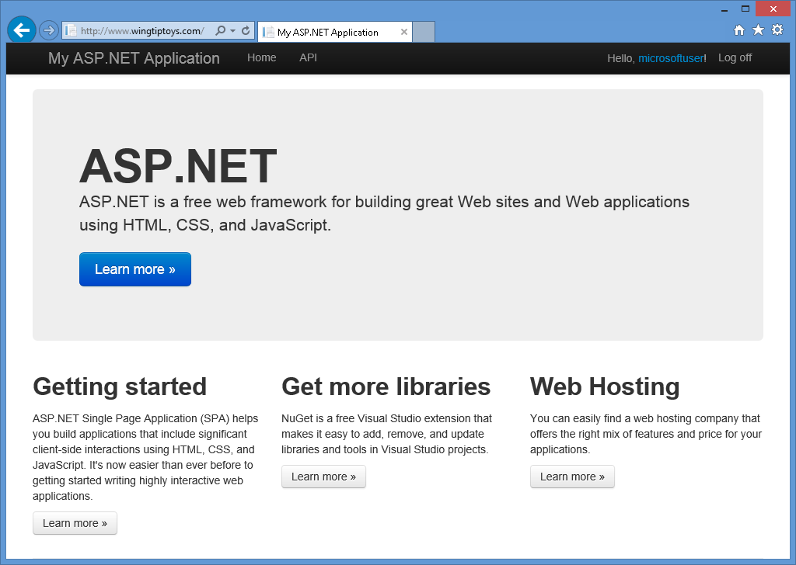](external-authentication-services/_static/image49.png)

## Enabling Twitter Authentication

Twitter authentication requires you to create a developer account, and it requires a consumer key and consumer secret in order to function. For information about creating a Twitter developer account and obtaining your consumer key and consumer secret, see [https://go.microsoft.com/fwlink/?LinkID=252166](https://go.microsoft.com/fwlink/?LinkID=252166).

Once you have obtained your consumer key and consumer secret, use the following steps to enable Twitter authentication for your web application:

1. When your project is open in Visual Studio 2013, open the *Startup.Auth.cs* file:

    
2. Locate the highlighted section of code:

    [!code-csharp[Main](external-authentication-services/samples/sample8.cs)]
3. Remove the &quot;//&quot; characters to uncomment the highlighted lines of code, and then add your consumer key and consumer secret. Once you have added those parameters, you can recompile your project:

    [!code-csharp[Main](external-authentication-services/samples/sample9.cs)]
4. When you press F5 to open your web application in your web browser, you will see that Twitter has been defined as an external authentication service:

    [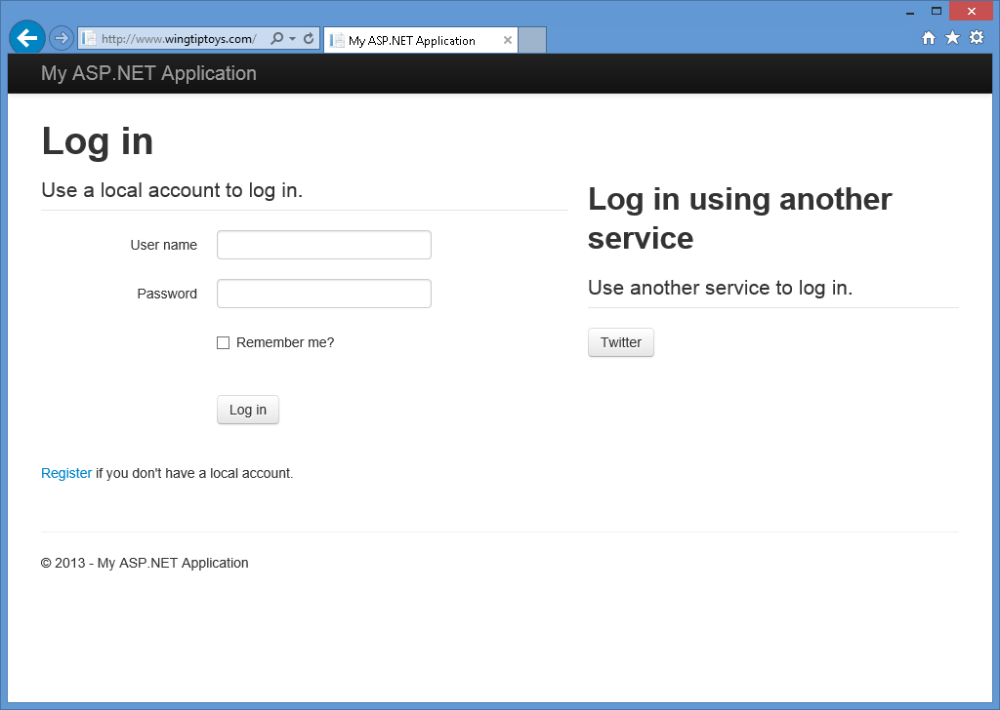](external-authentication-services/_static/image53.png)
5. When you click the **Twitter** button, your browser will be redirected to the Twitter login page:

    
6. After you enter your Twitter credentials and click **Authorize app**, your web browser will be redirected back to your web application, which will prompt you for the **User name** that you want to associate with your Twitter account:

    
7. After you have entered your user name and clicked the **Sign up** button, your web application will display the default **home page** for your Twitter account:

    

## Additional Information

For additional information about creating applications that use OAuth and OpenID, see the following URLs:

- [https://go.microsoft.com/fwlink/?LinkID=252166](https://go.microsoft.com/fwlink/?LinkID=252166)
- [https://go.microsoft.com/fwlink/?LinkID=243995](https://go.microsoft.com/fwlink/?LinkID=243995)

### Combining External Authentication Services

For greater flexibility, you can define multiple external authentication services at the same time - this allows your web application's users to use an account from any of the enabled external authentication services:

[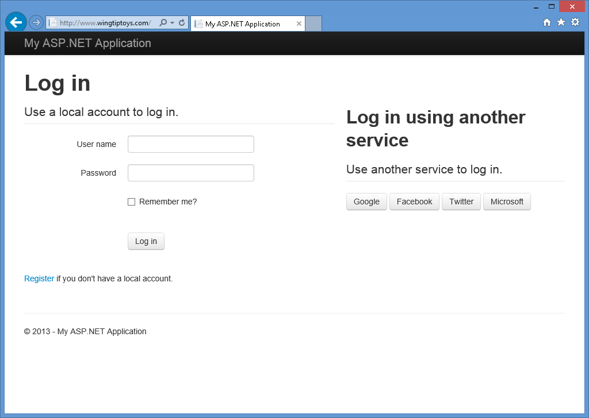](external-authentication-services/_static/image61.png)

### Configuring IIS Express to use a Fully Qualified Domain Name

Some external authentication providers do not support testing your application by using an HTTP address like `http://localhost:port/`. To work around this issue, you can add a static Fully Qualified Domain Name (FQDN) mapping to your HOSTS file and configure your project options in Visual Studio 2013 to use the FQDN for testing/debugging. To do so, use the following steps:

- Add a static FQDN mapping your HOSTS file:

    1. Open an elevated command prompt in Windows.
    2. Type the following command:

        <kbd>notepad %WinDir%\system32\drivers\etc\hosts</kbd>
    3. Add an entry like the following to the HOSTS file:

        <kbd>127.0.0.1 www.wingtiptoys.com</kbd>
    4. Save and close your HOSTS file.
- Configure your Visual Studio project to use the FQDN:

    1. When your project is open in Visual Studio 2013, click the **Project** menu, and then select your project's properties. For example, you might select **WebApplication1 Properties**.
    2. Select the **Web** tab.
    3. Enter your FQDN for the **Project Url**. For example, you would enter <kbd>http://www.wingtiptoys.com</kbd> if that was the FQDN mapping that you added to your HOSTS file.
- Configure IIS Express to use the FQDN for your application:

    1. Open an elevated command prompt in Windows.
    2. Type the following command to change to your IIS Express folder:

        <kbd>cd /d &quot;%ProgramFiles%\IIS Express&quot;</kbd>
    3. Type the following command to add the FQDN to your application:

        <kbd>appcmd.exe set config -section:system.applicationHost/sites /+&quot;[name='WebApplication1'].bindings.[protocol='http',bindingInformation='*:80:www.wingtiptoys.com']&quot; /commit:apphost</kbd>

 Where **WebApplication1** is the name of your project and **bindingInformation** contains the port number and FQDN that you want to use for your testing.

### How to Obtain your Application Settings for Microsoft Authentication

Linking an application to Windows Live for Microsoft Authentication is a simple process. If you have not already linked an application to Windows Live, you can use the following steps:

1. Browse to [https://go.microsoft.com/fwlink/?LinkID=144070](https://go.microsoft.com/fwlink/?LinkID=144070) and enter your Microsoft account name and password when prompted, then click **Sign in**:

    [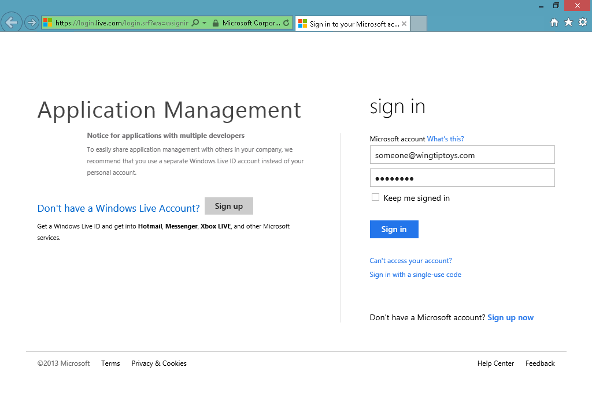](external-authentication-services/_static/image63.png)
2. Enter the name and language of your application when prompted, and then click **I accept**:

    
3. On the **API Settings** page for your application, enter the redirect domain for your application and copy the **Client ID** and **Client secret** for your project, and then click **Save**:

    

### Optional: Disable Local Registration

The current ASP.NET local registration functionality does not prevent automated programs (bots) from creating member accounts; for example, by using a bot-prevention and validation technology like [CAPTCHA](../../../web-pages/overview/security/16-adding-security-and-membership.md). Because of this, you should remove the local login form and registration link on the login page. To do so, open the *\_Login.cshtml* page in your project, and then comment out the lines for the local login panel and the registration link. The resulting page should like like the following code sample:

[!code-html[Main](external-authentication-services/samples/sample10.html)]

Once the local login panel and the registration link have been disabled, your login page will only display the external authentication providers that you have enabled:

[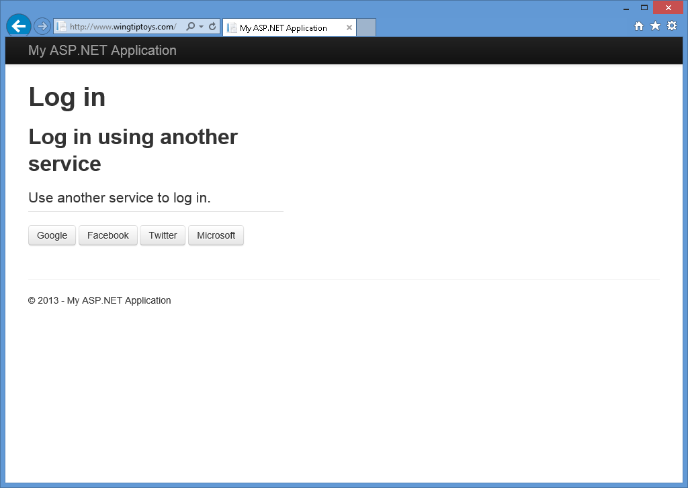](external-authentication-services/_static/image69.png)