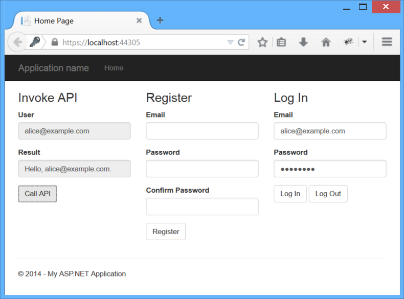
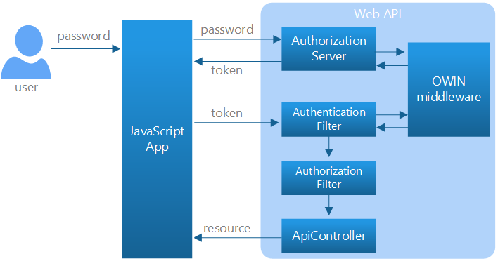
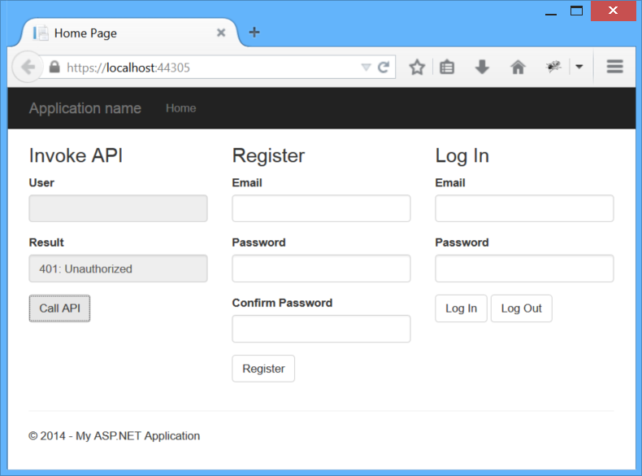
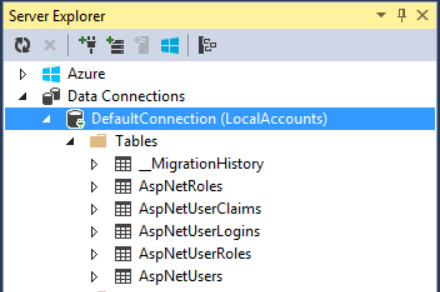
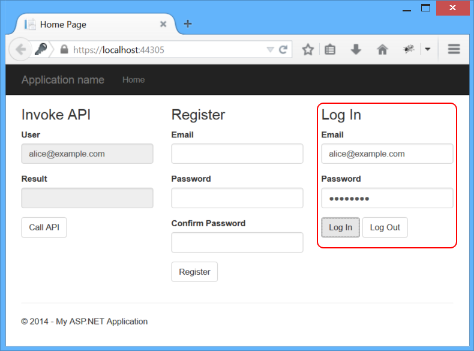
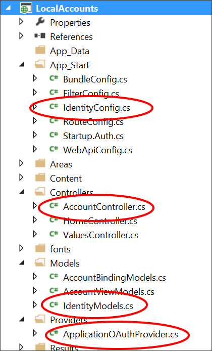
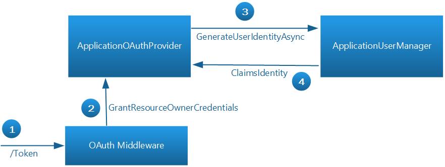
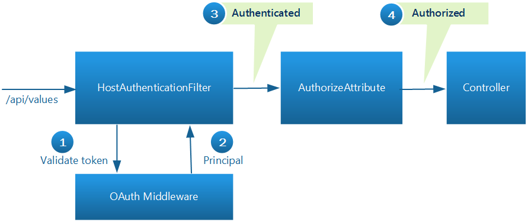

Secure a Web API with Individual Accounts and Local Login in ASP.NET Web API 2.2
====================
by [Mike Wasson](https://github.com/MikeWasson)

[Download Sample App](https://github.com/MikeWasson/LocalAccountsApp)

> This topic shows how to secure a web API using OAuth2 to authenticate against a membership database.
> 
> ## Software versions used in the tutorial
> 
> 
> - [Visual Studio 2013 Update 3](https://www.microsoft.com/visualstudio/eng/2013-downloads)
> - [Web API 2.2](../releases/whats-new-in-aspnet-web-api-22.md)
> - [ASP.NET Identity 2.1](../../../identity/index.md)

In Visual Studio 2013, the Web API project template gives you three options for authentication:

- **Individual accounts.** The app uses a membership database.
- **Organizational accounts.** Users sign in with their Azure Active Directory, Office 365, or on-premise Active Directory credentials.
- **Windows authentication.** This option is intended for Intranet applications, and uses the Windows Authentication IIS module.

For more details about these options, see [Creating ASP.NET Web Projects in Visual Studio 2013](../../../visual-studio/overview/2013/creating-web-projects-in-visual-studio.md#auth).

Individual accounts provide two ways for a user to log in:

- **Local login**. The user registers at the site, entering a username and password. The app stores the password hash in the membership database. When the user logs in, the ASP.NET Identity system verifies the password.
- **Social login**. The user signs in with an external service, such as Facebook, Microsoft, or Google. The app still creates an entry for the user in the membership database, but does not store any credentials. The user authenticates by signing into the external service.

This article looks at the local login scenario. For both local and social login, Web API uses OAuth2 to authenticate requests. However, the credential flows are different for local and social login.

In this article, I'll demonstrate a simple app that lets the user log in and send authenticated AJAX calls to a web API. You can download the sample code [here](https://github.com/MikeWasson/LocalAccountsApp). The readme describes how to create the sample from scratch in Visual Studio.

The sample app uses Knockout.js for data-binding and jQuery for sending AJAX requests. I'll be focusing on the AJAX calls, so you don't need to know Knockout.js for this article.

Along the way, I'll describe:

- What the app is doing on the client side.
- What's happening on the server.
- The HTTP traffic in the middle.

First, we need to define some OAuth2 terminology.

- *Resource*. Some piece of data that can be protected.
- *Resource server*. The server that hosts the resource.
- *Resource owner*. The entity that can grant permission to access a resource. (Typically the user.)
- *Client*: The app that wants access to the resource. In this article, the client is a web browser.
- *Access token*. A token that grants access to a resource.
- *Bearer token*. A particular type of access token, with the property that anyone can use the token. In other words, a client doesn't need a cryptographic key or other secret to use a bearer token. For that reason, bearer tokens should only be used over a HTTPS, and should have relatively short expiration times.
- *Authorization server*. A server that gives out access tokens.

An application can act as both authorization server and resource server. The Web API project template follows this pattern.

## Local Login Credential Flow

For local login, Web API uses the [resource owner password flow](http://oauthlib.readthedocs.org/en/latest/oauth2/grants/password.html) defined in OAuth2.

1. The user enters a name and password into the client.
2. The client sends these credentials to the authorization server.
3. The authorization server authenticates the credentials and returns an access token.
4. To access a protected resource, the client includes the access token in the Authorization header of the HTTP request.

When you select **Individual accounts** in the Web API project template, the project includes an authorization server that validates user credentials and issues tokens. The following diagram shows the same credential flow in terms of Web API components.

In this scenario, Web API controllers act as resource servers. An authentication filter validates access tokens, and the **[Authorize]** attribute is used to protect a resource. When a controller or action has the **[Authorize]** attribute, all requests to that controller or action must be authenticated. Otherwise, authorization is denied, and Web API returns a 401 (Unauthorized) error.

The authorization server and the authentication filter both call into an [OWIN middleware](../../../aspnet/overview/owin-and-katana/an-overview-of-project-katana.md) component that handles the details of OAuth2. I'll describe the design in more detail later in this tutorial.

## Sending an Unauthorized Request

To get started, run the app and click the **Call API** button. When the request completes, you should see an error message in the **Result** box. That's because the request does not contain an access token, so the request is unauthorized.

The **Call API** button sends an AJAX request to ~/api/values, which invokes a Web API controller action. Here is the section of JavaScript code that sends the AJAX request. In the sample app, all of the JavaScript app code is located in the Scripts\app.js file.

[!code-javascript[Main](individual-accounts-in-web-api/samples/sample1.js)]

Until the user logs in, there is no bearer token, and therefore no Authorization header in the request. This causes the request to return a 401 error.

Here is the HTTP request. (I used [Fiddler](http://www.telerik.com/fiddler) to capture the HTTP traffic.)

[!code-console[Main](individual-accounts-in-web-api/samples/sample2.cmd)]

HTTP response:

[!code-console[Main](individual-accounts-in-web-api/samples/sample3.cmd?highlight=1,4)]

Notice that the response includes a Www-Authenticate header with the challenge set to Bearer. That indicates the server expects a bearer token.

## Register a User

In the **Register** section of the app, enter an email and password, and click the **Register** button.

You don't need to use a valid email address for this sample, but a real app would confirm the address. (See [Create a secure ASP.NET MVC 5 web app with log in, email confirmation and password reset](../../../mvc/overview/security/create-an-aspnet-mvc-5-web-app-with-email-confirmation-and-password-reset.md).) For the password, use something like "Password1!", with an upper case letter, lower case letter, number, and non-alpha-numeric character. To keep the app simple, I left out client-side validation, so if there is a problem with the password format, you'll get a 400 (Bad Request) error.

The **Register** button sends a POST request to ~/api/Account/Register/. The request body is a JSON object that holds the name and password. Here is the JavaScript code that sends the request:

[!code-javascript[Main](individual-accounts-in-web-api/samples/sample4.js)]

HTTP request:

[!code-console[Main](individual-accounts-in-web-api/samples/sample5.cmd?highlight=5,10)]

HTTP response:

[!code-console[Main](individual-accounts-in-web-api/samples/sample6.cmd)]

This request is handled by the `AccountController` class. Internally, `AccountController` uses ASP.NET Identity to manage the membership database.

If you run the app locally from Visual Studio, user accounts are stored in LocalDB, in the AspNetUsers table. To view the tables in Visual Studio, click the **View** menu, select **Server Explorer**, then expand **Data Connections**.

## Get an Access Token

So far we have not done any OAuth, but now we'll see the OAuth authorization server in action, when we request an access token. In the **Log In** area of the sample app, enter the email and password and click **Log In**.

The **Log In** button sends a request to the token endpoint. The body of the request contains the following form-url-encoded data:

- grant\_type: "password"
- username: &lt;the user's email&gt;
- password: &lt;password&gt;

Here is the JavaScript code that sends the AJAX request:

[!code-javascript[Main](individual-accounts-in-web-api/samples/sample7.js?highlight=14)]

If the request succeeds, the authorization server returns an access token in the response body. Notice that we store the token in session storage, to use later when sending requests to the API. Unlike some forms of authentication (such as cookie-based authentication), the browser will not automatically include the access token in subsequent requests. The application must do so explicitly. That's a good thing, because it limits [CSRF vulnerabilities](preventing-cross-site-request-forgery-csrf-attacks.md).

HTTP request:

[!code-console[Main](individual-accounts-in-web-api/samples/sample8.cmd?highlight=5,10)]

You can see that the request contains the user's credentials. You *must* use HTTPS to provide transport layer security.

HTTP response:

[!code-console[Main](individual-accounts-in-web-api/samples/sample9.cmd?highlight=8)]

For readability, I indented the JSON and truncated the access token, which is a quite long.

The `access_token`, `token_type`, and `expires_in` properties are defined by the OAuth2 spec. The other properties (`userName`, `.issued`, and `.expires`) are just for informational purposes. You can find the code that adds those additional properties in the `TokenEndpoint` method, in the /Providers/ApplicationOAuthProvider.cs file.

## Send an Authenticated Request

Now that we have a bearer token, we can make an authenticated request to the API. This is done by setting the Authorization header in the request. Click the **Call API** button again to see this.

HTTP request:

[!code-console[Main](individual-accounts-in-web-api/samples/sample10.cmd?highlight=5)]

HTTP response:

[!code-console[Main](individual-accounts-in-web-api/samples/sample11.cmd)]

## Log Out

Because the browser does not cache the credentials or the access token, logging out is simply a matter of "forgetting" the token, by removing it from session storage:

[!code-javascript[Main](individual-accounts-in-web-api/samples/sample12.js)]

## Understanding the Individual Accounts Project Template

When you select **Individual Accounts** in the ASP.NET Web Application project template, the project includes:

- An OAuth2 authorization server.
- A Web API endpoint for managing user accounts
- An EF model for storing user accounts.

Here are the main application classes that implement these features:

- `AccountControlle` r. Provides a Web API endpoint for managing user accounts. The `Register` action is the only one that we used in this tutorial. Other methods on the class support password reset, social logins, and other functionality.
- `ApplicationUser`, defined in /Models/IdentityModels.cs. This class is the EF model for user accounts in the membership database.
- `ApplicationUserManager`, defined in /App\_Start/IdentityConfig.cs This class derives from [UserManager](https://msdn.microsoft.com/en-us/library/dn613290.aspx) and performs operations on user accounts, such as creating a new user, verifying passwords, and so forth, and automatically persists changes to the database.
- `ApplicationOAuthProvider`. This object plugs into the OWIN middleware, and processes events raised by the middleware. It derives from [OAuthAuthorizationServerProvider](https://msdn.microsoft.com/en-us/library/microsoft.owin.security.oauth.oauthauthorizationserverprovider.aspx).

### Configuring the Authorization Server

In StartupAuth.cs, the following code configures the OAuth2 authorization server.

[!code-csharp[Main](individual-accounts-in-web-api/samples/sample13.cs)]

The `TokenEndpointPath` property is the URL path to the authorization server endpoint. That's the URL that app uses to get the bearer tokens.

The `Provider` property specifies a provider that plugs into the OWIN middleware, and processes events raised by the middleware.

Here is the basic flow when the app wants to get a token:

1. To get an access token, the app sends a request to ~/Token.
2. The OAuth middleware calls `GrantResourceOwnerCredentials` on the provider.
3. The provider calls the `ApplicationUserManager` to validate the credentials and create a claims identity.
4. If that succeeds, the provider creates an authentication ticket, which is used to generate the token.

The OAuth middleware doesn't know anything about the user accounts. The provider communicates between the middleware and ASP.NET Identity. For more information about implementing the authorization server, see [OWIN OAuth 2.0 Authorization Server](../../../aspnet/overview/owin-and-katana/owin-oauth-20-authorization-server.md).

### Configuring Web API to use Bearer Tokens

In the `WebApiConfig.Register` method, the following code sets up authentication for the Web API pipeline:

[!code-csharp[Main](individual-accounts-in-web-api/samples/sample14.cs)]

The **HostAuthenticationFilter** class enables authentication using bearer tokens.

The **SuppressDefaultHostAuthentication** method tells Web API to ignore any authentication that happens before the request reaches the Web API pipeline, either by IIS or by OWIN middleware. That way, we can restrict Web API to authenticate only using bearer tokens.

> [!NOTE]
> In particular, the MVC portion of your app might use forms authentication, which stores credentials in a cookie. Cookie-based authentication requires the use of anti-forgery tokens, to prevent CSRF attacks. That's a problem for web APIs, because there is no convenient way for the web API to send the anti-forgery token to the client. (For more background on this issue, see [Preventing CSRF Attacks in Web API](preventing-cross-site-request-forgery-csrf-attacks.md).) Calling **SuppressDefaultHostAuthentication** ensures that Web API is not vulnerable to CSRF attacks from credentials stored in cookies.

When the client requests a protected resource, here is what happens in the Web API pipeline:

1. The **HostAuthentication** filter calls the OAuth middleware to validate the token.
2. The middleware converts the token into a claims identity.
3. At this point, the request is *authenticated* but not *authorized*.
4. The authorization filter examines the claims identity. If the claims authorize the user for that resource, the request is authorized. By default, the **[Authorize]** attribute will authorize any request that is authenticated. However, you can authorize by role or by other claims. For more information, see [Authentication and Authorization in Web API](authentication-and-authorization-in-aspnet-web-api.md).
5. If the previous steps are successful, the controller returns the protected resource. Otherwise, the client receives a 401 (Unauthorized) error.

## Additional Resources

- [ASP.NET Identity](../../../identity/index.md)
- [Understanding Security Features in the SPA Template for VS2013 RC](https://blogs.msdn.com/b/webdev/archive/2013/09/20/understanding-security-features-in-spa-template.aspx). MSDN blog post by Hongye Sun.
- [Dissecting the Web API Individual Accounts Template–Part 2: Local Accounts](http://leastprivilege.com/2013/11/26/dissecting-the-web-api-individual-accounts-templatepart-2-local-accounts/). Blog post by Dominick Baier.
- [Host authentication and Web API with OWIN](http://brockallen.com/2013/10/27/host-authentication-and-web-api-with-owin-and-active-vs-passive-authentication-middleware/). A good explanation of `SuppressDefaultHostAuthentication` and `HostAuthenticationFilter` by Brock Allen.
- [Customizing profile information in ASP.NET Identity in VS 2013 templates](https://blogs.msdn.com/b/webdev/archive/2013/10/16/customizing-profile-information-in-asp-net-identity-in-vs-2013-templates.aspx). MSDN blog post by Pranav Rastogi.
- [Per request lifetime management for UserManager class in ASP.NET Identity](https://blogs.msdn.com/b/webdev/archive/2014/02/12/per-request-lifetime-management-for-usermanager-class-in-asp-net-identity.aspx). MSDN blog post by Suhas Joshi, with a good explanation of the `UserManager` class.