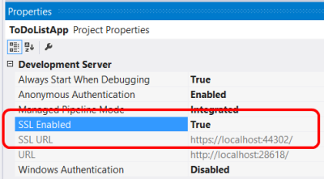

Working with SSL in Web API
====================
by [Mike Wasson](https://github.com/MikeWasson)

Several common authentication schemes are not secure over plain HTTP. In particular, Basic authentication and forms authentication send unencrypted credentials. To be secure, these authentication schemes *must* use SSL. In addition, SSL client certificates can be used to authenticate clients.

## Enabling SSL on the Server

To set up SSL in IIS 7 or later:

- Create or get a certificate. For testing, you can create a self-signed certificate.
- Add an HTTPS binding.

For details, see [How to Set Up SSL on IIS 7](https://www.iis.net/learn/manage/configuring-security/how-to-set-up-ssl-on-iis).

For local testing, you can enable SSL in IIS Express from Visual Studio. In the Properties window, set **SSL Enabled** to **True**. Note the value of **SSL URL**; use this URL for testing HTTPS connections.

### Enforcing SSL in a Web API Controller

If you have both an HTTPS and an HTTP binding, clients can still use HTTP to access the site. You might allow some resources to be available through HTTP, while other resources require SSL. In that case, use an action filter to require SSL for the protected resources. The following code shows a Web API authentication filter that checks for SSL:

[!code-csharp[Main](working-with-ssl-in-web-api/samples/sample1.cs)]

Add this filter to any Web API actions that require SSL:

[!code-csharp[Main](working-with-ssl-in-web-api/samples/sample2.cs)]

## SSL Client Certificates

SSL provides authentication by using Public Key Infrastructure certificates. The server must provide a certificate that authenticates the server to the client. It is less common for the client to provide a certificate to the server, but this is one option for authenticating clients. To use client certificates with SSL, you need a way to distribute signed certificates to your users. For many application types, this will not be a good user experience, but in some environments (for example, enterprise) it may be feasible.

| Advantages | Disadvantages |
| --- | --- |
| - Certificate credentials are stronger than username/password. - SSL provides a complete secure channel, with authentication, message integrity, and message encryption. | - You must obtain and manage PKI certificates. - The client platform must support SSL client certificates. |

To configure IIS to accept client certificates, open IIS Manager and perform the following steps:

1. Click the site node in the tree view.
2. Double-click the **SSL Settings** feature in the middle pane.
3. Under **Client Certificates**, select one of these options: 

    - **Accept**: IIS will accept a certificate from the client, but does not require one.
    - **Require**: Require a client certificate. (To enable this option, you must also select "Require SSL")

You can also set these options in the ApplicationHost.config file:

[!code-xml[Main](working-with-ssl-in-web-api/samples/sample3.xml)]

The **SslNegotiateCert** flag means IIS will accept a certificate from the client, but does not require one (equivalent to the "Accept" option in IIS Manager). To require a certificate, set the **SslRequireCert** flag. For testing, you can also set these options in IIS Express, in the local applicationhost.Config file, located in "Documents\IISExpress\config".

### Creating a Client Certificate for Testing

For testing purposes, you can use [MakeCert.exe](https://msdn.microsoft.com/en-US/library/bfsktky3.aspx) to create a client certificate. First, create a test root authority:

[!code-console[Main](working-with-ssl-in-web-api/samples/sample4.cmd)]

Makecert will prompt you to enter a password for the private key.

Next, add the certificate to the test server's "Trusted Root Certification Authorities" store, as follows:

1. Open MMC.
2. Under **File**, select **Add/Remove Snap-In**.
3. Select **Computer Account**.
4. Select **Local computer** and complete the wizard.
5. Under the navigation pane, expand the "Trusted Root Certification Authorities" node.
6. On the **Action** menu, point to **All Tasks**, and then click **Import** to start the Certificate Import Wizard.
7. Browse to the certificate file, TempCA.cer.
8. Click **Open**, then click **Next** and complete the wizard. (You will be prompted to re-enter the password.)

Now create a client certificate that is signed by the first certificate:

[!code-console[Main](working-with-ssl-in-web-api/samples/sample5.cmd)]

### Using Client Certificates in Web API

On the server side, you can get the client certificate by calling [GetClientCertificate](https://msdn.microsoft.com/en-us/library/system.net.http.httprequestmessageextensions.getclientcertificate.aspx) on the request message. The method returns null if there is no client certificate. Otherwise, it returns an **X509Certificate2** instance. Use this object to get information from the certificate, such as the issuer and subject. Then you can use this information for authentication and/or authorization.

[!code-csharp[Main](working-with-ssl-in-web-api/samples/sample6.cs)]